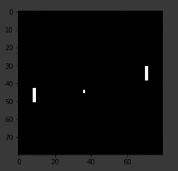
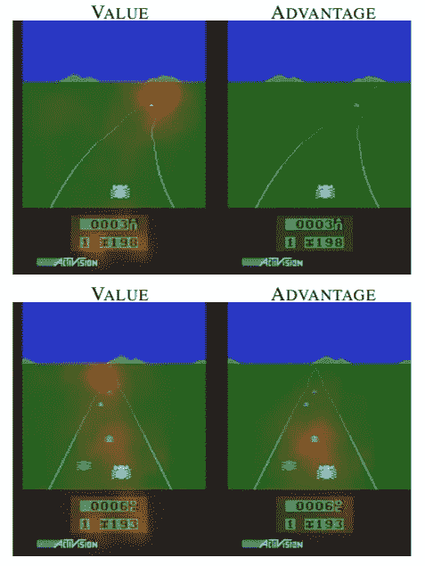
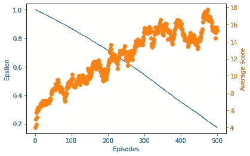
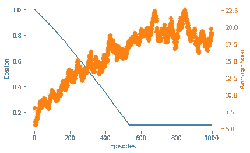
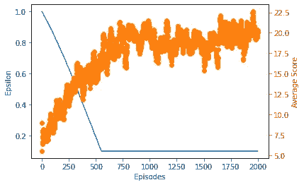

# 使用决斗深度 Q-学习构建用于毁灭的攻击性 AI 代理。

> 原文：<https://towardsdatascience.com/building-offensive-ai-agents-for-doom-using-dueling-deep-q-learning-ab2a3ff7355f?source=collection_archive---------32----------------------->

## Pytorch 中的实现。

# **简介**

在过去的几篇文章中，我们已经[讨论了](https://medium.com/gradientcrescent/fundamentals-of-reinforcement-learning-navigating-cliffworld-with-sarsa-and-q-learning-cc3c36eb5830)和[在](/automating-pac-man-with-deep-q-learning-an-implementation-in-tensorflow-ca08e9891d9c) [VizDoom 游戏环境](/playing-doom-with-ai-multi-objective-optimization-with-deep-q-learning-736a9d0f8c2)中实现了 [深度 Q 学习](/optimized-deep-q-learning-for-automated-atari-space-invaders-an-implementation-in-tensorflow-2-0-80352c744fdc) (DQN)和[双重深度 Q 学习](/discovering-unconventional-strategies-for-doom-using-double-deep-q-learning-609b365781c4) (DDQN)，并评估了它们的性能。深度 Q-learning 是一种高度灵活且响应迅速的在线学习方法，它利用场景内的快速更新来估计环境中的状态-动作(Q)值，以便最大化回报。Double Deep Q-Learning 通过将负责动作选择和 TD-target 计算的网络解耦，以最小化 Q 值高估，在训练过程的早期，当代理尚未完全探索大多数可能的状态时，这个问题尤其明显。

我们之前的双 DQN 特工[在维兹杜姆环境中的表现，训练了 500 集。](/discovering-unconventional-strategies-for-doom-using-double-deep-q-learning-609b365781c4)

本质上，使用单个状态-动作值来判断情况需要探索和学习每个单个状态的动作的效果，从而导致模型的泛化能力的固有障碍。此外，并非所有国家都同样与环境相关。



来自我们之前在 Pong 中训练的代理的预处理帧。

回想一下我们早期的[实现](https://medium.com/gradientcrescent/fundamentals-of-reinforcement-learning-automating-pong-in-using-a-policy-model-an-implementation-b71f64c158ff)中的 Pong 环境。在我们的代理人击球后，向左或向右移动的价值可以忽略不计，因为球必须首先移动到对手，然后返回给球员。结果，在这一点上计算用于训练的状态-动作值可能破坏我们的代理的收敛。理想情况下，我们希望能够识别每个行为的价值，而无需了解每个状态的特定效果，以便鼓励我们的代理专注于选择与环境相关的行为。

决斗深度 Q 学习(以下简称 DuelDQN)通过将 DQN 网络输出分成两个流来解决这些缺点:价值流和优势(或行动)流。通过这样做，我们部分地分离了整个国家行为评估过程。在他们的开创性论文中。al 展示了 DuelDQN 如何影响 Atari 游戏 Enduro 中代理人表现的可视化，演示了代理人如何学习专注于不同的目标。请注意，价值流已经学会关注道路的方向，而优势流已经学会关注代理人面前的直接障碍。实质上，我们通过这种方法获得了一定程度的短期和中期远见。



为了计算状态-动作的 Q 值，我们然后利用优势函数来告诉我们动作的相对重要性。**平均优势的减法，计算一个状态中所有可能的动作，用于找到我们感兴趣的动作的相对优势。**


根据 DuelDQN 架构的状态动作的 Q 值。

直观地说，为了获得对环境更可靠的评估，我们已经部分地分离了动作和状态值估计过程。

# **实现**

**我们将在与上一篇文章*保卫防线*相同的多目标条件下，在相同的 VizDoomgym 场景中实现我们的方法。**环境的一些特征包括:

*   一个 3 的动作空间:开火，左转，右转。不允许扫射。
*   向玩家发射火球的棕色怪物，命中率为 100%。
*   试图以之字形靠近来咬玩家的粉红色怪物。
*   重生的怪物可以承受更多伤害。
*   杀死一个怪物+1 点。
*   -死了得 1 分。


“防线方案”的初始状态

我们的 Google 协作实现是使用 Pytorch 用 Python 编写的，可以在 [GradientCrescent Github 上找到。](https://github.com/EXJUSTICE/GradientCrescent)我们的方法基于泰伯优秀强化学习[课程](https://www.manning.com/livevideo/reinforcement-learning-in-motion)中详述的方法。由于我们的 DuelDQN 实现类似于我们之前的香草 DQN 实现，所以整个高级工作流是共享的，这里不再重复。

让我们从导入所有必需的包开始，包括 OpenAI 和 Vizdoomgym 环境。我们还将安装火炬视觉所需的 AV 包，我们将使用它进行可视化。请注意，安装完成后，必须重新启动运行时，才能执行笔记本的其余部分。

```
#Visualization cobe for running within Colab
!sudo apt-get update
!sudo apt-get install build-essential zlib1g-dev libsdl2-dev libjpeg-dev nasm tar libbz2-dev libgtk2.0-dev cmake git libfluidsynth-dev libgme-dev libopenal-dev timidity libwildmidi-dev unzip# Boost libraries
!sudo apt-get install libboost-all-dev# Lua binding dependencies
!apt-get install liblua5.1-dev
!sudo apt-get install cmake libboost-all-dev libgtk2.0-dev libsdl2-dev python-numpy git
!git clone [https://github.com/shakenes/vizdoomgym.git](https://github.com/shakenes/vizdoomgym.git)
!python3 -m pip install -e vizdoomgym/!pip install av
```

接下来，我们初始化我们的环境场景，检查观察空间和动作空间，并可视化我们的环境。

```
import gym
import vizdoomgymenv = gym.make('VizdoomDefendLine-v0')
n_outputs = env.action_space.n
print(n_outputs)observation = env.reset()import matplotlib.pyplot as pltfor i in range(22):

  if i > 20:
    print(observation.shape)
    plt.imshow(observation)
    plt.show()observation, _, _, _ = env.step(1)
```

接下来，我们将定义预处理包装器。这些类继承自 OpenAI gym 基类，覆盖了它们的方法和变量，以便隐式地提供所有必要的预处理。我们将开始定义一个包装器来重复许多帧的每个动作，并执行元素方式的最大值以增加任何动作的强度。您会注意到一些三级参数，如 *fire_first* 和*no _ ops*——这些是特定于环境的，在 Vizdoomgym 中对我们没有影响。

```
class RepeatActionAndMaxFrame(gym.Wrapper):
  #input: environment, repeat
  #init frame buffer as an array of zeros in shape 2 x the obs space
    def __init__(self, env=None, repeat=4, clip_reward=False, no_ops=0,
                 fire_first=False):
        super(RepeatActionAndMaxFrame, self).__init__(env)
        self.repeat = repeat
        self.shape = env.observation_space.low.shape
        self.frame_buffer = np.zeros_like((2, self.shape))
        self.clip_reward = clip_reward
        self.no_ops = no_ops
        self.fire_first = fire_first
  def step(self, action):
        t_reward = 0.0
        done = False
        for i in range(self.repeat):
            obs, reward, done, info = self.env.step(action)
            if self.clip_reward:
                reward = np.clip(np.array([reward]), -1, 1)[0]
            t_reward += reward
            idx = i % 2
            self.frame_buffer[idx] = obs
            if done:
                break
        max_frame = np.maximum(self.frame_buffer[0], self.frame_buffer[1])
        return max_frame, t_reward, done, info
  def reset(self):
        obs = self.env.reset()
        no_ops = np.random.randint(self.no_ops)+1 if self.no_ops > 0    else 0
        for _ in range(no_ops):
            _, _, done, _ = self.env.step(0)
            if done:
                self.env.reset()

        if self.fire_first:
            assert self.env.unwrapped.get_action_meanings()[1] == 'FIRE'
            obs, _, _, _ = self.env.step(1)
        self.frame_buffer = np.zeros_like((2,self.shape))
        self.frame_buffer[0] = obs
    return obs
```

接下来，我们为我们的观察定义预处理函数。我们将使我们的环境对称，将它转换到标准化的盒子空间，将通道整数交换到张量的前面，并将其从原始(320，480)分辨率调整到(84，84)区域。我们也将我们的环境灰度化，并通过除以一个常数来归一化整个图像。

```
class PreprocessFrame(gym.ObservationWrapper):
  #set shape by swapping channels axis
 #set observation space to new shape using gym.spaces.Box (0 to 1.0)
    def __init__(self, shape, env=None):
        super(PreprocessFrame, self).__init__(env)
        self.shape = (shape[2], shape[0], shape[1])
        self.observation_space = gym.spaces.Box(low=0.0, high=1.0,
                                    shape=self.shape, dtype=np.float32)
   def observation(self, obs):
        new_frame = cv2.cvtColor(obs, cv2.COLOR_RGB2GRAY)
        resized_screen = cv2.resize(new_frame, self.shape[1:],
                                    interpolation=cv2.INTER_AREA)
        new_obs = np.array(resized_screen, dtype=np.uint8).reshape(self.shape)
        new_obs = new_obs / 255.0
   return new_obs
```

接下来，我们创建一个包装器来处理帧堆叠。这里的目标是通过将几个帧堆叠在一起作为单个批次，帮助从堆叠帧中捕捉运动和方向。这样，我们可以捕捉环境中元素的位置、平移、速度和加速度。通过堆叠，我们的输入采用(4，84，84，1)的形状。

```
class StackFrames(gym.ObservationWrapper):
  #init the new obs space (gym.spaces.Box) low & high bounds as repeat of n_steps. These should have been defined for vizdooom

  #Create a return a stack of observations
    def __init__(self, env, repeat):
        super(StackFrames, self).__init__(env)
        self.observation_space = gym.spaces.Box( env.observation_space.low.repeat(repeat, axis=0),
                              env.observation_space.high.repeat(repeat, axis=0),
                            dtype=np.float32)
        self.stack = collections.deque(maxlen=repeat)
    def reset(self):
        self.stack.clear()
        observation = self.env.reset()
        for _ in range(self.stack.maxlen):
            self.stack.append(observation)
        return  np.array(self.stack).reshape(self.observation_space.low.shape)
    def observation(self, observation):
        self.stack.append(observation)
    return np.array(self.stack).reshape(self.observation_space.low.shape)
```

最后，在返回最终环境供使用之前，我们将所有的包装器绑定到一个单独的 *make_env()* 方法中。

```
def make_env(env_name, shape=(84,84,1), repeat=4, clip_rewards=False,
             no_ops=0, fire_first=False):
    env = gym.make(env_name)
    env = PreprocessFrame(shape, env)
    env = RepeatActionAndMaxFrame(env, repeat, clip_rewards, no_ops, fire_first)

    env = StackFrames(env, repeat)
    return env
```

接下来，让我们定义我们的模型，一个深度 Q 网络，具有决斗架构的两个输出。这基本上是一个三层卷积网络，它采用预处理的输入观测值，将生成的展平输出馈送到一个全连接层，然后将输出分成价值流(单节点输出)和优势流(节点输出对应于环境中的动作数量)。

请注意，这里没有激活层，因为激活层的存在会导致二进制输出分布。我们的损失是我们当前状态-动作的估计 Q 值和我们预测的状态-动作值的平方差。然后，我们附上 RMSProp 优化器，以尽量减少我们在培训期间的损失。

```
import os
import torch as T
import torch.nn as nn
import torch.nn.functional as F
import torch.optim as optim
import numpy as npclass DeepQNetwork(nn.Module):
    def __init__(self, lr, n_actions, name, input_dims, chkpt_dir):
        super(DeepQNetwork, self).__init__()
        self.checkpoint_dir = chkpt_dir
        self.checkpoint_file = os.path.join(self.checkpoint_dir, name) self.conv1 = nn.Conv2d(input_dims[0], 32, 8, stride=4)
        self.conv2 = nn.Conv2d(32, 64, 4, stride=2)
        self.conv3 = nn.Conv2d(64, 64, 3, stride=1) fc_input_dims = self.calculate_conv_output_dims(input_dims) self.fc1 = nn.Linear(fc_input_dims,1024)
        self.fc2 = nn.Linear(1024, 512)
        #Here we split the linear layer into the State and Advantage streams
        self.V = nn.Linear(512, 1)
        self.A = nn.Linear(512, n_actions) self.optimizer = optim.RMSprop(self.parameters(), lr=lr) self.loss = nn.MSELoss()
        self.device = T.device('cuda:0' if T.cuda.is_available() else 'cpu')
        self.to(self.device) def calculate_conv_output_dims(self, input_dims):
        state = T.zeros(1, *input_dims)
        dims = self.conv1(state)
        dims = self.conv2(dims)
        dims = self.conv3(dims)
        return int(np.prod(dims.size())) def forward(self, state):
        conv1 = F.relu(self.conv1(state))
        conv2 = F.relu(self.conv2(conv1))
        conv3 = F.relu(self.conv3(conv2))
        # conv3 shape is BS x n_filters x H x W
        conv_state = conv3.view(conv3.size()[0], -1)
        # conv_state shape is BS x (n_filters * H * W)
        flat1 = F.relu(self.fc1(conv_state))
        flat2 = F.relu(self.fc2(flat1)) V = self.V(flat2)
        A = self.A(flat2) return V, A def save_checkpoint(self):
        print('... saving checkpoint ...')
        T.save(self.state_dict(), self.checkpoint_file) def load_checkpoint(self):
        print('... loading checkpoint ...')
        self.load_state_dict(T.load(self.checkpoint_file))
```

回想一下，用于决斗深度 Q 学习的更新函数需要以下内容:

*   当前状态 *s*
*   当前动作*一*
*   当前动作后的奖励 *r*
*   下一个状态*s’*
*   下一个动作*a’*

为了以有意义的数量提供这些参数，我们需要按照一组参数评估我们当前的策略，并将所有变量存储在一个缓冲区中，我们将在训练期间从该缓冲区中提取迷你批次中的数据。因此，我们需要一个重放内存缓冲区来存储和提取观察值。

```
import numpy as np
class ReplayBuffer(object):
    def __init__(self, max_size, input_shape, n_actions):
        self.mem_size = max_size
        self.mem_cntr = 0
        self.state_memory = np.zeros((self.mem_size, *input_shape),
                                     dtype=np.float32)
        self.new_state_memory = np.zeros((self.mem_size, *input_shape),
                                         dtype=np.float32)
        self.action_memory = np.zeros(self.mem_size, dtype=np.int64)
        self.reward_memory = np.zeros(self.mem_size, dtype=np.float32)
        self.terminal_memory = np.zeros(self.mem_size, dtype=np.bool)
#Identify index and store  the the current SARSA into batch memory def store_transition(self, state, action, reward, state_, done):
        index = self.mem_cntr % self.mem_size
        self.state_memory[index] = state
        self.new_state_memory[index] = state_
        self.action_memory[index] = action
        self.reward_memory[index] = reward
        self.terminal_memory[index] = done
        self.mem_cntr += 1 def sample_buffer(self, batch_size):
        max_mem = min(self.mem_cntr, self.mem_size)
        batch = np.random.choice(max_mem, batch_size, replace=False)

        states = self.state_memory[batch]
        actions = self.action_memory[batch]
        rewards = self.reward_memory[batch]
        states_ = self.new_state_memory[batch]
        terminal = self.terminal_memory[batch]
     return states, actions, rewards, states_, terminal
```

接下来，我们将定义我们的代理，它不同于我们普通的 DQN 实现。我们的代理正在使用一个勘探率递减的ε贪婪策略，以便随着时间的推移最大化开发。为了学会预测使我们的累积奖励最大化的状态和优势值，我们的代理将使用通过抽样存储的记忆获得的贴现的未来奖励。

您会注意到，作为代理的一部分，我们初始化了 DQN 的两个副本，并使用方法将原始网络的权重参数复制到目标网络中。虽然我们的常规方法利用这种设置来生成固定的 TD-目标，但在我们的 DuelDQN 方法中，双流的存在给该过程增加了一层复杂性:

*   从重放存储器中检索状态、动作、奖励和下一状态(sar)。
*   评估网络用于生成当前状态的优势( *A_s* )和状态( *V_s* )值。
*   目标网络还用于创建下一个状态的优势( *A_s_* )和状态( *V_s_* )值。
*   预测的 Q 值是通过将当前状态的优势和状态值相加，并减去用于归一化的当前状态优势值的平均值而生成的。
*   通过将下一个状态的优势和状态值相加，并减去下一个状态优势值的平均值以进行归一化，来计算目标 Q 值当前状态。
*   然后，通过将折扣后的目标 Q 值与当前状态奖励相结合，构建 TD 目标。
*   通过将 TD 目标与预测的 Q 值进行比较来计算损失函数，然后将其用于训练网络。

```
import numpy as np
import torch as T
#from deep_q_network import DeepQNetwork
#from replay_memory import ReplayBufferclass DuelDQNAgent(object):
    def __init__(self, gamma, epsilon, lr, n_actions, input_dims,
                 mem_size, batch_size, eps_min=0.01, eps_dec=5e-7,
                 replace=1000, algo=None, env_name=None, chkpt_dir='tmp/dqn'):
        self.gamma = gamma
        self.epsilon = epsilon
        self.lr = lr
        self.n_actions = n_actions
        self.input_dims = input_dims
        self.batch_size = batch_size
        self.eps_min = eps_min
        self.eps_dec = eps_dec
        self.replace_target_cnt = replace
        self.algo = algo
        self.env_name = env_name
        self.chkpt_dir = chkpt_dir
        self.action_space = [i for i in range(n_actions)]
        self.learn_step_counter = 0 self.memory = ReplayBuffer(mem_size, input_dims, n_actions) self.q_eval = DeepQNetwork(self.lr, self.n_actions,
                                    input_dims=self.input_dims,
                                    name=self.env_name+'_'+self.algo+'_q_eval',
                                    chkpt_dir=self.chkpt_dir) self.q_next = DeepQNetwork(self.lr, self.n_actions,
                                    input_dims=self.input_dims,
                                    name=self.env_name+'_'+self.algo+'_q_next',
                                    chkpt_dir=self.chkpt_dir)#Epsilon greedy action selection
    def choose_action(self, observation):
        if np.random.random() > self.epsilon:
          # Add dimension to observation to match input_dims x batch_size by placing in list, then converting to tensor
            state = T.tensor([observation],dtype=T.float).to(self.q_eval.device)
            #As our forward function now has both state and advantage, fetch latter for actio selection
            _, advantage = self.q_eval.forward(state)
            action = T.argmax(advantage).item()
        else:
            action = np.random.choice(self.action_space) return action def store_transition(self, state, action, reward, state_, done):
        self.memory.store_transition(state, action, reward, state_, done) def sample_memory(self):
        state, action, reward, new_state, done = \
                                    self.memory.sample_buffer(self.batch_size) states = T.tensor(state).to(self.q_eval.device)
        rewards = T.tensor(reward).to(self.q_eval.device)
        dones = T.tensor(done).to(self.q_eval.device)
        actions = T.tensor(action).to(self.q_eval.device)
        states_ = T.tensor(new_state).to(self.q_eval.device) return states, actions, rewards, states_, dones def replace_target_network(self):
        if self.learn_step_counter % self.replace_target_cnt == 0:
            self.q_next.load_state_dict(self.q_eval.state_dict()) def decrement_epsilon(self):
        self.epsilon = self.epsilon - self.eps_dec \
                           if self.epsilon > self.eps_min else self.eps_min def save_models(self):
        self.q_eval.save_checkpoint()
        self.q_next.save_checkpoint() def load_models(self):
        self.q_eval.load_checkpoint()
        self.q_next.load_checkpoint()

    def learn(self):
        if self.memory.mem_cntr < self.batch_size:
            return self.q_eval.optimizer.zero_grad() #Replace target network if appropriate
        self.replace_target_network() states, actions, rewards, states_, dones = self.sample_memory()
        #Fetch states and advantage actions for current state using eval network
        #Also fetch the same for next state using target network
        V_s, A_s = self.q_eval.forward(states)
        V_s_, A_s_ = self.q_next.forward(states_) #Indices for matrix multiplication
        indices = np.arange(self.batch_size) #Calculate current state Q-values and next state max Q-value by aggregation, subtracting constant advantage mean

        q_pred = T.add(V_s,
                        (A_s - A_s.mean(dim=1, keepdim=True)))[indices, actions]

        q_next = T.add(V_s_,
                        (A_s_ - A_s_.mean(dim=1, keepdim=True))).max(dim=1)[0] q_next[dones] = 0.0
        #Build your target using the current state reward and q_next
        q_target = rewards + self.gamma*q_next loss = self.q_eval.loss(q_target, q_pred).to(self.q_eval.device)
        loss.backward()
        self.q_eval.optimizer.step()
        self.learn_step_counter += 1 self.decrement_epsilon()
```

定义了所有支持代码后，让我们运行主训练循环。我们已经在最初的总结中定义了大部分，但是让我们为后代回忆一下。

*   对于训练集的每一步，在使用ε-贪婪策略选择下一个动作之前，我们将输入图像堆栈输入到我们的网络中，以生成可用动作的概率分布
*   然后，我们将它输入到网络中，获取下一个状态和相应奖励的信息，并将其存储到我们的缓冲区中。我们更新我们的堆栈，并通过一些预定义的步骤重复这一过程。
*   在一集的结尾，我们将下一个状态输入到我们的网络中，以便获得下一个动作。我们还通过对当前奖励进行贴现来计算下一个奖励。
*   我们通过上面提到的 Q 学习更新函数生成我们的目标 y 值，并训练我们的网络。
*   通过最小化训练损失，我们更新网络权重参数，以便为下一个策略输出改进的状态-动作值。
*   我们通过跟踪模型的平均得分(在 100 个训练步骤中测量)来评估模型。

```
env = make_env('VizdoomDefendLine-v0')
best_score = -np.inf
load_checkpoint = False
n_games = 2000
agent = DuelDQNAgent(gamma=0.99, epsilon=1.0, lr=0.0001,input_dims=(env.observation_space.shape),n_actions=env.action_space.n, mem_size=5000, eps_min=0.1,batch_size=32, replace=1000, eps_dec=1e-5,chkpt_dir='/content/', algo='DuelDQNAgent',env_name='vizdoogym')if load_checkpoint:
  agent.load_models()fname = agent.algo + '_' + agent.env_name + '_lr' + str(agent.lr) +'_'+ str(n_games) + 'games'
figure_file = 'plots/' + fname + '.png'n_steps = 0
scores, eps_history, steps_array = [], [], []for i in range(n_games):
  done = False
  observation = env.reset() score = 0
  while not done:
    action = agent.choose_action(observation)
    observation_, reward, done, info = env.step(action)
    score += reward if not load_checkpoint:
      agent.store_transition(observation, action,reward, observation_, int(done))
      agent.learn()
    observation = observation_
    n_steps += 1scores.append(score)
steps_array.append(n_steps)avg_score = np.mean(scores[-100:])if avg_score > best_score:
    best_score = avg_score

    print('Checkpoint saved at episode ', i)
    agent.save_models()print('Episode: ', i,'Score: ', score,' Average score: %.2f' % avg_score, 'Best average: %.2f' % best_score,'Epsilon: %.2f' % agent.epsilon, 'Steps:', n_steps)eps_history.append(agent.epsilon)
  if load_checkpoint and n_steps >= 18000:
    break
```

我们绘制了 500 集、1000 集和 2000 集的代理商平均分和我们的 epsilon 值。



500 集后我们经纪人的奖励分配。



1000 集后我们经纪人的奖励分配。



2000 集后我们经纪人的报酬分配。

查看结果并将其与我们的普通 DQN [实施](/playing-doom-with-ai-multi-objective-optimization-with-deep-q-learning-736a9d0f8c2)和双 DQN [实施](/discovering-unconventional-strategies-for-doom-using-double-deep-q-learning-609b365781c4)进行比较，您会注意到在 500、1000 和 2000 集的分布中有显著提高的改善率。此外，具有更受约束的报酬振荡，表明当比较任一实现时改进了收敛。

我们可以想象我们的代理人在 500 和 1000 集以下的表现。

500 集的代理性能。

在 500 集时，代理已经采用了先前在较高训练时间为 DQN 和 DDQN 识别的相同策略，归因于在局部最小值的收敛。仍然会采取一些攻击性的行动，但是主要的策略仍然依赖于怪物之间的友好射击。

at 1000 集呢？

1000 集的代理性能。

我们的经纪人已经成功地打破了本地化的最低限度，并发现了一个更具进攻性的角色为导向的替代战略。这是我们的 DQN 和 DDQN 模型都无法做到的，即使是在 2000 集的情况下——证明了 DuelDQN 的双流方法在识别和优先考虑与环境相关的行动方面的效用。

这就结束了双深度 Q 学习的实现。在我们的下一篇文章中，我们将通过把我们所学的所有知识结合到一个方法中来完成我们的 Q 学习方法系列，并在一个更动态的结局中使用它。

我们希望你喜欢这篇文章，并希望你查看 GradientCrescent 上的许多其他文章，涵盖人工智能的应用和理论方面。为了保持对 [GradientCrescent](https://medium.com/@adrianitsaxu) 的最新更新，请考虑关注该出版物并关注我们的 [Github](https://github.com/EXJUSTICE/GradientCrescent) 资源库

# 来源

萨顿等人。al，“强化学习”

塔博尔，“运动中的强化学习”

西蒙尼尼，[“深度 Q 学习的改进*](https://www.freecodecamp.org/news/improvements-in-deep-q-learning-dueling-double-dqn-prioritized-experience-replay-and-fixed-58b130cc5682/)