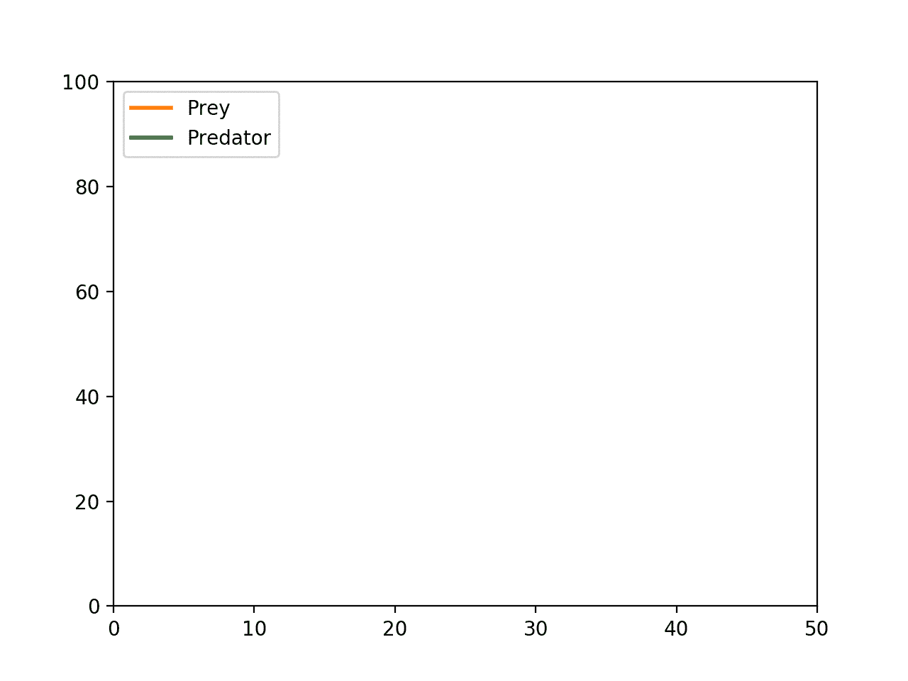
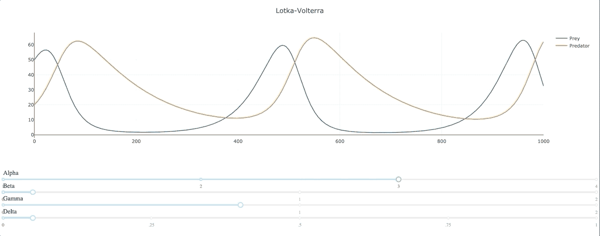
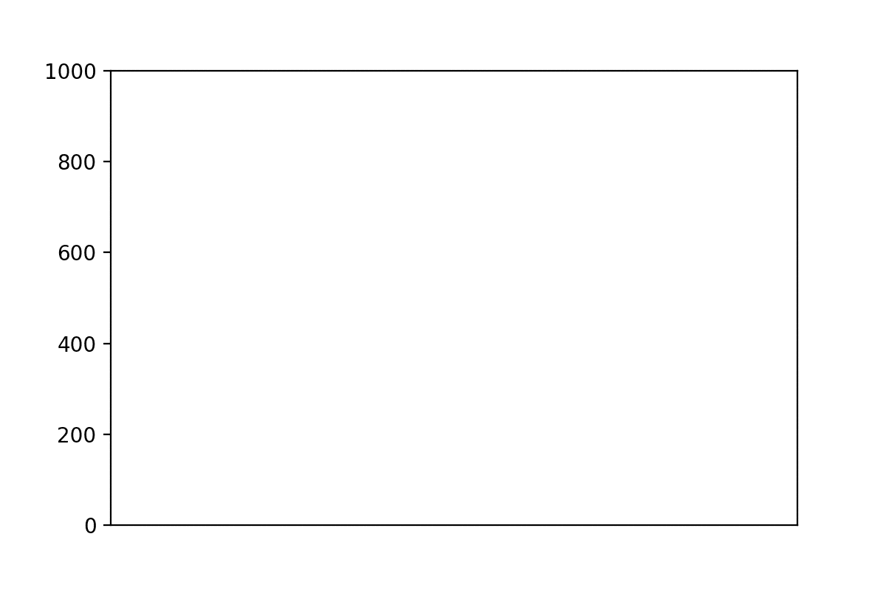

# 用 Python 构建人口模型

> 原文：<https://towardsdatascience.com/building-population-models-in-python-57f9e174d27d?source=collection_archive---------16----------------------->

## 概念模型和动画视觉效果，用于在没有大量数据的情况下讲述强大的数据科学故事。

做“数据科学”的一大挑战是收集足够的数据。许多模型，尤其是机器视觉或自然语言处理等复杂问题的模型，需要大型数据集，尽管我们可能生活在大数据时代，但在家中利用大型高质量数据集并不总是容易的。特别是对于数据科学的学生或该领域的新手来说，缺乏整洁的数据似乎会成为学习的障碍——我们还能从 iris 数据集或泰坦尼克号数据集获得多少里程？

如果你是一名数据科学家或正在接受培训的数据科学家，正在寻找一些兼职项目，我想建议有另一种方法来练习高度相关的技能，这种方法不需要大量的网络搜集或对精选数据的高级访问。如果说有什么不同的话，那就是许多数据科学教学(特别是在越来越普遍的训练营)对高精度预测的关注——这种预测需要基于大量数据训练的模型——不利于建立模型的基本用途之一:创建概念框架以更好地理解事物如何或为什么以它们的方式工作。考虑到这一点，我认为不需要收集数据就可以建立有用的模型。

在新冠肺炎疫情的世界里，这种模型无论是作为具体预测的基础，还是作为公共交流的工具，都显示出了极大的价值。也许你已经读过《华盛顿邮报》的那篇文章，这篇文章基本上像病毒一样传播开来，并迅速成为他们有史以来最受欢迎的在线文章。或者看了 3Blue1Brown 的[优秀视频](https://www.youtube.com/watch?v=gxAaO2rsdIs)和他的各种疫情场景的模型。在这两种情况下，以及许多其他情况下，非常有用的说明性视觉效果已经建立在不需要先前数据的模型之上。当然，这些模型的目标略有不同；他们并不试图预测确切的病例数或诸如此类的事情，相反，他们的目标是建立一种直觉，了解某些特征可能如何影响结果。但是，这仍然是有价值的，对于一种没有历史数据的新疾病，这可能是你能做的最好的了。

值得强调的是，从技术的角度来看，华盛顿邮报中强调的模型和视觉效果并不特别难构建。大多数初级数据科学家对 Python 和常用数学和绘图库有基本的掌握，他们应该有技术技能来构建这样的模型，并创建动画或交互式视觉效果。考虑到这一点，这里有几个开发人口模型的小项目，并为任何有兴趣在这方面创造自己的视觉效果的人提供相应的视觉效果。

疾病在人群中传播的简单模拟

任何类型的建模规则一:做好你的研究，不要太相信结果！

这确实适用于任何项目，但是如果你的模型不是建立在经验观察的基础上，它的重要性就会被放大。如今，人们通常根据预测模型的表现来判断它们，而不是根据它们对为什么做出某些预测的说法来判断——深度神经网络甚至以[的不透明](https://www.technologyreview.com/2017/04/11/5113/the-dark-secret-at-the-heart-of-ai/)而闻名——但我们将讨论的各种模型没有验证集。相反，它们是一系列已经被操作化的假设，所以你可以看到它们是如何发挥作用的。你能做出什么样的假设或简化，并且仍然能看到有用的结果？这在很大程度上取决于您正在建模的内容，而判断什么样的模型有意义的唯一方法是首先积累一些领域知识。

这类模型通常也不会给你准确的预测，也不应该这样对待。重要的是要明白，我们的目标不一定是预测未来，而是感受某些事情是如何影响潜在结果的。在我描述建立一个流行病模型之前，让我声明我不是流行病学家，也不是我提到的其他新冠肺炎模型的创造者。我们创建的任何模型都不应被理解为对疾病将如何传播的准确预测。相反，它们可以说明现实世界中可能存在的联系和影响，或者某些影响的大小。有一句话，通常被认为是乔治·博克斯说的，所有的模型都是错的，但有些是有用的。我们的目标是完全属于错误但有用的类别。

**项目 1:使用 Lotka-Volterra 的简单人口模型**

洛特卡-沃尔泰拉方程是一组简单的微分方程，也称为捕食者-猎物方程，你可能在高中生物课上遇到过。名副其实，他们模拟了捕食者和被捕食者相互作用的种群动态，其中每个种群的增长或下降部分取决于当前的种群规模。一个地区的大量野兔会让以野兔为食的狐狸数量增长，但随着狐狸数量的增长，捕食可能会开始减少野兔的数量，进而给狐狸的数量带来压力，等等。

出于我们的目的，Lotka-Volterra 方程是一个很好的起点，因为它们易于实现。只有两个方程，一个描述被捕食者种群的变化率，另一个描述捕食者种群的变化率。被捕食种群的公式为:

其中 x 是当前的猎物种群，y 是当前的捕食者种群，α是猎物的生长常数，β是代表捕食率的常数。猎物数量的相应等式是:

这两个方程合在一起形成了周期曲线，在捕食者数量少的时期，被捕食者数量迅速增长，但随着捕食者数量的增长，被捕食者数量又会下降。如果解微分方程的想法让你望而生畏，请认识到，你可以通过对每个变化率进行瞬时估计，向前增加一点时间，然后计算新的变化率，而无需任何复杂的数学运算，这就是我在这里所做的:

一个简单的人口模型

虽然这不是一个没有吸引力的图表，但我们希望真正利用视觉的力量，我们可以通过两种方式做到这一点。一种方法是将图形制成动画，就像实时描绘这些曲线一样。最普遍的 Python 图形库 Matplotlib 实际上有一个专门用于[创建动画](https://matplotlib.org/3.2.1/api/animation_api.html)的模块。该模块只有两种方法。一种方法是通过收集一系列 Matplotlib artist 对象来创建动画(比如 Axes 或 Line2d 对象，它们代表您正在绘制的事物的位置或绘制方式)。另一个应用您提供的函数来重复更新图形。该模块非常强大，但是可能有点敏感，因此有必要详细地浏览一个示例。

对于这种情况，我将使用。FuncAnimation()函数，它将重复调用一个函数来更新图形的信息。原则上，您可以使用这个函数来不断更新您的底层模型，如果您想要放弃一个没有设定结尾的动画，并看着它无限期地继续播放，这将是有意义的。如果您对动画有一个固定的结尾，我通常发现更简单的方法是运行模型，无论您需要创建多长时间的数据，然后使用动画功能来引用这些数据的增加部分。需要记住的另一件事是 Matplotlib 会自己显示动画，它没有办法将它们保存为视频文件或 gif 文件。你需要一个外部包来完成这个任务。我用 [ImageMagick](https://imagemagick.org/) 制作我的 gif。实现 Lotke-Volterra 方程动画的完整代码块如下:

以下是这段代码创建的内容:

Matplotlib 动画

模型是确定性的；对于四个参数的任何给定值，以及两个总体的任何给定值，两个总体的大小只会以一种方式出现。要考虑的问题是，当参数改变时，这条路径将如何运行。当捕食率增加或减少时，图表会有怎样的变化？什么因素会改变周期的长短？

为了真正探索模型中参数的相互作用，我们可以转向第二个技巧，即增加交互性。如果能够为每个参数设置新值，并让可视化自动重新计算，而不需要更改我们的代码，这将是很有帮助的。为此，我们可以考虑用 Dash 之类的工具构建一个仪表板(Matplotlib 也有图形交互工具，但 Dash 是一个常用工具，因此使用起来会更简单)。让我们建立一个简单的仪表板，它有四个滑块来控制参数的值。

在 Dash 中设置仪表板的代码分为两部分。在第一部分中，我们定义了仪表板的布局，使用 Dash 的 html 组件模块来控制仪表板的 html 布局。在第二种情况下，一系列回调函数将您拥有的任何输入(如本例中的滑块)连接到图形，并定义图形如何对输入做出反应。

这个示例 dash 非常简单，毕竟没有样式，只有仪表板的核心组件，但是能够实时处理参数和查看结果，这提供了一个有启发性的视觉效果，让您可以真正了解等式是如何工作的。这个方程有一个有趣的特征，表面上并不明显，那就是降低α，即猎物物种的增长率，实际上并不会降低猎物物种达到的峰值，因为这些峰值是由捕食者和猎物物种之间的相互作用决定的，较低的增长率最终也会降低捕食者物种的数量:

降低 alpha 值会改变图形的周期，但不会改变被捕食物种的峰值

当然，有一个重要的问题是，这个模型是否真的描述了野生动物的数量是如何随着时间变化的。为了回答这个问题，我们需要阅读生物学，但是我要重申的是，这个模型不需要准确地预测实际的动物数量才是有用的。

**项目 2:流行病学建模**

从静态的两方程模型到华盛顿邮报或 3Blue1Brown 视频中强调的那种更动态的半随机模型，需要更多的编码，但比你想象的要少。他们强调的那种[先生流行病学模型](https://en.wikipedia.org/wiki/Compartmental_models_in_epidemiology)有更多的活动部分，大量的个体被建模出来，一定量的随机机会发挥作用，但是，计算机做了大部分的繁重工作。真正的工作是考虑如何建立模型，而不是实际建模。

这种模型是面向对象编程的主要用例。毕竟，该模型实际上只是代表了一群具有特定属性的个体(他们是否被感染，他们的位置，他们被感染了多长时间，等等)。)和某些相互作用的方式(从一个地方移动到另一个地方，传播疾病)。因此，我们可以通过创建一个表示单个案例的对象类并让它们进行交互来模拟模型的工作。

对于这个模型，我们的类需要一些属性。当然，我们需要知道个人是否生病，因此一个属性是“状态”，我将它设置为 0 表示未感染但易感染，1 表示生病，2 表示已移除。每个人还需要一个位置，以及一些关于他们如何移动的信息，所以我也给了他们一个“速度”。我还想象每个人都有一套“界限”,标明他们活动的大致区域。你可以用这个来建模，比如说，生活在不同城市的人(就像 3Blue1Brown 所做的那样)或者不同的社区，他们之间有一些联系，但不是完全重叠。

最后，你需要描述个人可能改变和互动的方式。在这个简单的版本中，我包含了一个设置个人运动方向的方法，一个沿着运动方向改变他们位置的方法和一个覆盖可能传播的方法。在这个模型中，我假设离一个有传染性的人足够近(我们的模型对社会互动的粗略代表)会带来一定的患病概率。在这个例子中，半径和概率是全局变量，所以我为每个人都设置了相同的值，但是您可以很容易地更改代码，使它们成为个体本身的属性，并为不同的个体设置不同的值(也许有些个体天生就不容易受到影响)。在这个简单的示例中，您可以像这样设置该类:

现在您已经设置了这个类，实际上运行这个模型是非常简单的。生成一堆对象并将它们随机放置在整个网格中，其中一些应该用设置为 1 的“状态”进行实例化，表示已感染。在每一轮，更新他们的位置，看看是否有任何传播发生，然后跟踪有多少人被感染。冲洗并重复，记录每个回合中每个类别有多少人，然后根据数据生成您的绘图，这次使用 ArtistAnimation()函数，该函数接受 Matplotlib artist 对象的列表:

这就产生了这个情节，很像《华盛顿邮报》文章中的情节:

我们的简单流行病学模型的图形结果，蓝色表示易感，红色表示受感染，灰色表示已移除

创建动画散点图遵循基本相同的步骤，除了他们的状态之外，我们还需要跟踪每个人的位置。为了使视觉更容易理解，我还减少了创建的个体数量并减慢了它们的速度(也减少了感染半径和感染概率，因为当你减慢个体速度时，它们在慢慢经过时会在彼此附近转更多的圈，这实质上提高了你的感染率)。

它将会创造出类似这样的东西，这取决于机遇:

这些图与 Grant Sanderson 在 3Blue1Brown 制作的图有两个主要区别。一个是样式的质量——我用尽可能少的样式展示了这些示例，以尽可能清晰地展示代码的机制，而 3Blue1Brown 动画经过了仔细而美丽的渲染，以最大限度地清晰最终的动画。格兰特制作的动画可能超出了我的能力——他实际上编写了自己的动画库来制作他的视频——但是使用 Matplotlib 的工具来制作一些优秀的动画是可能的。

第二个大的区别实际上与模型或代码无关，而是所提问题的信息量。不过，我要再次强调，任何有好奇心并愿意做一些研究的人都可以开始问一些有趣的问题。你如何让这个模型更好地符合我们对这种疾病的了解？这些模型中个体行为的变化会如何影响结果？寻找答案的障碍比你想象的要低。