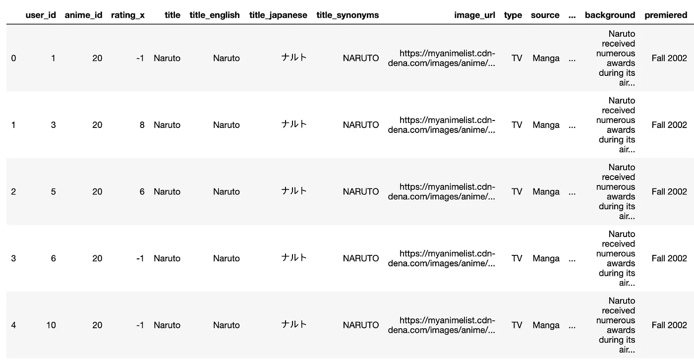
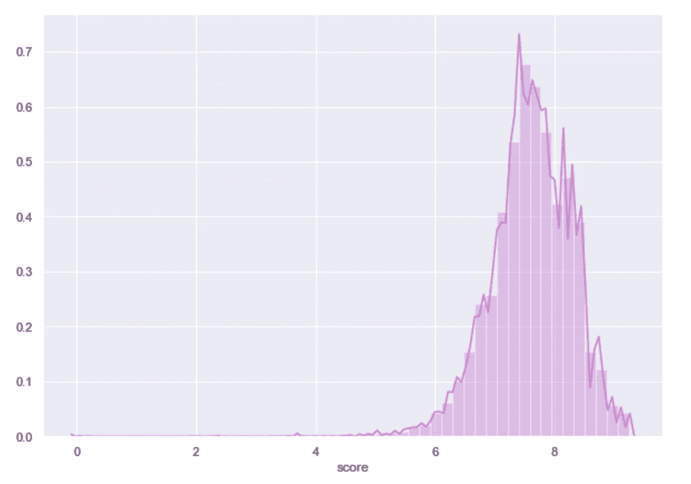

# 用 MyAnimeList 和 Sklearn 构建预测模型(第 1 部分)

> 原文：<https://towardsdatascience.com/building-predictive-models-with-myanimelist-and-sklearn-54edc6c9fff3?source=collection_archive---------49----------------------->

## 本文使用 MyAnimeList 数据库中的许多特性变量来预测用户评分


[**MyAnimeList**](https://myanimelist.net/) is one of the largest online data repositories for anime on the internet with listings ranging from TV series to Manga comics and data dating back to ~1905 (for anyone interested, this is [**活動写真/Katsudou Shashin**](https://myanimelist.net/anime/33187/Katsudou_Shashin)). Luckily this data is all [**available on Kaggle**](https://www.kaggle.com/azathoth42/myanimelist)and comes split into different components/data-frames: user ratings and anime listing information. Given my mutual love for anime and all things data, I thought it would be cool to combine data and to build some predictive models and basic recommendation systems in Python. I will discuss the intricacies of such in more detail below. The first section of my work with the MyAnimeList will focus on some machine learning techniques used to predict user rating scores using a variety of features that were computed for analysis using Sklearn. The second section will follow this post and will hone in on some simple techniques used to recommend anime content, based on both user rating correlations and feature variables.

## 数据准备

在执行任何分析之前，安装必要的软件包:

```
import numpy as np
import pandas as pd
import sklearn
import matplotlib.pyplot as plt
import seaborn as sb
from sklearn.preprocessing import LabelEncoder
from sklearn.model_selection import train_test_split
from sklearn.ensemble import RandomForestClassifier, RandomForestRegressor
from sklearn.model_selection import GridSearchCV
from sklearn.metrics import accuracy_score
from sklearn.neural_network import MLPRegressor, MLPClassifier
from sklearn import metrics
from matplotlib import rcParams
import joblib
from sklearn.tree import export_graphviz
import pydot
from IPython.display import Image
```

从本地导入两个数据框:

```
local_1 = '/Users/hopkif05/Desktop/rating.csv'
ratings = pd.read_csv(local_1)local_2 = '/Users/hopkif05/Desktop/AnimeList.csv'
anime_list = pd.read_csv(local_2)
```

并将它们连接在一个唯一的标识符上，在这种情况下是它们的 *anime_id* :

```
anime = pd.merge(ratings, anime_list, on=’anime_id’)
anime.head()
```



您可以从上面的数据框中看到，我们现在在数据库中有每个用户的评级，这些评级已经与该内容相关的所有元数据合并在一起。这里有大约 800 万个用户评级，有 33 行，每一行代表我们模型的一个潜在特征变量。为了后续的分析，我已经*选择了 user_id、anime_id、rating_x、title_english、type、source、scored_by、score、favorites、members、popularity* 和 *studio* 作为模型中包含的变量；并将它们存储在一个新的数据帧中:

```
anime_df = anime[[‘user_id’,’anime_id’,’rating_x’,’title_english’,’type’,’source’,’scored_by’,’score’,’favorites’,’members’,’popularity’,’studio’]].copy()
anime_df.head(100)
```


您可能会注意到，一些变量是分类变量，并且目前没有正确的格式来包含在任何后续的建模中。为了准备这些特性，我们可以对数据中的某些列进行一次性编码。我将使用我们的源特性作为例子:

```
enconder = LabelEncoder()
source_labels = enconder.fit_transform(anime_df[‘source’])
source_mappings = {index: label for index, label in 
 enumerate(enconder.classes_)}
source_mappings>>>>>> {0: '4-koma manga',
 1: 'Book',
 2: 'Card game',
 3: 'Digital manga',
 4: 'Game',
 5: 'Light novel',
 6: 'Manga',
 7: 'Music',
 8: 'Novel',
 9: 'Original',
 10: 'Other',
 11: 'Picture book',
 12: 'Radio',
 13: 'Unknown',
 14: 'Visual novel',
 15: 'Web manga'}
```

正如您从我们的*源*变量中看到的，每个源类型都被分配了一个数字变量，可用作我们预测模型的特征变量。对您希望在建模中使用的变量重复此操作，并将它们合并回您的原始数据框:

```
anime_df[‘source_label’] = source_labels
anime_df[‘type_label’] = type_labels
anime_df[‘title_label’] = title_labels
```

## **数据建模**

现在我们已经准备好了我们的特征变量，我们准备开始数据建模。在此之前，重要的是在我们的数据框架中可视化变量之间的关系。因为我们希望预测用户评级，所以我们希望了解我们的变量与 *rating_x:* 的相关程度

```
plt.figure(figsize=(12,10))
cor = anime_df.corr()
sb.heatmap(cor, annot=True, cmap=plt.cm.Dark2)
plt.show()
```


查看我们数据中总体分数的分布也很有用:

```
sb.distplot(anime_df[‘score’], color=”orchid”)
```



由于我们的结果变量( *rating_x* )与计算出的任何特征变量几乎没有相关性，因此我创建了一个二元结果测量，它使用平均用户评级分数作为高于或低于平均分数的阈值:

```
anime_df.rating_x.mean()
anime_df[‘rating_bracket’] = np.where(anime_df[‘rating_x’] >= 6.14, ‘1’, ‘0’)
```

现在，我们希望将这些数据分成训练、测试和验证部分，相应地将结果度量和特征变量分开。由于我们当前的框架中有大约 800 万行数据，运行模型可能会很耗时；为此，我从 *anime_df* 数据帧中随机抽取了 250k 的样本:

```
## Take a random sampleanime_sample = anime_df.sample(n=250000, random_state=1)features = anime_sample[[‘favorites’,’members’, ‘popularity’,’scored_by’,’source_label’, ‘type_label’,’title_label’]].copy()
labels = anime_sample[‘rating_bracket’]## Train — testX_train, X_test, y_train, y_test = train_test_split(features, labels, test_size=0.4, random_state=42)## Validation

X_val, X_test, y_val, y_test = train_test_split(X_test, y_test, test_size=0.5, random_state=42)
```

## 随机森林模型

我们要训练的第一个模型是随机森林；你可以在我之前写的 的 [**博客中读到更多关于训练一个随机森林模型的内容。在运行我们的随机森林模型之前，我们将首先优化两个输入参数，它们是**](https://medium.com/better-programming/odi-match-prediction-with-elo-scores-and-sklearn-b9dc60900ff5) **[*n_estimators*](https://scikit-learn.org/stable/modules/generated/sklearn.ensemble.RandomForestClassifier.html) 和 [*max_depth*](https://scikit-learn.org/stable/modules/generated/sklearn.ensemble.RandomForestClassifier.html) ，它们分别代表决策树的数量和每棵树的深度:**

```
def print_results(results):
 print(‘BEST PARAMS: {}\n’.format(results.best_params_))means = results.cv_results_[‘mean_test_score’]
 stds = results.cv_results_[‘std_test_score’]
 for mean, std, params in zip(means, stds, results.cv_results_[‘params’]):
 print(‘{} (+/-{}) for {}’.format(round(mean, 3), round(std * 2, 3), params))rf = RandomForestClassifier()
parameters = {
 ‘n_estimators’: [50,100],
 ‘max_depth’: [10,20,None]
}rf_cv = GridSearchCV(rf, parameters, cv=5)
rf_cv.fit(X_train, y_train.values.ravel())print_results(rf_cv)
```


我们可以将最佳参数设置存储到本地机器，以便在评估结束时用于模型验证:

```
joblib.dump(rf_cv.best_estimator_, ‘/.../.../.../AnimeRecs/RF_model.pkl’)
```

现在，我们可以使用优化的参数运行随机森林，并打印模型的准确性:

```
rf_model = RandomForestClassifier(n_estimators=100, max_depth=20)
rf_model.fit(X_train, y_train)
rf_predicted_values = rf_model.predict(X_test)
score = accuracy_score(y_test,rf_predicted_values)
print(score)>>>> Accuracy: 0.695905
```

您可以看到，我们的随机森林模型达到了大约 70%的准确率，这表明我们可以使用我们为此分析创建的特征变量以相当高的准确率预测用户评分。在得出这个结论之前，评估哪些变量与模型成功相关是很重要的。我们可以这样看待输入变量的相对重要性:

```
for name, importance in zip(features.columns, rf_model.feature_importances_):
… print(name, “=”, importance)favorites = 0.2778530464552122
members = 0.19784680037872093
popularity = 0.1759396781482536
scored_by = 0.15560656547263593
source_label = 0.0509643924057434
type_label = 0.04176822827070301
title_label = 0.10002128886873099
```

以上变量按降序排列，最重要的特性在顶部。您可以看到，我们编码的变量对我们的模型产生的重要性很小，并且在这种情况下可能具有最小的预测能力。就对我们的模型的相对重要性而言，最相关的特征变量是动画内容有多少个收藏夹，这完全是直观的。

我们还可以在随机森林模型中可视化一个单独的决策树，以查看数据是如何传递的:

```
export_graphviz(tree,
 feature_names=features.columns,
 out_file=’rf_anime_tree.dot’,
 filled=True,
 rounded=True)
```


## 前馈多层感知器

我们要训练的第二个模型是多层感知器( **MLP** )，这是一类前馈神经网络，旨在模拟大脑处理和存储信息的神经生理过程。MLP 通常用于监督学习问题，它们在一组输入-输出对上进行训练，并学习对它们之间的相关性进行建模。想了解更多关于 MLP 的信息，请阅读我之前的一篇文章。

我们将为我们的 MLP 模型优化的超参数是 *hidden_layer_sizes* ，这是第 I 个隐藏层中的节点数，以及*激活*、*，这是隐藏层的激活函数。对于激活功能，我们将确定逻辑激活和 relu 激活之间哪个功能更好:*

> **逻辑**:使用 sigmoid 函数(如逻辑回归)，返回 f(x) = 1 / (1 + exp(-x))
> 
> **Relu** :整流后的线性单位函数，返回 f(x) = max(0，x)。如果 value 值为正，该函数输出输入值，否则传递一个零

```
mlp = MLPClassifier()
parameters = {
 ‘hidden_layer_sizes’: [(10,), (50,)],
 ‘activation’: [‘relu’, ‘logistic’]
}
mlp_cv = GridSearchCV(mlp, parameters, cv=5)
mlp_cv.fit(X_train, y_train.values.ravel())
print_results(mlp_cv)
```


我们可以将最佳参数设置存储到本地机器，以便在评估结束时用于模型验证:

```
joblib.dump(rf_cv.best_estimator_, ‘/.../.../.../AnimeRecs/MLP_model.pkl’)
```

现在，我们可以使用优化的参数运行我们的 MLP 模型，并打印我们模型的精确度:

```
rf_model = RandomForestClassifier(n_estimators=100, max_depth=20)
rf_model.fit(X_train, y_train)
rf_predicted_values = rf_model.predict(X_test)
score = accuracy_score(y_test,rf_predicted_values)
print(score)>>>> Accuracy: 0.6758805
```

如您所见，该模型达到了大约 68%的准确率，低于我们的随机森林模型。由于 MLP 模型循环遍历数据的方式，在不同的时期/遍数遍历整个训练数据集之后评估模型的性能非常重要。为了评估这一点，我们可以设想模型随时间的验证损失:

```
loss_values = mlp_model.loss_curve_
mlp_model.score
plt.plot(loss_values)
plt.ylim((0.61,0.640))
plt.axvline(10,0,0.7)
plt.show()
```


从上图可以看出，10 个时期后，验证损失开始增加，这表明模型过度拟合。减少通过我们的训练数据的完整次数可能是有价值的，从而减少训练我们的模型的时间。然而，值得考虑的是，这可能会降低模型的整体准确性。

## 模型验证

如前所述，我们对数据进行了分割，这样我们就有了一个验证集，用于在评估的最后阶段对模型进行比较。这些数据对于所使用的两个模型中的任何一个都是完全看不到的，因此可以用作我们训练的模型的性能的强有力的衡量标准。此外，我们还存储了为此目的使用各种超参数的最佳估计值。

以下代码将遍历您存储的最佳估计值:

```
models = {}
for mdl in [‘MLP’, ‘RF’]:
 models[mdl] = joblib.load(‘/Users/hopkif05/Desktop/AnimeRecs/{}_model.pkl’.format(mdl))
models
```


下面的代码将创建一个函数来评估和比较所使用的两个模型的准确性。正如所见， *model.predict()* 函数存在于开始和结束时间函数之间，这意味着我们可以计算每个模型的延迟值，以评估它们计算预测需要多长时间:

```
def evaluate_model(name, model, features, labels):
    start = time()
    pred = model.predict(features)
    end = time()
    accuracy = round(accuracy_score(labels, pred), 3)
    print('{} -- Accuracy: {} / Latency: {}ms'.format(name,
                                                                                   accuracy,
                                                                                   round((end - start)*1000, 1)))
```

我们现在可以遍历我们的模型来确定它们的准确性:

```
for name, mdl in models.items():
    evaluate_model(name, mdl, X_val, y_val)MLP -- Accuracy: 0.683 / Latency: 675.7ms
RF -- Accuracy: 0.713 / Latency: 668.9ms
```

如上所述，随机森林模型在看不见的验证数据上表现最好。有趣的是，它还具有更短的延迟，这表明 MLP 模型已经被训练了太长时间；如前所述，这会对训练神经网络产生负面影响。

因此，可以总结为，我们的随机森林模型可以使用各种特征变量来预测 MyAnimeList 上的用户评级。考虑到随机森林模型在分类问题上表现良好，如我们的动漫数据中使用的二元结果测量，这一结果并不十分令人惊讶。给定我们为我们的随机森林输出计算的特征重要性，可以进一步确定与我们的随机森林模型的准确性最相关的变量是:*收藏夹* (0.28)、*成员* (0.20)、*流行度* (0.18)和*由* (0.16)评分。这些发现得到了上面打印的相关矩阵的支持，考虑到这些指标的性质，这些发现并不令人惊讶；因此，与我们的一次性编码变量相比，预计它们会产生相对较高的预测能力。