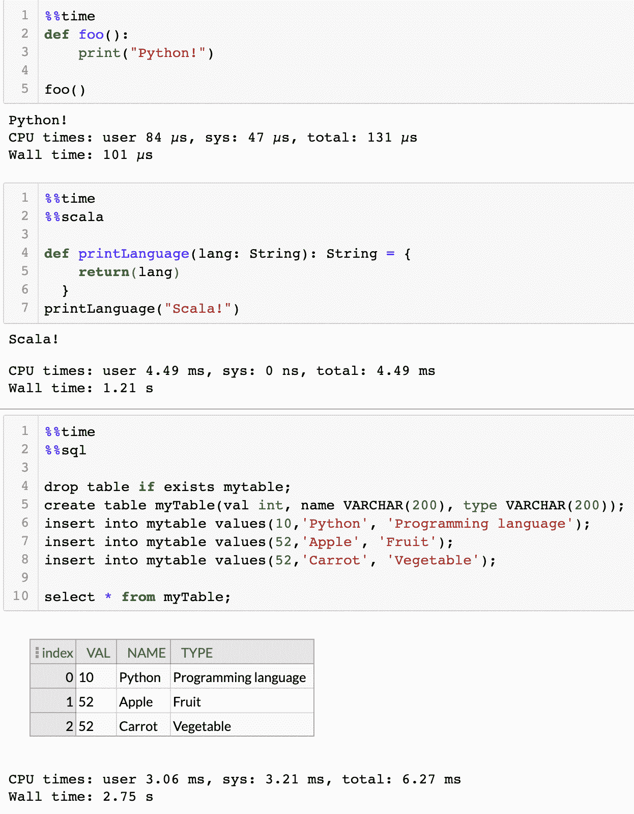
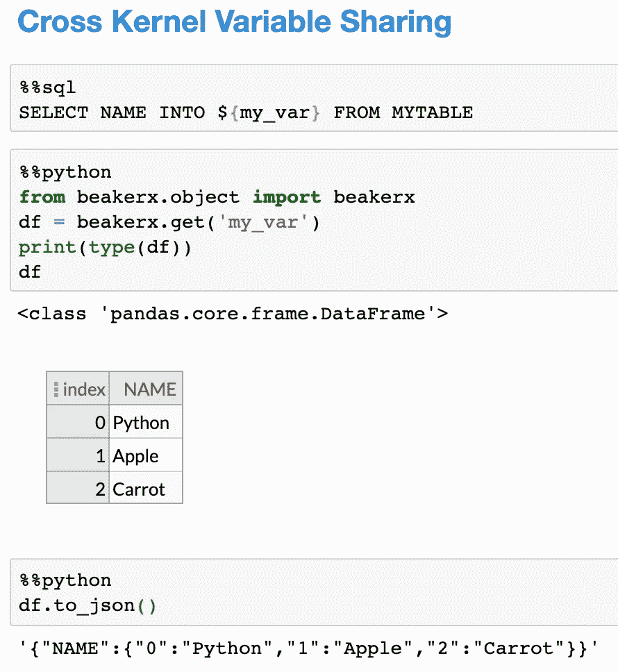
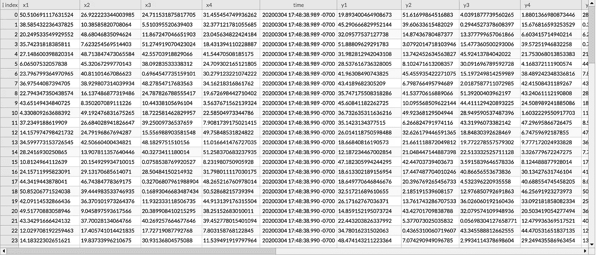
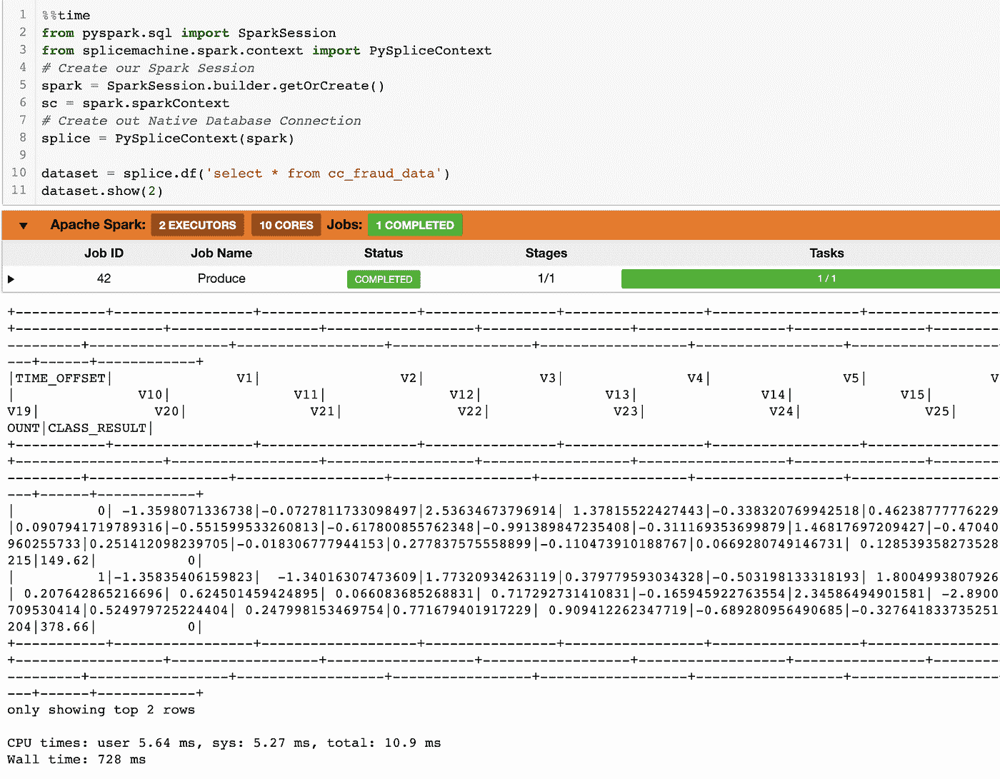
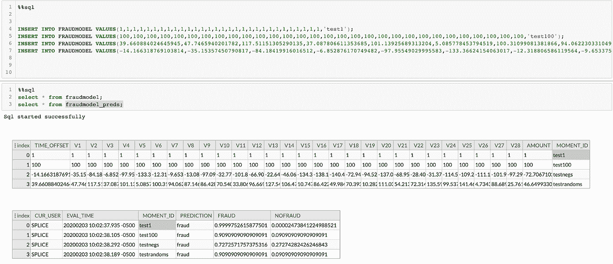
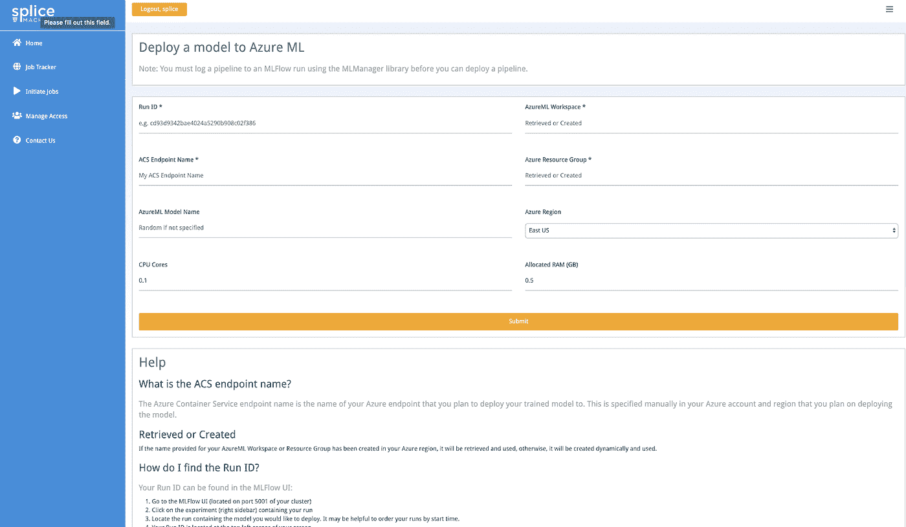

# 构建生产就绪的机器学习模型

> 原文：<https://towardsdatascience.com/building-production-ready-machine-learning-models-adc68754bcf4?source=collection_archive---------36----------------------->

## 了解具有本机 MLOps 的全新横向扩展 RDBMS，它可以轻松开发、管理、部署和治理 ML 模型。

资料来源:Peshkova/Adobe

作者:蒙特·兹韦本和本·爱泼斯坦

随着今天开发的机器学习包的质量，测试和创建模型再容易不过了。数据科学家可以简单地导入他们最喜欢的库，并立即访问数十种前沿算法。但是，创建生产就绪的机器学习模型需要的不仅仅是有效的算法。这需要实验、数据探索和坚实的组织。

数据科学家需要一个环境来自由探索数据，绘制不同的趋势和相关性，而不受数据集大小的限制。借助 Splice Machine 的 MLManager 2.0 平台，构建、测试、实验和将机器学习模型无缝部署到生产中再容易不过了。

以下是 ML Manager 最新版本中提供的数据科学功能的总结。

# Jupyter 笔记本

作为 ML Manager 2.0 的一部分，我们已经将 Jupyter 笔记本电脑直接构建到具有 BeakerX 支持的拼接机器平台中。Jupyter 笔记本是数据科学家工作和共享数据以及代码的最受欢迎的工具。它们易于使用，并允许通过将数据科学过程的各个部分分成不同的单元来模块化工作流。

用 Jupyter 处理熊猫数据帧——来源:拼接机

# 懂得多种语言的

在 ML Manager 2.0 中，我们不仅仅提供对通用 Jupyter 笔记本的访问。有了 ML Manager 2.0，数据科学家拥有了定制的笔记本，并增加了 BeakerX 的功能。我们已经与开源 BeakerX 项目合作，并为 Splice Machine 定制了它。这种定制的一个最重要的特性是**多语言**编程。这种编程范式允许数据科学家在同一个笔记本中用多种不同的语言编写代码。每个单元格都可以用“魔法”来定义，告诉 Jupyter 如何解释代码。

查看拼接机器上 BeakerX 内置的可用魔法命令—来源:拼接机器

数据科学家可以灵活地使用%%定义整个单元格的语言，或者使用%定义单行的语言。这允许你在同一个笔记本上写 SQL 代码，比如 Python、Scala、Java 或 R 代码。

在同一个 Jupyter 笔记本上运行不同语言的多个单元——来源:拼接机

在分离的多语言编程之上，我们还允许**交叉内核变量共享**。这意味着您可以用一种语言定义一个变量，并使用底层的 BeakerX 变量与另一种语言共享它。这使得数据科学家能够前所未有地访问他们的 SQL 数据。例如:

在 SQL 和 Python 之间直接共享变量—来源:Splice Machine

BeakerX 还有许多其他的优秀特性，这些特性直接内置在 Splice Machine 中。

# 形象化

Jupyter 笔记本电脑还配有出色的内置可视化工具，例如用于 2D 和 3D 绘图的 matplotlib 和 plotly:

在 Python 单元中查看 plotly 3D 图形-来源:Splice Machine

数据科学家还可以访问交互式 Pandas 表，您可以在其中对结果进行过滤和排序，并直接向表中添加可视化效果:

将结果直接过滤和分类到 Pandas 表中——来源:拼接机

# 原生 Spark 数据源— PySpliceContext

数据科学中的一个严重问题是过度拟合。过度拟合可能由许多不同的因素造成。这些问题包括创建的模型对训练数据过于精细，在数据集中进行有偏见的分割，甚至为问题选择错误的算法。然而，所有这些问题都可以克服。

数据科学团队面临的另一个挑战是数据规模问题。最难克服的偏差形式是倾斜数据集。许多数据科学团队遇到了在数据子集上构建模型，然后在整个数据集上训练模型的问题。这有可能给模型带来巨大的偏差。

因此，根据全部可用数据训练模型至关重要，而有了拼接机，这不再是一个问题。因为我们的 Jupyter 笔记本电脑与我们的数据库部署在同一位置，所以数据科学家可以直接使用横向扩展功能，即时访问他们的全部数据集。更重要的是，数据工程师和数据科学家使用与应用程序开发人员不同的编程模式。他们操纵火花和熊猫数据帧。现在 Splice 也提供了这种模式和完整的 CRUD API。使用我们的原生 Spark 数据源，您可以查询整个表，无论大小如何，并立即将其作为 Spark 数据帧使用。在几毫秒内，只需一次 api 调用，您就可以将表中的所有数据移动到 Spark Dataframe 中，并在屏幕上显示出来。更强大的是能够将数据帧插入到 Splice 中，并具有完全的 ACID 事务性。这种级别的数据访问和操作使得模型构建和数据探索比以往任何时候都更容易。

想象一下，能够以事务方式更新实时*特征库*,供多个模型实时使用。例如，这些特征存储可以有数万列跟踪客户行为模式的数据，这些数据可以立即转化为数据帧中的特征向量，以供模型管道测试。想象一下能够实时更新这个特征库。然后，模型会即时测试特征。呼叫中心呼叫前几秒钟发生了什么交易？放弃前添加到订单中的最后一个行项目是什么？一个网站的最后一次点击是什么？有了实时特性库和原生 Spark 数据源，ML 变得更有价值。

使用拼接原生数据源将完整的表摄取到 Spark 数据帧中—来源:拼接机器

# 建模简易性

在拼接机器平台上建模也同样简单。使用 Spark、Scikit-learn、TensorFlow、H2O 和 PyTorch，您可以在您最喜欢的库中工作。对于 Scikit-learn，我们可以利用 [skdist](https://github.com/Ibotta/sk-dist#sk-dist-distributed-scikit-learn-meta-estimators-in-pyspark) 在 Spark 上同时训练许多 scikit-learn 模型(想想交叉验证模型)。未来的工作将包括 TensorflowOnSpark。

# MLOps

所有这些伟大的特性都带来了很多复杂性。现在，您可以完全访问您的数据和建模工作，您如何围绕这一点建立一个团队呢？你如何组织你的工作？你如何维护治理？**你如何部署你的模型？**这些问题以及其他许多问题让术语 MLOps 进入了人们的视野。MLOps 是为生产就绪型团队实施数据科学工作流的流程。数据科学不同于其他工程工作，因为它是一个实验过程，需要不同的结构和组织方法。

# 第一遍

*使用典型的数据科学家电子表格* —来源:[拼接机](/feature-factories-pt-2-an-introduction-to-mlflow-873be3c66b66)

如果你曾经见过这样的电子表格，你就知道它的创建有多恐怖。这是一个典型的数据科学运行手册电子表格。不同的实验、运行、参数、数据集、指标以及数据科学实验所需的一切都存储在一个 excel 电子表格中。

这是任何严肃的数据科学团队都无法使用的。创建它需要很长时间，每个新项目都需要重新设计，而且很容易出现用户错误，因为不同的版本作为附件在人们的收件箱里飞来飞去。作为数据科学家，您可能会看着这张工作表，并问“如果我想调整另一个参数，或者尝试随机森林，那将如何适应这张电子表格？”你的恐惧是正确的，这些问题的答案是“你不能”和“它不会”这就是 MLManager 的用武之地

# MLManager(和 MLFlow)

干净灵活的 MLFlow 用户界面可以跟踪您的实验，无论多么复杂——来源:Splice Machine

Splice Machine 的 MLManager 采用了流行的开源项目 MLFlow，并添加了我们认为“完成 ML 生命周期”的功能。使用 MLFlow，您可以轻松、动态地跟踪与您的模型尝试相关的**一切**和**一切**:参数、度量、训练时间、运行名称、模型类型、图像等工件(想想 AUC 图表)，甚至是序列化模型。使用 Splice Machine 的 MLManager，所有这些指标、参数和工件都直接存储在数据库中，无需任何外部存储机制。

您可以轻松地构建大量模型，跟踪您需要的一切，并在 MLFlow UI 中对它们进行数字或视觉比较。例如，上面我们可以看到在一个实验中创建的许多不同运行的指标，下面我们深入研究其中的三个运行，看看我们的随机森林中的树的数量如何与我们的 F1:

用于比较运行和指标的直观用户界面—来源:拼接机

数据科学家甚至可以将他们用来构建模型的笔记本发布到 Github gists，以便共享代码、笔记和片段，供同行审查和透明。给定一个 MLFlow run_id，您可以将模型追溯到它的起源。对于生产就绪的数据科学团队来说，这对于保持对部署哪些模型以及何时部署的控制至关重要。

我们简单明了的 API 使这变得非常容易和可重用，无论您采用什么样的建模过程，只需几个函数调用就可以为您提供完全的可追溯性。我们提供的三个关键功能是:

1.  log _ feature _ transformations 记录特征向量中的每个特征为达到其最终状态而经历的所有单独转换(即一次性编码、标准化、标准化等)
2.  log _ Pipeline _ stages——记录 Spark 管道的所有阶段(如过采样、编码、字符串索引、向量组装、建模等)
3.  log _ model _ params 记录模型的所有参数和超参数
4.  log _ metrics 记录由我们的内置评估器类确定的模型的所有指标

一旦对模型进行了比较和测试，并且您的团队已经准备好进行部署，下一个主要障碍就要出现了。模型部署是数据科学世界中讨论最多的话题，因为它很复杂，不可概括，并且难以监督。像 AzureML 和 Sagemaker 这样的流行部署机制很难构建到您的管道中，并且很难维护治理。

谁部署了模型？谁可以给模特打电话？在过去的 24 小时里谁给模特打过电话？模特表现如何？如何将新模型集成到应用程序中？如果出于安全考虑，我们不想部署到云中，该怎么办？

这些问题很重要，而且没有直接的答案。借助 Splice Machine 的 MLManager，我们通过在 DB 模型部署中使用**来消除复杂性。我们的平台允许您将模型直接部署到数据库中，因此每次在表中插入新行时，您的模型都会立即自动运行，预测会被存储，并跟踪到正在使用的模型。最重要的是，它的部署和利用速度都非常快。部署时间不到 10 秒(相比之下，Sagemaker/Azure ML 部署需要将近 30 分钟)。所有型号的触发器都完全符合 ACID 标准。**

*在不到 6 秒的时间内将生产模型直接部署到数据库表中—* 来源:拼接机

*将行插入表中，并立即看到与每一行插入链接的预测，以实现全面的 ACID AI 治理——来源:拼接机*

在 DB 模型部署中，安全性和治理对于您的 DBA 来说也很容易学习，因为您的模型预测**就在一个表**中，就像数据库中的任何其他表一样。想要撤销对模型的访问权限吗？撤销对表的访问。想要收集模型的统计数据吗？只是一些 SQL 查询。想在应用程序中用一个模型替换另一个模型吗？更改查询中的表名。没有学习曲线，因为没有新技术在使用。此外，由于这只是持久数据，您也可以围绕该模型设计微服务

这是怎么做到的？我们的 MLManager 确定模型管道的类型和结构，创建特定于数据集和模型的表和触发器，并将它们部署到您选择的表中。触发器是动态生成的，当新记录插入到所选的表中时，它会立即运行。触发器调用一个生成的存储过程，该存储过程反序列化模型并将其应用于新记录，并将预测写入预测表。数据科学家和数据工程师不必学习 RDBMS 触发器和存储过程，因为它们是自动生成的。例如，下面是为模型部署生成的触发器和函数:

为直接在数据库的表中运行模型而创建的触发器—来源:拼接机器

然而，如果您的团队仍然希望部署到 Sagemaker 或 AzureML，MLManager 也支持这一点，包括部署 UI 和 API 调用。

将模型部署到 AWS Sagemaker 或 AzureML 的一行代码——来源:Splice Machine

用于将模型部署到 AWS Sagemaker 或 AzureML 而无需代码的 job tracker UI——来源:Splice Machine

如今，人工智能在商业成功方面变得越来越谨慎。没有它，你的公司将会被更敏捷、市场准备更充分的竞争对手甩在后面。由于糟糕的模型开发环境和部署时间的严重风险和影响，注入人工智能已经成为成功的最大障碍。您不能冒险将一个糟糕的模型投入到正在做出关键任务决策的生产中。然而，有了 Splice Machine，治理被完全集成，实验比以往任何时候都更容易，幕后管道也成为过去。

例如，考虑一家保险公司。当监管机构开始质疑你在承销中使用的模式时，Splice Machine ML Manager 如何帮助你遵守规定？您可以通过时间旅行回到您训练模型时存在的数据库的“虚拟快照”,并显示进入模型的要素以及当时这些要素上的数据的统计分布。Splice 使数据科学家能够在培训时将我们的 MVCC 事务引擎的快照隔离时间戳作为元数据记录在 MLFlow 中。通过时间旅行，您可以在几分钟内证明您的合规性。

借助我们的单点治理架构构建您可以信赖的模型，并访问完整、公正的数据，轻松、快速地部署模型，并在您的任务关键型应用程序中利用它们，没有延迟，并且与所有其他表具有相同的 ACID 合规性。无缝集成您的模型，无需学习任何新的架构或平台，您的模型只是一个(超级)表格。使用与监视任何其他表相同的技术来监视您的模型，当新模型准备好替换它时，可以立即重新部署。不要再为您想要现代化的每个应用程序重复创建轮子。

为了亲身体验 Splice Machine 和 ML Manager 2.0，[观看演示视频](https://info.splicemachine.com/ml-manager-2-0-demo.html?utm_source=medium&utm_medium=post&utm_campaign=ml_manager)，该视频强调了 Splice Machine 的强大功能，以及它如何帮助您构建生产就绪的 ML 模型。