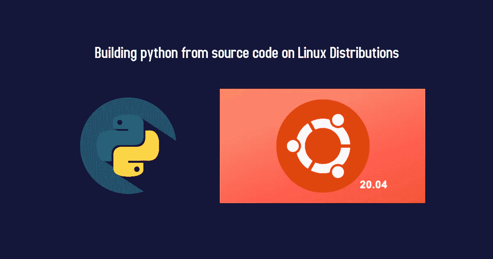
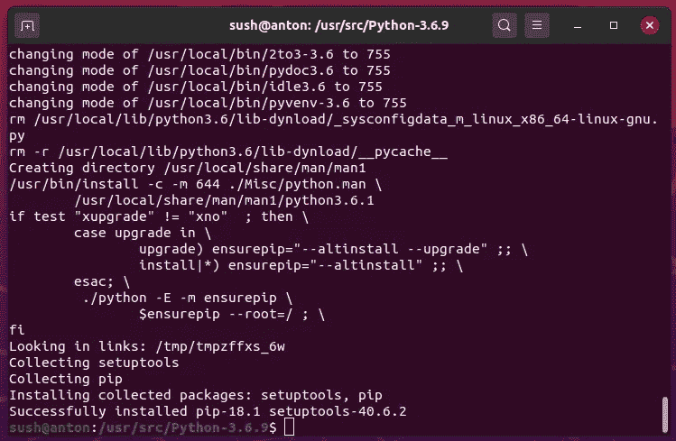
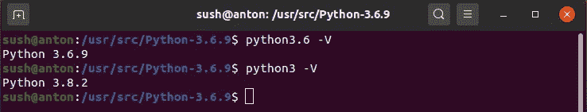
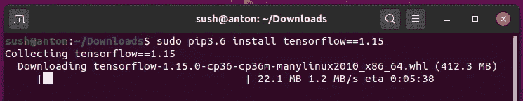
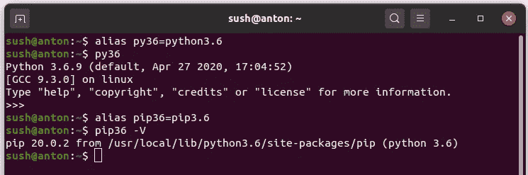

# 在 Ubuntu 20.04 LTS Focal Fossa 上从源代码构建 python

> 原文：<https://towardsdatascience.com/building-python-from-source-on-ubuntu-20-04-2ed29eec152b?source=collection_archive---------7----------------------->

## 了解如何在基于 Linux 的操作系统上从源代码构建您最喜欢的语言。



在你最喜欢的操作系统上构建你最喜欢的语言

> 除了面临依赖问题的用户之外，这个博客是为任何想尝试在任何基于 Linux 的操作系统上从源代码安装 python 的人准备的

如果你已经升级了你的操作系统，并且想知道为什么一些在 Ubuntu 18.04 上很容易安装的库不能在 20.04 上安装。当我的一个开发环境需要一个库，而我试图使用内置 python 来安装这个库时，我遇到了同样的问题。不幸的是，我面临着依赖问题。

这背后的原因是 Ubuntu 20.04 带有内置的 python 版本 3.8.2，而 Ubuntu 18.04 带有 Python 3.6.x

您可能会尝试安装不同的依赖于 Python 3.6 的库。别担心，这很容易..2..3

让我们从一个特定的 python 版本开始，我将在这篇博客中使用 Python 3.6.9，因为我是在以前的系统上工作的。

# 重要的事情先来

安装构建库所需的基本依赖项

```
sudo apt-get update
sudo apt-get install -y build-essential checkinstall 
```

和

```
sudo apt-get install libreadline-gplv2-dev libncursesw5-dev libssl-dev libsqlite3-dev tk-dev libgdbm-dev libc6-dev libbz2-dev
```

# 让我们建造

从改变目录开始，从 [**python**](https://www.python.org/downloads/source/) **下载源代码。**

> 我将从 **/usr/src** 安装它，但是你可以使用你选择的任何位置

```
cd /usr/src
sudo wget https://www.python.org/ftp/python/3.6.9/Python-3.6.9.tgz
```

正在提取下载的包

```
sudo tar xzf Python-3.6.9.tgz
```

# 编译源

```
cd Python-3.6.9
sudo ./configure --enable-optimizations
```

在这里，我们添加了一个新标志`--enable-optimizations`
，它设置了默认的 make targets 来启用 Profile Guided Optimization (PGO ),并可用于在某些平台上自动启用链接时间优化(LTO)。

关于`--enable-optimizations`的更多详情，请参见 [*此处的*](https://github.com/docker-library/python/issues/160)

# 我们都在等待的一步

构建 python

```
sudo make altinstall
```

当我们可以使用`install`时，为什么要使用`altinstall`

> **原因**:在 Unix 和 Mac 系统上，如果你打算安装多个版本的 python，你必须注意你的主要 Python 可执行文件不会被不同版本的安装覆盖
> 。`altinstall`构建特定版本的 python 而不覆盖你的默认版本，这样你就可以使用多个版本的 python。
> 
> 注:根据设备配置，此步骤可能需要一些时间



最终输出将是这样的

python 版本将用后缀`python3.6`构建

# 验证安装

```
python3.6 --version
```

注意我用了`python3.6`来代替。如果你尝试运行`python3 --version`,它会显示内置的 python 版本，从 Ubuntu 20.04 开始是 3.8



注意区别

# 用一个命令构建一切

我为此创建了一个 shell 脚本，您可以从这里下载脚本文件。

[](https://github.com/novasush/build-python-from-source) [## novas ush/build-python-from-source

### 用于从源代码构建 python 的 Shell 脚本...

github.com](https://github.com/novasush/build-python-from-source) 

# 升级 pip(可选)

为 pip 安装依赖关系

```
sudo apt-get install -y python3-distutils python3-testresources
```

下载 [**get-pip.py**](https://bootstrap.pypa.io/get-pip.py) 并运行

```
cd ~/
wget [https://bootstrap.pypa.io/get-pip.py](https://bootstrap.pypa.io/get-pip.py)
sudo python3.6 get-pip.py
```

就像`python3.6`这样使用前缀`pip3.6`进行安装



pip3.6 安装包

# 奖金

如果你对每次使用`python3.6`或`pip3.6`感到厌烦，就使用下面提到的任何一种配置。

**使用别名**

```
alias py36=python3.6
alias pip36=pip3.6
```



python3.6 和 pip3.6 的别名

> **别名**命令的限制:
> 要么在每次运行 python 或 pip 之前运行该命令，要么在`~/.bashrc`的底部添加这些行，但它将仅在用户级别运行。
> 解决这个问题的最佳方案是使用`update-alternatives`

**使用更新替代方案**

检查 python 路径，将其添加到更新替代配置中

```
which python3.6
```

> 我的路径是**/usr/local/bin/python 3.6**

添加更新替代配置的路径

```
sudo update-alternatives --install /usr/bin/python python /usr/local/bin/python3.6 0
```

# 这是所有的乡亲