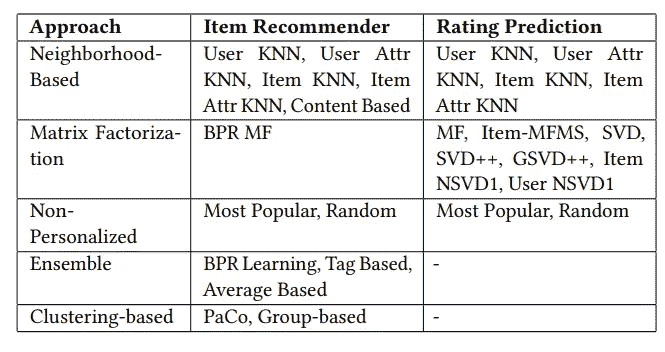
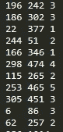

# 用 Python 框架构建推荐系统引擎

> 原文：<https://towardsdatascience.com/building-recommender-systems-engines-with-a-python-framework-5b4d29925c28?source=collection_archive---------18----------------------->

## 理解如何使用和开发案例推荐器的实用指南


马丁·范·登·霍维尔在 [Unsplash](https://unsplash.com/s/photos/documents?utm_source=unsplash&utm_medium=referral&utm_content=creditCopyText) 上的照片

科学界已经提出了许多推荐系统的框架，包括不同的编程语言，如 Java、C\#、Python 等。然而，它们中的大多数缺乏包含聚类和集成方法的集成环境，这些方法能够提高推荐准确度。一方面，聚类可以支持开发者预处理他们的数据，以优化或扩展推荐算法。另一方面，集成方法是以个性化方式组合不同类型数据的有效工具。

在本文中，我描述了一个名为案例推荐器的 python 框架，它包含各种基于内容的协作推荐算法，以及用于组合多种算法和数据源的集成方法。此外，它还提供了一套流行的评价方法和指标，用于评分预测和项目推荐。

# 语境化

传统上，推荐系统使用过滤技术和机器学习信息从用户简档的表示中产生适合用户兴趣的推荐。然而，其他技术，如神经网络、贝叶斯网络和关联规则，也在过滤过程中使用。目前使用最多的过滤类型是:基于内容的(CBF)，负责基于元素的内容过滤来选择信息，例如，由于包含不想要的单词而被过滤为垃圾的电子邮件消息；协同过滤(CF)，基于人与人之间的关系以及他们对要过滤的信息的主观看法。基于发件人和收件人之间的关系选择电子邮件就是一个例子。此外，还有一种结合了基于内容和协同过滤方法的混合方法。

# 案例推荐器

案例推荐器目前正在重写，以支持使用已知 Python 科学库的优化计算。除了使用元数据和外部信息，我还开发和改进了允许开发人员操作文件、预测和评估模型、计算用户或项目之间的相似性(不相似)的类。该框架现在在 Python 3 中实现，它解决了推荐系统中的两个常见场景:评级预测和项目推荐，在几个推荐策略中使用显式、隐式或两种类型的反馈。要在 Mac OS X / Linux/ Windows 上安装 Case Recommender，以下两个命令中的一个可能对开发者和用户有用:

```
easy_install CaseRecommender
```

或者:

```
pip install CaseRecommender
```

在设计我们的框架时，重要的特性是支持大规模的推荐计算，容易为不同类型的过滤和场景创建和扩展算法。另一个特性是支持稀疏和大型数据集，尽可能减少存储数据和中间结果的开销。开发人员可以选择使用一种可用的推荐算法，或者使用一种可用的集成技术组合多个推荐，或者使用 *BaseRatingPrediction* 或 *BaseItemRecommendation* 类开发自己的算法。到当前版本为止，框架中可用的算法如下表所示:



# 输入数据

该框架允许开发者处理不同的数据集，而不必开发他们自己的程序来执行推荐器功能。算法的输入要求数据采用简单的文本格式:

> 用户标识项目标识反馈

其中 user_id 和 item_id 是分别表示用户和项目 id 的整数，而 feedback 是表示用户有多喜欢某个项目或二元交互的数字。值之间的分隔符可以是空格、制表符或逗号。如果超过三列，则忽略所有附加列。例如，下面是来自 [ML100k 数据集](https://grouplens.org/datasets/movielens/100k/)的数据示例:



# 推荐系统的数据集

在学习期间，我还为遥感建立了一个高质量的以主题为中心的公共数据源库。它们是从栈溢出、文章、推荐网站和学术实验中收集整理的。存储库中提供的大多数数据集都是免费的，有开放的源链接，然而，有些不是，你需要请求许可才能使用或引用作者的工作。访问此链接获取这些数据。

[](https://github.com/caserec/Datasets-for-Recommender-Systems) [## 推荐系统数据集

### 这是一个用于推荐系统(RS)的以主题为中心的高质量公共数据源的存储库。他们是…

github.com](https://github.com/caserec/Datasets-for-Recommender-Systems) 

# 使用

对于使用折叠交叉验证划分数据集:

```
from caserec.utils.split_database import SplitDatabaseSplitDatabase(input_file=dataset, dir_folds=dir_path, n_splits=10).k_fold_cross_validation()
```

运行项目推荐算法(例如:ItemKNN)

```
from caserec.recommenders.item_recommendation.itemknn import ItemKNNItemKNN(train_file, test_file).compute()
```

运行评级预测算法(例如:ItemKNN)

```
from caserec.recommenders.rating_prediction.itemknn import ItemKNNItemKNN(train_file, test_file).compute()
```

评估排名(预测@N、回忆@N、NDCG @N、地图@ N 和地图总计)

```
from caserec.evaluation.item_recommendation import ItemRecommendationEvaluation
 ItemRecommendationEvaluation().evaluate_with_files(predictions_file, test_file)
```

评估排名(梅和 RMSE)

```
from caserec.evaluation.rating_prediction import RatingPredictionEvaluationRatingPredictionEvaluation().evaluate_with_files(predictions_file, test_file)
```

在折叠交叉验证方法中运行 ItemKNN

```
from caserec.recommenders.item_recommendation.itemknn import ItemKNN
from caserec.utils.cross_validation import CrossValidation## Cross Validation
recommender = ItemKNN(as_binary=True)
CrossValidation(input_file=db, recommender=recommender, dir_folds=folds_path, header=1, k_folds=5).compute()
```

更多例子可以在这个[链接](https://github.com/caserec/CaseRecommender/tree/master/examples)中找到。

# 结论

案例推荐的目标是集成和促进不同领域的新推荐技术的实验和开发。我们的框架包含一个推荐引擎，它包含基于内容的、协作的和混合的过滤方法，用于评级预测和项目推荐场景。此外，该框架包含集成和聚类算法、验证和评估指标，以提高和衡量推荐的质量。

未来的版本计划将包括更多的功能(并行处理技术和新算法)和一个评估工具，该工具有几个图和图形，以帮助开发人员更好地了解他们的推荐算法的行为。

# 有用的链接

[](https://github.com/caserec/CaseRecommender) [## 案例推荐/案例推荐者

### 案例推荐器是许多流行的推荐算法的 Python 实现，包括隐式推荐算法和…

github.com](https://github.com/caserec/CaseRecommender) [](http://www.mymedialite.net/) [## MyMediaLite 推荐系统库

### MyMediaLite 是公共语言运行时(CLR，通常称为。网)。它解决了…

www.mymedialite.net](http://www.mymedialite.net/) [](https://dl.acm.org/doi/10.1145/3240323.3241611) [## 案例推荐|第 12 届 ACM 推荐系统会议录

### 本文提出了一个改进的基于 Python 的开源推荐框架&案例推荐器

dl.acm.org](https://dl.acm.org/doi/10.1145/3240323.3241611)