# 在 Google Cloud 上用 Dockers 构建无服务器 Python 数据 API

> 原文：<https://towardsdatascience.com/building-serverless-python-data-apis-with-dockers-on-google-cloud-24d4f15cf81?source=collection_archive---------33----------------------->

在本文中，我将向您展示一种简单的方法，可以在几分钟内构建几个数据 API 来利用来自 BigQuery 数据集的数据。这些 API 将通过 dockers 部署，dockers 使用一个名为 [Cloud Run](https://cloud.google.com/run) 的 GCP 无服务器服务。

# 体系结构

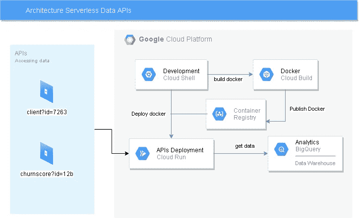

体系结构

背后的想法是使用无服务器组件。首先，让我们了解这些服务及其在架构中的用途。

*   **云运行:**云运行是一个完全托管的计算平台，可以自动扩展你的无状态容器[ [云运行文档](https://cloud.google.com/run) ]。它将处理所有的 API 请求，因为它是完全托管的，我们不需要担心伸缩性。为了实现第一个目标，必须部署 docker。
*   **云壳:**云壳为您提供直接从浏览器【云壳 Doc】命令行访问您的云资源。总是需要一个开发环境，在这种情况下，是云壳。python 代码将在这里开发。
*   **云构建:**云构建是一种在谷歌云平台基础设施上执行构建的服务。云构建根据您的规范执行构建，并生成 Docker 容器[ [Doc](https://cloud.google.com/cloud-build/docs) ]之类的工件。当我们准备好构建 docker 时，我们将调用 Cloud Build 来完成这项工作，默认情况下，这个 docker 将发布在 GCP 容器注册中心。
*   **容器注册:**在 Google 云平台上提供安全、私有的 Docker 图像存储[ [Doc](https://cloud.google.com/container-registry/docs) ]。在这个地方将托管我们的 docker，准备由云构建调用。
*   **BigQuery:** BigQuery 是 Google 完全托管的、Pb 级、低成本的分析数据仓库。BigQuery 是 NoOps——不需要管理基础设施，也不需要数据库管理员。BigQuery 是我们的数据仓库，所以 API 需要的所有数据都在这里。

# **获取数据**

对于这个项目，我们将使用一个名为 *covid19_ecdc* 的 [BigQuery 公共数据集](https://console.cloud.google.com/marketplace/browse?filter=solution-type:dataset&hl=ru&angularJsUrl=%2Fmarketplace%2Fbrowse%3Ffilter%3Dsolution-type%253Adataset%26hl%3Dru&authuser=5)，其中包含按国家和日期分列的确诊病例和死亡数据。

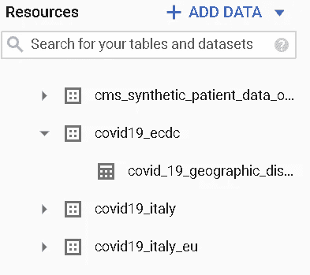

资料组

**创建数据集并查看**

让我们创建一个 BigQuery 数据集和一个视图或一个[物化视图](https://cloud.google.com/bigquery/docs/materialized-views-intro)来获取项目中的数据。

创建视图和数据集

**数据**

做一个简单的探索，我们可以确定模式和数据。对于这个项目，我们的 API 将提取

*   所有的数据
*   特定日期来自所有国家的案例
*   特定国家报告的所有病例

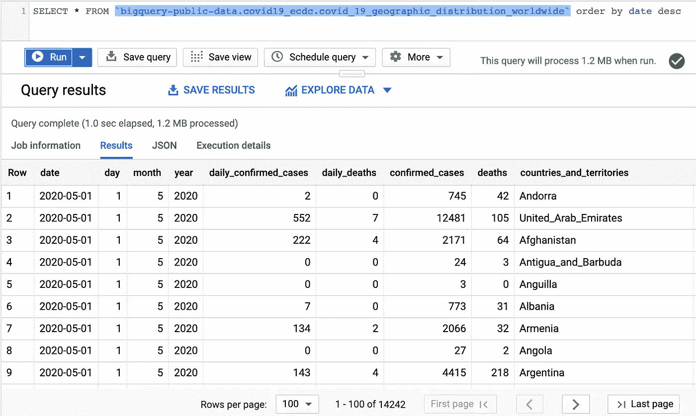

使用的表格

# **样板工程**

用 python 构建 REST API 并不难。为了简单起见，我发布了一个包含所有文件的 GitHub 项目。

[](https://github.com/antoniocachuan/dataapi-bigquery) [## antoniocachuan/data API-big query

### 用 python 构建一个无服务器数据 API，从 big query-antoniocachuan/data API-big query 获取数据

github.com](https://github.com/antoniocachuan/dataapi-bigquery) 

让我们了解一下文件

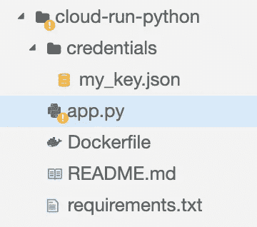

项目文件

**App.py**

主文件。Flask base 项目，这包括其他库，用 [flask_sqlalchemy](https://flask-sqlalchemy.palletsprojects.com/en/2.x/api/) 和 [flask_marshmallow 制作一个更简单的 API。](https://flask-marshmallow.readthedocs.io/en/latest/)

app.py

需要修改的代码行包括您的 GCP ID 项目、数据集和您的 GCP 凭据。了解更多关于如何获得 GCP 证书的信息。

在项目中更新此变量

**Dockerfile**

一个`Dockerfile`是一个文本文档，它包含用户可以在命令行上调用的所有命令，以组合一个图像。

这个项目使用一个瘦 python 映像，安装所有需要的库，最后用 [gunicorn](https://gunicorn.org/) 启动一个 HTTP 服务器来处理 API 请求。

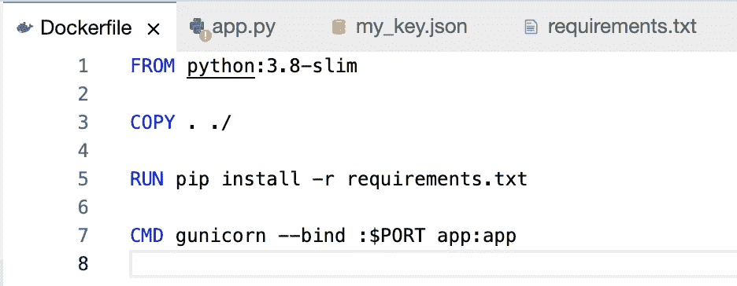

Dockerfile 文件

**Requirements.txt**

项目所需的所有 python 库的列表。

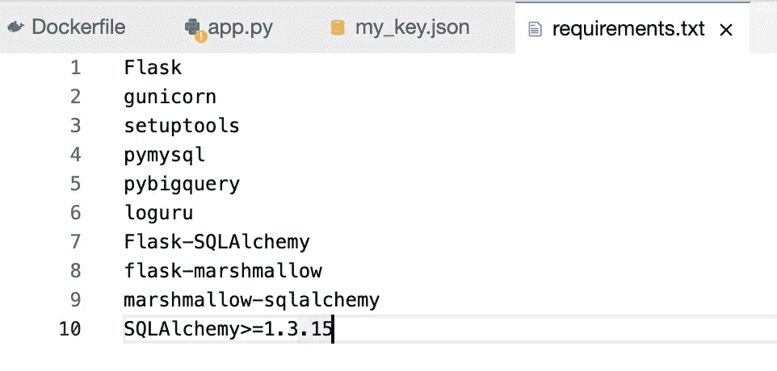

# **设计 API 请求**

**对象关系映射**

我们使用 SQLAlchemy 作为 ORM，将 Python 类转换成 BigQuery 表。Marshmallow 用于使对象序列化和反序列化更容易。

要使这段代码工作，定义类名等于 BigQuery 表是很重要的(默认情况下，内部的 *Covid* 将更改为 *covid* 以在 BigQuery 上搜索该表)。如果您有其他表名，请在第 23 行使用`__table__='YOUR_TABLE_NAME'` 。

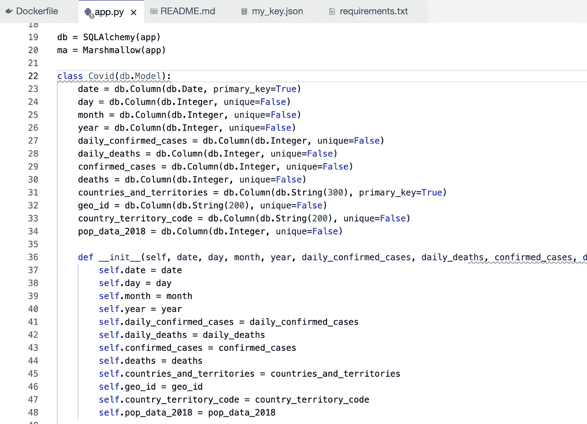

让我们为你定义所有你想被调用的列。

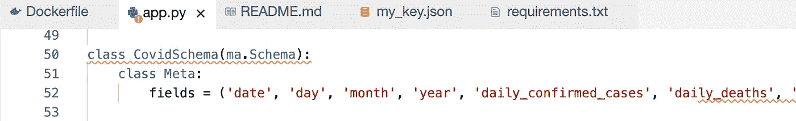

**请求**

为了实现定义的三个数据需求，我们编写了 3 个函数。

首先，我们的数据 API 返回 BigQuery 表中的所有数据。

获取所有国家数据

函数`get_day()`接收像`2020-04-04`这样的参数，并返回该特定日期来自所有国家的数据。

特定一天所有国家的数据

函数`country_detail()`像`PE`一样接收国家地理编码，并从特定国家返回数据。

# **使用云构建构建 docker 映像**

每次我们需要更新我们的项目，你需要建立一个新版本的 docker 图像。存在许多替代方案，这里我们使用 Cloud Build 工具来构建 docker 映像并将其发布到容器注册表。别忘了定义你的 *DOCKER_IMAGE_NAME* 。

```
gcloud builds submit — tag gcr.io/YOUR_PROJECT_ID/DOCKER_IMAGE_NAME
```

我在 Cloud Shell 上运行它，并记住与您的 Dockerfile 位于同一层，并且您的 project_id 必须被解决(您需要看到黄色的字母)

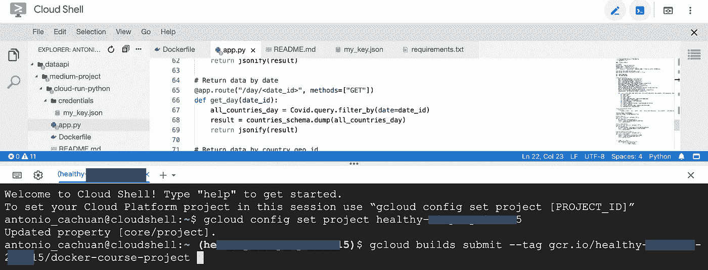

构建 Docker 映像

如果一切顺利，你可以看到你的 Docker 图片发布。

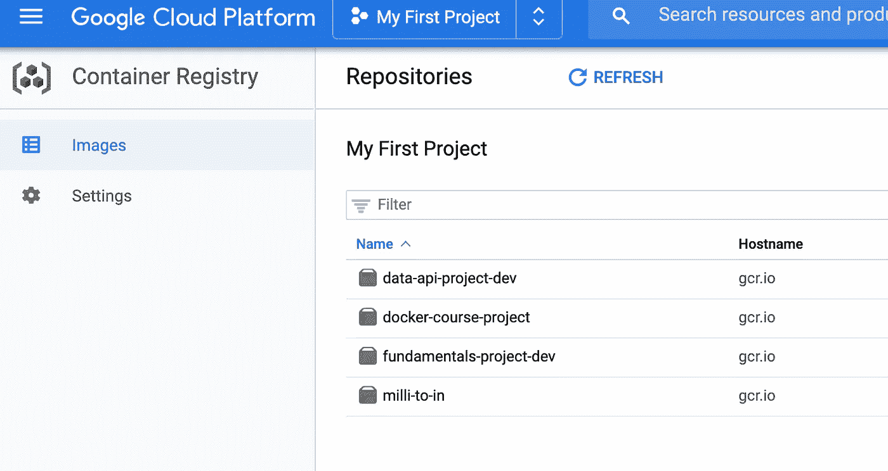

集装箱登记处

# 使用云运行部署 docker

最后一步是在 Web 上部署 Docker 映像！Cloud Run 会负责一切，决定一个 *SERVICENAME* ，更新对你 Docker 镜像的引用。

```
gcloud run deploy SERVICENAME --image gcr.io/YOUR_PROJECT_ID/DOCKER_IMAGE_NAME --platform managed --region us-central1 --allow-unauthenticated
```

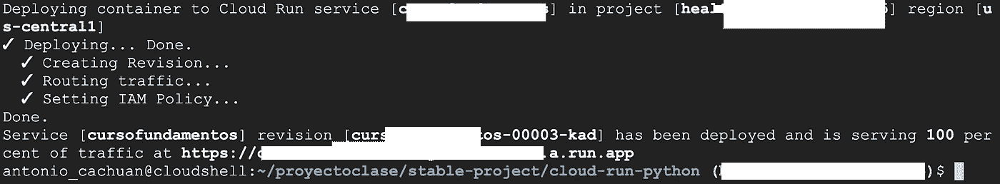

最后，您获得一个公共 URL 来开始获取数据！

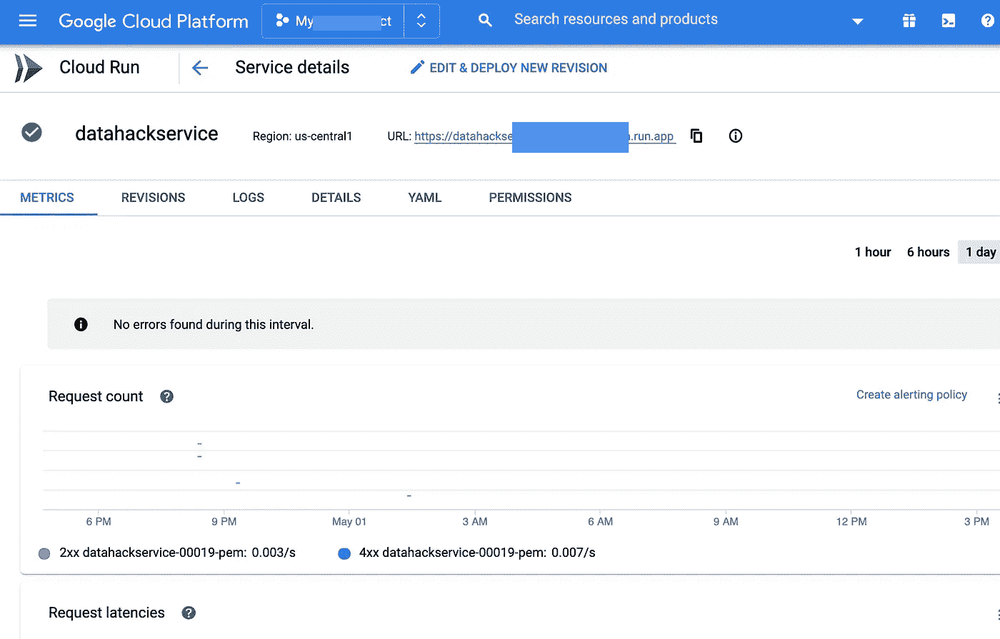

# **数据 API 工作**

是时候通过浏览器获取发出请求的数据了。

**所有国家的数据**

```
https://datahackservice-xx-uc.a.run.app/countries
```

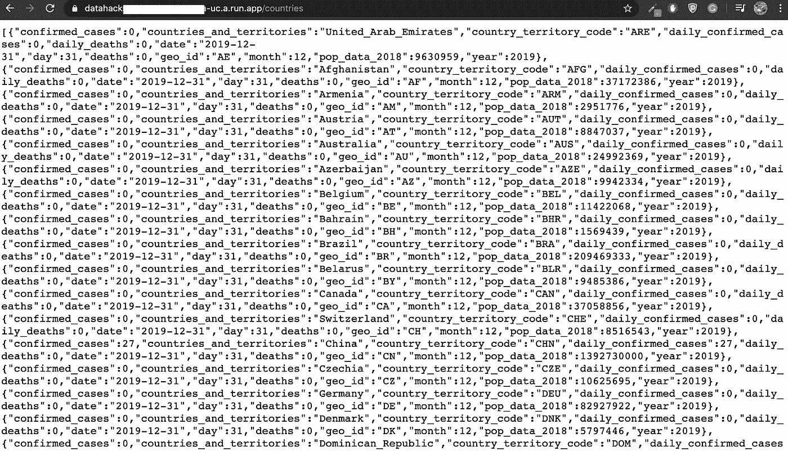

**特定日期的数据**

```
https://datahackservice-xx-uc.a.run.app/day/2020-05-01
```

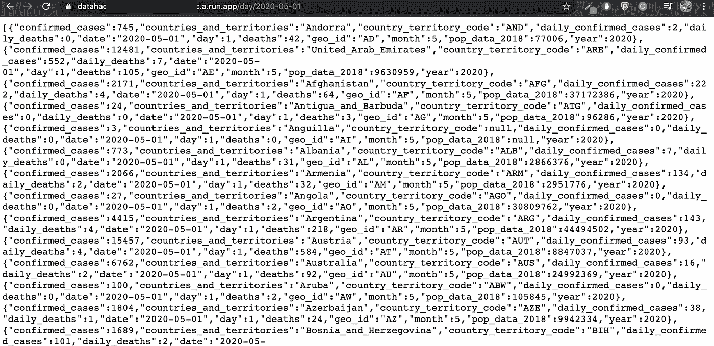

**特定国家的数据**

```
https://datahackservice-xx-uc.a.run.app/country/PE
```


# **结论和未来工作**

本文向您展示了使用 Python 和无服务器产品(如 Cloud Run 和 BigQuery)开发数据 API 是多么容易。

有了这个 API，我们就能构建出色的数据可视化，数据 API 强大的一个很好的例子来自《世界银行评论》Sébastien Pierre 的文章[这里](https://www.oreilly.com/content/data-apis-design-and-visual-storytelling/)。

特别感谢 [Martin Omander](https://github.com/momander/serverlesstoolbox/tree/master/cloud-run-python) 和 [Sagar Chand](https://www.codementor.io/@sagaragarwal94/building-a-basic-restful-api-in-python-58k02xsiq) 提供的优秀知识库和文章帮助我开发了这篇文章。

PS 如果你有什么问题，或者有什么有趣的数据想法，可以在 [Twitter](https://twitter.com/thony_ac77) 和 [LinkedIn 上找我。](https://www.linkedin.com/in/antoniocachuan/)另外，如果你正在考虑参加谷歌云认证，我写了一篇技术文章描述我的经验和建议。

[](/how-i-could-achieve-the-google-cloud-certification-challenge-6f07a2993197) [## 我如何完成谷歌云认证挑战？

### 在按照谷歌推荐的 12 周准备后，我通过了云工程师助理考试，在这里…

towardsdatascience.com](/how-i-could-achieve-the-google-cloud-certification-challenge-6f07a2993197)