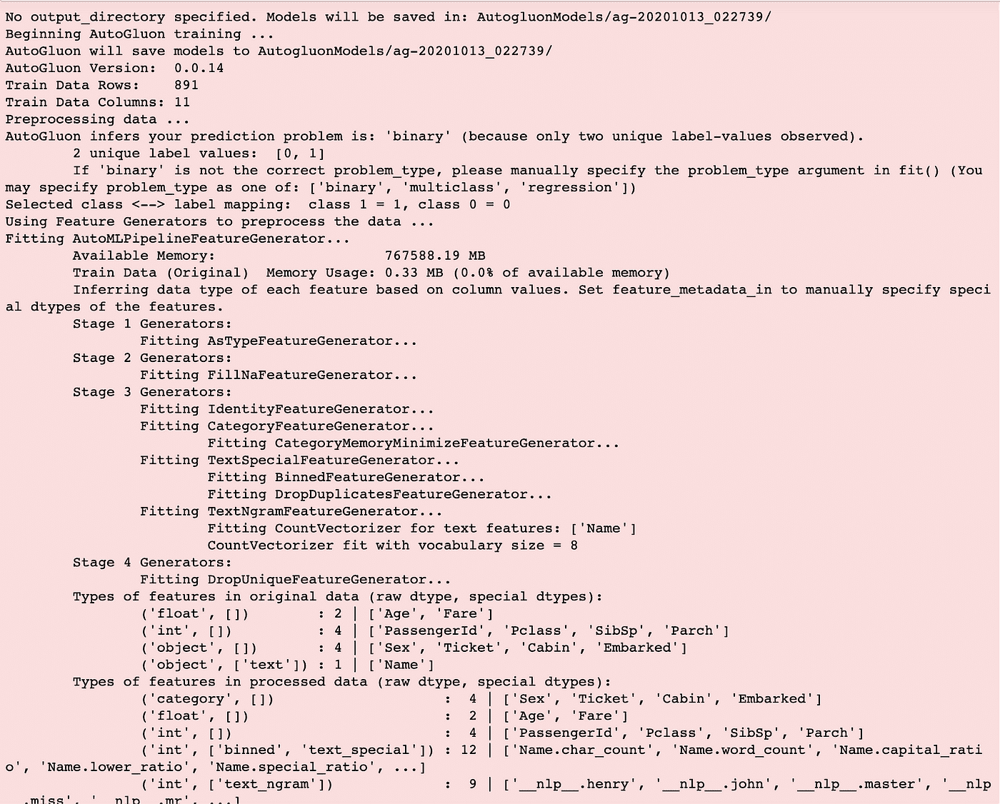
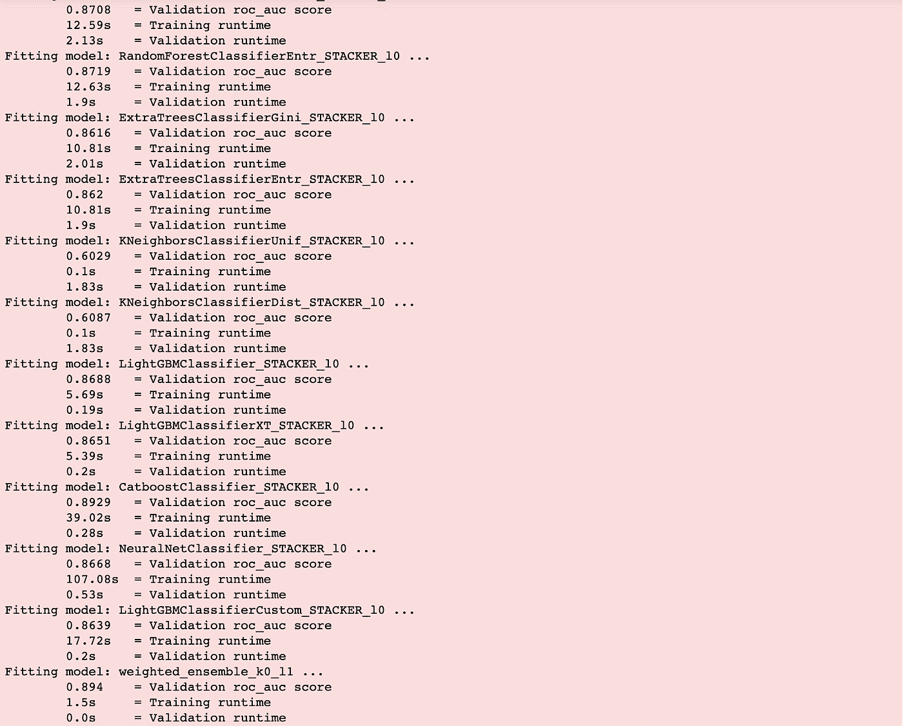
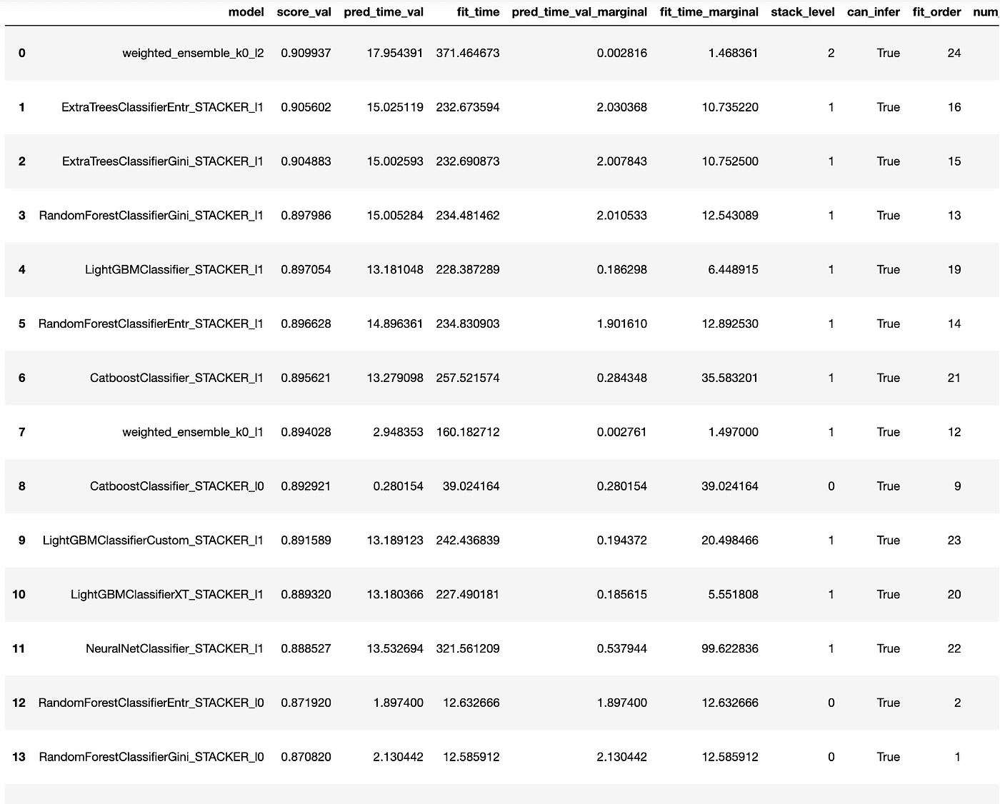
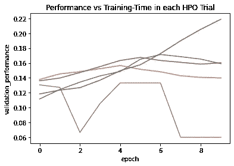

# 使用自动旋转构建最先进的机器学习模型

> 原文：<https://towardsdatascience.com/building-state-of-art-machine-learning-models-with-autogluon-9f19f61048fb?source=collection_archive---------27----------------------->

照片由[凯尔·布鲁姆](https://unsplash.com/@kaelbloom?utm_source=medium&utm_medium=referral)在 [Unsplash](https://unsplash.com?utm_source=medium&utm_medium=referral) 拍摄

# 自动登录和自动

AutoGluon 是由 AWS 构建的开源 AutoML 框架，它支持简单易用且易于扩展的 AutoML。它使您能够在没有专业知识的情况下，通过利用最先进的深度学习技术来实现最先进的预测准确性。这也是一种快速的方式来原型化您可以从您的数据集获得什么，以及获得您的机器学习的初始基线。AutoGluon 目前支持处理表格数据、文本预测、图像分类和对象检测。

**AutoML** 框架的存在是为了降低机器学习的入门门槛。他们负责繁重的任务，如数据预处理、特征工程、算法选择和超参数调整。这意味着，给定一个数据集和一个机器学习问题，继续用不同的超参数组合训练不同的模型，直到找到模型和超参数的最佳组合——也称为 *CASH(组合算法/超参数调整)*。现有的 AutoML 框架包括 SageMaker Autopilot、Auto-WEKA 和 Auto-sklearn。

AutoGluon 不同于其他(传统)AutoML 框架，它比 *CASH(组合算法/超参数调优*)做得更多。

# 集成机器学习和堆叠

在深入研究旋翼飞行器之前，重温一下系综机器学习和堆叠是很有用的。集成学习是一种并行训练许多(有目的地)弱模型来解决同一问题的机器技术。集成由一组单独训练的分类器组成，例如神经网络或决策树，当对新实例进行分类时，它们的预测被组合。这种机器学习技术背后的基本思想是*许多模型比少数模型好，不同学习的模型可以提高准确性，即使它们在孤立状态下表现较差。*

在大多数情况下，选择单个基本算法来构建多个模型，然后对其结果进行汇总。这也被称为 ***同质*** 集成学习方法，就像随机森林算法是最常见和最流行的同质集成学习技术之一，其中多棵树被训练来预测同一问题，然后在它们之间进行多数投票。同类方法的其他例子包括装袋、旋转森林、随机子空间等。

相比之下， ***异构*** 方法涉及使用不同的机器学习基础算法，如决策树、人工神经网络等，来创建用于集成学习的模型。 ***堆叠*** 是一种常见的异构集成学习技术。

这个表[这里](https://www.hindawi.com/journals/mpe/2013/312067/tab2/)列出了同构和异构机器学习的例子。

AutoGluon 使用了一个*多层堆栈集合*，我们接下来将研究它是如何工作的。

# 自动旋转是如何工作的

AutoGluon 在*监督机器学习*域中运行。这意味着您需要有用于训练的带标签的输入数据。AutoGluon 负责预处理、特征工程，并根据您试图解决的机器学习问题生成模型。

AutoML 的主要部分依赖于*超参数调整*来生成和选择最佳模型。超参数调整涉及为提供最佳模型的机器学习算法找到超参数的最佳组合。最佳参数集的搜索策略基于随机搜索、网格搜索或贝叶斯优化(SageMaker 使用的方法)。

然而，超参数调谐存在局限性。超参数调优效率低、耗时，而且由于不是所有调优的模型最终都会被使用，因此会造成大量开销浪费。最后，还存在过度拟合验证(保持)数据的风险，因为每次运行调优过程时，都会检查验证数据集，最终会过度拟合验证数据集。

AutoGluon 与其他 AutoML 框架的一个关键区别是，AutoGluon 使用(几乎)每一个经过训练的模型来生成最终预测(*而不是在超参数调整*后选择最佳候选模型)。

# 记忆和状态

自动增长是内存感知的，它确保训练的模型不会超过它可用的内存资源。

AutoGluon 是状态感知的，它预计模型在训练期间会失败或超时，并优雅地跳过失败的模型，继续下一个模型。只要你生成了一个成功的模型，自动旋转就可以开始了。

AutoGluon 依赖于多层堆栈集成等策略。它自动进行 k-fold bagging 和 out-of-fold 预测生成，以确保没有过度拟合。具体来说，它利用了现代深度学习技术，也不需要任何数据预处理。

# 行动中的自动旋转

自动增长也支持文本和图像，但是对于这篇文章，我们主要关注*自动增长表格。*分类和回归的监督机器学习问题的自动增长表格工作。您可以预先指定问题的类型，或者 AutoGluon 会根据您的数据集自动选择一个问题。

# 数据集

对于数据集，我们使用来自 Kaggle 的流行、开源的 [Titanic 数据集](https://www.kaggle.com/c/titanic/data)。该数据集包含训练数据，其中包括皇家邮轮泰坦尼克号上 851 名乘客的标记数据，以及他们是否在灾难中幸存。该数据集还包括一个测试集，其中有 418 名乘客，但没有标签，即他们是否幸存。

图片来自[维基百科](https://en.wikipedia.org/wiki/Titanic#/media/File:RMS_Titanic_3.jpg)

挑战在于根据包括的特征如姓名、年龄、性别、社会经济阶层等来预测乘客是否幸存。

# 设置

AutoGluon 安装非常简单，只需几行代码

# 培养

为了开始训练，我们首先从 AutoGluon 导入 TabularPrediction，然后加载数据。AutoGluon 目前可以对已经作为 pandas DataFrames 加载到 Python 中的数据表进行操作，或者对那些存储在 CSV 格式或 Parquet 格式的文件中的数据表进行操作。

一旦您加载了数据，您就可以立即开始训练，您所需要做的就是指向训练数据并指定您想要预测的列的名称。

训练从`.fit()`法开始

您可以选择指定希望培训运行的时间，AutoGluon 将在该时间内自动结束所有培训作业。

`eval_metric`参数允许您指定 AutoGluon 将用于验证模型的评估指标。默认是`accuracy`。

设置`auto_stack = True`允许 AutoGluon 管理它将自动创建的堆栈数量。您可以通过`stack_ensemble_levels`参数选择指定您想要的堆叠数量。

`presets`参数允许您选择想要生成的模型类型，例如，如果延迟和时间不是一个约束条件的话`presets='best_quality`通常会生成更精确的模型。另一方面，如果您知道延迟将是一个约束，那么您可以设置`presets=[‘good_quality_faster_inference_only_refit’, ‘optimize_for_deployment’` 来生成针对部署和推断更优化的模型。

训练开始后，AutoGluon 将在训练的不同阶段开始记录消息。

培训日志(图片由作者提供)

随着培训的进行，AutoGluon 还将记录其生成的各种模型的评估分数。

模型分数(图片由作者提供)

这里需要注意的是，除非您明确需要指定一个验证数据集，否则您应该直接将所有训练数据发送到 AutoGluon。这允许 AutoGluon 以有效的方式自动选择数据的随机训练/验证分割。

训练完成后，您可以开始使用`.predict()`功能进行推理。

在上面的例子中，我们只使用默认设置来训练 Titanic 数据集。

我们取得的成绩是最先进的。准确率为 ***~78*** ，在 Kaggle 的比赛中名列前 8%-10% 。

# 如果您想使用一个或一些模型，该怎么办

默认情况下，auto glon 会自动选择最佳的多层堆栈集合来运行您的预测，但是，您也可以通过生成一个带有单行代码的排行榜来获得 auto glon 生成的所有模型及其特定性能指标的列表:`predictor.leaderboard(extra_info=True, silent=True)`

排行榜(作者图片)

除了性能指标，排行榜还显示了每个模型/堆栈的训练和推理时间，以及顺序、祖先、后代等。以及其他信息。

使用此排行榜，您只需指定索引号，即可选择想要运行的特定组合。

例如，在上面的代码中，我们使用了系综的堆栈 19。

# 超参数调优呢

与您使用其他机器学习框架的经历相反，您可能不需要使用 AutoGluon 进行任何超参数调整。在大多数情况下，通过设置`auto_stack = True`或手动指定 stack_levels 和`num_bagging_folds`可以获得最佳精度

然而，AutoGluon 支持通过`hp_tune = True`参数进行超参数调整。当您启用超参数调整时，AutoGluon 将仅使用您指定了超参数设置的基本算法创建模型。它将跳过其余部分。

在上面的示例代码中，AutoGluon 将训练神经网络和各种基于树的模型，并在指定的搜索空间内调整每个模型的超参数。

# 结束语

虽然 AutoGluon 可以直接构建最先进的机器学习模型，但我发现它和我的新基线方法一样有用。

虽然 auto glon 会进行数据预处理和特征工程(而且做得非常好)，但是您会发现，如果在使用 auto glon 进行训练之前对数据进行预处理和特征工程，您可以获得更好的性能。总的来说，更好的数据几乎总是导致更好的模型。

# 附加阅读

*   [AutoGluon-Tabular:针对结构化数据的健壮而精确的 AutoML](https://arxiv.org/abs/2003.06505)
*   [亚马逊的 AutoGluon 只需几行代码就能帮助开发者部署深度学习模型](https://www.amazon.science/amazons-autogluon-helps-developers-get-up-and-running-with-state-of-the-art-deep-learning-models-with-just-a-few-lines-of-code)
*   [autoglon:深度学习的 AutoML 工具包](https://autogluon.mxnet.io/index.html)