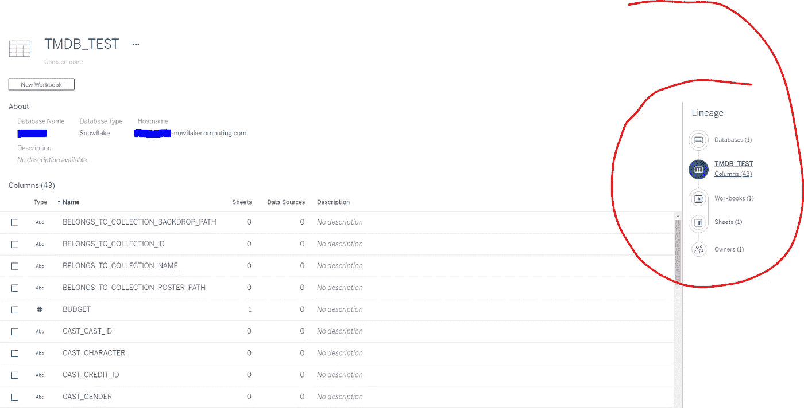

# 构建 Tableau 服务器影响分析报告:为什么和如何

> 原文：<https://towardsdatascience.com/building-tableau-server-impact-analysis-reports-why-and-how-191be0ce5015?source=collection_archive---------27----------------------->

## TABLEAU REST API: TABLEAU-API-LIB 教程

## 一个关注通过构建交互式可视化工具来跟踪数据谱系，从而提高团队生产力的系列

后台数据库的变化会波及到你的场景环境(图片由[张凯夫](https://unsplash.com/@zhangkaiyv?utm_source=medium&utm_medium=referral)在 [Unsplash](https://unsplash.com?utm_source=medium&utm_medium=referral) 上拍摄)

任何 Tableau 环境的支柱都是您输入的数据。俗话说:垃圾进，垃圾出。而您的许多 Tableau 资产(工作簿、数据源等。)代表您的数据生态系统的前端，当后端出现故障时，一切都完了。您的视觉效果是最终用户看到的和与之交互的内容，但这只是冰山一角。

对于许多使用 Tableau 的团队来说，每天都以掷骰子开始。他们将工作簿连接到数据库表，设置提取刷新计划，并希望明天一切都像今天一样顺利。但是希望不是一个好的策略。

在管理 Tableau 服务器环境的上下文中，一个好的策略是确切地知道数据管道中的变化将如何影响 Tableau 工作簿和数据源。在许多组织中，这种意识是存在的——但它往往是非正式的部落知识。

更好的策略是构建交互式 Tableau 工作簿，当您的数据团队对表和模式进行更改时，可以参考这些工作簿，这样任何人都可以准确地跟踪哪些内容和团队将受到影响。换句话说，我们对抗后端更改的最佳武器是构建一些交互式的东西，让我们只需点击一个按钮，就可以可视化数据库更改的影响。

本文是关于如何在 Tableau 中构建影响分析报告的系列文章的第一篇。在这里，我们将概述我们可以获得什么样的信息，概述我们如何利用相关数据，并为一系列教程做好准备，这些教程将介绍如何使用 Tableau 生态系统中的可用工具，将 Tableau 环境中的元数据转化为有价值的资产，从而提高所有 Tableau 相关工作流和团队的工作效率。

在接下来的几个星期里，这些教程将会被发布，链接也会被添加到这里。我们可以把这篇文章看作是引言和目录。

## 我们为什么要构建自己的影响分析报告？

在众多 Tableau 环境中担任顾问多年后，我还没有看到一个通用的解决方案可以全面解决每个环境的独特需求。

这并不是说不存在一刀切的解决方案。它们确实存在。然而，很难找到一个对千篇一律的解决方案充满热情的客户。每个组织的数据管理都是独一无二的，围绕其数据生态系统演变的复杂性通常需要复杂的解决方案来充分满足其目标。祝你好运从盒子里拿出那种解决方案。

话虽如此，在标准的 Tableau 服务器部署中，有一些现成的产品可供您使用，但需要付费。其中一个工具是[数据管理插件](https://help.tableau.com/current/online/en-us/dm_overview.htm) (DMAO)。这个产品(特别是它的元数据方面)值得了解。

我鼓励你尝试一下 DMAO，Tableau 在开发新工具方面一直做得很好。然而，这些工具被设计成普遍适用于任何环境，因此它们可能不会触及您的团队的具体痛处。

让我们更仔细地看看 DMAO 提供了什么，因为这将有助于将我们的对话引向底层的[元数据 API](https://help.tableau.com/current/api/metadata_api/en-us/index.html) ，以及它在构建定制的影响分析报告时对我们的宝贵价值。

## 一个新的 Tableau 产品:数据管理插件

DMAO 是 Tableau 产品系列中的许可产品。它包括 Tableau 目录和 Tableau 准备指挥。

用 Tableau 自己的话说，他们是这样定义产品组合的:

> 数据管理插件是一个特性和功能的集合，可帮助客户在其 Tableau 服务器或 Tableau 在线环境中管理 Tableau 内容和数据资产。
> 
> 您可以使用 Tableau Prep Conductor 利用 Tableau Server 或 Tableau Online 的计划和跟踪功能来自动更新流输出。
> 
> Tableau Catalog 包含在数据管理附加组件中，使您可以在数据管理空间中使用各种附加功能。您可以使用 Tableau Catalog 来发现数据、管理数据资产、传达数据质量、执行影响分析以及跟踪 Tableau 内容中使用的数据的沿袭。

好奇那看起来像什么吗？Tableau Prep Conductor 超出了本文的范围，因为它旨在为 Tableau 用户提供一个熟悉的界面来管理他们的数据管道，所以让我们把重点放在 Tableau 目录上。

数据沿袭:跟踪数据的来源和在环境中的使用位置。

在上图中，我们可以看到 Tableau 目录为我们探索各种资产之间的关联提供了一个前端界面。底层元数据知道如果您使用工作簿 A，它将引用数据源 B。同样，数据源 B 接入数据库 C 并使用表 X、Y 和 z。想知道表中存在的列吗？没问题。想知道有多少其他工作簿使用这些表？没问题。

这些元数据对你来说是非常有用的。最棒的是，即使你不拥有 DMAO 的产品，你也可以通过元数据 API 使用底层元数据。这意味着你可以自己获取数据，并随意使用。自由！

如果你在 2019.3 或更高版本上，元数据 API 是标准的，包括电池。如果您想深入研究，请查看这篇关于使用元数据 API 的教程。

## 元数据:你在 Tableau 世界的新朋友

虽然它确实有一个未来的环，元数据不仅仅是一个时髦的词。在 Tableau 的上下文中，元数据提供了关于你的内容、你的用户、如何访问或使用内容的信息，以及几乎所有介于两者之间的信息。

作为元数据的一个例子，考虑一下这个:Tableau 最近举办了一个[社区挑战赛](https://www.tableau.com/developer/mini-challenges)，邀请参与者使用元数据扫描 Tableau 服务器上的工作簿，识别命名不当的计算，并向工作簿的所有者发送电子邮件，要求他们重命名标记的计算。

在 Tableau Server 版本 2019.3 中引入元数据 API 之前，以直接的方式解决这一挑战是不可能的。能够查看工作簿的内部并查询其计算字段的详细信息是元数据 API 赋予我们所有人的一个愿望。

这仅仅是皮毛。我们从 Metdata API 中获得的另一个强大功能是查看我们的工作簿和数据源，以查看为我们的视觉效果提供支持的数据库资产。

我甚至数不清有多少次听到一位分析师抱怨被要求编制一份 Tableau 中使用的所有数据库表的列表。当你思考这个问题时，从管理的角度来看，这似乎是一个很好的问题:我们的 Tableau 仪表板中使用了什么？我们如何确保人们使用的是正确的 T4 数据来源？我们如何确保在不破坏仪表板的情况下修改数据库中的表是安全的？如果我们从数据库中删除旧表，会破坏多少仪表板？

在过去，这些问题会在一些负担过重的分析师任务清单的积压中痛苦地死去。今天不行。今天，您只需几个问题和一个仪表板，就能得到所有这些问题的答案。

## 介绍我们影响分析节目的演员阵容

舞台已经布置好了，让我们给你介绍一下演员。这部剧里有三位明星你会想熟悉的:

1.  [元数据 API](https://help.tableau.com/current/api/metadata_api/en-us/index.html)
2.  [REST API](https://help.tableau.com/current/api/rest_api/en-us/REST/rest_api_ref.htm)
3.  [Tableau 服务器仓库](https://help.tableau.com/current/server/en-us/perf_collect_server_repo.htm)([工作组](https://tableau.github.io/tableau-data-dictionary/2020.1/data_dictionary.htm?_fsi=EWF8KNhY) PostgreSQL 数据库)

这些是我们将在接下来的教程中使用的工具，用于从我们的 Tableau 环境中收集数据并构建影响分析仪表板。我们从我们的 Tableau 环境中提取数据，将数据反馈到 Tableau 视觉效果中，并使用这些视觉效果来更好地管理我们的 Tableau 环境。我怀疑“元”这个词再合适不过了。

在我们需要识别内容之间关系的任何场景中，元数据 API 都将是主角。虽然这些信息中的一些也可以从 REST API 中提取，但元数据 API 受益于 GraphQL，这是一种查询语言，它让我们能够以 REST API 实现不支持的方式动态定义查询。元数据 API 允许我们准确地定义我们想要拉取的数据，并使搜索 Tableau 环境的每个角落成为可能。

我不是说给 REST API 蒙上阴影；它有自己的角色。事实上，REST API 是我们进入元数据 API 的网关，也是我们所有查询都要通过的载体。REST API 允许我们以自动化的方式获取数据并发布、更新或删除内容。使用 REST API，我们将能够将从元数据 API 提取的数据发布为 Tableau 数据源文件或摘录。在构建我们的影响分析时，这是非常必要的一步——我们需要将数据源插入到我们的仪表板中。

这个故事中的第三个火枪手是 Tableau Server 的内部 PostgreSQL 数据库。这包含了丰富的信息，虽然我们需要的 90%将来自元数据 API 和 REST API，但是存储库数据库将为我们的影响分析添加有价值的上下文。例如，我们可以添加一些信息来描述特定内容的访问频率、用户对特定内容采取的操作、哪些内容是以交互方式而不是通过电子邮件订阅来访问的，等等。当需要真正定制您的影响分析时，PostgreSQL 数据库将是您的得力助手。

既然我提到了火枪手…第四个火枪手(达达尼昂)应该是超级 API。这更像是客串，更像是一种最佳实践，而不是必须的。我们不会将 CSV 文件作为影响分析仪表板的数据源发布，而是使用 Hyper API 来创建。超级文件。这些是高性能的提取，API 支持将数据附加到。超级文件。这为跟踪我们元数据中的历史趋势打开了大门，而不需要担心将我们的数据存储在一个巨大的 CSV 中，或者担心将数据存储在数据库中。

## 影响分析路线图和里程碑

我们将在此发布更新。

里程碑 1 (ETA 是 4/24/2020):使用元数据 API 为我们的工作簿(视图和仪表板)、数据源和流收集数据。对于这三类内容中的每一类，我们将确定所有相关的数据库资产。

里程碑 2 (ETA 是 4/29/2020):在里程碑 1 的基础上，使用来自 Tableau 服务器存储库的补充数据，提供与每个工作簿(视图和仪表板)、数据源和流程相关联的交互数量。

里程碑 3 (ETA 为 5/6/2020):使用 hyper API 将里程碑 1 和 2 的组合输出转换为. Hyper 提取，并将内容发布到 Tableau 服务器(或 Tableau Online)。

里程碑 4 (ETA 是 5/13/2020):使用里程碑 3 中发布的数据源构建我们的第一个影响分析仪表板。

*里程碑 5 (TBD)*

## 包装它

本文到此结束，并为我们探索构建定制的视觉效果，为我们的团队提供易于使用的影响分析仪表板打下基础！请继续关注我们在上面列出的里程碑上的复选框。

## 希望使用 Python 来开发 Tableau APIs 吗？

如果你想开始使用 [tableau-api-lib](https://github.com/divinorum-webb/tableau-api-lib) ，我用来与 tableau 的 api 交互的 Python 库，这里有几个相关的教程。

[Tableau 服务器上线:入门](https://medium.com/snake-charmer-python-and-analytics/tableau-server-on-tap-getting-started-89bc5f0095fa)

[tap 上的 Tableau 服务器:使用个人访问令牌进行认证](https://medium.com/snake-charmer-python-and-analytics/tableau-server-on-tap-authenticating-with-a-personal-access-token-7f4affaece3e)

[Tableau Server on tap:向元数据 API 发送 GraphQL 查询](https://medium.com/snake-charmer-python-and-analytics/tableau-server-on-tap-sending-graphql-queries-to-the-metadata-api-cf390d449345)

[如何将 Tableau 服务器元数据加载到熊猫数据帧中](https://medium.com/snake-charmer-python-and-analytics/how-to-load-tableau-server-metadata-into-a-pandas-dataframe-dd6e89e4ca0d)