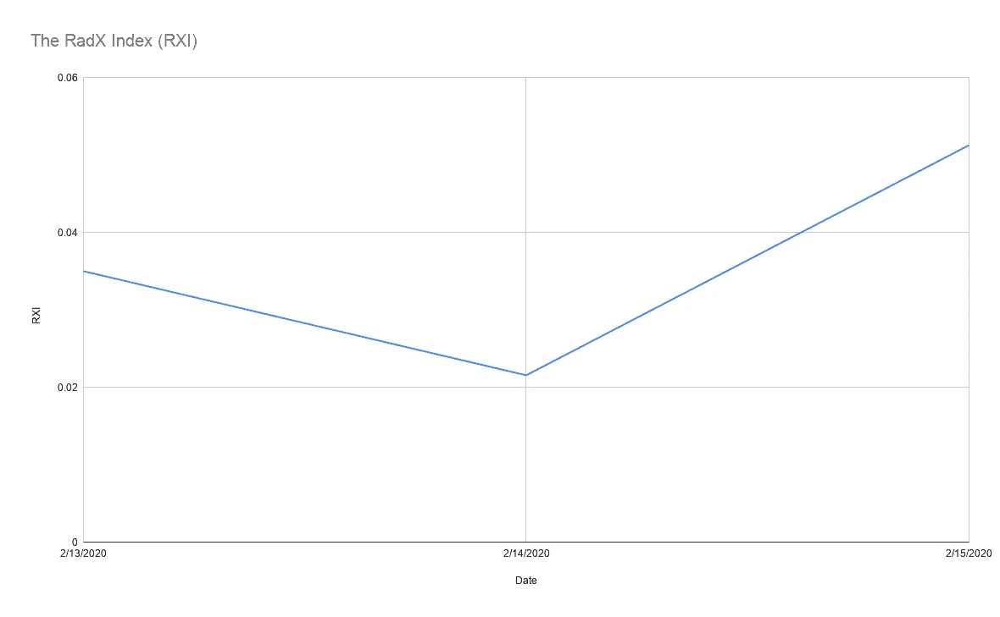
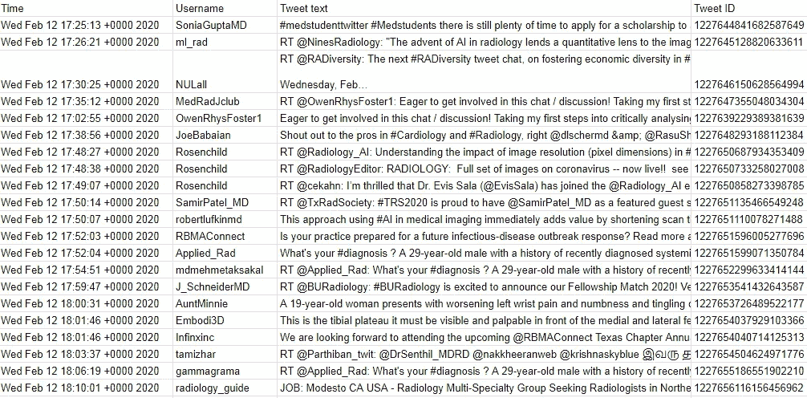
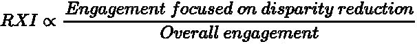

# 构建放射学性别差异的道琼斯指数

> 原文：<https://towardsdatascience.com/building-the-dow-jones-index-for-gender-disparities-in-radiology-b9b14df758fa?source=collection_archive---------35----------------------->

改编自[https://bit.ly/2SUhBed](https://bit.ly/2SUhBed)

Twitter 上的数据流提供了丰富的信息来源，可以帮助我们实时了解趋势和观点。

人们可以很容易地以自动化的方式利用 Twitter 数据，并创建大型的结构化数据集。这种能力直觉上很强大——我们能从无休止的患者/医生聊天中学到什么？—我花了相当多的时间思考最高产量的用例。

我的结论是，Twitter 数据的一个特别有意义的应用是理解放射学中的性别差异，以及它们是如何随时间变化的。这是有意义的，因为:

*   有一场强大的运动专注于纠正放射学中的性别差异，这个领域在吸引和培养女性人才方面历来表现不佳。这种论述是围绕一系列离散的、确定的标签组织的，比如#RadXX 和# WomenInRadiology。
*   这个讨论代表了围绕放射学的更大的 Twitter 讨论的一个子集，这是一个每天有成千上万条推文的强大对话。因此，我们可以考虑女性赋权放射活动与整个放射活动的某种比例。

利用这一推理，我决定建立 RadX 指数(RXI)，这是一个类似道琼斯的定量指数，为我们在纠正放射学性别差异方面的表现提供了一个动态的实时标志。你可以在这里查看:【https://bit.ly/320uK9D

简单的 1.0 版本是这样工作的:

1.  包括#RadXX 在内的所有推文都放在一个数据库中，带有时间戳和其他关键信息，如用户名和推文 URL。
2.  包括#Radiology 在内的所有推文都放在一个类似的数据库中。
3.  每 24 小时，每个数据库(#RadXX 和#Radiology)中的推文数量被量化，并取一个比率来形成 RXI。
4.  当天的 RXI 以经典的股票代码方式自动绘制，提供了一个公开的图形索引，显示我们的表现以及随时间的变化。

包含#radiology 的推文组织在数据库中进行分析

我们正在有效地创建以下内容的自动近似:

这种方法简单且不完美，但它是一个开始。有许多方法可以使它变得更复杂，例如:

*   对女性和男性放射科医生反应的情感分析。放射科对女性是什么态度？
*   量化男性和女性放射科医生的推文数量。有足够数量的女性放射科医生参加讨论吗？
*   围绕#RadXX 推文的参与度分析(例如，浏览量、点赞数、RTs)。参与度越高，RXI 越高。
*   #RadXX 和#Radiology 不一定是 RXI 比率的最佳标签。例如，将#RadXX、# WomenInRadiology 和#HeForShe 结合使用可能比单独使用#RadXX 更好。

可以整合这些指标，以创建一个更复杂的主 RXI 得分，该得分优于 1.0 迭代(在一天内构建，以开始生成数据和讨论)。

你怎么想呢?我很想让这个指数开源，并共同努力来改善它。我的方法是粗略的第一步，但你可能比我聪明…所以，你能想到更好的 RXI 实现吗？大家讨论一下！

**如果你想就这个项目或医疗保健/技术领域的任何其他事情进行交流，请联系** [**Twitter**](https://twitter.com/kevinsealsmd) **或**[**LinkedIn**](https://www.linkedin.com/in/kevinsealsmd/)**。如果你喜欢这篇文章，请分享…讨论将使这个想法变得更好！**