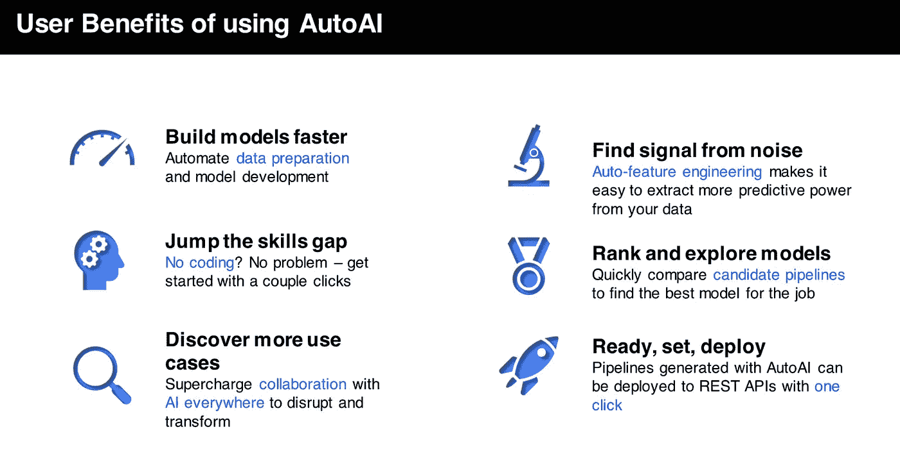
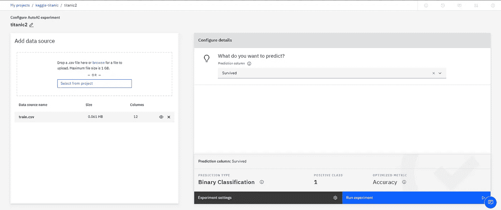
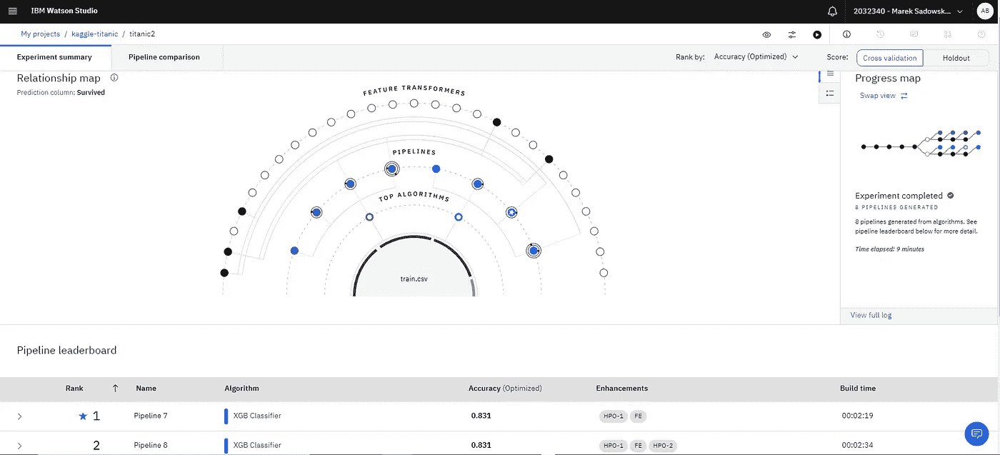
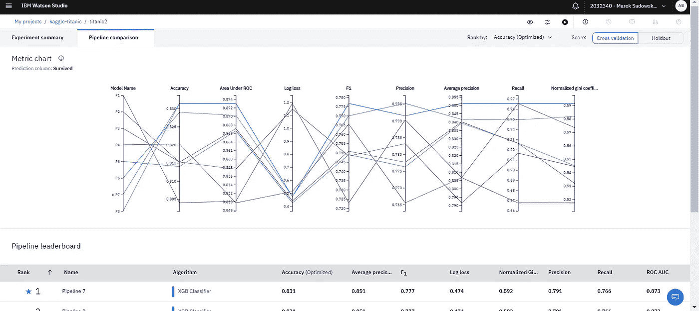
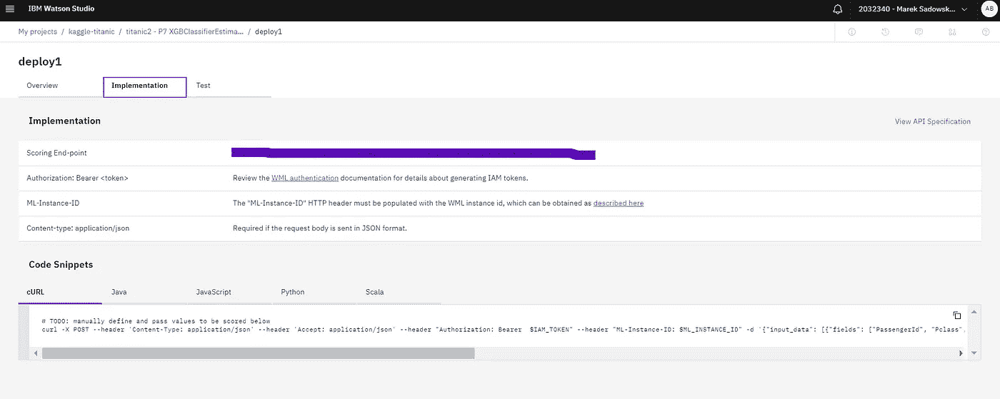
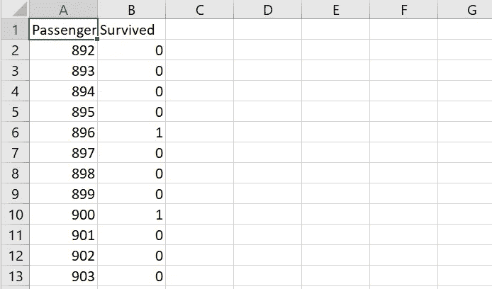
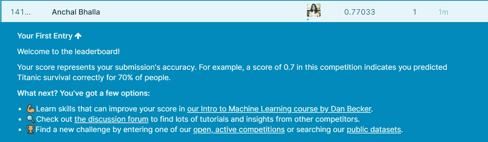

# 使用 AutoAI 构建 Kaggle 项目的“Hello World”

> 原文：<https://towardsdatascience.com/building-the-hello-world-of-kaggle-projects-using-autoai-ea1faf6fa567?source=collection_archive---------51----------------------->

## 从这个博客开始你的 Kaggle 之旅，并使用 Watson AutoAI 充分利用它

埃里克·克鲁尔在 [Unsplash](https://unsplash.com/s/photos/robots?utm_source=unsplash&utm_medium=referral&utm_content=creditCopyText) 上的照片

总是有人问我，开始研究数据科学的最佳方式是什么？嗯，我对此的回答总是一样的，做大量的数据科学课程来熟悉概念，然后通过参加 Kaggle 竞赛来继续构建项目。在这篇博客中，我将展示我是如何使用 AutoAI 在 30 分钟内完成[泰坦尼克号生存](https://www.kaggle.com/c/titanic#) Kaggle 比赛，从而开始我的 Kaggle 之旅的。

# **什么是 Kaggle 比赛？**

[Justin Chan](https://www.datadriveninvestor.com/author/justin/) 关于[数据驱动型投资者](https://www.datadriveninvestor.com/2019/01/14/kaggle-for-data-driven-investors/)的照片

Kaggle 为数据科学爱好者提供了一个分析比赛的平台，公司和研究人员发布数据，让爱好者竞争，以产生预测和描述数据的最佳模型。目前有超过 13，000 个数据集，Kaggle 提供了一个名副其实的数据金矿。

# 为什么选择 IBM Watson AutoAI？

Watson Studio 中的 AutoAI 可以自动完成通常需要数据科学家几天或几周时间才能完成的任务。您所需要做的就是提交您的数据，剩下的就交给工具来决定最适合您项目的管道。

格雷格·菲拉在 IBM 沃森[上的照片](https://medium.com/ibm-watson/introducing-autoai-for-watson-studio-241675fb0454)

# 让卡格灵开始吧！

泰坦尼克号项目被称为 Kaggle 项目的“hello world ”,因为初学者可以在尝试复杂项目之前获得 Kaggle 实践经验。

**准备:**

1.  设置 AutoAI: —创建一个 IBM Cloud 账户。— [创建一个 Watson Studio 实例](https://dataplatform.cloud.ibm.com/)。—创建项目—在项目中添加 AutoAI。
2.  在 [Kaggle](https://kaggle.com/) 上创建账户
3.  参加[泰坦尼克号生存竞赛](https://www.kaggle.com/c/titanic#)

## 步骤 1 —数据收集:

我们必须从[竞赛页面](https://www.kaggle.com/c/titanic)下载数据集。zip 文件将包含 3 个文件 train.csv 文件是我们将用于训练模型的文件，测试是我们将用于批量评分我们的模型并将其用于提交目的的文件，而 gender_ submission 文件显示了 Kaggle 的提交文件应该是什么样子(它是我们将填写的模板)。

## 第 2 步—数据准备:

数据非常干净，但是在训练数据集和测试数据集中需要注意空值。首先，让我们用 Age 和 Fare 列中值的平均值替换它们中的空值。我使用 Excel 公式“平均值”来查找和替换这些值。我让客舱栏为空。在测试模型时，这一点正在处理中(待续…)

## 步骤 3 —使用 AutoAI 建立模型:

虽然这一步看起来很难，但却是最简单的，因为我们使用的是 AutoAI。只需在 Watson Studio 中创建一个 AutoAI 项目，为您的实验命名，并上传您的 train.csv 文件。选择“幸存”作为您的预测变量，运行实验，并等待至少 15 分钟。

AutoAI 采用数据集和目标变量来设计管道(这些是不同的模型)，使用各种 HPO(超参数优化)参数和增强的特征工程来为每个管道获得最佳模型。

您可能已经知道，有不同的方法来评估和选择最佳模型，如准确度、F1 分数、精确度等。您也可以根据自己的需要对其进行编辑，但是我们将针对这种情况选择准确性(您也可以尝试其他评估者)。在下图中，您可以看到每个管道在不同评估者面前的表现。这就是选择和推荐部署最佳管道(领导者管道)的方式。

现在，要部署模型，请单击第一个管道(带有星号)，另存为，然后单击模型。这将允许您将您的模型部署为 Watson 机器学习模型。

回到您的项目，单击 WML 模型并将其部署为 web 服务，部署完成后，您可以测试它并获取我们将在下一步中使用的评分链接。

## 步骤 4 —对模型进行批量评分

现在我们有了模型，让我们创建一个 python 脚本，根据 test.csv 对 AutoAI 模型进行批量评分，以提交我们的结果。

下面是对测试文件中的所有记录运行批处理分数测试的代码。

代码基本上是将每个记录逐个存储在变量中，这样就可以将它作为有效载荷传递给模型进行评分。由于一些客舱值为空，我们将其替换为空。一旦我们从模型中获得 JSON 结果，我们解析它以获得记录的预测值，并将其存储在数组中，该数组将被写回到 Results.csv 表中。

Results.csv 文件

## 最后一步——向 Kaggle 提交结果

转到竞赛页面，点击提交结果以提交您的结果文件。等到你出现在领导板上，你的分数(我的分数是 77%)和排名会显示在屏幕上。分数决定你的排名。你可以不断改进你的模型，并不断提交多次到达顶端。

作者在 Kaggle 上的排行榜

瞧💃！！您已经提交了您的第一个 Kaggle 项目！！

# 我的经历

AutoAI 确实使 kaggling 变得更简单，一个担心是缺乏对参数的控制，并且需要对某些事情进行微调。这可以通过将模型保存为笔记本并用 python 编码来轻松完成。在我看来，Watson AutoAI 是初学者开始 Kaggle 之旅的最佳工具。

快乐的旅行💃！

# 参考

1.  [https://www.kaggle.com/c/titanic#](https://www.kaggle.com/c/titanic#)
2.  https://dataplatform.cloud.ibm.com/
3.  【https://kaggle.com/ 
4.  [https://medium . com/IBM-Watson/introducing-autoai-for-Watson-studio-241675 FB 0454](https://medium.com/ibm-watson/introducing-autoai-for-watson-studio-241675fb0454)