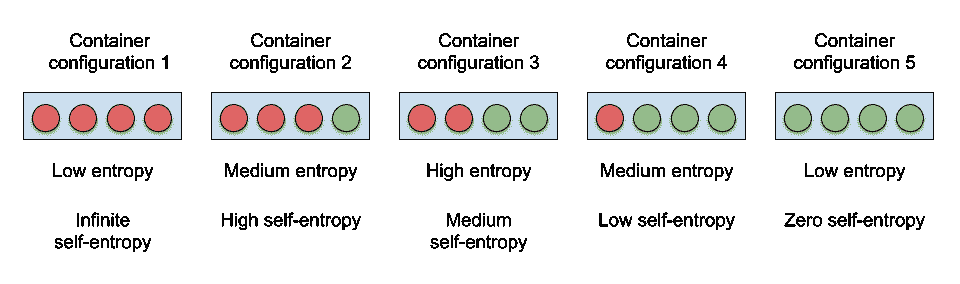
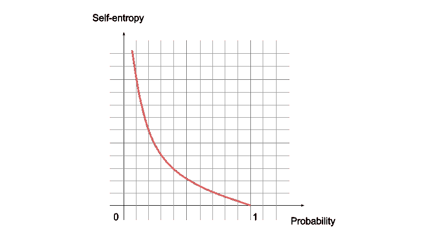
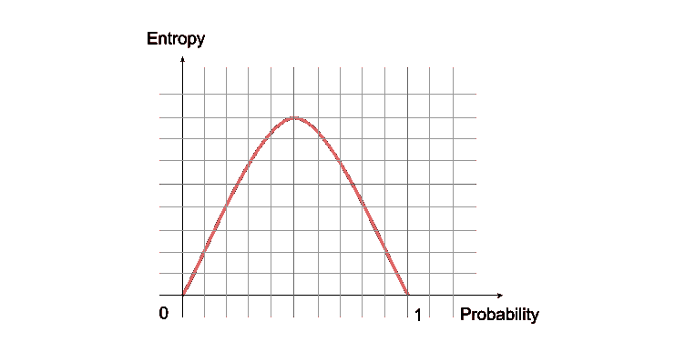
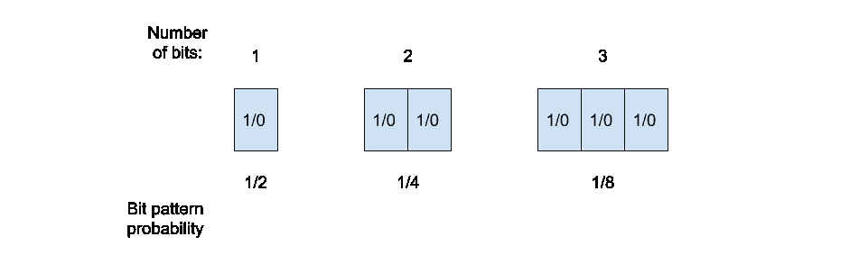
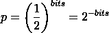
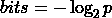
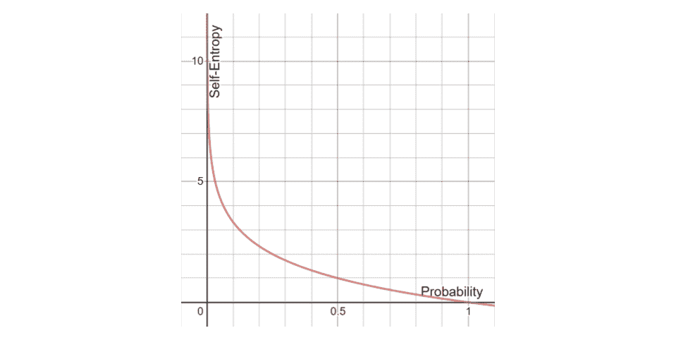
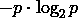
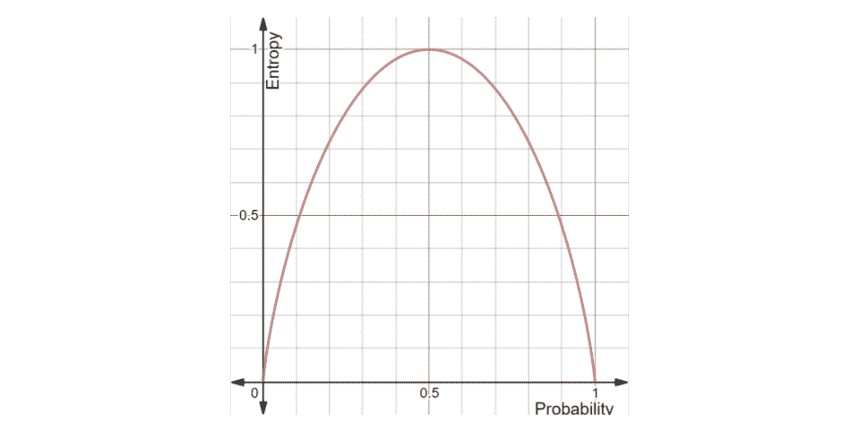
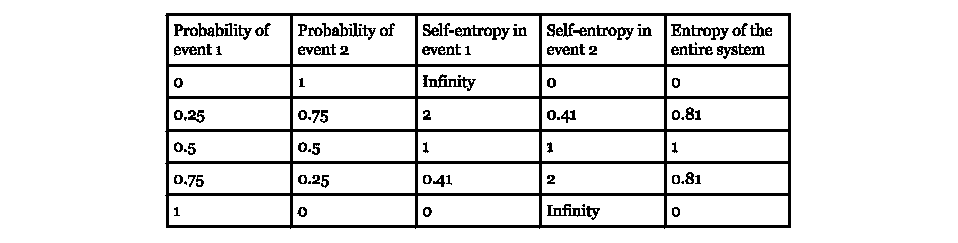

# 构建香农熵公式

> 原文：<https://towardsdatascience.com/building-the-shannon-entropy-formula-ca67bdb74cdc?source=collection_archive---------23----------------------->

## 每个人理解香农熵的直观方法

凯利·西克玛在 [Unsplash](https://unsplash.com?utm_source=medium&utm_medium=referral) 上的照片

# 目的

本文的写作是试图理解可以使用香农熵公式的决策树算法的结果。本文旨在通过首先用一个例子说明熵，然后一步一步地建立公式，来展示公式背后的直观推理。

# 熵是什么？

**熵是不确定性的度量**，由 Claude E. Shannon 引入信息论领域。在这种情况下，可以区分两个相关的量:熵和自熵，前者处理一组事件，后者与单个事件相关。

# **信息和熵**

要记住的一个基本概念是**信息和熵是直接相关的**。

**自熵度量的是事件中包含的不确定性或信息。**

当考虑自熵时，高度不确定的事件具有高熵并提供大量信息，而某个事件具有低熵并提供少量信息。

举个极端的例子，一个总会发生的事件有零自熵，而一个永远不会发生的事件有无限自熵。

**另一方面，熵测量所有事件对系统贡献的平均自熵。**

为了说明这两种熵类型，假设您有一个容器，其中只能放置四个球，可以是绿色或红色，如图 1 所示。这导致了五种配置，其中排序并不重要。

图 1:熵和自熵与提取绿色球的概率相关

考虑到容器配置 1，整个系统的**熵为零，因为提取球**的事件不存在不确定性，因为球总是红色的。提取红球的自熵为零，对于绿球是无穷大。

在容器配置 2 中，整个系统的熵很低，因为人们很可能从容器中抽取一个红球。在这种情况下，提取绿色球的自熵高，而提取红色球的自熵低。

最后一个重要的情况是容器配置 3，因为它提供了最大熵，因为这两个事件的可能性相等。这两个事件的自熵中等，相等。

容器配置 4 和 5 分别与容器配置 2 和 1 相同，只是颠倒了绿色和红色。

上述事件的自熵可以通过图 2 中的图表来总结。

图 2:与提取绿色球的概率相关的自熵图

同样，两个事件系统的熵可以用图 3 中的图来概括。

图 3:与提取绿色球的概率相关的熵图

# 测量信息

由于熵和信息是直接相关的，测量一个也会导致测量另一个的方法。

一种更直观的表示信息的方式是使用二进制数字，即比特。例如，整数值可以表示为 0 和 1 的位模式。

像从容器中取出一个球这样的事件或者像“客队赢了比赛”这样的消息也可以用表 1 中的某些位模式来表示。

表 1:不同事件的潜在位模式表示

# 测量自熵

**比特模式可以与取决于比特数的概率相关联。**例如，任何单个位模式的概率为 1/2，而任何两个位的位模式的概率为 1/4，如此类推，如图 4 所示。

图 4:与位数相关的位模式概率

通常，某个位模式的概率为:

相反，通过在两面都应用以 2 为底的对数:

如图 4 所示，对于[0，1]的整个概率范围，可以获得信息比特的数量，这接近于图 2 中的直觉。

图 5:自熵公式的图表

# 测量熵

当测量一个系统的熵时，每个事件的平均自熵贡献被考虑在内。

举例来说，考虑包含 10 位信息的事件(或消息)。如果该消息以 0.2 的概率出现，那么它对整个系统的平均贡献是 10 比特* 0.2 = 2 比特因此，**考虑到自熵的公式，每个事件的平均贡献是:**

包含在 n 个事件及其相关概率的系统中的熵是所有这些平均贡献的总和:

回到第一个示例，考虑两个事件的系统，公式变为:

因为所有概率的总和等于 1，所以上述可以替换为:

在图 5 中画出两个事件系统的熵公式，我们可以再次证实图 3 中的直觉。

图 6:两个事件的熵图

表 2 给出了对两个事件的系统应用自熵和熵公式时得到的 of 值。事件 1 可以与“抽取一个红球”相关联，而事件 2 可以与“抽取一个绿球”相关联，如在所示的例子中。

表 2:双事件系统的自熵和熵值

# 结论

我希望这能让我们对熵公式是如何建立的有所了解。

回顾本文的目的，决策树使用 Shannon 熵公式来挑选一个特征，该特征将数据集递归地分割成具有高度一致性(低熵值)的子集。更均匀地分割数据集会使决策树深度更小，从而更易于使用。

如果你有意见或建议，我将很高兴收到你的来信！

图 1 中的例子基本上是 [Luis Serrano](https://medium.com/u/ff11baf3f5fe?source=post_page-----ca67bdb74cdc--------------------------------) 在文章[“香农熵、信息增益和从桶中捡球”](https://medium.com/udacity/shannon-entropy-information-gain-and-picking-balls-from-buckets-5810d35d54b4)中的简化版本