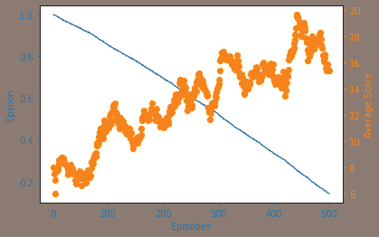
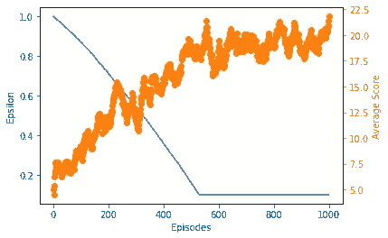

# 使用决斗式双深度 Q 学习构建终极 AI 智能体

> 原文：<https://towardsdatascience.com/building-the-ultimate-ai-agent-for-doom-using-dueling-double-deep-q-learning-ea2d5b8cdd9f?source=collection_archive---------43----------------------->

## Pytorch 中强化学习的实现。

# **简介**

在过去的几篇文章中，我们已经[讨论了](https://medium.com/gradientcrescent/fundamentals-of-reinforcement-learning-navigating-cliffworld-with-sarsa-and-q-learning-cc3c36eb5830)和[为 VizDoom 环境实现了](/automating-pac-man-with-deep-q-learning-an-implementation-in-tensorflow-ca08e9891d9c)各种价值学习架构，并检验了它们在最大化回报方面的表现。简而言之，这些包括:

*   深度 Q 学习 (DQN)
*   [双深度 Q 学习](/discovering-unconventional-strategies-for-doom-using-double-deep-q-learning-609b365781c4) (DDQN)
*   [决斗深度 Q 学习](/building-offensive-ai-agents-for-doom-using-dueling-deep-q-learning-ab2a3ff7355f) (DuelDQN)

总的来说，vanilla Deep Q-learning 是一种高度灵活和响应性的在线强化学习方法，它利用快速的场景内更新来估计环境中的状态-动作(Q)值，以便最大化回报。Q-learning 可以被认为是一种策略外的 TD 方法，其中该算法旨在选择独立于当前遵循的策略的最高值的状态-动作对，并且已经与 OpenAI Atari 健身房环境的许多原始突破相关联。

相比之下，双重深度 Q 学习改进通过使用双重网络设置将动作选择与 Q 值目标计算分离，解决了在 DQN 观察到的状态-动作值高估的问题，这是之前在训练中观察到的普遍问题。类似地，due Deep Q-learning 通过将单个输出状态-动作流分成单独的价值和优势流，提高了模型在训练期间的概括能力，允许代理学习专注于单独的目标以提高性能。

在我们的 DQN 系列文章的最后一篇中，我们将把迄今为止我们所学的所有内容结合到一个单一的复合方法中——决斗双深度 Q 学习(DuelDDQN)。通过结合我们以前模型的所有优势，我们将致力于进一步提高我们的代理在 VizDoom 环境中的收敛性。

# **实施**

**我们将在与上一篇文章*保卫防线*相同的多目标条件下，在相同的 VizDoomgym 场景中实现我们的方法。**环境的一些特征包括:

*   一个 3 的动作空间:开火，左转，右转。不允许扫射。
*   向玩家发射火球的棕色怪物，命中率为 100%。
*   试图以之字形靠近来咬玩家的粉红色怪物。
*   重生的怪物可以承受更多伤害。
*   杀死一个怪物+1 点。
*   -死了得 1 分。


“防线方案”的初始状态

回想一下，在[我们最初的 DQN 实现](/playing-doom-with-ai-multi-objective-optimization-with-deep-q-learning-736a9d0f8c2)中，我们已经利用了两个并发网络——一个用于行动选择的评估网络，以及一个定期更新的目标网络，以确保生成的 TD 目标是固定的。我们可以利用这个现有的设置来构建我们的 DuelDDQN 架构，而无需初始化更多的网络。

请注意，由于两个网络定期更新彼此的权重，因此这两个模型仍然是部分耦合的，但重要的是，动作选择和 Q 值评估是由在特定时间步长不共享同一组 a 权重的独立网络完成的。

我们的 Google 协作实现是利用 Pytorch 用 Python 编写的，可以在 [GradientCrescent Github 上找到。](https://github.com/EXJUSTICE/GradientCrescent)我们的方法基于泰伯优秀强化学习[课程](https://www.manning.com/livevideo/reinforcement-learning-in-motion)中详述的方法。由于我们的 DDQN 实现类似于我们之前的普通 DQN 实现，所以整个高级工作流是共享的，这里不再重复。

让我们从导入所有必需的包开始，包括 OpenAI 和 Vizdoomgym 环境。我们还将安装火炬视觉所需的 AV 包，我们将使用它进行可视化。请注意，安装完成后必须重新启动运行时。

```
#Visualization cobe for running within Colab
!sudo apt-get update
!sudo apt-get install build-essential zlib1g-dev libsdl2-dev libjpeg-dev nasm tar libbz2-dev libgtk2.0-dev cmake git libfluidsynth-dev libgme-dev libopenal-dev timidity libwildmidi-dev unzip# Boost libraries!sudo apt-get install libboost-all-dev# Lua binding dependencies
!apt-get install liblua5.1-dev
!sudo apt-get install cmake libboost-all-dev libgtk2.0-dev libsdl2-dev python-numpy git
!git clone [https://github.com/shakenes/vizdoomgym.git](https://github.com/shakenes/vizdoomgym.git)
!python3 -m pip install -e vizdoomgym/!pip install av
```

接下来，我们初始化我们的环境场景，检查观察空间和动作空间，并可视化我们的环境。

```
import gym
import vizdoomgymenv = gym.make('VizdoomDefendLine-v0')
n_outputs = env.action_space.n
print(n_outputs)observation = env.reset()
import matplotlib.pyplot as pltfor i in range(22):

  if i > 20:
    print(observation.shape)
    plt.imshow(observation)
    plt.show()
observation, _, _, _ = env.step(1)
```

接下来，我们将定义预处理包装器。这些类继承自 OpenAI gym 基类，覆盖了它们的方法和变量，以便隐式地提供所有必要的预处理。我们将开始定义一个包装器来重复许多帧的每个动作，并执行元素方式的最大值以增加任何动作的强度。您会注意到一些三级参数，如 *fire_first* 和*no _ ops*——这些是特定于环境的，在 Vizdoomgym 中对我们没有影响。

```
class RepeatActionAndMaxFrame(gym.Wrapper):
  #input: environment, repeat
  #init frame buffer as an array of zeros in shape 2 x the obs space
    def __init__(self, env=None, repeat=4, clip_reward=False, no_ops=0,
                 fire_first=False):
        super(RepeatActionAndMaxFrame, self).__init__(env)
        self.repeat = repeat
        self.shape = env.observation_space.low.shape
        self.frame_buffer = np.zeros_like((2, self.shape))
        self.clip_reward = clip_reward
        self.no_ops = no_ops
        self.fire_first = fire_first
  def step(self, action):
        t_reward = 0.0
        done = False
        for i in range(self.repeat):
            obs, reward, done, info = self.env.step(action)
            if self.clip_reward:
                reward = np.clip(np.array([reward]), -1, 1)[0]
            t_reward += reward
            idx = i % 2
            self.frame_buffer[idx] = obs
            if done:
                break
        max_frame = np.maximum(self.frame_buffer[0], self.frame_buffer[1])
        return max_frame, t_reward, done, info
  def reset(self):
        obs = self.env.reset()
        no_ops = np.random.randint(self.no_ops)+1 if self.no_ops > 0    else 0
        for _ in range(no_ops):
            _, _, done, _ = self.env.step(0)
            if done:
                self.env.reset()

        if self.fire_first:
            assert self.env.unwrapped.get_action_meanings()[1] == 'FIRE'
            obs, _, _, _ = self.env.step(1)
        self.frame_buffer = np.zeros_like((2,self.shape))
        self.frame_buffer[0] = obs
    return obs
```

接下来，我们为我们的观察定义预处理函数。我们将使我们的环境对称，将它转换到标准化的盒子空间，将通道整数交换到张量的前面，并将其从原始(320，480)分辨率调整到(84，84)区域。我们也将我们的环境灰度化，并通过除以一个常数来归一化整个图像。

```
class PreprocessFrame(gym.ObservationWrapper):
  #set shape by swapping channels axis
 #set observation space to new shape using gym.spaces.Box (0 to 1.0)
    def __init__(self, shape, env=None):
        super(PreprocessFrame, self).__init__(env)
        self.shape = (shape[2], shape[0], shape[1])
        self.observation_space = gym.spaces.Box(low=0.0, high=1.0,
                                    shape=self.shape, dtype=np.float32)
   def observation(self, obs):
        new_frame = cv2.cvtColor(obs, cv2.COLOR_RGB2GRAY)
        resized_screen = cv2.resize(new_frame, self.shape[1:],
                                    interpolation=cv2.INTER_AREA)
        new_obs = np.array(resized_screen, dtype=np.uint8).reshape(self.shape)
        new_obs = new_obs / 255.0
   return new_obs
```

接下来，我们创建一个包装器来处理帧堆叠。这里的目标是通过将几个帧堆叠在一起作为单个批次，帮助从堆叠帧中捕捉运动和方向。这样，我们可以捕捉环境中元素的位置、平移、速度和加速度。通过堆叠，我们的输入采用(4，84，84，1)的形状。

```
class StackFrames(gym.ObservationWrapper):
  #init the new obs space (gym.spaces.Box) low & high bounds as repeat of n_steps. These should have been defined for vizdooom

  #Create a return a stack of observations
    def __init__(self, env, repeat):
        super(StackFrames, self).__init__(env)
        self.observation_space = gym.spaces.Box( env.observation_space.low.repeat(repeat, axis=0),
                              env.observation_space.high.repeat(repeat, axis=0),
                            dtype=np.float32)
        self.stack = collections.deque(maxlen=repeat)
    def reset(self):
        self.stack.clear()
        observation = self.env.reset()
        for _ in range(self.stack.maxlen):
            self.stack.append(observation)
        return  np.array(self.stack).reshape(self.observation_space.low.shape)
    def observation(self, observation):
        self.stack.append(observation)
    return np.array(self.stack).reshape(self.observation_space.low.shape)
```

最后，在返回最终环境供使用之前，我们将所有的包装器绑定到一个单独的 *make_env()* 方法中。

```
def make_env(env_name, shape=(84,84,1), repeat=4, clip_rewards=False,
             no_ops=0, fire_first=False):
    env = gym.make(env_name)
    env = PreprocessFrame(shape, env)
    env = RepeatActionAndMaxFrame(env, repeat, clip_rewards, no_ops, fire_first)

    env = StackFrames(env, repeat)
    return env
```

接下来，让我们定义模型中的决斗部分，一个深度 Q 网络，具有两个输出流。这基本上是一个三层卷积网络，它采用预处理的输入观测值，将生成的展平输出馈送到一个全连接层，然后将输出分成价值流(单节点输出)和优势流(节点输出对应于环境中的动作数量)。

请注意，这里没有激活层，因为激活层的存在会导致二进制输出分布。我们的损失是我们当前状态-动作的估计 Q 值和我们预测的状态-动作值的平方差。然后，我们附上 RMSProp 优化器，以尽量减少我们在培训期间的损失。

```
import os
import torch as T
import torch.nn as nn
import torch.nn.functional as F
import torch.optim as optim
import numpy as np
class DeepQNetwork(nn.Module):
    def __init__(self, lr, n_actions, name, input_dims, chkpt_dir):
        super(DeepQNetwork, self).__init__()
        self.checkpoint_dir = chkpt_dir
        self.checkpoint_file = os.path.join(self.checkpoint_dir, name)
        self.conv1 = nn.Conv2d(input_dims[0], 32, 8, stride=4)
        self.conv2 = nn.Conv2d(32, 64, 4, stride=2)
        self.conv3 = nn.Conv2d(64, 64, 3, stride=1)
        fc_input_dims = self.calculate_conv_output_dims(input_dims)
        self.fc1 = nn.Linear(fc_input_dims,1024)
        self.fc2 = nn.Linear(1024, 512)
        #Here we split the linear layer into the State and Advantage streams
        self.V = nn.Linear(512, 1)
        self.A = nn.Linear(512, n_actions)
        self.optimizer = optim.RMSprop(self.parameters(), lr=lr)
        self.loss = nn.MSELoss()
        self.device = T.device('cuda:0' if T.cuda.is_available() else 'cpu')
        self.to(self.device)
    def calculate_conv_output_dims(self, input_dims):
        state = T.zeros(1, *input_dims)
        dims = self.conv1(state)
        dims = self.conv2(dims)
        dims = self.conv3(dims)
        return int(np.prod(dims.size()))
    def forward(self, state):
        conv1 = F.relu(self.conv1(state))
        conv2 = F.relu(self.conv2(conv1))
        conv3 = F.relu(self.conv3(conv2))
        # conv3 shape is BS x n_filters x H x W
        conv_state = conv3.view(conv3.size()[0], -1)
        # conv_state shape is BS x (n_filters * H * W)
        flat1 = F.relu(self.fc1(conv_state))
        flat2 = F.relu(self.fc2(flat1))
        V = self.V(flat2)
        A = self.A(flat2)
        return V, A
     def save_checkpoint(self):
        print('... saving checkpoint ...')
        T.save(self.state_dict(), self.checkpoint_file)
     def load_checkpoint(self):
        print('... loading checkpoint ...')
        self.load_state_dict(T.load(self.checkpoint_file))
```

接下来，我们将定义我们的代理，它遵循我们之前的 [DDQN 实现](/discovering-unconventional-strategies-for-doom-using-double-deep-q-learning-609b365781c4)和 [DuelDQN 实现](/building-offensive-ai-agents-for-doom-using-dueling-deep-q-learning-ab2a3ff7355f)。我们的代理正在使用一个勘探率递减的ε贪婪策略，以便随着时间的推移最大化开发。为了学会预测使我们的累积奖励最大化的状态-行动-值，我们的代理人将使用通过抽样存储的记忆获得的贴现的未来奖励。

您会注意到，作为代理的一部分，我们初始化了 DQN 的两个副本，并使用方法将原始网络的权重参数复制到目标网络中。虽然我们的常规方法利用这种设置来生成固定的 TD 目标，但我们的 DuelDDQN 方法将扩展到这一点:

*   从重放存储器中检索状态、动作、奖励和下一状态(sar)。
*   评估网络用于生成当前状态的优势( *A_s* )和状态( *V_s* )值。它还用于为下一个状态生成相应的值。
*   目标网络用于创建下一个状态的优势( *A_s_* )和状态( *V_s_* )值。
*   当前状态的预测 Q 值( *q_pred* )是通过对当前状态的优势和状态值求和，并使用评估网络的输出流减去用于归一化的当前状态优势值的平均值而生成的。使用评估网络的输出流，下一状态 re 的评估 Q 值( *q_eval* )也以类似的方式创建。使用 *argmax()* 函数获得下一个状态的最大可能性动作。请注意， *q_eval* 在这里的作用只是关注于动作选择，与明确地参与目标计算无关。
*   使用目标网络的输出流，以类似的方式为下一状态( *q_next* )创建目标 Q 值。 *q_next* 的作用是专注于目标计算，不参与动作选择。
*   通过评估网络识别的 *max_actions* 将当前状态中的回报与从下一状态的目标网络导出的 Q 值相结合，计算当前状态的 TD-target。
*   通过将 TD 目标与当前状态 Q 值进行比较来计算损失函数，然后将其用于训练网络。

```
import numpy as np
import torch as T
#from deep_q_network import DeepQNetwork
#from replay_memory import ReplayBuffer#Combining the value stream splitting of a DuelDQN with the update approach of a DDQN
class DuelDDQNAgent(object):
    def __init__(self, gamma, epsilon, lr, n_actions, input_dims,
                 mem_size, batch_size, eps_min=0.01, eps_dec=5e-7,
                 replace=1000, algo=None, env_name=None, chkpt_dir='tmp/dqn'):
        self.gamma = gamma
        self.epsilon = epsilon
        self.lr = lr
        self.n_actions = n_actions
        self.input_dims = input_dims
        self.batch_size = batch_size
        self.eps_min = eps_min
        self.eps_dec = eps_dec
        self.replace_target_cnt = replace
        self.algo = algo
        self.env_name = env_name
        self.chkpt_dir = chkpt_dir
        self.action_space = [i for i in range(n_actions)]
        self.learn_step_counter = 0self.memory = ReplayBuffer(mem_size, input_dims, n_actions)self.q_eval = DeepQNetwork(self.lr, self.n_actions,
                                    input_dims=self.input_dims,
                                    name=self.env_name+'_'+self.algo+'_q_eval',
                                    chkpt_dir=self.chkpt_dir)self.q_next = DeepQNetwork(self.lr, self.n_actions,
                                    input_dims=self.input_dims,
                                    name=self.env_name+'_'+self.algo+'_q_next',
                                    chkpt_dir=self.chkpt_dir)#Epsilon greedy action selection
    def choose_action(self, observation):
        if np.random.random() > self.epsilon:
          # Add dimension to observation to match input_dims x batch_size by placing in list, then converting to tensor
            state = T.tensor([observation],dtype=T.float).to(self.q_eval.device)
            #As our forward function now has both state and advantage, fetch latter for actio selection
            _, advantage = self.q_eval.forward(state)
            action = T.argmax(advantage).item()
        else:
            action = np.random.choice(self.action_space)return actiondef store_transition(self, state, action, reward, state_, done):
        self.memory.store_transition(state, action, reward, state_, done)def sample_memory(self):
        state, action, reward, new_state, done = \
                                self.memory.sample_buffer(self.batch_size)states = T.tensor(state).to(self.q_eval.device)
        rewards = T.tensor(reward).to(self.q_eval.device)
        dones = T.tensor(done).to(self.q_eval.device)
        actions = T.tensor(action).to(self.q_eval.device)
        states_ = T.tensor(new_state).to(self.q_eval.device)return states, actions, rewards, states_, donesdef replace_target_network(self):
        if self.learn_step_counter % self.replace_target_cnt == 0:
            self.q_next.load_state_dict(self.q_eval.state_dict())def decrement_epsilon(self):
        self.epsilon = self.epsilon - self.eps_dec \
                           if self.epsilon > self.eps_min else self.eps_mindef save_models(self):
        self.q_eval.save_checkpoint()
        self.q_next.save_checkpoint()def load_models(self):
        self.q_eval.load_checkpoint()
        self.q_next.load_checkpoint()
    #Make sure you understand this line by line
    #For DDQN main difference is here - Consult the lecture to gain a stronger understanding of why things differe here
    def learn(self):#First check if memory is even big enough
        if self.memory.mem_cntr < self.batch_size:
            returnself.q_eval.optimizer.zero_grad()#Replace target network if appropriate
        self.replace_target_network()states, actions, rewards, states_, dones = self.sample_memory()
        #Fetch states and advantage actions for current state using eval network
        #Also fetch the same for next state using target network
        V_s, A_s = self.q_eval.forward(states)
        V_s_, A_s_ = self.q_next.forward(states_)

        #Eval network calculation of next state V and A
        V_s_eval, A_s_eval = self.q_eval.forward(states_)#Indices for matrix multiplication
        indices = np.arange(self.batch_size)#Calculate current state Q-values and next state max Q-value by aggregation, subtracting constant advantage mean
        #Along first dimension, which is action dimension, keeping original matrix dimensions

        #recall [indices,actions] is used to maintain array shape of (batch_size) instead of (batch_size,actions)
        #Essentilly by adding a a batch index to our vector array we ensure that calculated Q_pred is not tabular, but applicable for a batch update
        q_pred = T.add(V_s,
                        (A_s - A_s.mean(dim=1, keepdim=True)))[indices, actions]
        #For q_next, fetch max along the action dimension. 0th element, because max returns a tuple,
        #of which 0th position are values and 1st position the indices.
        q_next = T.add(V_s_,
                        (A_s_ - A_s_.mean(dim=1, keepdim=True)))

        #QEval q-values for DDQN
        q_eval = T.add(V_s_eval, (A_s_eval - A_s_eval.mean(dim=1,keepdim=True)))
        max_actions = T.argmax(q_eval, dim=1)
        q_next[dones] = 0.0
        #Build your target using the current state reward and q_next, DDQN setup
        q_target = rewards + self.gamma*q_next[indices, max_actions]loss = self.q_eval.loss(q_target, q_pred).to(self.q_eval.device)
        loss.backward()
        self.q_eval.optimizer.step()
        self.learn_step_counter += 1self.decrement_epsilon()
```

定义了所有支持代码后，让我们运行主训练循环。我们已经在最初的总结中定义了大部分，但是让我们为后代回忆一下。

*   对于训练集的每一步，在使用ε-贪婪策略选择下一个动作之前，我们将输入图像堆栈输入到我们的网络中，以生成可用动作的概率分布。
*   然后，我们将它输入到网络中，获取下一个状态和相应奖励的信息，并将其存储到我们的缓冲区中。我们更新我们的堆栈，并通过一些预定义的步骤重复这一过程。
*   在一集的结尾，我们将下一个状态输入到我们的网络中，以便获得下一个动作。我们还通过对当前奖励进行贴现来计算下一个奖励。
*   我们使用去耦网络通过上述 Q 学习更新函数生成我们的目标 y 值，并训练我们的 actor 网络。
*   通过最小化训练损失，我们更新网络权重参数，以便为下一个策略输出改进的状态-动作值。
*   我们通过跟踪模型的平均得分(在 100 个训练步骤中测量)来评估模型。

```
# Main threadenv = make_env('DefendTheLine-v0')
best_score = -np.inf
load_checkpoint = False
n_games = 20000agent = DuelDDQNAgent(gamma=0.99, epsilon=1.0, lr=0.001,input_dims=(env.observation_space.shape),n_actions=env.action_space.n, mem_size=5000, eps_min=0.15,batch_size=32, replace=1000, eps_dec=1e-5,chkpt_dir='/content/', algo='DuelDDQNAgent',env_name='vizdoogym')if load_checkpoint:
  agent.load_models()fname = agent.algo + '_' + agent.env_name + '_lr' + str(agent.lr) +'_'+ str(n_games) + 'games'
figure_file = 'plots/' + fname + '.png'n_steps = 0
scores, eps_history, steps_array = [], [], []for i in range(n_games):
  done = False
  observation = env.reset()score = 0
  while not done:
    action = agent.choose_action(observation)
    observation_, reward, done, info = env.step(action)
    score += rewardif not load_checkpoint:
      agent.store_transition(observation, action,reward, observation_, int(done))
      agent.learn()
    observation = observation_
    n_steps += 1scores.append(score)
  steps_array.append(n_steps)avg_score = np.mean(scores[-100:])if avg_score > best_score:
    best_score = avg_score

    print('Checkpoint saved at episode ', i)
    agent.save_models()print('Episode: ', i,'Score: ', score,' Average score: %.2f' % avg_score, 'Best average: %.2f' % best_score,'Epsilon: %.2f' % agent.epsilon, 'Steps:', n_steps)eps_history.append(agent.epsilon)
  if load_checkpoint and n_steps >= 18000:
    break#x = [i+1 for i in range(len(scores))]
```

我们绘制了 500 集和 1000 集代理人的平均得分和我们的 epsilon 值。可以观察到，DuelDDQN 模型的收敛性明显优于基线 DQN 和 DDQN 模型的收敛性，甚至稍微改善了 DuelDQN 模型的性能。



500 集后我们经纪人的奖励分配。



1000 集后我们经纪人的奖励分配。

我们可以想象我们的代理人在 500 集以下的表现。

500 集的代理性能。

回想一下，我们以前的代理遭受了陷入局部最小值的特殊问题，依赖于怪物之间的友好射击作为主要的得分策略，而不是代理的主动性。我们的 DuelDDQN 代理没有什么不同，比以前的模型更快地达到这个最小值。解决这个问题要么需要改变环境(用扫射代替转弯可能是一种选择)，加速学习以避免模式崩溃(如通过动量)，要么通过奖励工程——例如，根据生存的持续时间或怪物从代理人的武器中受到的原始伤害增加相应的奖励。

那么，通过我们的系列课程，我们学到了什么？

*   像 DQN 这样的价值学习架构为 RL 代理开发提供了一个很好的基线。
*   这种架构的性能可以通过对学习过程的设计进行小的修改来提高。
*   鼓励模型探索，特别是在高水平的收敛上，是学习过程的一把双刃剑。
*   就实现目标而言，一个模型的表现只能和它的回报函数的设计一样好，这必须通过观察仔细分析或推断。

这就结束了决斗双深度 Q 学习的实现，以及我们关于 DQN 的系列。在我们的下一篇文章中，我们将暂时停止强化学习，尝试一些特定的生成图像处理技术。

我们希望你喜欢这篇文章，并希望你查看 GradientCrescent 上的许多其他文章，涵盖人工智能的应用和理论方面。为了保持对 [GradientCrescent](https://medium.com/@adrianitsaxu) 的最新更新，请考虑关注该出版物并关注我们的 [Github](https://github.com/EXJUSTICE/GradientCrescent) 资源库

# 来源

萨顿等人。al，“强化学习”

塔博尔，“运动中的强化学习”

西蒙尼尼，[“深度 Q 学习的改进*](https://www.freecodecamp.org/news/improvements-in-deep-q-learning-dueling-double-dqn-prioritized-experience-replay-and-fixed-58b130cc5682/)