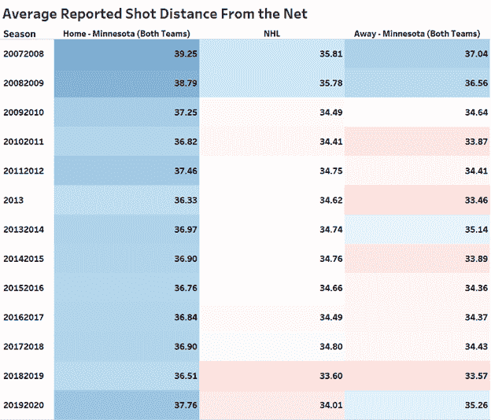
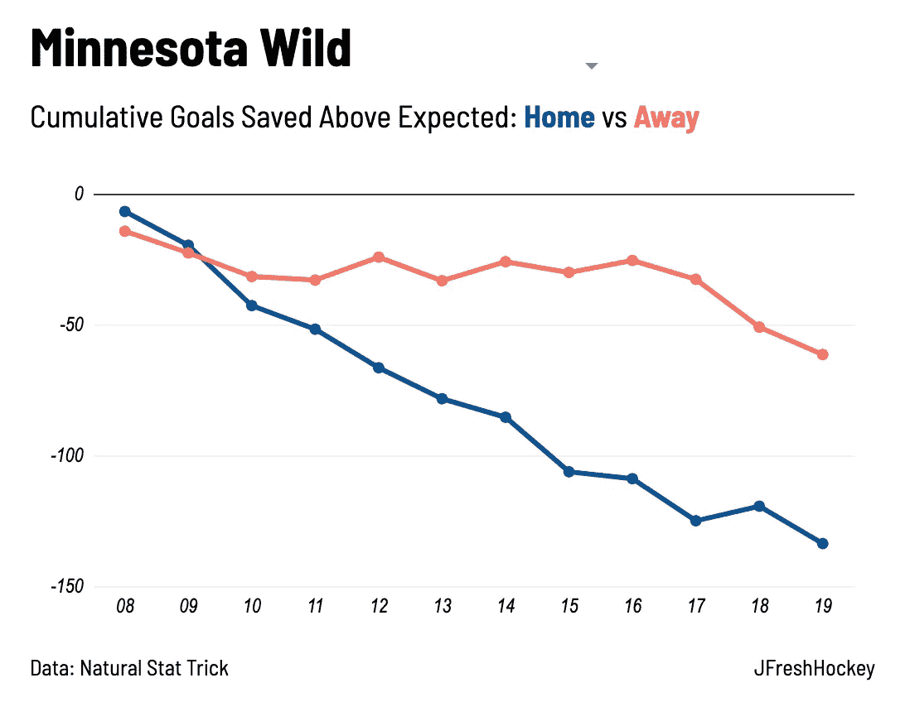
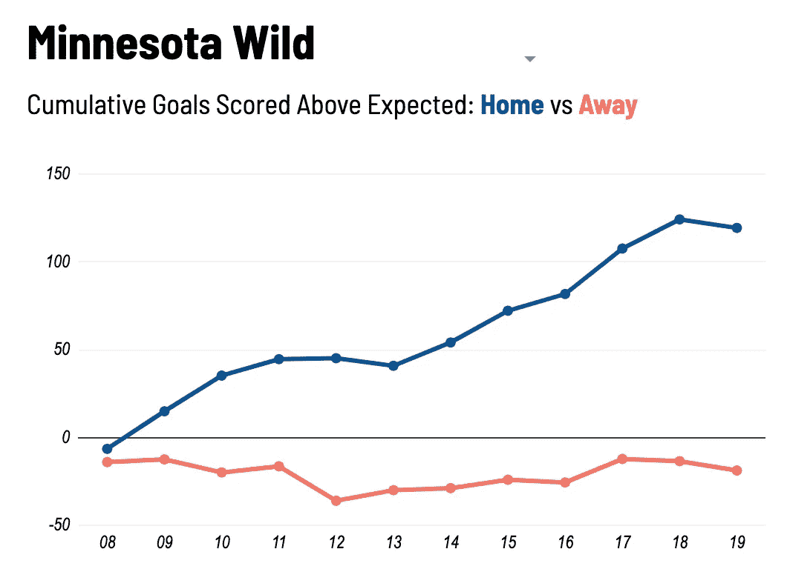
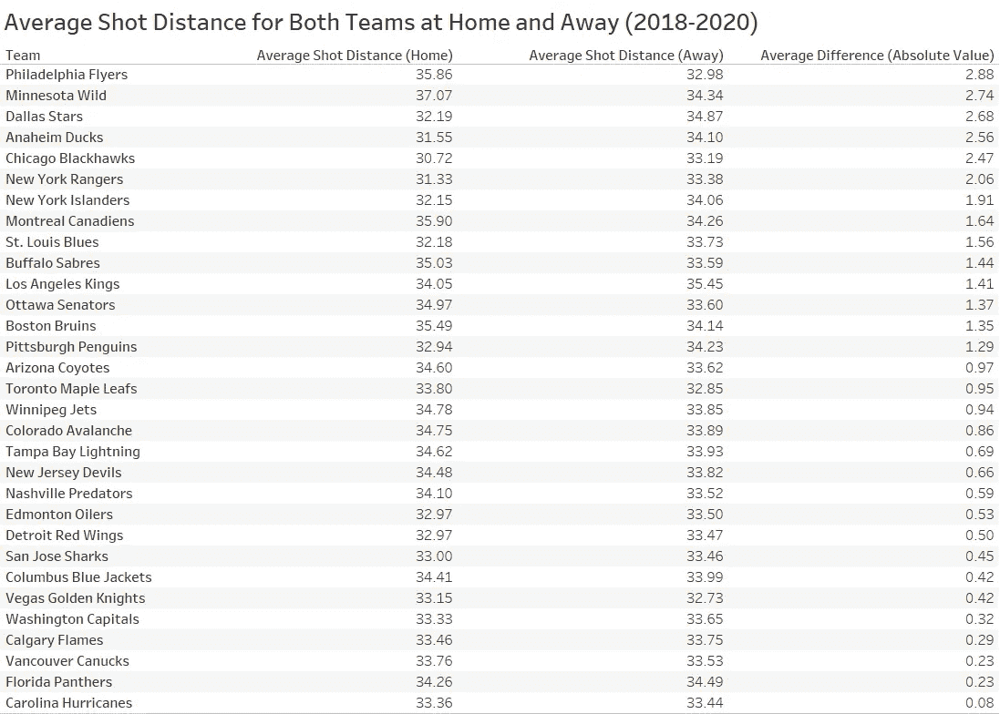
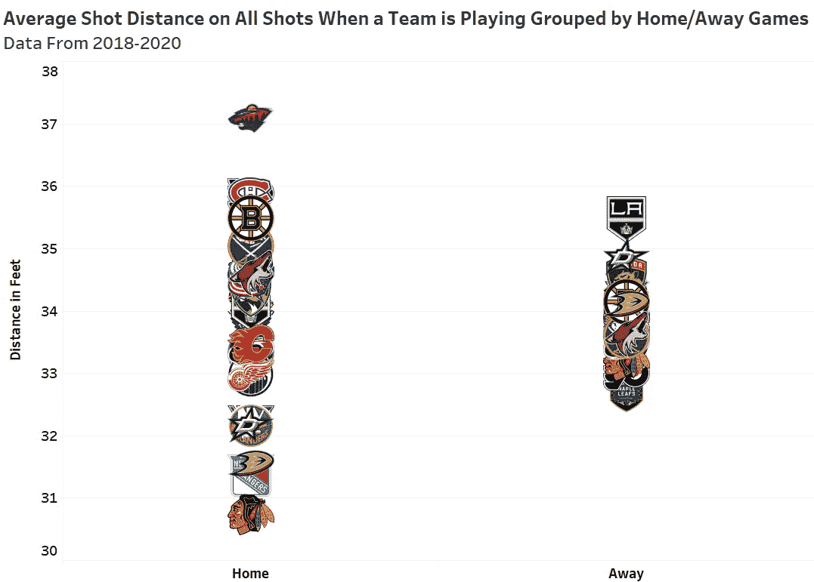

# 基于预期目标的场馆调整 RAPM 建设:起源、过程和结果(上)

> 原文：<https://towardsdatascience.com/building-venue-adjusted-rapm-for-expected-goals-the-origin-the-process-and-the-results-part-1-1c12f68df0cc?source=collection_archive---------44----------------------->

## 起源:是什么激励我建造这一切？

据[Evolving-Hockey.com](https://www.evolving-hockey.com/?)报道，在 2019 年至 2020 年常规赛中，明尼苏达州野生滑冰运动员在 NHL 的 goals above replacement (GAR)中领先。换句话说，他们的计算通过调整赛程强度和背靠背等背景因素来隔离团队表现，并将团队守门员的表现与他们的运动员分开，从而得出结论:如果你用一名替补级别的球员(一名容易被替换的球员，低于他们球队图表上的第 13 名前锋、第 7 名防守队员或第 2 名守门员)替换明尼苏达野外的每一名运动员，那么他们的净胜球差将比你对 NHL 中的其他球队做同样的事情时下降更多。更简洁地说:通过这种模式，除了守门之外，明尼苏达野生队是 2019-20 常规赛中 NHL 最好的球队。

如果你不熟悉替代以上的目标，我会列出一些快速的基础:这是一个由 EvolvingWild 制作的非常有效的模型，允许我们通过将玩家的个人贡献与各种外部因素(如竞争、队友和使用)隔离开来，然后将他们的贡献与典型的替代级别玩家的贡献进行比较，并确定他们增加了多少价值，来改善我们的玩家评估。该模型是在单个玩家级别上从头开始构建的，团队价值仅仅是聚合的玩家价值，但统计数据也可以用于团队级别。自 2007-2008 年以来，常规赛进球超过替补的球队赢得了 60.5%的季后赛系列赛，而常规赛排名更高的球队仅赢得了 55.9%的系列赛，这表明该模型具有可靠的预测能力，尽管它本质上是描述性的。我不会进一步深入细节，但这是一个很好的模型，可以说是比目前存在的任何其他曲棍球统计数据更好的“全面”反映球员价值的快照。您可以从这个由模型创建者撰写的 3 部分系列文章中了解更多详细信息:

 [## 超越替代的胜利:历史、哲学和目标(第一部分)

### 胜于替补(WAR)是一个由 sabermetric 社区在过去的几年中创建和发展的棒球度量标准…

hockey-graphs.com](https://hockey-graphs.com/2019/01/16/wins-above-replacement-history-philosophy-and-objectives-part-1/) 

现在，回到野外。考虑到他们的运动员在净胜球上排名第 19，在得分率上排名第 21，这似乎有点令人惊讶。如果我们假设模型是有效的和准确的——我很乐意这样做——那么模型输出和真实排名结果之间的差异只能用两个因素来解释:

1.  荒野有着联盟中最艰难的赛程，每隔一个晚上与联盟中的顶级球队背靠背比赛。
2.  荒野的守门员太糟糕了，他们把一个真正的斯坦利杯竞争者降到了第 21 位。

从模型本身来看，多半是后者。他们的守门员以 6.8 个进球 ***排在*** 替补之后，排名倒数第一。这意味着，如果你把一个典型的第三阵容守门员放在网上，他们的净胜球将会 ***提高*** 大约 7 个球。这比第二差的守门员差得多，第二差的守门员属于底特律红翼队，贡献了 1.2 个进球。这些数字不太容易用储蓄百分比来调和；明尼苏达州守门员的综合扑救百分比为 90.25%，而底特律的守门员的综合扑救百分比为 89.36%。那么，《进化中的曲棍球》是如何计算出底特律有明显更好的守门员的呢？

答案在于调整拍摄质量。Evolving Hockey 根据各种因素(例如报告的离网距离(到目前为止最重要的因素)、报告的离网角度和比赛强度)计算射门得分或失球得分的概率，以计算每次射门得分的概率，并根据射门得分的概率为该射门分配“预期得分”值。(举个例子，一个有 35%机会成为进球的危险射门，其预期进球值为 0.35。)他们的计算发现，与底特律的守门员面对的平均射门相比，明尼苏达的守门员面对的平均射门明显不太可能成为进球——以至于当你调整这些射门的质量时，底特律的守门员看起来要好得多，尽管他们的扑救百分比较低。直觉上，这是有道理的。我们知道，决定射门成为进球概率的最大因素是离网的距离。我们还知道，底特律守门员面对的平均射门距离为 32.2 英尺，而明尼苏达守门员面对的平均射门距离为 36.69 英尺。所以，你有它:野生动物只是需要更好的守门员，他们将是联盟中最好的球队。对吗？

不完全是。虽然明尼苏达州的守门员面对的射门平均来说比底特律的守门员面对的更容易，但我刚刚列出的统计数据可能没有描述实际发生的事情，这也是事实。如果你仔细再读一遍前面的段落，你会发现我很小心地指出这是每次射门的*距离。我做出这种区分是因为我有充分的理由相信 Xcel 能源中心(明尼苏达州的主场)的记分员报告说，那些射门的距离比实际距离稍微远一些，并且这些记分员对那些没有入网的射门也是如此。*

***注**:在本文的剩余部分，我将使用术语“射门”不仅指球门上的射门，也指没有入网的射门。这些射门被分析界称为 Fenwicks(以分析师 Matt Fenwick 命名)，我用它们来代替射门，因为我相信迫使射门偏出和射门入网是守门员和溜冰者分别拥有的技能，我希望表扬那些在这些技能上表现出熟练程度的人，惩罚那些没有的人。*

*现在，回到野外:指责明尼苏达州的记分员工作不力似乎有些苛刻，但有太多的证据表明不能置之不理。在过去 13 个赛季中的每一个赛季，明尼苏达主场比赛在冰场两端的平均报道击球距离都比客场比赛的平均报道距离远得多。以下是每一个赛季的数字，显示在联赛平均水平旁边，让你对分布有个概念:*

**

*图片由 [TopDownHockey](https://twitter.com/TopDownHockey)*

*在客场，明尼苏达的比赛风格在比联盟平均水平更接近外线和比联盟平均水平更接近球网之间来回摇摆，但从来没有巨大的差异。在这段时间里，明尼苏达客场比赛报道的平均投篮距离是 34.69 英尺，而所有 NHL 比赛报道的平均投篮距离是…34.69 英尺。相比之下，明尼苏达的主场比赛报道的平均投篮距离是 37.27 英尺。*

**

*图片由 [TopDownHockey](https://twitter.com/TopDownHockey)*

*这不仅仅是一次性事件；在超过 500 场主场比赛、超过 500 场客场比赛和超过 15，000 场 NHL 比赛的样本量中，这种现象年复一年地存在。*

*对错误的计分假设的一个有效的反驳是，野生动物只是在家里玩的风格不同于在路上。也许他们在主场会加强控制，减少冒险，因为他们觉得自己能够控制比赛的进程，但在客场他们会采用对手更典型的风格。这是有可能的，但是这种趋势也不太可能持续十三季。当你考虑到野外有四个总经理和六个不同的主教练负责这个样本时，这种可能性就更小了，他们每个人都可能部署不同的策略。在这些赛季的每一个赛季中，无论是谁执掌球队，他们客场比赛的平均射门距离从未在任何一个方向上偏离联盟平均水平超过 1.5 英尺，而他们主场比赛的平均射门距离一直超过联盟平均水平 1.5 英尺*以上。因此，虽然我们不能 100%确定明尼苏达州的记分员跟踪投篮数据是错误的，但这显然比任何其他结论更合理，需要的假设也明显更少。考虑到这一点，我将继续假设明尼苏达州的记分员确实表现出一种错误地跟踪比实际距离更远的投篮的模式，我将把这种行为模式称为**“记分员偏见”****

**现在，我们已经为记分员偏见奠定了基础，并同意在假设它确实存在的情况下继续工作，下一个问题是，这究竟如何影响曲棍球在明尼苏达野生动物替代排名之上的目标。这个问题的答案是防御。在运动员层面，这一指标的防守部分主要是通过预期目标来量化的，正如我们已经提到的，该统计的最大组成部分是报告的允许击球距离。如果明尼苏达州的记分员报告射门距离球网比实际距离远，那么他们的运动员允许的射门的预期进球值将低于这些射门成为进球的“真实”概率，因此看起来这些运动员在抑制预期进球方面比实际情况做得更好。**

**这是另一种形象化的方式:想象一个对手在投币口击球。如果该射门被正确记录，预期目标模型可以计算出它有 25%的得分概率，并且该射门将被分配相应的预期目标值 0.25。但是，如果明尼苏达州的记分员将此记录为从圆圈外射门，预期目标模型可能会使用报告的距离来计算它只有 10%的得分机会，并且该射门只会被分配 0.1 的预期目标值。这将会不准确地吹捧明尼苏达州的滑冰运动员的防守表现，暗示他们允许一个比他们实际做的更不危险的射门。而且，如果明尼苏达队的守门员在那次射门中允许进球，他们将被错误地记为比预期低 0.9 球，而不是比预期低 0.75 球。这听起来不多，但在一个赛季的过程中，或者在许多赛季的过程中，这加起来是一个非常重要的数字:**

****

**图片由[jfreshchoke](https://twitter.com/JFreshHockey)提供。数据来自[自然属性绝招](https://twitter.com/NatStatTrick)。**

**正如你所看到的，明尼苏达一直被糟糕的守门员表现所困扰。但是这个问题由于记分员的偏见而变得更加复杂，当他们在客场比赛时，这种偏见并不存在。**

**进攻呢？上表中明尼苏达州的主客场比赛显示了两个队的射门，这意味着明尼苏达州的记分员也报告说，主场比赛中的射门距离球网比实际距离要远。因此，从逻辑上来说，明尼苏达投篮的预期进球值也会不准确地低，因此他们制造危险投篮的进攻能力应该被高估，就像他们压制危险投篮的防守能力被高估一样，对吗？从上面同样的视觉化，看进球 ***得分*** ，而不是扑出，上面的主客场预期支持了这一点:**

****

**图片由[jfreshchoke](https://twitter.com/JFreshHockey)提供。数据来自[自然属性绝招](https://twitter.com/NatStatTrick)。**

**正如你所看到的，明尼苏达的滑手在家里看起来像精英射手，但在路上略低于平均水平。从逻辑上讲，人们可能会怀疑这些问题本质上是相互平衡的。他们确实这么做了。双方的预期目标是平等的。但与防守不同，替换目标以上使用实际目标而不是预期目标来衡量进攻贡献。由于 NHL 审查每一个进球，以确保它进入网内，记分员的偏见将不会在实际进球中发挥作用。从理论上讲，如果野生动物表现出一般的进球能力，不管他们是通过糟糕的射门质量和出色的射门还是相反的方式做到这一点；他们高于替补的进攻目标将是一般球队的目标。**

**然而，明尼苏达队本赛季实际上并不是一支普通的进攻球队。他们明显高于平均水平。这可能会让你感到惊讶(这让我感到惊讶)，但明尼苏达实际上在每小时 5 对 5 进球方面排名第五，在每小时强力进攻进球方面排名第十。这与他们在替补得分上的排名是一致的:在力量进攻部分排名第五，在力量进攻部分排名第九。鉴于这些信息，我可以很舒服地说，这种模式给了他们的进攻一个公平的震动，而*防守*是这种特定模式的唯一问题。**

**在我们继续之前，让我们记住我们从哪里开始:发展曲棍球的目标高于替代是一个非常有效的评估指标，它表明在 2019-2020 NHL 常规赛中，明尼苏达野生队拥有联盟中最好的滑冰运动员和联盟中最差的守门员。但是我们有理由非常有信心地相信，明尼苏达州主场馆的记分员一直报告说，射门距离球网比实际距离稍远，我们知道，如果他们*和*这样做，那么高于替换的进球将高估明尼苏达州滑冰运动员的防守性能，代价是守门员，而他们的进攻没有受到惩罚。**

**虽然我只关注 XCel 能源中心的记分员，但他们并不是唯一表现出记分员偏见的人。他们甚至不是最糟糕的罪犯。历史上，迄今为止最糟糕的犯规者是麦迪逊广场花园的记分员，他们与明尼苏达的记分员相反，报告说射门比他们更靠近球网，不知何故甚至不如明尼苏达的记分员准确。此外，虽然麦迪逊广场花园在过去两个赛季中实际上已经改善了他们的问题，但明尼苏达仍然没有他们主客场投篮距离之间的最大差异。**

****

**图片由 [TopDownHockey](https://twitter.com/TopDownHockey)**

**正如你所看到的，费城飞人队主场在富国银行中心的平均击球距离的绝对值实际上比在野外要大。达拉斯、阿纳海姆和芝加哥也很近。会不会是大部分冰场都有某种程度的记分员偏见？下面的图像表明情况可能是这样的:**

****

**图片由 [TopDownHockey](https://twitter.com/TopDownHockey)**

**正如你所看到的，球队在主场比赛时比在客场比赛时平均投篮距离的差异要大得多。在客场，每支球队的平均投篮距离在 32.5 英尺和 35.5 英尺之间，而在主场，球队的平均投篮距离在 30.5 英尺和 37.5 英尺之间。**另外，主场距离的方差是 2.06 英尺，而客场距离的方差只有 0.31 英尺！****

**因此，公平地说，明尼苏达州的 Xcel 能源中心可能不是唯一一个遭受记分员偏见的溜冰场。我认为这是有道理的，从逻辑上讲，人为错误在这里发挥作用，大多数记分员做的事情与其他记分员略有不同。在一个完美的世界中，我们会让记分员前往不同的竞技场，以便随机处理这个问题，但这个世界并不完美，这样做会产生大量的旅行费用，所以我们必须利用现有的数据。**

**我还应该指出，我不是唯一认识到这一点的人，我也不是第一个。2007 年，我十岁的时候，艾伦·赖德发布了“关于‘镜头质量’的产品召回通知”，他在通知中介绍了这个问题并声明:**

> **我们显然有一个 RTSS 得分手偏见的问题。这个问题在麦迪逊广场花园看起来很残酷，但在其他地方显然也很重要。NHL 需要认真审视这一过程的一致性。**

**许多其他曲棍球分析家认为这是一个问题，并提供了额外的证据来支持他们的立场。很明显，记分员偏见在 NHL 是一个真实的现象。**

**现在，我们已经确定 XCel 能源中心存在记分员偏见，解释了它如何导致我们不准确地评估明尼苏达州野生的滑冰运动员和守门员，并确定 XCel 能源中心不是唯一存在记分员偏见的竞技场，它只是逻辑上遵循许多其他滑冰运动员和守门员可能会由于记分员偏见而被高估或低估。例如，据报道，过去两年在本田中心举行的阿纳海姆鸭队比赛中，平均射门距离球网 2.56 英尺*，比这个样本中阿纳海姆鸭队客场比赛的平均射门距离近 2.56 英尺。如果这个数字实际上是射门距离被不准确报告的结果，那么从逻辑上来说，阿纳海姆的防守表现将被低估，他们的守门员将被高估。达拉斯也是如此，费城反过来也是如此。这里的底线是记分员的偏见导致我们对运动员和守门员的一些不准确的评估，特别是在进球高于替补的情况下。***

***我们如何解决这个问题？嗯，*我*不要。模型不是我做的，我也无权决定如何修复我认为是问题的东西。这甚至不是由我来决定这是一个问题还是需要解决。我在这里的目的只是简单地提供一个估计，即记分员偏差的影响可能在多大程度上歪曲了滑冰运动员和守门员在冰上的实际表现，并允许我们在分析不断发展的曲棍球目标高于替换和其他高级曲棍球统计数据时记住这些估计的影响，这些统计数据使用预期目标，并不考虑记分员偏差的影响。***

**为了做到这一点，我要做三件事:**

1.  **建立一个预期目标模型，它在测试中表现得足够好，以至于我可以放心地将它作为一个描述性模型来评估已经发生的投篮质量。**
2.  **确定记分员偏差的调整，当我用我计算的调整后的射门距离替换我获得的报告射门距离时，该调整不会损害我的预期目标模型的性能。**
3.  **建立一个规则的调整正负(RAPM)模型，允许我提供一个球员对预期目标的孤立进攻，防守和净影响的点估计。我会这样做，因为 goals above replacement 使用球员对预期目标的孤立影响来对抗来自发展中的曲棍球的 RAPM 模型，作为评估滑冰运动员防守的主要组成部分之一，他们使用的大多数其他组成部分与这一措施密切相关。因此，RAPM 将提供一个坚实的估计，什么样的运动员的贡献将是上述目标的防守组成部分替换。(此外，RAPM 本身也被许多粉丝和分析师用作评估运动员的工具，对球员进攻对预期目标的影响的分数估计在那里比在替代目标中更有分量。)**

**此过程的最终目标是使用报告的击球距离提供一名选手的单独进攻、防守和净影响的单点估计，使用调整后的击球距离提供一名选手的单独进攻、防守和净影响的单点估计，然后并排显示它们，以便根据这些模型之一提供对记分员偏差的调整如何影响选手或球队的单独影响的估计。我还希望对守门员做同样的事情，使用报告的射门距离提供守门员孤立表现的一分估计，使用调整的射门距离提供守门员孤立表现的一分估计。我的假设是，像明尼苏达州的亚历克斯·斯塔洛克和德万·杜布尼克这样的守门员，在调整了记分员的偏见后，看起来会明显更好。**

**在第 2 部分中，我将回顾这个过程。敬请关注。**