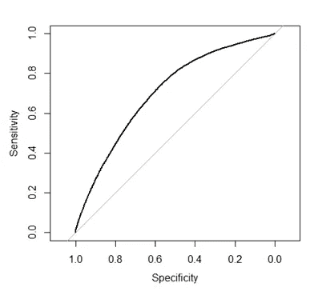
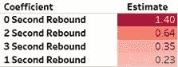
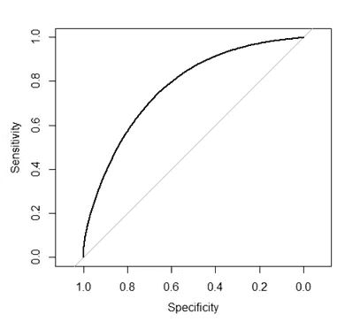
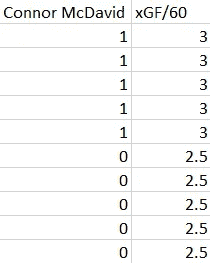
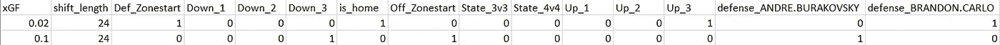
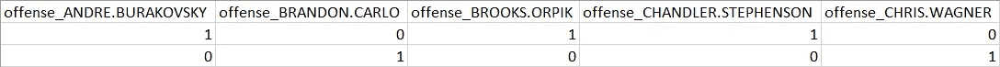

# 基于预期目标的场馆调整 RAPM 建设:起源、过程和结果(下)

> 原文：<https://towardsdatascience.com/building-venue-adjusted-rapm-for-expected-goals-the-origin-the-process-and-the-results-part-2-9245ae51e23d?source=collection_archive---------44----------------------->

## 过程:我是如何建立这一切的？

照片由[克莱门特 H](https://unsplash.com/@clemhlrdt?utm_source=medium&utm_medium=referral) 在 [Unsplash](https://unsplash.com?utm_source=medium&utm_medium=referral) 上拍摄

在本文的第一部分，我为几个关键概念奠定了基础:

1.  [不断发展的曲棍球](https://www.evolving-hockey.com/?)的高效目标高于替代模型得出结论，明尼苏达州荒野在 2019-2020 年常规赛中拥有 NHL 最好的滑冰选手和最差的守门员。
2.  Xcel Energy Center 是明尼苏达野生动物队主场比赛的场地，该中心的记分员表现出一种错误的报告模式，即投篮距离球网比实际距离远，我称之为“记分员偏差”。
3.  如果射门(定义为射门和失球)被报告为离球网比拍摄时更远，这将导致上述目标高于替代模型以守门员为代价高估明尼苏达州运动员的防守性能，而不会影响运动员的进攻性能。
4.  Xcel 能源中心的记分员并不是唯一表现出记分员偏见的人。他们甚至不是最差的。

我最后说，我的目的不是“解决”这个问题，而是提供一个估计，记分员的偏见在多大程度上歪曲了滑冰运动员和守门员在容易发生这种情况的冰场上的行为。然后我概述了我打算做的三件事:

1.  建立一个预期目标模型，它在测试中表现得足够好，以至于我可以放心地将它作为一个描述性模型来评估已经发生的投篮质量。
2.  确定记分员偏差的调整，当我用我计算的调整后的射门距离替换我获得的报告射门距离时，该调整不会损害我的预期目标模型的性能。
3.  建立一个正则化的调整正负(RAPM)模型，允许我提供一个滑冰运动员对预期目标的孤立进攻，防守和净影响的点估计。这将允许我比较一个运动员在调整记分员偏差前后的单独影响，并确定记分员偏差对他们未调整结果的影响。

如果您还没有阅读本文的第一部分，我建议您在继续阅读之前先阅读一下。它会让你更好地理解手头的主要概念，并解释为什么我能在我所做的假设下舒服地工作。话虽如此，如果你已经很好地理解了替代目标、预期目标、RAPM 和记分员偏差等概念，并且你真的只是对我最近在 Twitter 上发布的一些图表和统计数据背后的方法论感兴趣，那么请随意继续阅读。

我以最少的编码经验开始了这个过程。我学过一点 Python，包括一门大学入门课程，还完成了 EDX 的免费在线“统计和 R”课程。大概就是这样。虽然我在 Python 方面有更多的经验，但我选择了使用 R，因为在我有限的时间里，我觉得使用 R 更舒服，更重要的是因为 [Evolving Hockey scraper](https://github.com/evolvingwild/evolving-hockey/blob/master/EH_scrape_functions.R) 是用 R 编写的。虽然我在这个 Scraper 的主题上，但我不能不感谢 EvolvingWild 创建了这个 Scraper 并向公众提供它。

我用这个刮刀从 2018-2019 和 2019-2020 NHL 赛季的每一场记录比赛中提取数据。我想使用不止一年的样本量，因为我正在研究的所有指标都被认为在多年样本中更可靠，但我选择不使用三年或更长时间的样本量，因为[NHL 在 2018-2019 赛季之前缩小了最大守门员垫尺寸](https://www.usatoday.com/story/sports/nhl/2018/09/29/nhl-goalie-equipment-continues-to-shrink-premium-on-scoring/37984165/)。这一根本性的变化对任何投篮成为进球的概率都产生了重大影响，我过去曾注意到，2018-2019 年之前建立的预期进球模型表现出严重低估投篮质量的模式；我不想我的孩子遭受同样的问题。

一旦我确定了我想要的样本并为它收集了数据，下一步就是构建预期的目标模型。我首先对预期目标模型的历史和理论做了一些研究，发现它们通常是用两种方法之一构建的:

1.  逻辑回归:一种统计建模技术，使用其他预测变量来预测一个二元变量的概率。在这种情况下，二元变量是投篮是否成为进球，预测变量是距离、投篮角度、比赛实力状态、投篮是否是篮板等。
2.  梯度推进:一种用于回归和分类问题的机器学习技术。

这里的两个关键区别是，基于梯度推进的模型比基于逻辑回归的模型产生的结果稍好，但是逻辑回归更容易编码和实现，并且仍然提供良好的结果。因为我的目标是构建一个可靠的模型，我可以轻松地使用它，而不一定是构建最好的模型，所以我选择了逻辑回归。

在确定我可以使用逻辑回归建立一个可接受的模型之后，下一个问题是我如何确定一个模型*是*可接受的。你如何让一个预期目标模型经得起推敲？我过去“测试”公共模型的一种方法是在团队级别检查预期目标份额(xGF%)和实际目标份额(GF%)之间的相关性。大多数公共模型的 R 在 0.4 到 0.46 之间，因此 R 为 0.4 的预期目标模型将通过该测试。但是这种测试也有问题——一些球队的射门和守门能力比其他球队更好——我从来没有见过一个可信的分析师这样测试一个模型。我想确保我用来测试我的模型的任何方法都是已经被其他分析师使用过的可靠方法，所以我着手确定测试我的模型的最佳过程。

我的研究发现，测试预期目标模型最常见的方法是测量曲线下面积(AUC)；通过接收机工作特性(ROC)测试获得的值。如果你不熟悉这些东西，你和几周前的我没什么不同，所以让我来给你解释一下:在第二次世界大战中，雷达接收器操作员是一个分析雷达并确定雷达上的光点是友军船只、敌军船只还是随机碎片/噪音的人。他们进行这些区分的熟练程度被称为他们的“接收器操作特征”接收器工作曲线在 x 轴上绘出了信号检测器的假阳性率，在 y 轴上绘出了信号检测器的真阳性率，曲线穿过并示出了给定假阳性率的对应真阳性率。

无用或完全随机的模型的 AUC 为 0.5，而“一般”模型通常被认为是 AUC 在 0.7 到 0.8 之间的模型。据我所知，他的是每个公众期望的目标模型的范围，大多数更受欢迎的模型在该范围的上端。(作为参考，[发展曲棍球的预期目标模型](https://rpubs.com/evolvingwild/395136/)的平均力量击球的 AUC 为 0.7822，强力击球的 AUC 为 0.7183，短手击球的 AUC 为 0.7975。)

请记住，我在这里的目标不是创建现有的最佳预期目标模型，而是创建一个足够可靠的模型，我可以用它作为过去事件的描述模型。我建立的第一个模型使用距离作为唯一的变量，我仍然获得了 0.7045 的 AUC，这在技术上意味着它符合公平模型的条件。为了给你一个形象的描述，我的 ROC 曲线是这样的:

图片由 [TopDownHockey](https://twitter.com/TopDownHockey)

在这一点上，我很兴奋我已经看到了一些结果，但我也意识到我还没有做那么多，我可能应该尽我的努力在前进之前对这个模型的*做一些*改进。

接下来的几天，我修补了一些我认为可能会提高模型性能的变量。这里的过程只是我构建不同的虚拟变量(值为 0 或 1 的分类变量，表示该变量是否存在),并在添加它们之前和之后测试我的模型的 AUC，以查看它们是否有任何改进。以下是我在最终模型中使用的变量:

*   射击距离。(连续)
*   拍摄角度。(连续)
*   拍摄和之前事件之间的时间差。(连续)
*   射击类型。(分类)
*   射手实力。(分类)
*   游戏实力状态。(分类)
*   之前的事件是否是拍摄团队的外卖。(假人)
*   之前的事件是否是对手的赠品。(假人)
*   一个投篮是否跟随对方球队的一个被阻挡的投篮。(假人)
*   一枪到底是不是冲。(假人)
*   一次击球是否是前一次击球零秒后发生的反弹。(假人)
*   一次击球是否是前一次击球后一秒钟发生的反弹。(假人)
*   一次击球是否是前一次击球后两秒钟发生的反弹。(假人)
*   一次投篮是否是在前一次投篮后三秒钟发生的反弹。(假人)

为什么我在选择篮板球的分类上如此小心翼翼？因为我发现篮板对进球几率的影响有很大的不同，这取决于它们发生的时间。以下是我对每个系数的估计:

图片由 [TopDownHockey](https://twitter.com/TopDownHockey)

我完全可以猜到零秒的篮板最有可能成为进球。这很有道理。我想不到的是，一秒钟的篮板比两三秒钟的篮板更不容易得分。这是为什么呢？我不能肯定地说，但我的理论是:零秒篮板是快速的，没有给守门员时间回到位置的 bang-bang 比赛，而一秒篮板通常是“强迫”射门的结果，守门员只有足够的时间回到位置并准备做出扑救。相比之下，2 秒和 3 秒的篮板更多的是在第一次射门后传球或偏转的结果，这使得守门员离开了位置，造成了更多的“混乱”

这只是我的理论，不管它是不是真的，最终都无关紧要；重要的是，包含这些变量为模型增添了独特的风格，并提高了性能。最后，我得到了 0.7707 的 AUC，仅次于预期目标模型的 AUC。这是我改进的模型中的大鹏鸟的图像:

图片由[托普顿曲棍球](https://twitter.com/TopDownHockey)

如果你回头看第一个只使用距离的 ROC 曲线，你会发现有很大的改善。我对自己在这一点上所做的感到非常自豪，我很高兴能够继续这一过程的下一步，即进行场地调整，以解决记分员的偏见。

创建场地调整是这个过程中最简单的部分，因为已经有很多关于场地调整的优秀作品可供公众使用。在我发现的场地调整中，我发现最可行的两个是迈克尔·舒克斯(Michael Schuckers)(在[这篇文章](http://statsportsconsulting.com/main/wp-content/uploads/Schuckers_Curro_MIT_Sloan_THoR.pdf)的第 9 页)和肯·克日维奇(Ken Krzywicki)(在[这篇文章](http://www.hockeyanalytics.com/Research_files/SQ-DistAdj-RS0809-Krzywicki.pdf)的第 2 页)。

我实现了两种调整，并使用调整后的距离数据再次测试了模型。我发现 Schuckers 的调整稍微损害了模型性能，而 Krzywicki 的稍微改善了模型性能，将 AUC 从 0.7707 增加到 0.7708，所以我选择了 Krzywicki 的。这是一个非常小的改进，但这正是我所需要的。以下是 Krzywicki 调整背后的方法论:

> **调整后的距离=(报告距离)-(Rink 平均报告距离)**

有时候最简单的方法也管用。

现在，我已经建立了一个预期目标模型，并实施了一个可接受的场地调整，我对 2018-2019 和 2019-2020 赛季的每一个畅通的镜头都有两套预期目标值:一套在场地调整之前，一套在场地调整之后。下一步是建立一个正则化的调整正负模型(RAPM)模型，使用根据报告的击球距离计算的预期目标值来隔离每个运动员的进攻、防守和净影响，然后根据调整的击球距离的预期目标值进行同样的操作。

这是这个过程中最难的部分。请记住，在这个项目之前，我的编码经验非常有限，虽然我通过搜集数据、创建预期目标模型和应用场地调整学到了很多东西，但我仍然远远不是编程专家。不过，在讨论我的经验之前，我将向您概述一下什么是 RAPM 以及我为什么在这里使用它。

我之前说过，一旦我建立了一个 RAPM 模型，我将“对一个球员的单独进攻、防守和对预期目标的净影响进行点估计。”但是你如何得到它呢？曲棍球是一项流动性很强的运动，以至于很难对一名球员的单独冲击做出哪怕是一点点的估计。当你说 RAPM 是在没有使用任何单个结果的情况下计算出的*，而仅仅是冰上结果时，这听起来就更加困难了。*

说实话，这不是一个简单的概念。我花了一段时间来理解它，我已经尝试解释了很多次，几乎每次都失败了。这一次，为了解释 RAPM 是如何工作的，我将从我建立这些模型的经验中吸取教训，并通过尽可能少的数据点来解释这个概念。

让我们假设影响冰上进攻结果的唯一*背景因素是康纳·麦克戴维是否在场外的冰上比赛。其他一切——所有其他队友和对手，转变开始于哪个区域，比分是多少——这些都不重要。这听起来是不是很傻？是的，确实是这样，而且完全是愚蠢的，但是我保证这将有助于理解这一点。*

这个傻乎乎的虚构世界与现实世界有一个共同点:康纳·麦克戴维(Connor McDavid)极其擅长进攻，并对他的团队产生进攻的速度产生强烈影响，这种速度是以每小时的预期进球数(xGF/60)来衡量的。我们有十个数据点可以让我们准确地确定麦克戴维的影响:没有康纳·麦克戴维的五个班次，球队的进攻率为 2.5 xGF/60；有康纳·麦克戴维的五个班次，球队的进攻率为 3.0 xGF/60。如果我们创建一个名为“Connor McDavid”的虚拟变量，当 McDavid 在冰上时，该变量的值为 1，当他不在冰上时，该变量的值为 0，我们的数据如下所示:

图片由 [TopDownHockey](https://twitter.com/TopDownHockey)

如果我们使用 xGF/60 作为我们的目标变量对该数据进行非常简单的回归，我们的斜率截距形式的趋势线将是 xGF/60 = 2.5 + 0.5*(Connor McDavid)。这意味着，对于没有康纳·麦克达维的典型转变，我们预计球队的冰上进攻预期进球率为 2.5 xGF/60，康纳·麦克达维的存在将该值增加了 0.5，因此我们预计有康纳·麦克达维的转变将看到进攻以 3.00 xGF/60 的比率产生。**这意味着康纳·麦克戴维的孤立影响使他的球队的进攻率增加了 0.5 xGF/60。**

现在，让我们介绍另一名球员，他也可以影响他们球队的冰上进攻率。记住，除了麦克戴维之外，没有什么比 T4 更重要的了，但是这个球员也很重要。但是我们不知道它们到底有多重要。

幸运的是，有了我们现有的数据，我们可以很容易地计算出它们有多重要。假设这个玩家在没有 Connor McDavid 的情况下跳出来进行转换，他们的冰上 xGF/60 是 2.8。我们知道，除了一名球员的控制之外，绝对没有其他外部因素影响这个比率，我们知道正常的比率是 2.5 xGF/60，所以我们可以得出结论，这名球员对他们球队的进攻率的孤立影响是增加了 0.3 xGF/60。我们不需要观察这种转变，我们不需要计算这个球员有多少进球或助攻——我们确切地知道他们的影响是什么。

现在，如果这个玩家跳出来和 Connor MC David 换班**，他们以 2.9 xGF/60 的比率产生进攻，会怎么样？除了 McDavid 之外，我们不知道其他任何事情，但是 McDavid *在这种转变中*在那里，所以我们从他们的冰上率中减去 3.0 xGF/60 的比率，发现他们对他们球队进攻率的单独影响是*减少了*0.1 xGF/60。同样，我们不需要观察这种转变来知道这个玩家的影响是什么。**这是自上而下曲棍球分析的精髓:使用冰上结果来隔离球员的影响。****

现在，回到现实世界。一切又变得重要了。不仅是康纳·麦克达维，还有其他每一个队友，每一个对手，是在进攻区还是防守区开始转移，比分是多少，等等。哦，我们不仅要隔离球员的进攻影响，还要隔离他们的防守影响。这一切都让事情变得更加复杂，给我们的最终价值增加了许多不确定性，这就是为什么我尽可能使用“点估计”这个术语来衡量一个玩家的影响。

虽然事情现在变得更加复杂，但 McDavid 的例子为我们提供了一个如何隔离每个人的影响的例子:除了表示游戏强度、分数、转换开始的区域和其他一些变量的虚拟变量之外，还创建表示溜冰者是否在冰上的虚拟变量，因为我们知道这些事情很重要，并且我们希望对它们进行说明。此外，对于每个滑冰运动员，我们必须创建一个虚拟变量来表示他们是否在冰上，而是一个表示他们是否在冰上进行进攻，一个表示他们是否在冰上进行防守，因为我们想隔离他们的进攻*和*防守影响，并为每个影响找到单独的点估计。

为了举例说明这一点，我将通过拉 2018-2019 赛季第二场比赛第三阶段发生的一次转变来“分块”我的真实数据集。关于这种转变，你需要知道以下几点:

*   华盛顿首都队主场迎战波士顿布鲁因斯队。
*   华盛顿首都队领先三个或更多的球。
*   这一转变持续了 24 秒。
*   这种转变始于波士顿进攻区的对抗。
*   布鲁因斯拍摄了一个未被阻挡的镜头，该镜头的值为 0.1 xGF。
*   首都队在这一次转移中拍摄了一个未被阻挡的镜头，其值为 0.02 xGF。
*   波士顿的五名选手是布兰登·卡罗、约阿金·诺德斯特龙、克里斯·瓦格纳、诺埃尔·阿恰里和兹德诺·查拉。
*   华盛顿的滑冰选手有安德烈·布拉科夫斯基、布鲁克斯·奥尔皮克、钱德勒·斯蒂芬森、拉斯·埃勒和麦迪逊·鲍威。

这是 RAPM 准备格式转变的局部视图:

图片由[托普顿曲棍球](https://twitter.com/TopDownHockey)

正如您所看到的，顶行从主队的角度将这种转变显示为“进攻”，而从客队的角度将这种转变显示为“防守”，而底行从主队的角度将这种转变显示为“进攻”。上面的图像只显示了一些防守的选手，但这里是进攻的选手。

图片由 [TopDownHockey](https://twitter.com/TopDownHockey)

请记住，整个顶行是从华盛顿首都的角度来看的。在顶行中，xGF/60 是首都队进攻的比率，标记为“进攻”的选手是那些为首都队效力的选手，标记为“防守”的选手是那些为布鲁因斯队效力的选手。相比之下，底部一行是从波士顿布鲁因斯的角度来看的，这意味着 xGF/60 是布鲁因斯产生进攻的速率，标记为“进攻”的选手是那些为布鲁因斯效力的选手，标记为“防守”的选手是那些为首都效力的选手。首都也领先至少 3 个球，所以他们被标记为“上升 3”，而布鲁因斯被标记为“下降 3”

要锁定两个特定的球员，只需看看安德烈·布拉科夫斯基和布兰登·卡洛。从首都的角度来看——第一排——布兰登·卡罗在防守，安德烈·布拉科夫斯基在进攻。从布鲁因斯(最下面一排)的角度来看，布兰登·卡罗在进攻，安德烈·布拉科夫斯基在防守。

这个例子是一个班次对应两行。我使用的样本大小的整个数据集包含 544，502 个移位，总共 1，089，004 行。这听起来很多，但这里的关键概念仍然存在:从每个团队的角度来看，每个班次包含两行，从虚拟变量返回的系数将确定某个变量(如 Connor McDavid 进攻)的存在对团队的预期进球率的影响。

这种使用回归分析曲棍球运动员的概念是基于他们在冰上发生的一切事情，这是大多数现代公共曲棍球分析的核心。我喜欢这样想，RAPM 不是通过专注于进球和助攻等个人统计数据，或者更“高级”的个人统计数据，如封锁传球和区域出口，来从头到尾分析曲棍球，而是从**自上而下**——因此有了用户名。如果一名球员阻挡了很多传球，并因此阻止了对手积累危险的得分机会，这将显示在他们的防守 RAPM 统计中。如果一名球员在防守区表现一般，努力阻挡传球，但他们是一名出色的前锋，不断阻止对手在转换中建立进攻，这也会在他们的防守 RAPM 统计数据中显示出来。如果他们做好了其中的一些事情，但他们也做了一些其他的事情，这些事情阻止了他们产生强大的影响，谁会真正在乎呢？这是我的哲学。

我的解释清楚地表明，我是 RAPM 的超级粉丝，但我没有在这里使用它，因为我喜欢它。我使用它是因为球员对预期目标的 RAPM 影响是替代目标以上防守部分最重要的指标之一，替代目标以上的其他部分与 RAPM 密切相关，因此提供场地调整前后球员 RAPM 的点估计将显示场地调整对替代目标以上某些部分的影响程度。(RAPM 本身也是一个非常受欢迎的指标，我认为它有助于了解场馆调整可能如何影响 RAPM 本身。)

既然我已经解释了自上而下曲棍球分析的概念，RAPM，以及为什么我选择使用它，是时候解释我是如何实现它的了。如上所示，我的数据框包含过去两个赛季中每次换班的两行:一行是主队“进攻”，一行是客场队“进攻”。我的目标是运行一个回归，通过获得系数估计值来隔离每个外部变量对 xGF/60 结冰速率的影响。

不幸的是，不像前面的例子中虚构的 Connor McDavid 数据，我不能只运行一个标准的多元线性回归。这有三个原因:

1.  xGF/60 表示某事物发生的速率，不考虑结冰时间。两次移动的速率可能相等，都是 4.0 xGF/60，但是如果其中一次发生在两分钟内，而另一次发生在两秒内，我们就不能简单地将它们组合起来，就好像它们是同一件事一样。两分钟内发生的那次更有意义。
2.  数据中存在大量多重共线性。这是一种奇特的说法，表明这些数据中的许多变量彼此高度相关，这是一种奇特的说法，表明像肖恩·莫纳汉和约翰尼·高德罗这样的球员几乎所有的时间都在一起打球。具有多重共线性的数据集上的传统线性回归导致极不稳定的系数估计。
3.  这种不稳定性也会存在于在非常小的样本中发布极端结果的玩家身上。如果你运行一个简单的多元线性回归,“最好的”球员可能会成为某个打了 13 分钟，冰上命中率达到 72%的人，或者类似的荒谬的人。

对于第一个问题，有一个非常简单的解决方法:使用轮班持续时间作为权重，将其转换为加权多元线性回归。砰，简单，搞定。

还有一个解决方案可以同时解决第二个和第三个问题，但是有点不太简单:正则化(RAPM 的 R)。正则化是一种数学技术，它使系数估计值偏向总体均值零。为了简化这个概念，并把它变成曲棍球术语，我们本质上是说，直到我们有足够的数据来准确地估计一个球员到底是什么，我们将假设他们大致是平均水平。这不仅适用于自己玩过很小样本的选手，也适用于玩过大样本，但是没有某个队友的小样本的选手。

我使用的正则化版本被称为岭正则化或吉洪诺夫正则化，我将这些系数偏向零或“收缩”它们的程度由我通过对我的原始数据集进行[交叉验证测试](https://en.wikipedia.org/wiki/Cross-validation_(statistics))获得的λ值决定。运行的最终回归被认为是“**加权岭回归**我可以更详细地解释这在数学上到底意味着什么，但是现在，这个模型仍处于测试阶段，我宁愿坚持从曲棍球的角度用尽可能少的数学来解释这个过程。

这整个过程与 [Evolving Wild 用来建造他们的 RAPM 模型](https://hockey-graphs.com/2019/01/14/reviving-regularized-adjusted-plus-minus-for-hockey/)的过程极其相似。我非常感谢他们的赞扬；如果没有它，我不确定我能不能造出自己的模型。我有意密切跟踪他们的过程，因为正如我在第一篇文章中所述，他们的 RAPM 模型的防守部分在他们的目标替换模型中起着很大的作用，而大多数其他部分与 RAPM 密切相关，因此根据 RAPM 在场地调整前后对球员防守影响的点估计将使我了解场地调整如何影响替换后的防守目标。

虽然我的过程在设计上非常相似，但它在两个方面有所不同:我使用了不同的预期目标模型来构建它，并且我同时使用了两年时间。一次使用两年时间给了我更大的样本量，这意味着我通过交叉验证获得的 Lambda 值比我只对一年的数据进行交叉验证获得的值要小。因此，我的系数在那里“缩小”或偏向零，比进化的 Wild 的系数小**度，我在光谱的两端得到更大的值。**

虽然这是本文的第二部分，我不应该在第三部分之前讨论结果，但我仍然觉得有必要提供一个结果作为较小的 Lambda 值所做的示例，所以我将与 Mark Stone 一起讨论。在过去的两年里，根据我们的两个模型，他在平均实力下对预期目标的净影响是所有球员中最高的。但是他们的模型对他的净影响的系数估计是+0.46 xG/60；在场地调整之前，我的模型的系数估计值为+0.701 xG/60。

直观地说，我更喜欢同时使用多个年份的*，因为*的λ值较低，因此系数估计值较大。换句话说，我认为像 Mark Stone 这样的精英玩家的真实孤立影响可能比他们更接近我的系数估计，我更喜欢使用一种方法来使这种类型的结果成为可能。但这是个人喜好的问题，两种方式都有各自的优缺点。

一旦我使用通过**报告的**击球距离计算的预期目标值完成了这个过程，我就使用通过**调整的**击球距离计算的预期目标值重复了相同的精确过程。

结果非常有趣。它们将在第 3 部分中讨论。敬请关注。