# 基于预期目标的场馆调整 RAPM 建设:起源、过程和结果(下)

> 原文：<https://towardsdatascience.com/building-venue-adjusted-rapm-for-expected-goals-the-origin-the-process-and-the-results-part-3-87db02cc2cfd?source=collection_archive---------38----------------------->

## **结果:记分员偏差有多大？**

在为本文的第一部分和第二部分写了超过 7000 个单词之后，我很兴奋终于可以分享结果了。如果你一直在阅读，我相信你也是，我想感谢你花时间阅读我的作品。我希望你喜欢它。

如果你没有跟着读，没关系。我强烈建议你在阅读本文之前先阅读第一和第二部分；它们并不短，但它们会让你很好地理解为什么这对我很重要，为什么你也应该关心它。但是如果你对阅读不感兴趣，你只想看到结果，我不会责怪你，也不会阻止你阅读。但是，我将为您快速回顾一下我在第一部分和第二部分中介绍的内容:

1.  明尼苏达州的记分员错误地报告说，射门距离球网比实际距离远，这导致他们的滑冰运动员的防守性能被高估，他们的守门员被高效的模型低估，如发展曲棍球的目标高于替换。明尼苏达州的记分员也不是唯一表现出这种行为模式的人，我称之为“记分员偏见”
2.  我的目的不是“修复”这个问题，而是提供一个对它所导致的不准确性的估计。为此，我构建了一个预期目标模型，对击球距离进行了场地调整，从而提高了我的预期目标模型的性能，并构建了一个 RAPM 模型，它提供了一个溜冰者孤立影响的点估计。

对于结果，我将从团队层面开始分析，然后转移到守门员，最后是个人选手。

在团队层面，我会从防守开始。以下是每支球队在过去两个赛季的防守表现，以每小时预期进球数(xGA/60)衡量，地点调整前后:

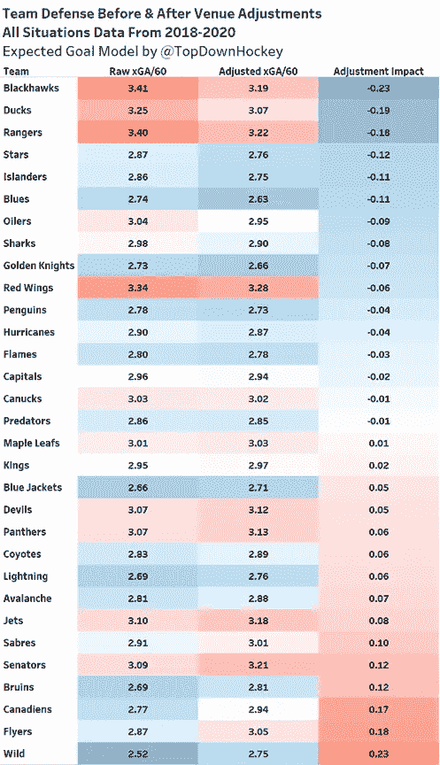

图片由[托普顿曲棍球](https://twitter.com/TopDownHockey)

既然明尼苏达从本文开始就一直走在前列，那我们就重点关注他们吧。正如你所看到的，他们的防守在这次调整中受到了最大的惩罚。在调整之前，他们的 2.52 的 xGA/60 是联盟中最好的，第二名哥伦布以 2.66 的 xGA/60 舒适地坐在他们的后面。调整后，明尼苏达以 2.75 的成绩跌至 xGA/60 的第 6 位。他们的防守仍然很好，但是他们不再是最好的防守球队了。

在光谱的另一端，芝加哥的进步程度与明尼苏达的衰退程度差不多。他们是调整前防守最差的球队，调整后防守第四差的球队。阿纳海姆和纽约流浪者队也看到了重大的改善，而蒙特利尔和费城看到他们的防守人数下降到类似的程度。其他六个团队的 xGA/60 比率变化至少为 0.1，其中三个团队有所改善，三个团队有所下降。

我发现这里非常有趣的是这个图案的对称性。光谱两端各有一个团队，他们看到的极端变化彼此相同，两端各有两个团队，他们稍微不太极端的变化实际上相同，光谱两端各有三个团队，他们非极端但仍然显著的变化实际上相同。让我们看看同样的模式是否在进攻中持续，这是通过每小时的预期目标(xGF/60)和同一两年样本的数据来衡量的:

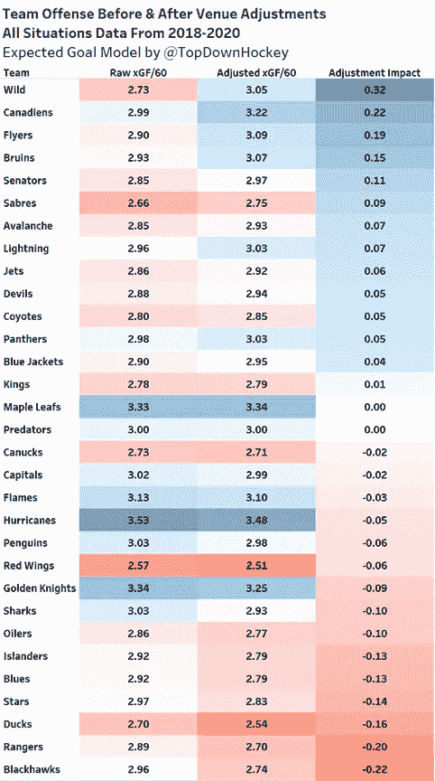

图片由 [TopDownHockey](https://twitter.com/TopDownHockey)

团队进攻没有团队防守那么对称，但模式是相似的:明尼苏达和蒙特利尔等球队的记分员报告说，投篮距离球网比实际距离远，他们的进攻有所加强，而芝加哥和阿纳海姆等球队的进攻有所下降。

让我感到惊讶的一件事是，明尼苏达的进攻比他们的防守下降了更大的程度。这意味着他们的预期目标差异有了显著的改善。他们是一个异数，还是这发生在许多不同的团队？让我们通过查看加减值来找出答案，这是通过在同一两年样本中每小时的预期目标差异(xG+/-/60)来衡量的:

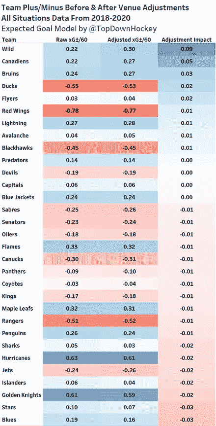

图片由[托普顿曲棍球](https://twitter.com/TopDownHockey)

事实证明，明尼苏达是唯一一支预期净胜球率显著上升的球队。蒙特利尔的变化足以令人惊讶，但其他人都在误差范围内。明尼苏达为什么进步了？我不完全确定，但我有一个理论:明尼苏达在主场是一支很好的控球球队，有 51.93%的芬威克投篮命中率。他们拍摄的*和*允许的拍摄值通过调整增加了，但是因为有更多的主场拍摄，这给了他们一个整体的提升。这一理论也适用于蒙特利尔和波士顿，这两支球队的预期净胜球率分别排名第二和第三。

他们主场芬威克的命中率分别是 54.74%和 53.71%，经过我的调整，他们在主场的支持和反对投篮变得稍微更有价值。这只是一个理论，我需要做更多的研究来确定为什么会这样。这也没什么大不了的，因为没有一支球队会看到他们的预期目标差异率变化太大。

为了更好地了解这些调整是如何影响我做了重大调整的球队在联盟范围内的排名，请查看以下可视化内容:

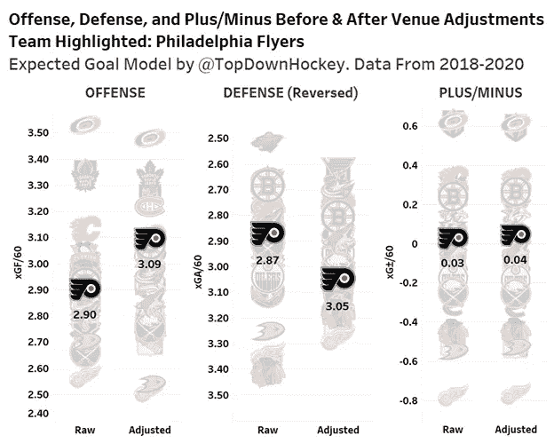

图片由 [TopDownHockey](https://twitter.com/TopDownHockey)

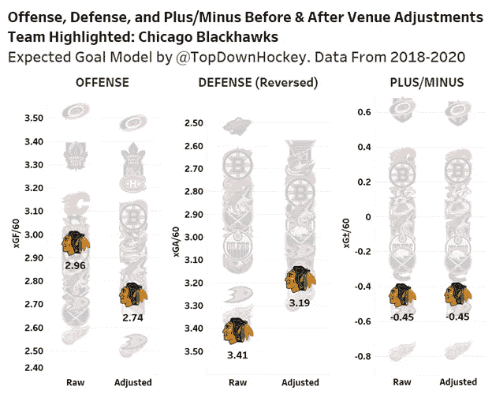

图片由[托普顿曲棍球](https://twitter.com/TopDownHockey)

正如你所看到的，一个好的团队通常仍然是一个好的团队，一个坏的团队通常仍然是一个坏的团队。但是，对于记分员有严重偏见的球队来说，他们擅长不同事情的程度会有很大的不同。

现在是时候转向守门员了。对于可视化，我选择使用超出预期的扑救目标(GSAx)来代替德尔塔芬威克扑救百分比(dfSV%)或另一个每射门/每分钟指标，因为我想提供一个守门员的综合指标受到了多大影响的想法。如果我使用一个每次射门的指标，一个无关紧要的守门员在 Xcel 能源中心或麦迪逊广场花园玩了一个小样本大小的游戏，大部分时间都在玩，可能会看到一个疯狂膨胀的“调整影响”。

在我的第一次可视化中，我任意设定了最少 75 场游戏。我这样做是因为我知道我需要为*设定某种*最小值，因为包括每个守门员将产生大约 100 个数据点——太多了，无法显示——我计算出每个球队自 2019-2020 赛季以来至少打了 150 场比赛，所以守门员需要至少打了他球队一半的比赛才能达到最低阈值。以下是达到我的最低门槛的守门员，按照场地调整对他们的 GSAx 的影响进行排名:

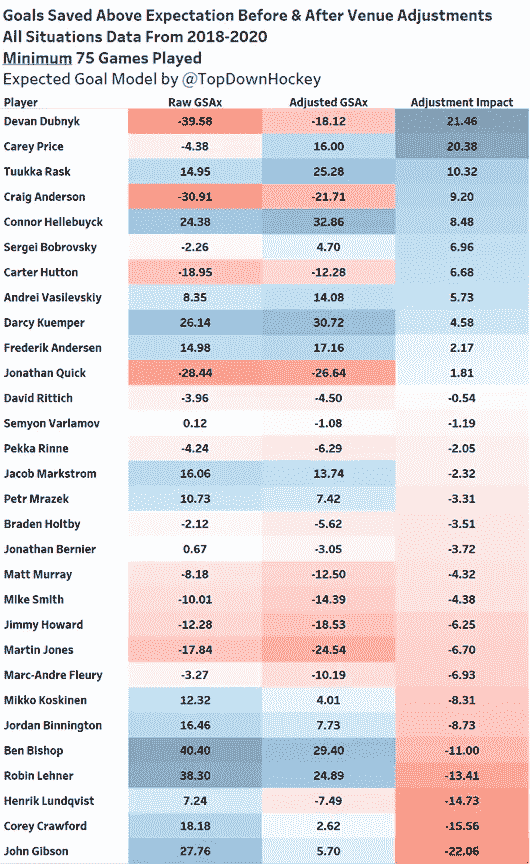

图片由 [TopDownHockey](https://twitter.com/TopDownHockey)

Dubnyk、Price 和 Gibson 都受到此次调整的巨大影响。杜布尼克从联盟中最差的守门员变成了……一个比少数人更好的非常差的守门员。凯里·普莱斯从一个低于平均水平的守门员变成了十佳守门员。约翰·吉布森从最好的国家之一发展到略高于平均水平。克劳福德、伦奎斯特、雷纳和毕晓普也受到重创。莱纳尤其有趣，因为尽管他在过去两个赛季为三支不同的球队效力，但他上场时间最多的两支球队的主场记分员历史上报告说，射门距离球网比实际距离更近，所以他因场地调整而受到重罚是有道理的。

创建了最后一个可视化后，我仔细检查了一下，发现卡特·哈特不见了。我可以发誓他是费城过去两年的首发，但结果却是他打了整整 74 场比赛。尽管他的样本很小，但他是受我的调整影响最大的球员之一，所以我讨厌我的想象没有包括他。Alex Stalock 也出现在本文第一部分的特色图片中，他也受到了我的调整的严重影响。我没有办法忘记这些人的存在，所以我为守门员创造了两个可视化效果来展示那些没有达到我最低出场次数的守门员:一个是受到场地调整最积极影响的十个守门员，一个是受到最消极影响的十个守门员。他们在这里:

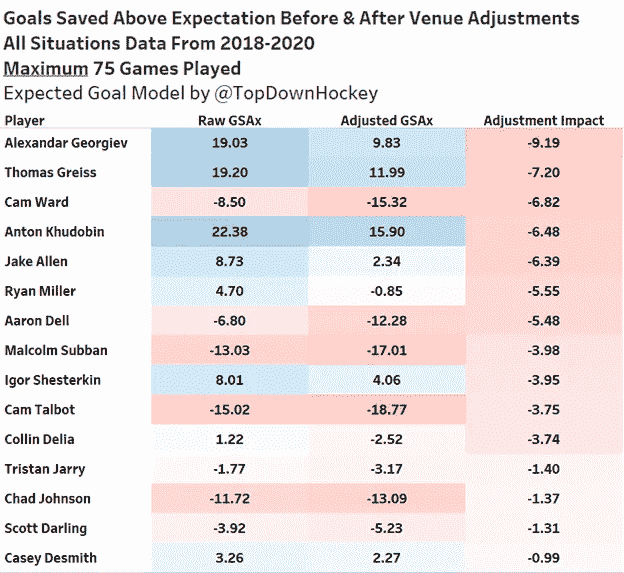

图片由 [TopDownHockey](https://twitter.com/TopDownHockey)

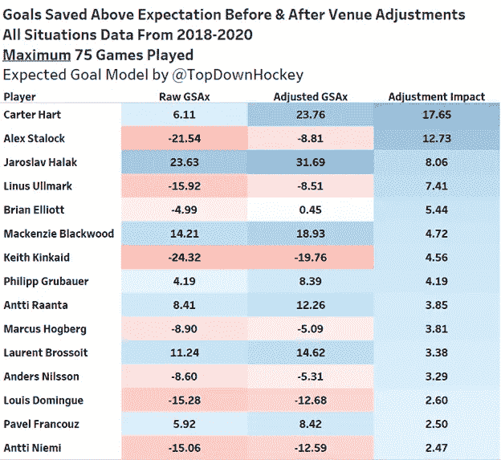

图片由[托普顿曲棍球](https://twitter.com/TopDownHockey)

这里的要点很简单:像乔尔杰夫和谢斯特金比赛的麦迪逊广场花园这样的场地导致他们的守门员被没有考虑场地的指标高估，而像卡特哈特和布莱恩埃利奥特比赛的富国银行中心这样的场地导致他们的守门员被没有考虑场地的指标低估。

既然每个人都喜欢最好和最差球员的排名，我觉得我应该按照调整后的 GSAx 列出前 15 名和后 15 名的守门员，没有最低的比赛门槛。以下是前 15 名:

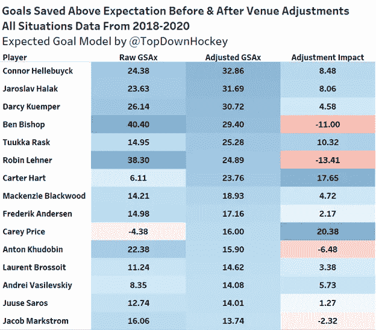

图片由 [TopDownHockey](https://twitter.com/TopDownHockey)

这是倒数 15 名:

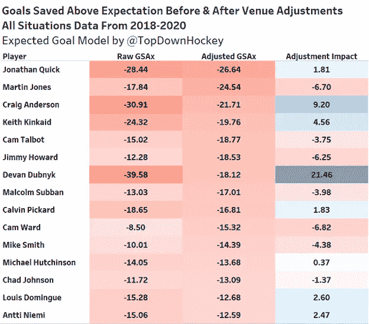

图片由 [TopDownHockey](https://twitter.com/TopDownHockey)

正如你所看到的，这一调整对像 Devan Dubnyk 和 Alex Stalock 这样的守门员产生了非常重大的影响，他们在 Xcel Energy Center 打主场比赛，记分员报告说射门距离球网比实际距离远。这也对像 Ben Bishop 和 Anton Khudobin 这样的守门员产生了重大影响，他们在美国航空中心打主场比赛，记分员报告说，射门距离球网比实际距离近。但这种调整并没有显著到颠倒世界，告诉我们明尼苏达的守门员是好的，达拉斯的守门员是坏的。Bishop 和 Khudobin 仍然在 GSAx 排名前 15 位，而 Dubnyk 仍然在排名后 15 位，Stalock 只是勉强错过了晋级。

为了更好地了解这些调整如何影响守门员相对于他们的同行，请查看以下可视化:

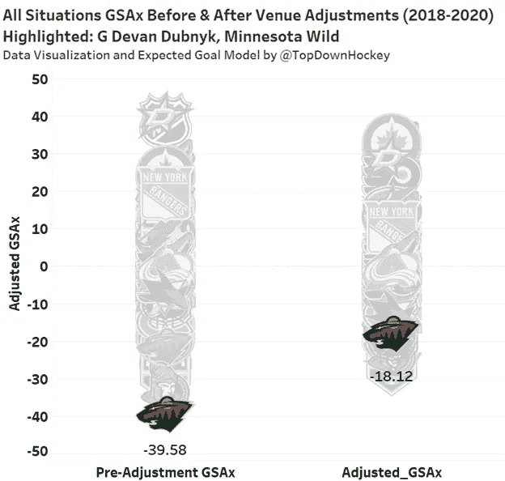

图片由 [TopDownHockey](https://twitter.com/TopDownHockey)

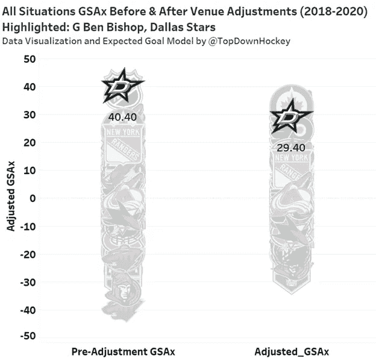

图片由[托普顿曲棍球](https://twitter.com/TopDownHockey)

最后，在我进入滑冰者之前:我特此授予德万·杜布尼克“圣何塞鲨鱼队最差守门员”的称号。

请记住，我使用加权岭回归来计算一个称为正则化调整正负(RAPM)的指标，这是一个玩家的孤立影响的点估计。我这样做是因为进化曲棍球的目标高于替换使用一个球员的孤立(通过 RAPM)对预期目标的影响作为滑冰运动员防守的主要组成部分之一，因为大多数其他组成部分与 RAPM 密切相关。

在这里，我要做的第一件事是将我的 RAPM 在场地调整前的结果与所有玩了至少 200 分钟的冰上曲棍球 RAPM 模型的结果进行比较:

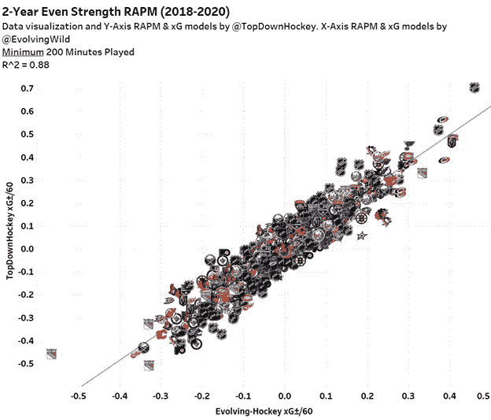

图片由 [TopDownHockey](https://twitter.com/TopDownHockey)

如您所见，两个模型的结果非常相似。这是我一直以来的目标:建立一个类似他们的模型，但是是我自己的，这样我就可以在场地调整前后比较我自己的模型。如果我只是建立了一个有场地调整的模型，并与他们的进行比较，我不会知道哪些差异是由场地调整引起的，哪些差异是由模型差异引起的。

正如我对团队所做的那样，我将从他们的防守开始我对运动员的分析。在我公布这些数字之前，我应该指出，这些数据大致遵循正态分布，原始 RAPM xGA/60 的标准偏差为 0.117，而调整后的 RAPM xGA/60 的标准偏差为 0.115。现在我已经澄清了这一点，以下是防守受到这一调整最消极和最积极影响的运动员:

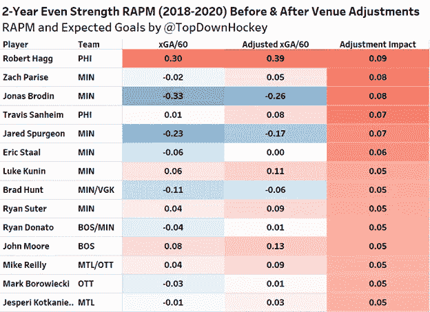

图片由 [TopDownHockey](https://twitter.com/TopDownHockey)

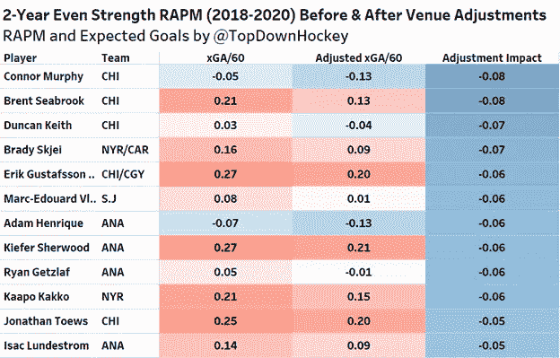

图片由[托普顿曲棍球](https://twitter.com/TopDownHockey)

(记住，负数是好的，减少玩家 RAPM xGA/60 的调整意味着调整奉承他们。)

这与我们的预期大致相符:来自明尼苏达、费城和蒙特利尔的选手在调整后防守看起来稍差，而来自阿纳海姆、芝加哥和纽约流浪者的选手看起来稍好。但是*他们受影响有多大？记住，这里的标准差大致是 0.116，所以没有球员的防守影响改变了哪怕一个标准差，只有大约十几个人看到他们的防守影响在任一方向上改变了半个标准差。虽然像阿纳海姆和明尼苏达这样的球队在进行场地调整后看起来有很大的不同，但他们的个人选手都没有看到巨大的变化。*

进攻呢？进攻的标准偏差略大于防守:原始 RAPM xGF/60 的标准偏差为 0.122，调整后的 RAPM xGF/60 的标准偏差为 0.121。以下是进攻冲击最大的球员:

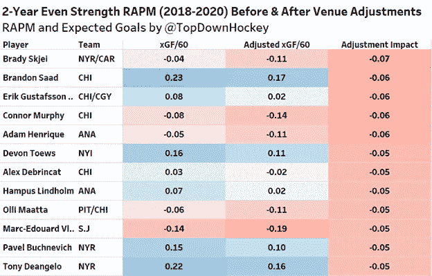

图片由 [TopDownHockey](https://twitter.com/TopDownHockey)

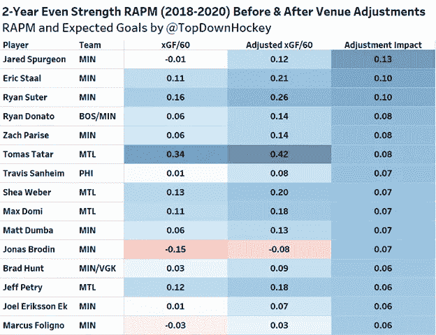

图片由 [TopDownHockey](https://twitter.com/TopDownHockey)

还记得在我实施场地调整后，明尼苏达看到他们的进攻比他们看到的防守下降有了更大程度的提高吗？嗯，这只能说明他们的选手看到了迄今为止所有队伍中进攻方面最大的进步。这也是有道理的，唯一一个看到他们的进攻或防守孤立影响改变至少一个标准差的球员是明尼苏达野生动物队的贾里德·司布真，这种改变是他进攻影响的增加。

加号/减号呢？既然记分员的偏见是双向的，那么大多数球员在场地调整前后不应该有相似的净影响吗？我们将深入探讨这一点，但在此之前，我们需要确定标准差，以便了解任何调整的幅度。原始预期目标差异率的标准偏差为 0.170，调整后预期目标差异率的标准偏差为 0.169。这比进攻或防守的规模要大得多，我们应该记住这一点。

现在我们已经确定了这一点，让我们来看看那些净影响受场地调整影响最大的玩家:

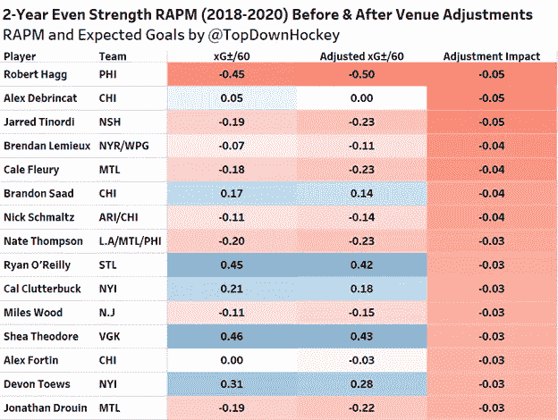

图片由 [TopDownHockey](https://twitter.com/TopDownHockey)

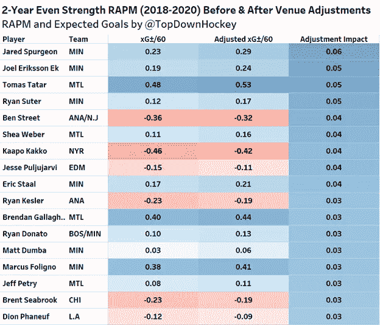

图片由 [TopDownHockey](https://twitter.com/TopDownHockey)

如你所见，大多数进攻调整基本上被防守调整抵消了；Jared Spurgeon 的调整是唯一一个甚至在净影响标准偏差的三分之一以内的调整。因此，公平地说，记分员偏见在球员对预期净胜球的净影响中没有发挥很大作用，如果我们只看这个指标，记分员偏见就不是问题。

以下是另一个形象化的例子，让您了解在场地调整前后，玩家相对于其他玩家的影响力会发生怎样的变化:

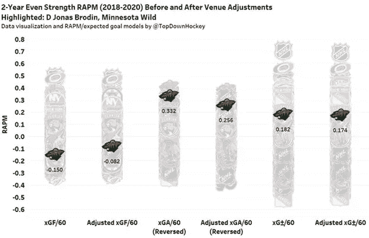

图片由[托普顿曲棍球](https://twitter.com/TopDownHockey)

上面的可视化是为了强调场地调整可以对球员的进攻影响做出重大改变，但他们的防守影响通常会在相反的方向上看到类似幅度的变化，因此他们的净影响将非常相似。在 Jonas Brodin 的例子中，你是使用原始的还是调整后的指标并不重要:他的净影响非常好。

当我们关注净影响之外的东西时，*问题就出现了。正如我上面提到的，某些指标，如发展曲棍球的目标高于替代使用预期目标的防守，但实际目标的进攻。如果我们看看上面乔纳斯·布洛丁图表中间的两列，很明显，在我们调整了记分员的偏见后，他的防守明显变弱了。同样，这对于预期的净胜球差来说不是一个大问题，因为他的进攻被记分员的偏见所拖累，其程度与他的防守被支撑的程度大致相同，但如果我们使用一个不容易出现记分员偏见的不同指标(如进球)，我们将高估他的防守影响，而不惩罚他的进攻。*

当我们分析一个运动员时，这也不是什么大问题。如上所述，只有一名选手看到他们的进攻或防守影响改变了一个标准差，只有少数其他选手接近。但是，当我们分析一个全队的运动员时，平均每个运动员的防守都比实际情况好大约半个标准差，所有这些不准确性加起来会导致我们得出一些相当不准确的结论。请记住，无论记分员的偏见导致我们高估一支球队的防守，它导致我们随后低估他们的守门员(反之亦然)。

现在我们已经建立了所有这些，我们从这里去哪里？这不是我能决定的。就我个人而言，我仍然计划使用不断发展的曲棍球目标高于替代和 RAPM 模型来评估 NHL 滑冰运动员和守门员，以及其他没有纳入场地调整的模型，因为尽管记分员有偏见，它们仍然非常有效。我还计划交叉引用我自己的模型的结果，以确定记分员偏差是否影响其他模型的输出，以及影响的程度。但重要的是，现在我已经研究了这个问题，并做了一些工作来确定它可能会导致我对某些球员的评估有多不准确，我处于一个更好的位置来细微地处理这些数字，并且比以前更少错误地看待曲棍球。希望你看了我的研究也有同感。

如果你想与我进一步讨论这些细节，或者你只是想看到一些你最喜欢的球队或球员的可视化效果，请随时在 Twitter 上联系我，地址是 [TopDownHockey](https://twitter.com/TopDownHockey) 。