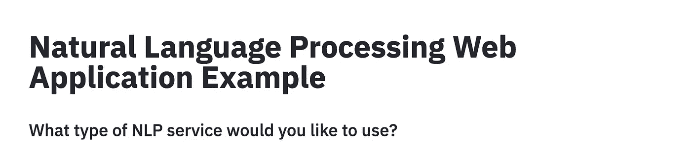
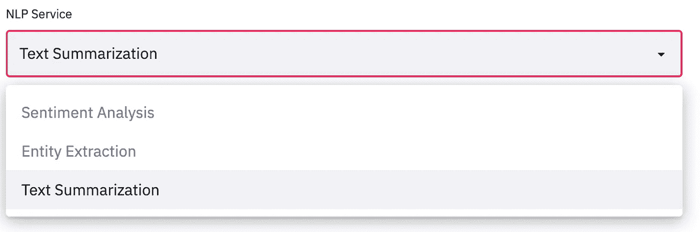
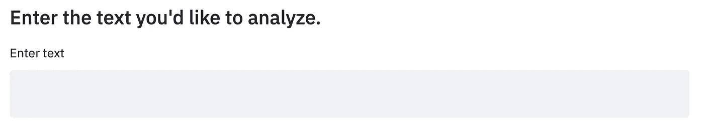
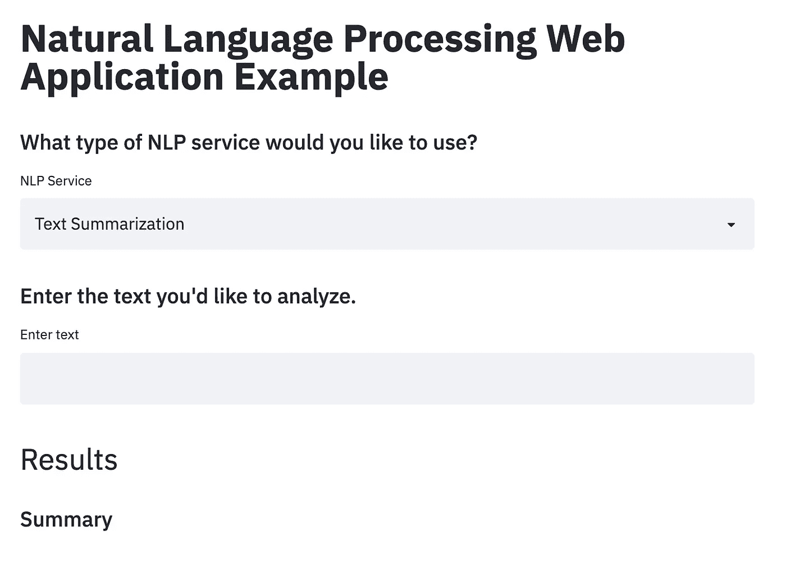
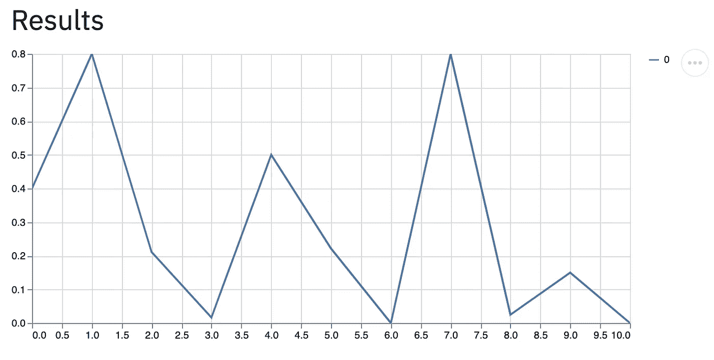
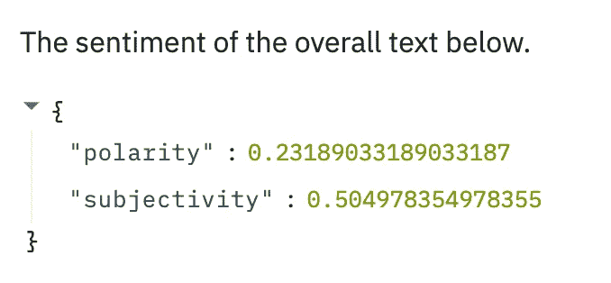
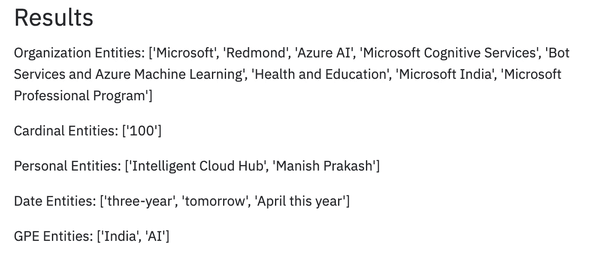
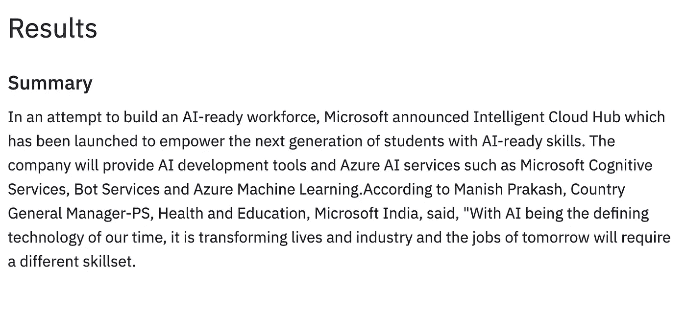

# 使用 Streamlit 为 NLP 项目构建 Web 应用程序

> 原文：<https://towardsdatascience.com/building-web-applications-with-streamlit-for-nlp-projects-cdc1cf0b38db?source=collection_archive---------25----------------------->

## [实践教程](https://towardsdatascience.com/tagged/hands-on-tutorials)

## 在解决 NLP 任务(如情感分析、NER 和文本摘要)时，Streamlit 基础知识的代码演示和解释。


图片来自 [Unsplash](https://unsplash.com/photos/hpjSkU2UYSU)

数据科学家面临的最常见的任务之一是以一种用户交互的格式呈现他们的模型/项目。如果模型不能在某种类型的应用程序中呈现，那么它对任何外部用户都没有多大用处。这介绍了 web/app 开发的广阔领域，然后引出了更多的语言和工具，如 HTML、CSS、ReactJS、Dash、Flask 等，它们可以帮助您创建一个前端界面，供用户与您的模型进行交互并从中获得结果。这个广阔的领域起初可能会令人生畏，并且与传统的数据科学技能集格格不入。

[Streamlit](https://www.streamlit.io/) 是一个简单的 Python API，它提供了一种方式来**缩短这个学习曲线**，并消除数据科学家了解这些工具的需要。一般的全栈库应该是大规模项目的首选，但是如果您的数据科学项目需要一个**快速前端**，Streamlit 不仅仅是为了这个目的。在本文中，我想演示 Streamlit 的基础知识，同时构建一个 web 应用程序，允许用户使用模型解决常见的 NLP 任务，如情感分析、命名实体识别和文本摘要。

**注意**:虽然我们可以为这些任务中的每一项构建定制模型，但我还是使用了 Python 库中预先训练好的模型，因为本文更侧重于构建一个 web 应用程序来通过 Streamlit 显示您的 ML/NLP 项目。

# 目录

1.  Web 应用程序设置
2.  数据
3.  情感分析
4.  命名实体识别(NER)
5.  文本摘要
6.  整个代码和结论

# 1.Web 应用程序设置

在构建任何模型之前，我们需要一个应用程序外观的模板。让我们先导入 streamlit(为了**安装**使用 pip3 为 Python3 安装 streamlit)。

导入 streamlit

为了解释我们的应用程序是什么，让我们添加一个标题**和一个小标题**，询问用户希望从我们的三个选项中选择哪一个 NLP 服务。 **Streamlit.title()** 、 **Streamlit.header()** 和 **Streamlit.subheader()** 是按**降序**排列的不同**标题级别**。对于纯非标题文本数据，您可以使用 **Streamlit.text()** 。

用于创建应用程序标题的代码



Streamlit 的航向代码结果

现在我们有了应用程序的主要问题，我们可以构建一个**下拉菜单**，让用户从我们的模型可以完成的三个任务中进行选择。这可以使用 **Streamlit.selectbox()** 调用来完成。

用于创建带有选项的下拉菜单的代码



NLP 服务使用的下拉菜单

从三个选项中选择的服务作为字符串存储在**选项变量**中。需要输入的下一条信息是用户想要输入的文本**文本**，以便我们的模型处理/执行所选择的任务。为此我们可以使用 **Streamlit.text_input()** 调用，它类似于 HTML 中的 textarea 标签。

用于输入文本进行分析的代码



供用户输入模型的文本区域

然后，文本输入被存储在**文本变量**中。现在我们有了包含所有需要处理的信息的选项和文本变量，我们需要创建一个区域来显示结果。

现在我们的模板设置，我们有一些东西看起来像下面的。



用 Streamlit 制作的整体模板

只用了大约 10 行 Python 代码，就创建了一个非常简单而有效的模板。现在我们有了前端，我们可以处理/向我们的模型提供这些信息，并将结果返回给用户。

# 2.数据

对于 NLP 任务，我们将使用以下一篇名为“ [**微软推出智能云中心以提升人工智能&云技术**](https://analyticsindiamag.com/microsoft-launches-intelligent-cloud-hub-to-upskill-students-in-ai-cloud-technologies/)**的学生的文本数据。文章/正文是通过[中的文章](/understand-text-summarization-and-create-your-own-summarizer-in-python-b26a9f09fc70)找到链接的。我们将使用下面的**文本块**作为所有三个 NLP 任务的**输入**文本。**

```
In an attempt to build an AI-ready workforce, Microsoft announced Intelligent Cloud Hub which has been launched to empower the next generation of students with AI-ready skills. Envisioned as a three-year collaborative program, Intelligent Cloud Hub will support around 100 institutions with AI infrastructure, course content and curriculum, developer support, development tools and give students access to cloud and AI services. As part of the program, the Redmond giant which wants to expand its reach and is planning to build a strong developer ecosystem in India with the program will set up the core AI infrastructure and IoT Hub for the selected campuses. The company will provide AI development tools and Azure AI services such as Microsoft Cognitive Services, Bot Services and Azure Machine Learning.According to Manish Prakash, Country General Manager-PS, Health and Education, Microsoft India, said, "With AI being the defining technology of our time, it is transforming lives and industry and the jobs of tomorrow will require a different skillset. This will require more collaborations and training and working with AI. That’s why it has become more critical than ever for educational institutions to integrate new cloud and AI technologies. The program is an attempt to ramp up the institutional set-up and build capabilities among the educators to educate the workforce of tomorrow." The program aims to build up the cognitive skills and in-depth understanding of developing intelligent cloud connected solutions for applications across industry. Earlier in April this year, the company announced Microsoft Professional Program In AI as a learning track open to the public. The program was developed to provide job ready skills to programmers who wanted to hone their skills in AI and data science with a series of online courses which featured hands-on labs and expert instructors as well. This program also included developer-focused AI school that provided a bunch of assets to help build AI skills.
```

# **3.情感分析**

**对于情感分析，我们将使用 [textblob](https://textblob.readthedocs.io/en/dev/quickstart.html) 库来生成输入文本的极性和主观性。(使用 pip3 **为 Python3 安装** textblob)**

**为了标记数据，我们使用 [NLTK](https://www.nltk.org/) 库将文本分割成句子，这样我们就可以将较大的文本分割成较小的部分进行可视化分析。使用 textblob 库，我们得到了每句话的**情感**来创建贯穿文本的情感的可视情节。**注**:对于图书馆，情绪用-1 到 1 表示，1 表示最积极，-1 表示最消极。**

**策划每句话的情绪**

**使用 **Streamlit.line_chart()** 中的另一个简洁的 Streamlit 特性，我们可以用线图绘制每个句子的情感，以便用户直观地分析第二部分中显示的文本数据。**

****

**文本中每句话的情感得分图**

**如果我们想要对文本有一个总体的看法，我们可以对整个数据字符串使用 TextBlob API 调用。**

**整篇文章的整体情绪**

**使用 **st.write()** 调用，我们可以显示从 textblob 返回的情感。返回的两个特征是**极性**和**主观性**。极性在[-1，1]之间，主观性在[0，1]之间，0.0 为客观，1.0 为主观。**

****

**输入文本的总体情感**

# **4.命名实体识别(NER)**

**对于 NER，我们将在[空间](https://spacy.io/api/doc)中使用另一个流行的 NLP 库。**

**Spacy 有一个很好的特性，它提供了**类型的实体**以及它所识别的实体。这方面的例子包括:人、组织、日期、金钱等等。为了提取实体及其标签，我们可以遍历找到的实体的整个列表，并将它们加入到一个字典中。**

**使用空间提取实体和实体类型**

**为了让我们的用户获得每种类型实体的直观表示，我们可以创建一个助手函数，列出每种类型的所有实体。**

**提取每种类型的实体的辅助函数**

**使用这个函数，我们可以提取每种类型的实体，并将结果写出来让用户清楚地看到。**

**将函数应用于编写每种类型的实体**

****

**文本数据中每种类型的实体**

# **5.文本摘要**

**对于文本摘要，我们将使用 [gensim](https://pypi.org/project/gensim/) 库，它有一个简单的**摘要调用**。**

**Gensim 进口**

**使用 summary 调用，我们可以轻松地生成输入文本的摘要。**注意**:总结电话需要不止一句话来配合 gensim。**

**使用 gensim 的文本摘要**

****

**输入的摘要文本**

# **6.整个代码和结论**

**完整代码**

**[](https://github.com/RamVegiraju/NLPStreamlit) [## RamVegiraju/NLPStreamlit

### 一个 Streamlit 应用程序，可以执行 NLP 任务，如情感分析、命名实体识别(NER)和文本…

github.com](https://github.com/RamVegiraju/NLPStreamlit) 

Streamlit 允许您无缝集成流行的数据科学/ML 库，以在简单而简洁的 web 应用程序/仪表板上显示您的项目。虽然更常见的全栈技能组合将更好地服务于大规模项目，但使用 Streamlit 所需的短时间和简单性大大有助于数据科学家和 ML 工程师展示他们的项目。

我希望这篇文章对那些试图在 ML/NLP 项目中使用 Streamlit 的人有用。如果你对谈论 ML &数据科学感兴趣，请随时在评论中留下任何反馈或通过 [Linkedln](https://www.linkedin.com/in/ram-vegiraju-81272b162/) 与我联系。感谢您的阅读！**