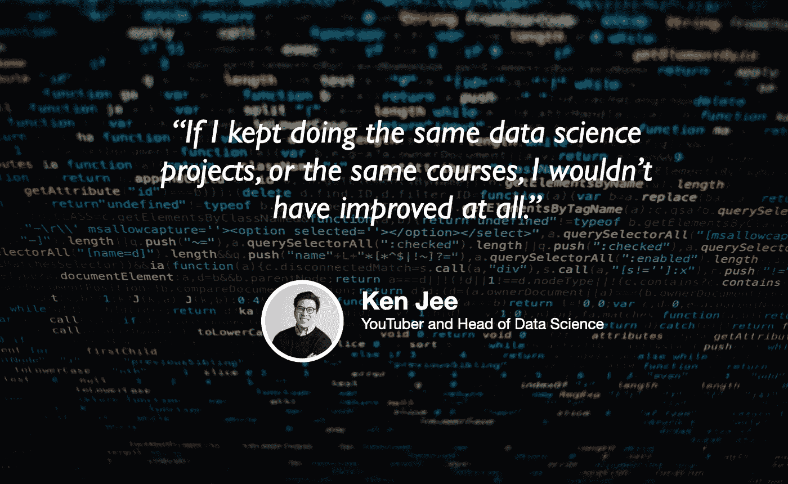

# 打造您在数据科学领域的品牌

> 原文：<https://towardsdatascience.com/building-your-brand-in-data-science-840ba5baaff9?source=collection_archive---------36----------------------->

## [苹果](https://podcasts.apple.com/ca/podcast/towards-data-science/id1470952338?mt=2) | [谷歌](https://www.google.com/podcasts?feed=aHR0cHM6Ly9hbmNob3IuZm0vcy8zNmI0ODQ0L3BvZGNhc3QvcnNz) | [SPOTIFY](https://open.spotify.com/show/63diy2DtpHzQfeNVxAPZgU) | [其他](https://anchor.fm/towardsdatascience)

## 肯·吉在 [TDS 播客](https://towardsdatascience.com/podcast/home)

背景图片由 [Markus Spiske](https://unsplash.com/@markusspiske?utm_source=unsplash&utm_medium=referral&utm_content=creditCopyText) 提供

*编者按:迈向数据科学播客的“攀登数据科学阶梯”系列由 Jeremie Harris 主持。Jeremie 帮助运营一家名为*[*sharpes minds*](http://sharpestminds.com)*的数据科学导师初创公司。可以听下面的播客:*

众所周知，数据科学是一个品牌非常重要的领域。

事实上，如果说我从帮助求职者在[sharpes minds](http://sharpestminds.com)获得工作的 A/B 测试方法中学到了什么，那就是写博客、在社交媒体上保持良好形象、做开源贡献、播客和在聚会上演讲是获得雇主注意的最佳方式之一。

品牌很重要。如果有一个人对数据科学中的品牌价值以及如何建立品牌有深刻的理解，那就是数据科学家兼 YouTuber Ken Jee。Ken 不仅拥有数据科学家和体育分析师的经验，曾在 DraftKings 和 GE 工作过，而且他还创办了许多公司——他的 YouTube 频道拥有超过 60 000 名订户，是他今天的主要项目之一。

在今天的节目中，我和 Ken 讨论了数据科学中的品牌建设策略，以及为那些希望获得第一份数据相关职位的人提供的求职技巧。以下是我最喜欢的一些外卖食品:

*   许多公司积极寻找不仅将数据科学作为一种工具，而且作为看待世界的一种方式的候选人。这是因为一名优秀的数据科学家需要能够解决数据科学问题，还需要能够发现这些问题，这意味着要学会通过数据的镜头来思考和看待世界。
*   例如，我们讨论了将求职视为数据科学项目的想法:用 NLP 对职位描述进行聚类，以确定可能值得申请的角色，并且重要的是，测量您的申请转化率。最后一个技巧是关键:转化率是你知道你需要投入多少工作才能达到每周面试的目标数量的唯一方法。
*   认识到求职中你能控制的方面和你不能控制的方面是很重要的——因为不这样做可能会导致你因为不可避免的失败而责怪自己。例如，面试官的低血糖可能会导致他们过于严厉，招聘经理在你现场的早上起床就心情不好，可能无法与你以及他前一天面试的人沟通。
*   研究你申请的公司。你应该带着对公司业务的清晰想法去参加面试，以及对他们最大的问题可能是什么的一些有根据的猜测。如果您准备好了一些关于工业或经济趋势如何影响他们的业务的问题，将会得到加分！(提示:COVID 是许多公司的一个重要因素)

你也可以点击这里在 Twitter 上关注[肯，点击这里](https://twitter.com/KenJee_DS)查看[的 YouTube 频道，了解他的工作。另外，点击这里查看](https://www.youtube.com/channel/UCiT9RITQ9PW6BhXK0y2jaeg?view_as=subscriber)[肯最新的 66 天数据计划](/why-im-starting-data-science-over-21bec8036ce9)！

你可以在推特上关注我[这里](https://twitter.com/jeremiecharris)。