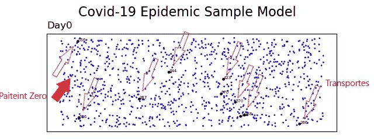
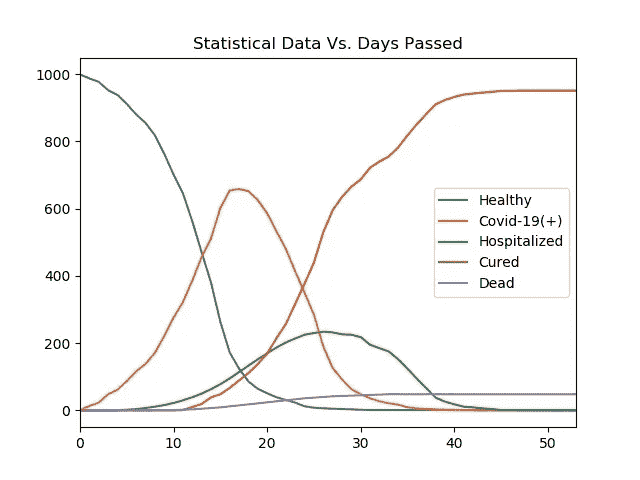
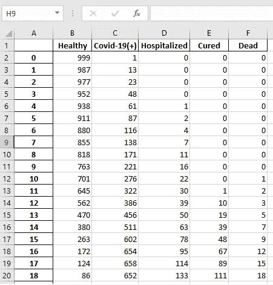
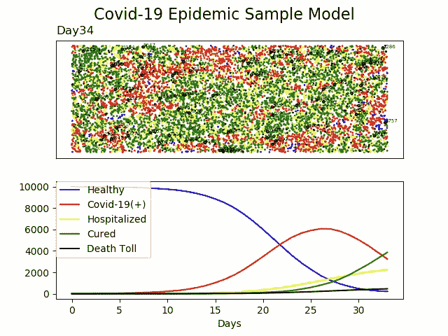

# 使用 Python 构建您自己的新冠肺炎流行病简单模型

> 原文：<https://towardsdatascience.com/building-your-own-covid-19-epidemic-simple-model-using-python-e39788fbda55?source=collection_archive---------12----------------------->

## 理解基本的动力学和概念，同时编写一个简单的计算流行病模型

如果你生活在这个世界上，很有可能你还没有听说过这种新型冠状病毒新冠肺炎和它在全世界引起的疫情。事实上，这是一个很好的机会，当你在家中自我隔离，远离公众，像许多人一样，有很多额外的时间来处理。所以，如果你熟悉编程，为什么不试试这个:在家里建立自己的流行病模型。这有助于提高你的编程能力，并帮助你理解流行病的概念和基本动态。


照片由[融合医学动画](https://unsplash.com/@fusion_medical_animation?utm_source=medium&utm_medium=referral)在 [Unsplash](https://unsplash.com?utm_source=medium&utm_medium=referral) 上拍摄

但首先请注意，这只是一篇展示如何使用 Python 为新冠肺炎疫情准备一个基本模型的文章。另一方面，这意味着:**它不是一个你可以用来预测未来的模型。这是**而不是**你的 DIY 模型，它让你能够简单地忽略官方机构推荐你做的事情。它也不是在社交媒体上向其他人证明我们注定要失败的可视化工具！如果你同意这些免责声明，现在让我们开始编码。**



我们在此假设的主要概念是，模拟一个样本社会中有限数量的个体每天相互作用，以及每次相互作用带来的污染机会。为了简单起见，我随机生成了这个组，邻近度代表每个人与其最近的 ***邻居*** 的互动量。注意，一个人的邻居可能是他/她的家人、同事、同学或他/她每天接触的任何人。我假设这种相互作用对于样本中的大多数人来说是相同的，但是为了使事情更有趣，让我们假设一部分群体，我取了 10%，我们称之为 ***运输者*** ，在模型中每天随机移动；这意味着他们的邻居每天都在变化。我添加了这些组来代表那些店主、出租车司机、警察等等。他们每天都和新的人打交道。我用圆圈标记了运输者和他们的号码来跟踪他们。
最后，为了完成我们的零日初始化，我们更需要的是零号患者！我把它涂成红色。

初始化后，模拟每天都是这样进行的:

*   运输者随机移动。
*   人们与他们的邻居互动。
*   在互动过程中，感染会随机传播，并有预先确定的机会从一个病人传染给一个健康人。
*   一定比例的患者，新冠肺炎(+)，随机住院，假设他们的症状变得最糟糕。
*   随机选择的住院病人中有一部分死亡。
*   那些已经忍受了疾病期，比如说 14 天，症状轻微的患者将被治愈，并对疾病产生免疫力。
*   还有明天。。。我们再次重复以上所有内容。这种情况一直持续到不可能再有新的感染为止。

对所有编程语言来说，编写上面提到的算法是一件容易的事情，但是对于可视化来说，Python 使用`matplotlib`提供了很多。

让我们看看，如果我们用 1000 个人的随机数据集运行这个模拟，并且在每次交互中感染机会为 25%，会发生什么:

让我们看看模拟过程中的统计数据是什么样的:



由于模拟需要一些时间，我让 python 在日志中报告我的社会在模拟期间到底发生了什么:

```
-------------------------------
Day: 0
- - - - - - - - - - - - - - - - 
Healthy         999
Covid-19(+)       1
Hospitalized      0
Cured             0
Dead              0
Name: 0, dtype: int64
-------------------------------
Day: 1
- - - - - - - - - - - - - - - - 
Healthy         987.0
Covid-19(+)      13.0
Hospitalized      0.0
Cured             0.0
Dead              0.0
Name: 1, dtype: float64
-------------------------------
Day: 2
- - - - - - - - - - - - - - - - 
Healthy         977.0
Covid-19(+)      23.0
Hospitalized      0.0
Cured             0.0
Dead              0.0
Name: 2, dtype: float64
-------------------------------
.
. . 
. . . 
. . . . 
-------------------------------
Day: 53
- - - - - - - - - - - - - - - - 
Healthy           1.0
Covid-19(+)       0.0
Hospitalized      0.0
Cured           951.0
Dead             48.0
Name: 53, dtype: float64
```

我让 python 自动完成所有的工作，制作所有的图表、列表和视频，并以我选择的格式保存。但是请注意，如果您为数量选择了较大的数字，并且以错误的方式更改了一些假设，则可能需要一些模拟运行时间。

例如，模拟 10，000 个人花费了我大约 24 小时，直到第 34 天，您可能会看到下面的模拟结果:



> 既然你已经开发了自己的样本模型，你可能会发现搜索由专业流行病学家开发的更科学的模型很有趣，或者你可能会在这里看到一个来自华盛顿邮报的。

下面，你可以找到我的 python 代码，在上面的模型中，你可以很容易地改变参数，看看在不同的假设下会发生什么。

```
# -*- coding: utf-8 -*-
"""
Created on Sat Feb 29 21:57:53 2020[@author](http://twitter.com/author): Sadegh Maghsoudi
"""
# Functions --------------------------------------------------
def point(xlimit,ylimit):
    import random
    x = random.uniform(0,xlimit)
    y = random.uniform(0,ylimit)
    return x,ydef Generate(GrupSize,xlimit,ylimit):
    import pandas as pd
    import math
    df = pd.DataFrame(columns='X,Y,Covid-19,Day'.split(','))

    for i in range(GrupSize):
        df.loc[i,'X'], df.loc[i,'Y'] = point(xlimit,ylimit)
        df.loc[i,'Covid-19'] = False

    samplesize = math.floor(GrupSize/100)
    MoversList = df.sample(n = samplesize).index.values.tolist()

    StatofDay = pd.DataFrame(columns='Healthy,Covid-19(+),Hospitalized,Cured,Dead'.split(','))
    return df , StatofDay, MoversList

def plt1color(df):
    cols=[]
    for l in df.index:
        if df.loc[l,'Covid-19']==True: #Infected
            cols.append('red')
        elif df.loc[l,'Covid-19']==666: #Dead
            cols.append('black')
        elif df.loc[l,'Covid-19']==115: #Hospitalized
            cols.append('yellow')
        elif df.loc[l,'Covid-19']==7: #Cured
            cols.append('green')
        else:
            cols.append('blue') #Healthy
    return colsdef plt2color(Stat):
    cols=[]
    for i in Stat.columns:
        if i=='Covid-19(+)': #Infected
            cols.append('red')
        elif i=='Dead': #Dead
            cols.append('black')
        elif i=='Hospitalized': #Hospitalized
            cols.append('yellow')
        elif i=='Cured': #Cured
            cols.append('green')
        else:
            cols.append('blue') #Healthy
    return colsdef Plot():
    import matplotlib.pyplot as plt
    global df, fig, Stat, Day, Moverslist
    cols=plt1color(df)
    ld = ['Healthy','Covid-19(+)','Hospitalized','Cured','Death Toll']
    axs[0].cla()
    axs[0].scatter(df['X'],df['Y'],s=1,c=cols)
    for i in MoversList:
        axs[0].scatter(df.loc[i,'X'],df.loc[i,'Y'],s=6,facecolors='none', edgecolors='black')
        axs[0].text(df.loc[i,'X']+0.02, df.loc[i,'Y']+0.02, str(i), fontsize=5)
    cols=plt2color(Stat)
    sDay = str(Day)
    title = 'Day' + sDay
    axs[0].set_title(title,loc='left')
    axs[0].set_yticklabels([])
    axs[0].set_xticklabels([])
    axs[0].tick_params(
#    axis='both',       # changes apply to the x-axis
    which='both',      # both major and minor ticks are affected
    bottom=False,      # ticks along the bottom edge are off
    top=False,         # ticks along the top edge are off
    right=False,      # ticks along the right edge are off
    left=False,         # ticks along the left edge are off
    labelbottom=False) # labels along the bottom edge are off
    axs[1].cla()
    axs[1].plot(Stat.Healthy,label=ld[0],color=cols[0])
    axs[1].plot(Stat['Covid-19(+)'],label=ld[1],color=cols[1])
    axs[1].plot(Stat.Hospitalized,label=ld[2],color=cols[2])
    axs[1].plot(Stat.Cured,label=ld[3],color=cols[3])
    axs[1].plot(Stat.Dead,label=ld[4],color=cols[4])
#    axs[1].set_prop_cycle(color=cols)
    axs[1].legend(bbox_to_anchor=(0, 1), loc='upper left', borderaxespad=0.)
    plt.xlabel('Days')
    plt.show()
    if Day<10 : sDay = '0' + sDay
    title = 'Day' + sDay + '.png'
    plt.savefig(title)returndef Png_to_gif():
    from PIL import Image
    import glob

    # Create frames
    frames = []
    imgs = glob.glob("*.png")
    for i in imgs:
        new_frame = Image.open(i)
        frames.append(new_frame)

    # Save into GIF
    frames[0].save('png_to_gif.gif', format='GIF',
          append_images=frames[1:],
          save_all=True,
          duration=500, loop=0)def infect(Person):
    import random
    global df,Day
    if random.random()>0.25 and Day>3 : return
    if df.loc[Person,'Covid-19']==False:
        df.loc[Person,'Covid-19'], df.loc[Person,'Day'] = True, Day

def Move(xlimit,ylimit):
    """ 
    Move Movers Randomly
    """
    import random
    global df, MoversList
    for i in MoversList:
        if (df.loc[i,'Covid-19']==115) or (df.loc[i,'Covid-19']==666) : MoversList.remove(i)
        df.loc[i,'X'], df.loc[i,'Y'] = (df.loc[i,'X']+random.uniform(1,xlimit/3))%xlimit, (df.loc[i,'Y']+random.uniform(1,ylimit/3))%ylimitdef check(i,j):
    import math
    global df, YesterdayPatients, Distlimit
    Dist = math.sqrt((df.loc[i,'X']-df.loc[j,'X'])**2+(df.loc[i,'Y']-df.loc[j,'Y'])**2)
    flag = ((YesterdayPatients[i]==True) ^ (YesterdayPatients[j]==True)) and Dist<Distlimit
    return flag

def interact():
    global Day, df
    for i in range(len(df)):
        for j in range(i):
            if check(i,j):
                if (df.loc[i,'Covid-19']==False) :
                    infect(i)
                else:
                    infect(j)def kill():
    import math
    global df

    samplesize = math.floor(len(df[df['Covid-19']==True])*.005+len(df[df['Covid-19']==115])*.005)
    if samplesize>len(df[df['Covid-19']==True]): return
    df.loc[df[df['Covid-19']==True].sample(n = samplesize).index.values.tolist(),'Covid-19']=666
    returndef hospitilize():
    import math
    global df
    samplesize = math.floor(len(df[df['Covid-19']==True])*0.03)
    if samplesize>len(df[df['Covid-19']==True]): return
    df.loc[df[df['Covid-19']==True].sample(n = samplesize).index.values.tolist(),'Covid-19']=115
    returndef cure():
    global df, Day
    df.loc[(df['Day']<Day-10) & (df['Covid-19']==True) ,'Covid-19'] = 7
    df.loc[(df['Day']<Day-21) & (df['Covid-19']==115) ,'Covid-19'] = 7
    return

def Tomorrow(): # To Be checked and Resolved!!!
    global df, Day
    Day +=1
    kill()
    hospitilize()
    cure()
    Move(xlimit,ylimit)
    interact()def Count(Day):
    global df, Stat

    List = list(df['Covid-19'])

    Stat.loc[Day,'Healthy'] = List.count(False)
    Stat.loc[Day,'Covid-19(+)'] = List.count(True)    
    Stat.loc[Day,'Hospitalized'] = List.count(115)    
    Stat.loc[Day,'Cured'] = List.count(7)
    Stat.loc[Day,'Dead'] = List.count(666)

    return

def write_log(*args):
    global log_file
    line = ' '.join([str(a) for a in args])
    log_file.write(line+'\n')
    print(line)

# Main -------------------------------------------------------------------
import matplotlib.pyplot as plt
import random
log_file = open("Log.txt","w+")# -------------------------------------------
#   I N P U T   V A R I A B L E S   H E R E  |
# -------------------------------------------
#                                            |
n = 1000    #                                |
xlimit,ylimit=30,30   #                      |
Distlimit = 1.5 #                            |
#                                            |
# -------------------------------------------write_log(31*'-')
write_log("Here's the Input Data:")
write_log(8*'- - ') 
write_log('Numper of Sample:',n)
write_log('X & Y limites: ',xlimit,', ',ylimit)
write_log('Distance required for Contamination:', Distlimit)# Day = 0,  Generating Model...
Day = 0df, Stat, MoversList = Generate(n,xlimit,ylimit)
infect(random.randrange(n))
fig, axs = plt.subplots(2)
fig.suptitle('Covid-19 Epidemic Sample Model', fontsize=16)
Plot()
Count(Day)
write_log(31*'-')
write_log('Day:',Day)
write_log(8*'- - ')    
write_log(Stat.loc[Day])# Day=1
YesterdayPatients = list(df['Covid-19'])
Tomorrow()
Plot()
Count(Day)
write_log(31*'-')
write_log('Day:',Day)
write_log(8*'- - ')    
write_log(Stat.loc[Day])

#Main Loop  .  .  .countsames = 0
while Stat.loc[Day, 'Healthy']>0 and Day<100:
    log_file = open("Log.txt","a+")
    if (list(Stat.loc[Day])==list(Stat.loc[Day-1])): 
        countsames +=1
        if countsames>2 : break
    else :
        countsames = 0

    YesterdayPatients = list(df['Covid-19'])
    Tomorrow()
    Plot()
    Count(Day)
    write_log(31*'-')
    write_log('Day:',Day)
    write_log(8*'- - ')    
    write_log(Stat.loc[Day])
    log_file.close()Png_to_gif()
Stat.to_excel('Stat.xlsx')
Stat.plot(title='Statistical Data Vs. Days Passed')
plt.savefig('Stat')
```

***编者注:*** [*迈向数据科学*](http://towardsdatascience.com/) *是一份以数据科学和机器学习研究为主的中型刊物。我们不是健康专家或流行病学家，本文的观点不应被解释为专业建议。想了解更多关于疫情冠状病毒的信息，可以点击* [*这里*](https://www.who.int/emergencies/diseases/novel-coronavirus-2019/situation-reports) *。*