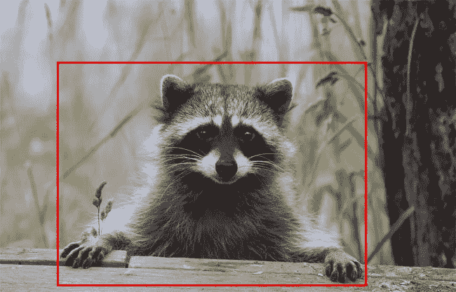
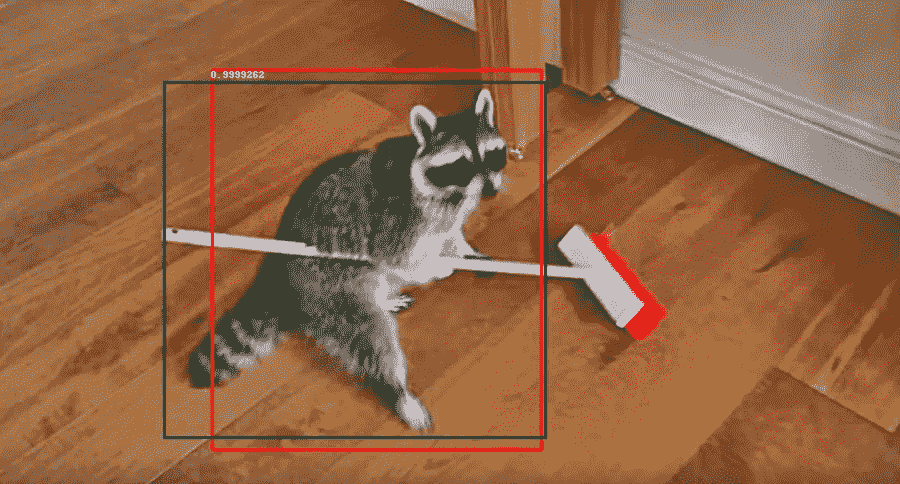
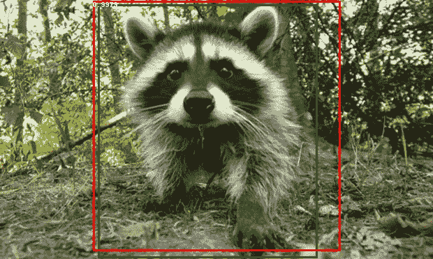

# 构建自己的物体探测器——py torch vs tensor flow 以及如何开始？

> 原文：<https://towardsdatascience.com/building-your-own-object-detector-pytorch-vs-tensorflow-and-how-to-even-get-started-1d314691d4ae?source=collection_archive---------2----------------------->

## -详细的“操作”方法-


由 [Unsplash](https://unsplash.com/s/photos/stars?utm_source=unsplash&utm_medium=referral&utm_content=creditCopyText) 上 [Greg Rakozy](https://unsplash.com/@grakozy?utm_source=unsplash&utm_medium=referral&utm_content=creditCopyText) 拍摄的照片

在经历了实现用于物体检测的人工智能系统的一些困难和头痛之后，我想分享一些我所获得的关于如何开始的知识。第一步总是最难的，这就是为什么这种非常实用的方法旨在让人们轻松进入 TensorFlow 和 PyTorch 的对象检测框架的世界。

由于我已经是一名经验丰富的数据科学家，并且在过去几年中开发了一些高效的机器学习软件组件，我认为上网应该是一件相当容易的工作，找到一个预先训练的 CNN，并在一个看不见的数据集上进一步训练它，使它能够检测一些以前未知的物体。直到大约一年前，我大部分时间都在做基于树的模型，大量的 scikit-learn 以及 xgboost，当然还有大量的熊猫。和许多人工智能任务一样，我的第一个方法是经典的 a:“不要这么快！”有一些你必须知道的垫脚石，但是似乎没有多少文章和博客提到。在这个主题上花了很多时间并阅读了大量 TensorFlow 源代码后，我知道了如下问题的答案:

> "为什么我从官方 GitHub repos 得到的示例代码不能工作？"

所以我想为什么不与他人分享我使用这些工具的经验，并描述我是如何着手解决我所面临的问题的。

简单地说，我的目标是开发自己的对象检测器——一种可以分类和检测图像中对象的神经网络，不仅仅是现成的对象检测算法，而是特别擅长从我自己的数据集中检测图像——这意味着我必须进行迁移学习。

首先，我上网更新了一些关于这些算法在数学上如何工作的知识(我真的可以推荐吴恩达在 coursera 上关于[卷积神经网络](https://www.coursera.org/learn/convolutional-neural-networks?specialization=deep-learning#syllabus)的 deeplearning.ai 课程。它有整整一周的时间专门用于对象检测，让您了解关键概念并很好地描述每件事情背后的数学。因此，有了这个理论，我看了一些我可以用于我的任务的开源数据集，偶然发现了 experiencor 在 https://github.com/experiencor/raccoon_datasetGitHub[上的以下浣熊数据集，然后我决定使用它。它已经将注释和图像整齐地存储在各自的文件夹中，并且只需要检测一个类(浣熊),因此这是一个很好的起点。](https://github.com/experiencor/raccoon_dataset)

完成后，我看了看两个广为人知的深度学习框架，它们让你使用预训练的网络进行迁移学习(进一步训练这些网络以使它们适应你的特定数据集)， [TensorFlow 的对象检测 API](https://github.com/tensorflow/models/tree/master/research/object_detection) 以及 PyTorch 的 [torchvision](https://pytorch.org/docs/stable/torchvision/models.html#object-detection-instance-segmentation-and-person-keypoint-detection) 包。有一件事我可以马上说:我在 PyTorch 中只用了半天就完成了我的工作，而在 TensorFlow 中我却花了几天时间才完成了我想要的一切！事实上，tf object detection API 是基于 TensorFlow 1.x 构建的，而我们现在已经有了 2.x 版本，这给我带来了很多兼容性问题，如果不仔细查看源代码，几乎不可能完成任何工作，因为他们的报告中的一些示例是基于 2.x 的，而核心培训代码仍然基于 1.x。

我在 [Google Colab](http://colab.research.google.com) 上编写代码，因为他们为你提供了整洁的笔记本体验，让你可以访问他们云上的免费 CPU 和 GPU，以及以 google drive 形式提供的免费存储，可以很容易地安装到你的 Colab 空间。

# 获取数据

获取数据相当容易，因为我只需导航到一个不同的文件夹(在我安装的 google drive 存储中)并运行

```
! git clone [https://github.com/experiencor/raccoon_dataset.git](https://github.com/experiencor/raccoon_dataset.git)
```

检查数据很容易，就像这样:

```
from PIL import Imageimage = Image.open("<your path>/raccoon_dataset/images/raccoon-1.jpg")
image
```


来自 https://github.com/experiencor/raccoon_dataset[的 raccoon-1.jpg](https://github.com/experiencor/raccoon_dataset)

当谈到这个图像的标签时，我们必须查看 annotations 文件夹。在对象检测的情况下，每个对象的一个类(在我们的例子中只是浣熊的一个类)和每个对象的 4 个代表边界框的坐标组成了标签。要快速浏览，只需将浣熊-1.xml 文件下载到您的笔记本电脑上，用编辑器打开它(我用的是 Atom)。然后，您会看到以下内容:

```
<annotation verified="yes">
 <folder>images</folder>
 <filename>raccoon-1.jpg</filename>
 <path>/Users/datitran/Desktop/raccoon/images/raccoon-1.jpg</path>
 <source>
  <database>Unknown</database>
 </source>
 <size>
  <width>650</width>
  <height>417</height>
  <depth>3</depth>
 </size>
 <segmented>0</segmented>
 <object>
  <name>raccoon</name>
  <pose>Unspecified</pose>
  <truncated>0</truncated>
  <difficult>0</difficult>
  <bndbox>
   <xmin>81</xmin>
   <ymin>88</ymin>
   <xmax>522</xmax>
   <ymax>408</ymax>
  </bndbox>
 </object>
</annotation>
```

它告诉你这个注释文件对应于 raccoon-1.jpg 文件，对象的类是“浣熊”,边界框的边由 xmin，xmax，ymin 和 ymax 表示。一个非常自然的反应是首先通过简单地在图像中画出方框来检查这是否正确。

很容易做到:

```
from PIL import ImageDrawxmin = 81
ymin = 88
xmax = 522
ymax = 408draw = ImageDraw.Draw(image)
draw.rectangle([(xmin, ymin), (xmax, ymax)], outline =”red”)
image
```



带有来自浣熊-1.xml 的绑定框的 raccoon-1.jpg

因此，我们不必仔细检查文件夹中的每个文件并收集每个图像上的正确标签，因为已经有一个包含所有这些信息的 csv 文件。快速浏览一下可以这样做:

```
import pandas as pdlabels = pd.read_csv("<your path>/raccoon_dataset/data/raccoon_labels.csv")labels.head()
```

这是 TensorFlow 和 PyTorch 库的起点，也是两者开始不同的地方。

> A 部分:张量流

# 装置

从 TensorFlow 对象检测开始，基本上应该是这样工作的:你克隆他们的 repo 并根据他们的[安装指南](https://github.com/tensorflow/models/blob/master/research/object_detection/g3doc/installation.md)安装 API。在实践中，你必须用 Google Colab 做的事情在某些方面更容易，在某些方面更难:

1.  安装 TensorFlow 和所有其他提到的库(在 Google Colab 中，选择一个 tf 版本的神奇命令就是你所需要的，其他的都是预装的)

```
%tensorflow_version 1.x
```

2.COCO API 安装—已经预装，可以通过

```
import pycocotools
```

3.克隆他们的回购协议

```
! git clone [https://github.com/tensorflow/models.git](https://github.com/tensorflow/models.git)
```

4.导航到模型/研究文件夹

```
import os 
os.chdir("<your path>/models/research")
```

5.安装 protobufs

```
! protoc object_detection/protos/*.proto --python_out=.
```

6.现在，要测试您的安装，只需运行:

```
%%bashexport PYTHONPATH=$PYTHONPATH:`pwd`:`pwd`/slim
python object_detection/builders/model_builder_test.py
```

7.超级重要:您在 Colab 中执行的每个 bash 命令都像是启动一个新的终端会话，因此非常重要的是，每次您使用 CLI 进行 tf 的对象检测时，您都必须包括

```
export “PYTHONPATH=$PYTHONPATH:`pwd`:`pwd`/slim
```

在你的牢房顶上！

因为与 API 的每一次交互都是以命令行方式进行的(为了训练一个您称之为类似的模型):

```
%% bash 
export “PYTHONPATH=$PYTHONPATH:`pwd`:`pwd`/slimpython”python object_detection/model_main.py \
    --pipeline_config_path=${PIPELINE_CONFIG_PATH} \
    --model_dir=${MODEL_DIR} \
    --num_train_steps=${NUM_TRAIN_STEPS} \
    --sample_1_of_n_eval_examples=$SAMPLE_1_OF_N_EVAL_EXAMPLES \
    --alsologtostderr
```

我想深入了解这个 CLI(另外，笔记本环境并不是真正为命令行执行而构建的),我在 Colab 上的安装中添加了一个关键的东西:

8.启用 python 内核来查找 model_main.py 文件中的所有导入(在上面的 CLI 中调用)。

```
import syssys.path.append("<your path>/models/research/object_detection")sys.path.append("<your path>/models/research/slim/")
```

9.确保您安装了 numpy==1.17，否则评估脚本将无法工作。

瞧，准备好开始了！

# 选择一个预先训练好的网络

安装了必要的软件并下载了训练数据后，我们终于可以考虑人工智能了。我们可以使用哪种卷积神经网络架构？它是在哪个数据集上训练的？在 TensorFlow 的对象检测 API 中，我们可以从他们的[检测模型 zoo](https://github.com/tensorflow/models/blob/d4eedbb9a7ceccfbcf08ec843abcc38d7f7dc4d7/research/object_detection/g3doc/detection_model_zoo.md) (顺便说一下，喜欢这个名称:)中的各种模型中进行选择，这些模型是在不同的行业和研究标准图像数据集上训练的。也许最著名的是所谓的 COCO 数据集(上下文中的公共对象),它有许多不同的图像，带有标签类、边界框，甚至可以作为注释使用的遮罩。该数据集被用于许多比赛，并被引用为“旨在推动物体检测技术的发展”。很酷的东西，也是我一直在寻找的。我选了一个叫“更快的 R-CNN”的网络。我选择它是因为它在 TensorFlow 模型动物园和火炬视觉套装中都有，这样我可以更容易地比较这两者。更快的 R-CNN 是一个区域提议网络(因此称为 R ),它使用“锚盒”技术来定位物体并预测它们。简而言之，它是两个网络的组合，一个检测图像中很可能包含对象的区域，另一个预测边界框以及这些区域中的类别概率。网上有很多更详细的解释。我个人比较喜欢[这个](https://medium.com/@smallfishbigsea/faster-r-cnn-explained-864d4fb7e3f8)[高昊](https://medium.com/u/8b44cbadef3a?source=post_page-----1d314691d4ae--------------------------------)的。

# 配置模型

## 1.下载模型文件

一旦您选择了模型，您首先必须下载它，这意味着您下载网络架构和预先训练的权重。我选择的是“更快 _ rcnn _ inception _ v2 _ coco _ 2018 _ 01 _ 28”的模式。这是通过从 models/research 文件夹运行以下命令来完成的:

```
%%bashwget [http://download.tensorflow.org/models/object_detection/faster_rcnn_inception_v2_coco_2018_01_28.tar.gz](http://download.tensorflow.org/models/object_detection/faster_rcnn_inception_v2_coco_2018_01_28.tar.gz)tar -xvf faster_rcnn_inception_v2_coco_2018_01_28.tar.gz
```

现在您可以找到一个包含所有模型文件的文件夹:

```
import os 
os.listdir("faster_rcnn_inception_v2_coco_2018_01_28")
```

看起来像这样:

```
['model.ckpt.index',  'checkpoint',  'pipeline.config',  'model.ckpt.data-00000-of-00001',  'model.ckpt.meta',  'saved_model',  'frozen_inference_graph.pb']
```

在那里，您可以找到检查点信息，让您使用预训练的权重重建模型，从而为迁移学习做好准备。您还有一个 saved_model 文件夹，其中包含下载模型的导出版本以及一个 freezed _ inference 图——正如其名称所建议的，您可以使用一个 tf 图进行推理。最后但同样重要的是，您可以找到一个 pipeline.config 文件的示例。在此文件中，您可以准确指定您希望如何训练您的网络，使用什么样的训练数据，您有多少个对象类，等等。在这里，我们可以根据我们的具体需求定制预训练模型。

## 2.准备数据

在 TensorFlow 的对象检测中，[估算器 API](https://www.tensorflow.org/versions/r1.15/api_docs/python/tf/estimator/Estimator) 用于处理训练和评估(以及一些类似检查点等的东西。)过程。这个 API 需要您首先创建的 tf.record 格式的数据。

幸运的是，浣熊数据集的创建者已经完成了这项工作。否则我们也可以自己改造它:

```
!python generate_tfrecord.py --csv_input=data/train_labels.csv  --output_path=data/train.record
```

我们有一个 train.record 和一个 test.record 数据集，它们将用于在训练期间向 tf.estimator 对象成批提供数据。

## 3.调整 pipeline.config 文件

在 pipeline.config 文件中，我们必须调整 5 个区域。微调检查点、训练配置、有效配置、类数量和第二阶段后处理。其他一切都可以保持原样。fine_tune_checkpoint 是下载的检查点文件中包含的预训练权重的路径。我们在这里所做的就是设置它等于

```
fine_tune_checkpoint: "<your path >/faster_rcnn_inception_v2_coco_2018_01_28/model.ckpt"
```

如果您发现没有名为 model.ckpt 的文件，请不要担心，相信我，它确实是这样工作的；)可以重建模型并将权重插入到正确的层中。num_classes 字段被设置为 1(仅 1 个类:浣熊)。

在 train_config 部分，我们可以调整所有关于训练阶段的东西。我保留了所有的默认设置，只修改了必要的部分，比如 train_input_reader，在这里，您必须设置 train.record 训练数据集的输入路径，以及包含标签信息的 pbtxt 文件的 label_map_path。我首先将 label_map 文件更改为

```
item {
  id: 1
  name: 'raccoon'
}
```

然后我将 train_input_reader 设置为

```
train_input_reader: {
  tf_record_input_reader {
   input_path: "<your path>/raccoon_dataset/data/train.record"
  }
  label_map_path: "<your path>/training/raccoon_label_map.pbtxt"
}
```

接下来，我更改了有效配置部分。这个名字再次解释了这一切。我只是将 eval_input_reader 设置为我的 label_map 文件，并将 test.record 测试数据设置为

```
eval_input_reader: {
  tf_record_input_reader {
   input_path: "<your path>/raccoon_dataset/data/test.record"
  }
label_map_path: "<your path>/training/raccoon_label_map.pbtxt"
  shuffle: false
  num_readers: 1
}
```

最后，我调整了第二阶段后处理。在这里，您可以定义模型如何处理输出。通常，检测模型输出类别概率和边界框坐标的多个可能组合(例如，每个锚一组)，其不等于图像中对象的数量。作为用户，我们必须使用非最大值抑制等技术来获得最佳匹配的边界框(上面提到的 Andrew Ngs Coursera 课程对此做了很好的介绍！)到图像中的每个对象。我在这里挑选了以下内容:

```
second_stage_post_processing {
      batch_non_max_suppression {
        score_threshold: 0.5
        iou_threshold: 0.6
        max_detections_per_class: 5
        max_total_detections: 5
      }
      score_converter: SOFTMAX
    }
```

这意味着我将只允许每个图像 5 个检测(理想情况下，如果图像中存在不同的浣熊，5 个不同的检测)。IoU(并集上的交集)阈值以及分数阈值被定制为每个对象只有一个边界框。

# 训练模型

一旦 pipeline.config 文件准备就绪，我们就可以开始培训了。TensorFlow 建议使用一个[命令行作业](https://github.com/tensorflow/models/blob/master/research/object_detection/g3doc/running_locally.md)调用带有各种输入参数的 model_main.py 文件来完成这项工作。然而，当我想深入了解一下时，我跳进了这个文件并自己运行了这些命令。对于模型的训练和评估，对象检测 API 利用 [tf 的估计器 API](https://www.tensorflow.org/versions/r1.15/api_docs/python/tf/estimator/Estimator) 。它很好地照顾了我们的训练和评估，并且集成了自动检查点和模型导出。它还允许从给定的检查点进行迁移学习(这正是我们正在做的)，并在训练期间编写自动摘要，我们可以用 [tensorboard](https://www.tensorflow.org/tensorboard) 可视化这些摘要，以监控表现。

评估人员将需要培训和评估规范，这些规范包含并定义刚才提到的所有内容，并负责为我们批量处理数据。tf 的对象检测具有预定义的函数来从我们的 pipline.config 文件中实例化这些对象:

在开始之前，我们需要导入所有必需的库(就像在 model_main.py 文件中一样):

```
from __future__ import absolute_import
from __future__ import division
from __future__ import print_function
from absl import flags
import tensorflow as tf
from object_detection import model_hparams
from object_detection import model_lib
```

现在，我们可以从指定模型目录开始:

```
model_dir = "<your path>/faster_rcnn_inception_v2_coco_2018_01_28/model_dir"
```

API 将把它的日志文件以及检查点和导出的模型写到这个目录中。然后，在指定运行配置、pipeline.config 文件的路径以及要训练的步骤数(一个步骤是对单批数据的一次运行)之后:

```
config = tf.estimator.RunConfig(model_dir=model_dir)
pipeline_config_path= "<your path>/training/pipeline.config"
num_train_steps=10000
```

我们可以实例化所有对象，并最终使用适当的预构建函数创建训练和评估规格。

```
train_and_eval_dict = model_lib.create_estimator_and_inputs(
                        run_config=config,
                        hparams=model_hparams.create_hparams(None),
                        pipeline_config_path = pipeline_config_path,
                        train_steps =num_train_steps,
                        sample_1_of_n_eval_examples = 1)estimator = train_and_eval_dict['estimator']
train_input_fn = train_and_eval_dict['train_input_fn']
eval_input_fns=train_and_eval_dict['eval_input_fns']
eval_on_train_input_fn=train_and_eval_dict['eval_on_train_input_fn']predict_input_fn = train_and_eval_dict['predict_input_fn']
train_steps = train_and_eval_dict['train_steps']
```

然后使用 Estimator、train_spec 和 eval_spec 进行训练:

```
tf.estimator.train_and_evaluate(estimator,train_spec,eval_specs[0])
```

现在发生的一些事情值得一提。首先，使用 pipeline.config 文件中的适当优化器设置来训练模型。每隔**config . save _ check points _ secs**模型将检查点(一组权重)写入 model_dir。然后每个 **eval_specs[0]。我们暂停训练，在测试集上运行评估。为了做到这一点，我们首先需要有一个可用的检查点。eval_spec 配置为使用 COCO challenge 的[评估指标](http://cocodataset.org/#detection-eval)(使用 pycocotools 库)。每个**config . save _ summary _ steps**estimator API 都会写出事件文件，以便在 tensorboard 中可视化。**

我运行了 10.000 步的模型，并在测试集上获得了 0.65 的最终 mAP。当对肉眼进行预测时，这已经输出了一些相当不错的边界框。但是为了看到这一点，我们首先需要弄清楚如何用这个训练过的模型进行推理。

# 用模型做预测

这可能是整个对象检测流程中最难解决的部分。在 TensorFlow 的对象检测报告中，有一些关于如何在预建模型上进行推理的示例，但是，代码依赖于 TensorFlow 1.x 版。在 TensorFlow 1.x 代码中使用保存的模型或冻结的推理图(相对于 tf 2.x)要复杂得多，因为您必须直接使用 tf 图和会话。

## 1.导出模型

无论哪种方式，我们首先必须以正确的方式导出模型。我花了一些实验来找出为什么已经在 eval_specs 中的导出器并在 TF . estimator . train _ and _ evaluate 末尾导出一个保存的模型不工作。本质上，这是由于在这个自动导出器中使用的服务功能。它是针对使用 tf.example 类型数据(例如，测试.记录数据)而定制的，然而，我们正在尝试输入表示图像的 3D 张量。这就是为什么我们必须运行一个指定输入类型的[导出](https://github.com/tensorflow/models/blob/master/research/object_detection/g3doc/exporting_models.md)作业。

包含以下进口:

```
import tensorflow as tf
from google.protobuf import text_format
from object_detection import exporter
from object_detection.protos import pipeline_pb2
slim = tf.contrib.slim
flags = tf.app.flags
```

我们必须提供一个输出目录、我们的 pipeline.config 文件、输入类型以及一个我们希望从中导出模型的检查点(只使用最新的一个)

```
pipeline_config_path = "<your path>/training/pipeline.config"
config_override = ""
input_shape = False
trained_checkpoint_prefix ="<your path>/faster_rcnn_inception_v2_coco_2018_01_28/model_dir/model.ckpt-10000"
output_directory = "<your path>faster_rcnn_inception_v2_coco_2018_01_28/output"
input_type = "image_tensor"
write_inference_graph = False
```

现在我们可以经营出口商了

```
tf.reset_default_graph()
pipeline_config = pipeline_pb2.TrainEvalPipelineConfig()
with tf.gfile.GFile(pipeline_config_path, 'r') as f:
   text_format.Merge(f.read(), pipeline_config)
text_format.Merge(config_override, pipeline_config)
if input_shape:
   input_shape = [
        int(dim) if dim != '-1' else None
        for dim in input_shape.split(',')
   ]else:
    input_shape = Noneexporter.export_inference_graph(
   input_type, pipeline_config, trained_checkpoint_prefix,
   output_directory, input_shape=input_shape, 
   write_inference_graph=write_inference_graph)
```

## 2.模型的加载和推理

对于 TensorFlow 2.x，我们只需重新加载运行时并选择 2.x 作为版本

```
%tensorflow_version 2.x
```

而且基本上只是跟随他们的例子[笔记本](https://github.com/tensorflow/models/blob/master/research/object_detection/object_detection_tutorial.ipynb)。然后，您可以用两行代码加载模型:

```
model = tf.saved_model.load("<your path>/faster_rcnn_inception_v2_coco_2018_01_28/output/saved_model")
model = model.signatures['serving_default']
```

我们现在要做的就是从测试集中加载一个图像(例如 raccoon-14.jpg)

```
from PIL import Image, ImageDraw
import numpy as np
import pandas  as pd
filename = "raccoon-14.jpg"img = Image.open("<your path>/raccoon_dataset/images/"+filename)test = pd.read_csv("<your path>/raccoon_dataset/data/test_labels.csv")true_labels = test[test["filename"] == filename][["xmin", "ymin", "xmax","ymax"]]
```

并运行推理(如 tf 推理脚本所建议的)

```
image = np.asarray(img)
# The input needs to be a tensor, convert it using `tf.convert_to_tensor`.
input_tensor = tf.convert_to_tensor(image)# The model expects a batch of images, so add an axis with `tf.newaxis`.
input_tensor = input_tensor[tf.newaxis,...]# Run inference
output_dict = model(input_tensor)# All outputs are batches tensors.
# Convert to numpy arrays, and take index [0] to remove the batchdimension.# We're only interested in the first num_detections.
num_detections = int(output_dict.pop('num_detections'))
output_dict = {key:value[0, :num_detections].numpy()
                 for key,value in output_dict.items()}
output_dict['num_detections'] = num_detections# detection_classes should be ints.
output_dict['detection_classes'] = output_dict['detection_classes'].astype(np.int64)
```

## 3.绘制边界框

现在，我们可以用红色绘制已学习的边界框，用绿色绘制真实标签:

```
selected_boxes = output_dict["detection_boxes"]
selected_scores = output_dict["detection_scores"]
draw = ImageDraw.Draw(img)#draw predictions:
for i in range(len(selected_scores)):
  draw.rectangle([(selected_boxes[i][1]*img.width,                     selected_boxes[i][0]*img.height), (selected_boxes[i][3]*img.width,  selected_boxes[i][2]*img.height)],  outline ="red",  width = 3)
  draw.text((selected_boxes[i][1]*img.width, selected_boxes[i][0]*img.height), text = str(selected_scores[i]))# draw groundtruth:
for i in range(len(true_labels["xmin"].values)):
  draw.rectangle([(true_labels["xmin"].values[i], true_labels["ymin"].values[i]), (true_labels["xmax"].values[i], true_labels["ymax"].values[i])],  outline ="green",  width = 3)img
```



测试数据集中的 raccoon-14.jpg

我们可以看到一只很酷的小浣熊在做家务。考虑到我们只训练了 10.000 步的网络，包围盒和概率也相当不错。

注意:如果你想在 TF 1 . x 版本中这样做，你可以按照[这里](https://github.com/tensorflow/models/blob/guptapriya-patch-1/research/object_detection/object_detection_tutorial.ipynb)的脚本来做。

> B 部分:PyTorch

PyTorch 有一个名为 [torchvision](https://pytorch.org/docs/stable/torchvision/index.html) 的包，包括模型架构、数据集和其他对计算机视觉有用的功能。Torchvision 也有一个关于对象检测的子包，我们将在本节中使用。下面的很多设置和代码都是根据 torchvision 的目标检测[教程](https://pytorch.org/tutorials/intermediate/torchvision_tutorial.html)建模的。

# 装置

1.  我们需要确保安装了 numpy 版。
2.  检查 pycocotools 安装

```
import pycocotools
```

4.转到您创建的 PyTorch 对象检测目录

```
import os
os.chdir("<your path>/pytorch object detection")
```

3.克隆 PyTorch vision repo 并复制一些 python 文件

```
%%bashgit clone [https://github.com/pytorch/vision.git](https://github.com/pytorch/vision.git)
cd vision
git checkout v0.3.0cp references/detection/utils.py ../
cp references/detection/transforms.py ../
cp references/detection/coco_eval.py ../
cp references/detection/engine.py ../
cp references/detection/coco_utils.py ../
```

4.现在我们可以做所有必要的进口

```
import numpy as np
import torch
import torch.utils.data
from PIL import Image
import pandas as pdfrom torchvision.models.detection.faster_rcnn import FastRCNNPredictorfrom engine import train_one_epoch, evaluate
import utils
import transforms as T
```

# 配置模型

## 1.准备数据

与必须为我们的训练数据创建新类型的数据文件(与 TensorFlow 中的 training.record 文件一样)相反，我们只需编写一个数据集 python 类，稍后模型将使用该类来解析图像和相应的注释。该类需要从 **torch.utils.data.Dataset** 继承并实现 **__getitem__** 和 **__len__** 方法。由于我们将使用与前面相同的浣熊数据集，并且 repo 中的 data 文件夹已经包含一个包含所有已解析注释的浣熊 _labels.csv 文件，所以我们所要做的就是编写一个小的助手函数:

```
def parse_one_annot(path_to_data_file, filename):
   data = pd.read_csv(path_to_data_file)
   boxes_array = data[data["filename"] == filename][["xmin", "ymin",        
   "xmax", "ymax"]].values

   return boxes_array
```

然后我们可以用它来编写我们的 RaccoonDataset 类:

```
class RaccoonDataset(torch.utils.data.Dataset):
   def __init__(self, root, data_file, transforms=None):
       self.root = root
       self.transforms = transforms
       self.imgs = sorted(os.listdir(os.path.join(root, "images")))
       self.path_to_data_file = data_filedef __getitem__(self, idx):
      # load images and bounding boxes
      img_path = os.path.join(self.root, "images", self.imgs[idx])
      img = Image.open(img_path).convert("RGB")
      box_list = parse_one_annot(self.path_to_data_file, 
      self.imgs[idx])
      boxes = torch.as_tensor(box_list, dtype=torch.float32)num_objs = len(box_list)
      # there is only one class
      labels = torch.ones((num_objs,), dtype=torch.int64)
      image_id = torch.tensor([idx])
      area = (boxes[:, 3] - boxes[:, 1]) * (boxes[:, 2] - boxes[:,
      0])
      # suppose all instances are not crowd
      iscrowd = torch.zeros((num_objs,), dtype=torch.int64)
      target = {}
      target["boxes"] = boxes
      target["labels"] = labels
      target["image_id"] = image_id
      target["area"] = area
      target["iscrowd"] = iscrowdif self.transforms is not None:
         img, target = self.transforms(img, target)
      return img, targetdef __len__(self):
         return len(self.imgs)
```

我们可以运行一个快速检查，看看是否一切都正确实现了。实例化一个 RaccoonDataset 对象并运行 __getitem__

```
dataset = RaccoonDataset(root= "<your path>/raccoon_dataset",data_file= "<your path>/raccoon_dataset/data/raccoon_labels.csv")dataset.__getitem__(0)
```

输出应该是这样的

```
(<PIL.Image.Image image mode=RGB size=650x417 at 0x7FE20F358908>,  {'area': tensor([141120.]),
 'boxes': tensor([[ 81.,  88., 522., 408.]]),   
 'image_id': tensor([0]),   
 'iscrowd': tensor([0]),   
 'labels': tensor([1])})
```

## 2.下载并调整模型

由于我们之前在 TensorFlow 中使用了一个更快的 R-CNN，我们在这里也将使用一个。而且火炬接力也没有给我们太多的选择。在他们的[网站](https://pytorch.org/docs/stable/torchvision/models.html#object-detection-instance-segmentation-and-person-keypoint-detection)上，他们只有两个预先训练好的(在 coco 上)用于物体检测的模型。一个[更快的 R-CNN ResNet-50 FPN](https://arxiv.org/abs/1506.01497) 和一个[面罩 R-CNN ResNet-50 FPN](https://arxiv.org/abs/1703.06870) 。

为了下载预训练的更快的 r-cnn，我们可以编写一个小的 get_model 函数来调整模型的最后一层，以输出许多适合我们的浣熊数据集的类:

```
def get_model(num_classes):
   # load an object detection model pre-trained on COCO
   model = torchvision.models.detection.
           fasterrcnn_resnet50_fpn(pretrained=True)# get the number of input features for the classifier
   in_features = model.roi_heads.box_predictor.cls_score.in_features
   # replace the pre-trained head with a new on
   model.roi_heads.box_predictor = FastRCNNPredictor(in_features,/
   num_classes)

   return model
```

我们还可以添加一个小小的 transformer 函数，通过做一些基本的数据扩充(图像的水平翻转)来增强我们的训练集

```
def get_transform(train):
   transforms = []
   # converts the image, a PIL image, into a PyTorch Tensor
   transforms.append(T.ToTensor())
   if train:
      # during training, randomly flip the training images
      # and ground-truth for data augmentation
      transforms.append(T.RandomHorizontalFlip(0.5))
   return T.Compose(transforms)
```

现在，我们可以实例化我们的训练和测试数据类，并将它们分配给 data_loaders，data _ loaders 控制在训练和测试期间如何加载图像(批量大小等)。

```
# use our dataset and defined transformationsdataset = RaccoonDataset(root= "<your path>/raccoon_dataset",
          data_file= "<your 
          path>/raccoon_dataset/data/raccoon_labels.csv",
          transforms = get_transform(train=True))dataset_test = RaccoonDataset(root= "<your path>/raccoon_dataset"
               data_file= "<your
               path>/raccoon_dataset/data/raccoon_labels.csv",
               transforms = get_transform(train=False))# split the dataset in train and test settorch.manual_seed(1)
indices = torch.randperm(len(dataset)).tolist()
dataset = torch.utils.data.Subset(dataset, indices[:-40])
dataset_test = torch.utils.data.Subset(dataset_test, indices[-40:])# define training and validation data loaders
data_loader = torch.utils.data.DataLoader(
              dataset, batch_size=2, shuffle=True, num_workers=4,
              collate_fn=utils.collate_fn)data_loader_test = torch.utils.data.DataLoader(
         dataset_test, batch_size=1, shuffle=False, num_workers=4,
         collate_fn=utils.collate_fn)print("We have: {} examples, {} are training and {} testing".format(len(indices), len(dataset), len(dataset_test)))
```

# 训练模型

首先，我们可以使用以下命令来检查 GPU 设置是否正确:

```
torch.cuda.is_available()
```

如果你在 Google Colab 上运行，只需将运行时间切换到 GPU 即可。

现在我们可以使用我们的 **get_model** 函数来建立模型。此外，我们还必须指定一个优化器和一个学习率调度器，以便随着时间的推移调整学习率。

```
device = torch.device('cuda') if torch.cuda.is_available() else torch.device('cpu')# our dataset has two classes only - raccoon and not racoon
num_classes = 2
# get the model using our helper function
model = get_model(num_classes)
# move model to the right device
model.to(device)# construct an optimizer
params = [p for p in model.parameters() if p.requires_grad]
optimizer = torch.optim.SGD(params, lr=0.005,
                            momentum=0.9, weight_decay=0.0005)# and a learning rate scheduler which decreases the learning rate by # 10x every 3 epochslr_scheduler = torch.optim.lr_scheduler.StepLR(optimizer,
                                               step_size=3,
                                               gamma=0.1)
```

为了进行训练，我们现在必须编写自己的 for 循环，遍历我们希望训练的历元数，然后调用 PyTorch 的 train_one_epoch 函数，调整学习速率，最后每个历元评估一次。

```
# let's train it for 10 epochsnum_epochs = 10
for epoch in range(num_epochs):
   # train for one epoch, printing every 10 iterations
   train_one_epoch(model, optimizer, data_loader, device, epoch,
                   print_freq=10)# update the learning rate
   lr_scheduler.step()
   # evaluate on the test dataset
   evaluate(model, data_loader_test, device=device)
```

为了保存训练好的模型(没有自动检查点)，我们可以在完成训练后运行以下命令:

```
os.mkdir("<your path>/pytorch object detection/raccoon/")torch.save(model.state_dict(), "<your path>/pytorch object detection/raccoon/model")
```

10 个时代后，我得到了 0.66 的地图。

# 用模型做预测

我们首先必须加载模型，其工作方式是用前面的 get_model 函数实例化同一个“空”模型，然后将保存的权重加载到网络架构中。

```
loaded_model = get_model(num_classes = 2)loaded_model.load_state_dict(torch.load(“<your path>/pytorch object detection/raccoon/model”))
```

现在，我们可以使用 dataset_test 类来获取测试图像及其基本事实，并通过预测器运行它们。

```
idx = 0
img, _ = dataset_test[idx]
label_boxes = np.array(dataset_test[idx][1]["boxes"])#put the model in evaluation mode
loaded_model.eval()with torch.no_grad():
   prediction = loaded_model([img])image = Image.fromarray(img.mul(255).permute(1, 2,0).byte().numpy())
draw = ImageDraw.Draw(image)# draw groundtruthfor elem in range(len(label_boxes)):
   draw.rectangle([(label_boxes[elem][0], label_boxes[elem][1]),
   (label_boxes[elem][2], label_boxes[elem][3])], 
   outline ="green", width =3)for element in range(len(prediction[0]["boxes"])):
   boxes = prediction[0]["boxes"][element].cpu().numpy()
   score = np.round(prediction[0]["scores"][element].cpu().numpy(),
                    decimals= 4)
   if score > 0.8:
      draw.rectangle([(boxes[0], boxes[1]), (boxes[2], boxes[3])], 
      outline ="red", width =3)
      draw.text((boxes[0], boxes[1]), text = str(score))image
```



测试集中的 raccoon-45.jpg

# 简短比较

总而言之，可以肯定地说，对于习惯于命令式编码(代码在编写时执行)并一直使用 scikit-learn 类型 ML 框架的人来说，PyTorch 很可能更容易让他们开始使用(一旦 TensorFlow 将对象检测 API 升级到 2.x 版，这也可能会改变)。在本文中，我只关注“易用性”这一方面，而不关注模型的性能速度、可变性或可移植性。然而，当试图将这样的模型部署到生产性软件环境中时，需要许多这样的特性。在这里，TensorFlow 中使用的带有 config.py 文件的高级 API 从一开始就在框架中融入了更多的灵活性，其中较低级别的 torchvision 更加开放，这意味着更容易看到“幕后”(您不必研究大量 TensorFlow 源代码)，但是在其教程中只显示标准。任何不符合标准的内容都必须从头开始编写，而 TensorFlow 可能会在配置文件中有一个部分来解决这个问题。此外，TensorFlow 模型动物园有更多预先训练好的模型可供人们使用。总的来说，我的经验类似于数据科学社区中一个非常典型的观点，即 PyTorche 的对象检测框架可能更适合于研究目的和“理解实现的每个细节”，而 TensorFlow 的 API 是构建生产模型的更好选择。

我希望你们能从中获得一些有价值的信息。现在是时候亲自尝试一下了。快乐编码:)

## 参考资料:

**张量流物体检测:**

[](https://github.com/tensorflow/models/tree/master/research/object_detection) [## 张量流/模型

### 创建精确的机器学习模型，能够在单个图像中定位和识别多个对象…

github.com](https://github.com/tensorflow/models/tree/master/research/object_detection) 

**火炬传递:**

[](https://pytorch.org/tutorials/intermediate/torchvision_tutorial.html) [## TorchVision 对象检测微调教程— PyTorch 教程 1.5.0 文档

### 提示为了充分利用本教程，我们建议使用 Colab 版本。这将允许您试验…

pytorch.org](https://pytorch.org/tutorials/intermediate/torchvision_tutorial.html) 

**卷积神经网络(coursera):**

[](https://www.coursera.org/learn/convolutional-neural-networks?specialization=deep-learning) [## 卷积神经网络| Coursera

### 本课程将教你如何建立卷积神经网络，并将其应用于图像数据。感谢深…

www.coursera.org](https://www.coursera.org/learn/convolutional-neural-networks?specialization=deep-learning)