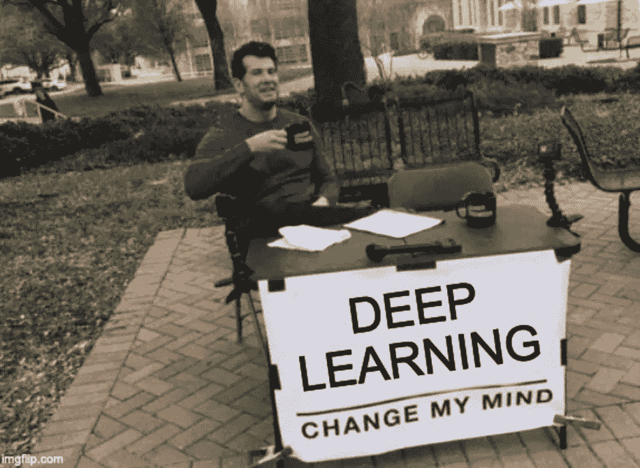
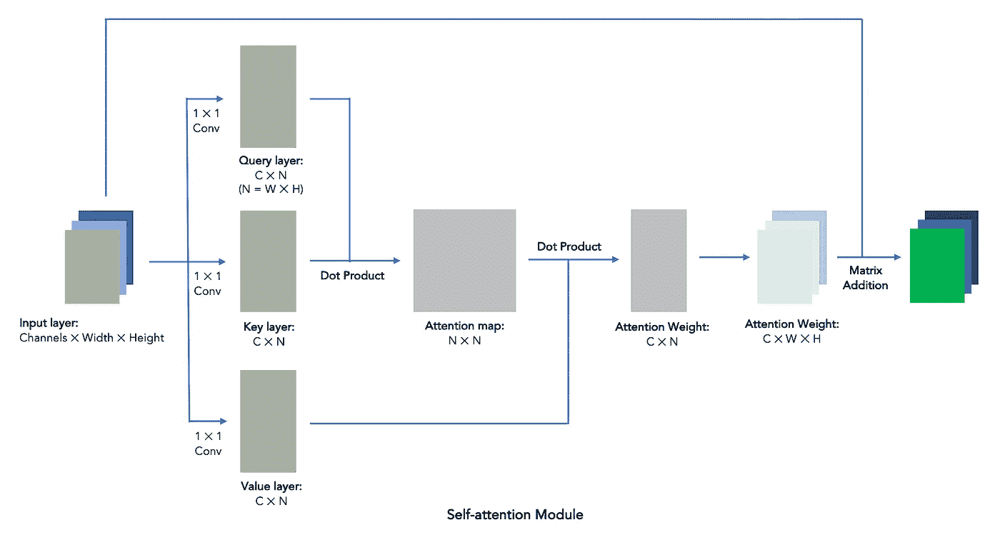
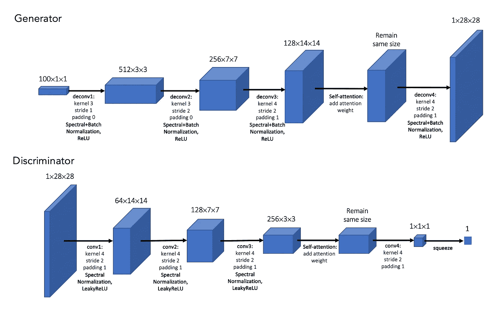
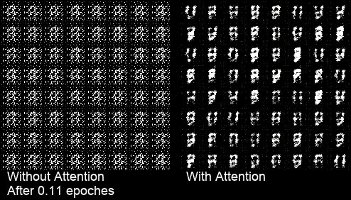
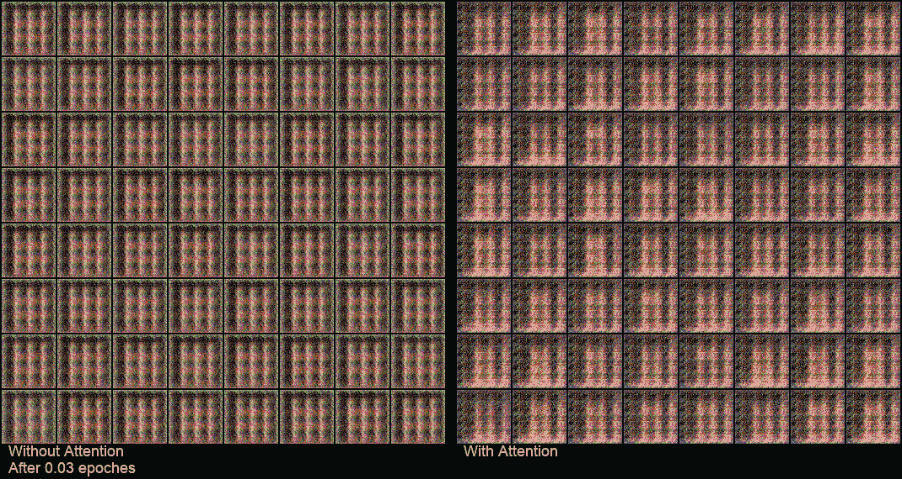

# 建立你自己的自我关注感

> 原文：<https://towardsdatascience.com/building-your-own-self-attention-gans-e8c9b9fe8e51?source=collection_archive---------15----------------------->

## 用 MNIST 和西里巴数据集实现 SAGAN 的 PyTorch

来自 imgflip.com 的迷因

**GANs** ，又称**生成对抗网络**，是近年来机器学习领域最热门的话题之一。它由两个不同的神经网络模型组成，一个叫做 ***生成器*** ，一个叫做 ***鉴别器*** 。这听起来很难理解，但让我试着这样说:假设我们想在没有任何绘画知识的情况下伪造名画，我们应该怎么办？大多数人会说，看看画，学着怎么做就行了。但这不是一个人的工作，在某种程度上，我相信你会在绘画上越来越好。你需要让你的朋友来到一幅真画和一幅你伪造的画面前，让他猜猜哪一幅是真的。一开始他很容易猜到，但是继续猜下去，你最终会把你的朋友弄糊涂。

在 GANs 里，*发生器*就像你伪造画作，*鉴别器*就是专门辨别哪幅画是假的朋友。想想这里的目标，你想让你的朋友很难分辨真假。如果你的朋友对每幅画给出一个从 0 到 1 的真实概率，你会希望他对你给他看的任何一幅画给 0.5 分，不管是真实的还是伪造的。这也将是 GANs 的目标，反映在损失函数中。

我们也经常看到 **DCGAN** ，它代表**深度卷积 GAN** 。这是一种专门用于图像生成的 GAN 设计，为*发生器*和*鉴别器*使用卷积层。它的工作原理就像 CNN 一样。 *A* ***自关注 GAN*** *是利用自关注层的 DCGAN。*自我关注的想法已经存在多年，在一些研究中也被称为*非本地*。想想卷积是如何工作的:它们对附近的像素进行卷积，并从局部块中提取特征。它们在每一层“本地”工作。相反，自我关注层从远处的街区学习。2017 年，谷歌发表了一篇论文“[关注是你所需要的全部](https://arxiv.org/abs/1706.03762)”，带来了更多关于该话题的炒作。对于单个图像输入，它是这样工作的:

1.使用一个核大小为 1 的卷积生成查询、键和值层，形状为 *(Channels * N)* ，其中 *N = Width * Height* 。

2.由查询和关键字的矩阵点积生成关注图，形状为 *(N * N)* 。 *N * N* 注意力图描述的是每个像素在每隔一个像素上的注意力得分，因此得名“自我关注”。这里的像素是指输入矩阵中的数据点。

3.通过价值与注意力地图的矩阵点积得到注意力权重，形状为 *(C * N)* 。注意力权重描述了所有像素中每个像素的总注意力分数。然后我们将注意力权重重塑为 *(C * W * H)* 。

4.将注意力权重添加回输入层本身，权重为γ，学习参数初始化为 0。这意味着自我关注模块最初不做任何事情。

**综上所述，自我关注 GAN 只是一个具有自我关注层的 DCGAN。**2018 年的论文“[自我关注生成对抗网络](https://arxiv.org/abs/1805.08318)”指出*DCG an 可能无法捕捉多类数据集一致出现的几何或结构模式，例如，画狗时没有单独的脚。*毕竟如何打造一个**自我关注的甘**？让我们把手弄脏吧！

## 1.正在准备数据集

我们将使用 **MNIST 数字数据集**。用 **PyTorch** 下载后，我们再用 *DataLoader* 加载数据。

## 2.构建模型

首先，我们将构建**自我关注模块**，稍后将在*生成器*和*鉴别器*中使用。可以查阅之前的自我关注模块结构，以便更好的理解。

*发生器*和*鉴别器*的结构如图所示:

模型结构

*谱归一化*是在[生成对抗网络谱归一化](https://arxiv.org/abs/1802.05957)中提出的一种新的权重归一化技术，用于更加稳定的训练过程。借用[萨根的 spectra . py](https://github.com/heykeetae/Self-Attention-GAN/blob/master/spectral.py)。

## 3.创建培训功能

这通常是最令人困惑的部分。与 CNN 或其他简单的机器学习模型不同，GANs 没有现成的拟合函数。我们需要编写整个训练函数。

我们首先初始化我们的模型和优化器。然后在一个循环中，我们首先从*数据加载器*读入一批数据。

下一步，我们向我们的鉴别器提供一批真实图像，并计算*。然后我们用一组随机数作为潜在变量，用生成器生成一批伪图像，再次送入鉴别器，得到损失。*

*如前所述，我们的鉴别器的目标是对真实图像给出接近 1 的预测，对虚假图像给出接近 0 的预测。因此，我们希望减少(1-对真实图像的预测)和对虚假图像的预测的总和。借助 **PyTorch** ，我们可以使用 backward 和 step 实现这一点，并在几行代码内更新鉴别器的所有学习参数。*

*然后，我们使用来自鉴别器的假图像的输出来更新发生器的参数。瞧，一个训练循环完成了，我们为第一批图像训练了我们的模型。打印出日志信息，并保存图像/模型，如果你想要的。*

## *4.模型性能*

*训练功能完成后，只需运行该功能即可开始训练。每 100 批从生成器中抽取样本，可以看到我们的模型学习画数字的过程。左边是没有注意的结果，右边是注意的结果。*

**

*关于 MNIST 的培训过程*

*通过对模型结构进行一些细微的更改，我们可以让我们的模型在其他大小的输入上运行。使用与 [**SAGAN**](https://github.com/heykeetae/Self-Attention-GAN) 相同的结构，我们也可以在 ***CelebA*** *数据集*上运行。具体的[模型结构](https://github.com/franknb/Self-attention-DCGAN/blob/master/model_64.py)和[训练功能](https://github.com/franknb/Self-attention-DCGAN/blob/master/SAGAN_celeba.ipynb)可以在我的 [**GitHub**](https://github.com/franknb/Self-attention-DCGAN) 中找到。*

**

*CelebA 上的培训流程*

## *5.你应该使用自我关注甘吗？*

*正如你可能从上面的 gif 中观察到的，**在有和没有自我关注层的模型之间没有明显的视觉差异**。此外，自我关注层通过计算多个矩阵点积来工作，这将导致 **10% ~ 30%的训练时间延长**，具体取决于你的具体模型结构。*

*然而，在 [SAGAN 论文](https://arxiv.org/abs/1805.08318)(韩等人 2018)中，作者确实报告了使用自我注意模块获得更好的初始和 FID 分数。我的下一步将是采用这些指标中的任何一个，看看自我关注的甘是否带来了更好的表现。在我的 [**GitHub**](https://github.com/franknb/Self-attention-DCGAN) **查看所有源代码和演示。***