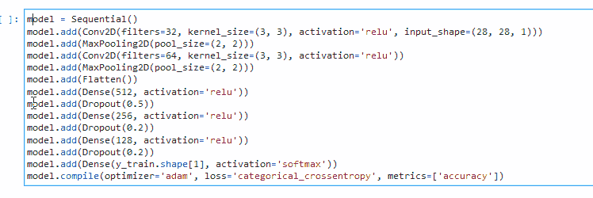
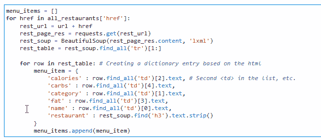
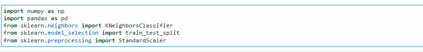
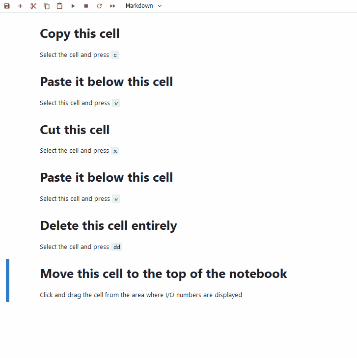
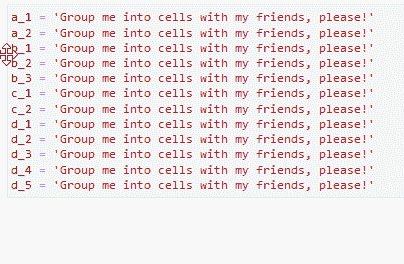
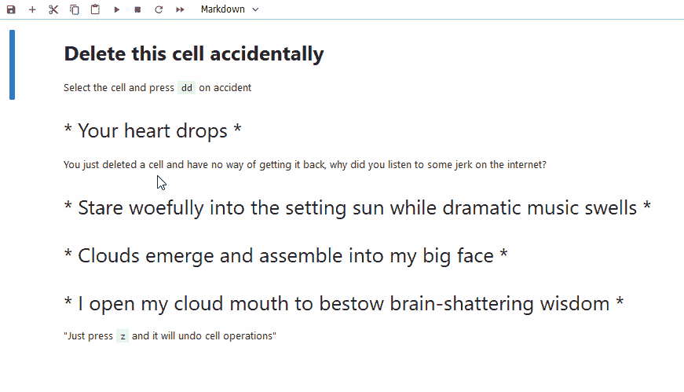
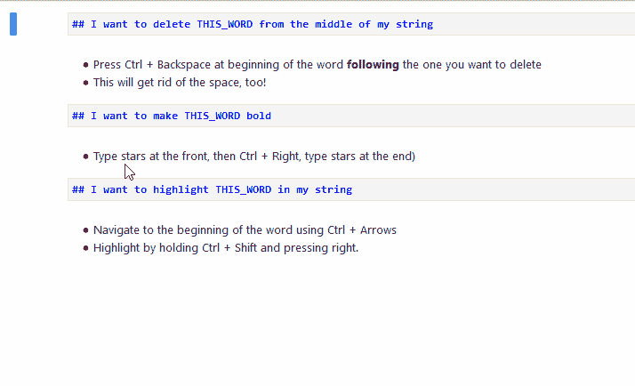
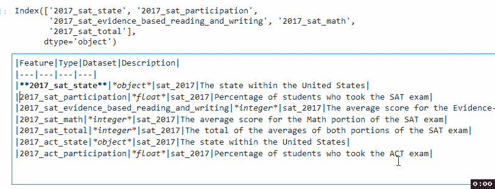

# 您需要了解的 Jupyter 实验室内置快捷方式和工作流程提示

> 原文：<https://towardsdatascience.com/built-in-shortcuts-and-workflow-tips-for-jupyter-lab-you-need-to-know-c86e09a8f339?source=collection_archive---------37----------------------->

在我开始从事数据科学之前，我一直在与音频打交道:编辑播客，混合中学乐队成员的 50 首曲目，[改编《怪物史莱克》中的“童话”主题，](https://www.youtube.com/watch?v=pwAZ89mJlMI)等等。作为一名音频编辑，你 **100%绝对需要快捷方式**，否则你会在做一个大项目时瘫坐在椅子上。只是没有足够的时间点击所有的东西。因此，当我学习像 Jupyter Lab 这样的新技术时，我做的第一件事就是**找到我能找到的每一条捷径**，这样我就不会因为点击而提前死去。

图为:*我试图不用快捷方式清理一个 Jupyter 笔记本。(图片由* [*安妮·尼加德*](https://unsplash.com/@polarmermaid?utm_source=medium&utm_medium=referral) *上***)**

*让我们挖掘捷径，好吗？注意，我将提到 Windows 键 **Control 和 Alt** ，它们分别等同于 Mac 上的 **Command 和 Option** 。*

# *1.鼠标修饰符:Ctrl(命令)和 Alt(选项)*

*鼠标修改器是改变鼠标操作的按键。我用过的大多数软件在你`control + click`或者`alt + click`的时候做*一些*的事情，是否有用就是另一回事了。*

*在 Jupyter Lab 中，您可以使用 Control 和 Alt 做一些令人惊讶的事情:*

*   ***按住 control 键并点击可以让你在一个单元格内的多个地方进行编辑**。双击也会突出显示一个单词。将这两者结合起来，您可以快速地移除不需要的方法。*

**

*按住 Ctrl 键，双击“值”并删除。*

*   *按住 alt 并拖动可以让你编辑垂直线条。我用它给单元格中的变量添加前缀/后缀。(注意:你也可以按 Ctrl + F 来替换，但是在“全部替换”功能背叛了我之后，我对它产生了信任问题。)*

**

*按住 alt 键，垂直向下拖动，给变量名添加前缀*

**

*按住 alt，拖动一个框，一次替换多个变量前缀*

*   *回答你的下一个问题，是的！您可以按住 Alt + Ctrl 突出显示并编辑单元格内的多个位置。但是我只在感觉混乱的时候用这个。*

**

# *2.细胞操作*

*单元格可以很好地用数据讲故事，但当你需要更好地组织其中的代码时，它就很烦人了。这里有一些操作，你可以对细胞本身进行清理你的笔记本在一瞬间！*

*这些操作**中的每一个都必须在单元格被选中**时执行，所以你不应该编辑单元格。您可以通过单击通常会看到输入/输出数字的单元格左侧区域来选择单元格。*

*   ***复制**:按`c`即可*
*   ***粘贴**:按下`v`即可*
*   ***切**:按`x`即可*
*   ***删除**:按`dd`*
*   ***移动**:点击并拖动单元格*

*现在看我快速地做这个——哇！我好快啊！哇！印象深刻！哇！我根本没必要练习这个！(…)*

**

## *合并和拆分单元格*

*这将帮助我们解决以下问题:*

1.  *您在一个单元格中写了太多内容，希望将其拆分为多个单元格*
2.  *你需要与某人共享代码，但是它跨越了 8 个不同的单元，对你和接收者来说，复制它将是乏味的*

*   ***拆分单元格:**将光标放在后的*行的开头，然后按`Ctrl + Shift + -`进行拆分**

**

*用 Ctrl + Shift + -拆分单元格*

*   ***合并单元格**:按住`Shift`，选择要合并的单元格范围，选择所有要合并的单元格(先点击单元格 1，再点击单元格 8，选择单元格 1-8)，然后按`Shift + M`，将所有单元格合并为一个单元格*

**

*用 Shift + M 合并单元格*

*   ***撤销最后一个单元格操作:**这是写给那些认为自己因为意外删除了一个复杂函数单元格而毁了整个晚上的数据科学家的。按`z`取消最后一次细胞操作，并降低您的心率。按下`Shift + z`也可以重做最后一次单元操作！*

**

# *3.使用 Ctrl 导航和编辑文本*

*这是跨越许多程序、文本编辑器和浏览器的东西。我建议每个人都使用它，因为它可以节省你浏览文本行的时间。*

*   ***通过文字导航:**按住`ctrl`并按向左或向右箭头*
*   ***删除一整字:**按住`ctrl`，根据你要删除的方向，按`delete`或`backspace`。*如果您想删除从单词中间到单词结尾/开头的内容，也可以这样做。将光标放在中间，使用适当的* `*delete*` *或* `*backspace*` *键**
*   ***高亮显示一个单词:**按住`ctrl + shift`并按向左或向右箭头高亮显示一个单词。这在 Jupyter Lab 中不是非常有用，但是在文本编辑器中很有用，在那里你可以使用快捷键来加粗、突出显示或给文本加下划线。*

**

*除了最初的点击，在制作上面的 gif 时没有使用鼠标。*

*如果你有一个[可编程游戏键盘/鼠标](https://www.bestbuy.com/site/logitech-orion-spectrum-g910-wired-gaming-mechanical-romer-g-switch-keyboard-with-rgb-backlighting-black/5053501.p?skuId=5053501)，通过 word 导航的概念是一个完美的工具——我使用`ctrl + arrows`的想法来分配快速宏，通过结合上述一些技术，**将通过按下按钮**自动加粗 markdown 数据字典中每行的第一个单词。*

**

*是的，你现在需要一个游戏键盘。我不是罗技赞助的，但我应该是。*

# *最后…平行笔记本标签*

*当我第一次开始使用 Jupyter Lab 时，最令人沮丧的事情之一是**在 markdown** 中创建自述文件。我不得不使用第三方平台来查看我的降价编辑。不要害怕！因为我有一个工作流程改进！*

*   *双击用编辑器打开 README.md 文件。*
*   *右键点击并转到**打开>降价预览***
*   *单击屏幕顶部的预览选项卡，并将其拖动到屏幕的右侧，将两者并排放置，并查看您的减价的实时更新。*

*请原谅全屏 gif…*

**

*这个的其他用途:*

*   *调出上下文帮助菜单(在“帮助”下)，这样你就可以查看一个函数的文档字符串，而不需要按`Shift + Tab`*
*   *调出一个包含您的自定义函数的`funcs.py`脚本，这样您就可以记住它们是如何工作的，而无需来回翻动。*

# *就这些了，伙计们！*

*如果您对 Jupyter Lab 有任何其他不满，请留下评论，我会看看我是否能想到用内置功能解决它的方法！也感谢我的同事们在我用“撤销最后一个单元格操作”功能拯救了某人的夜晚后，鼓励我写这篇博文。*