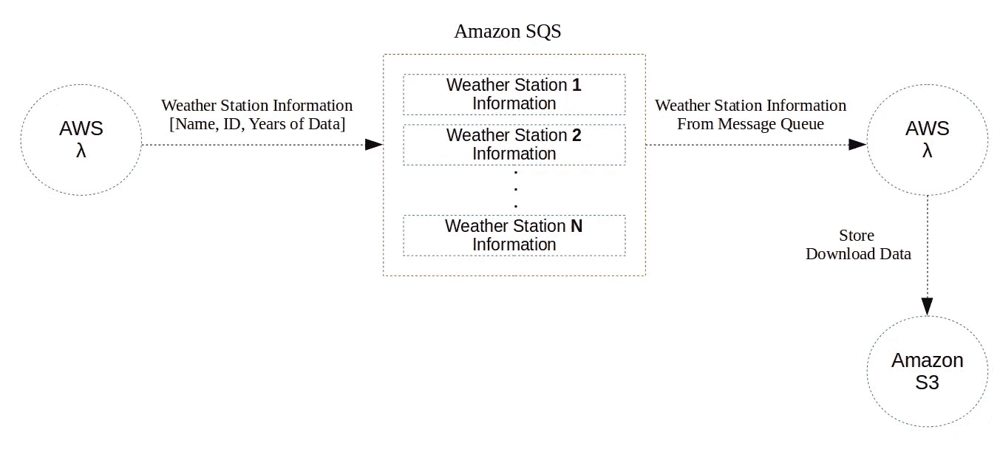
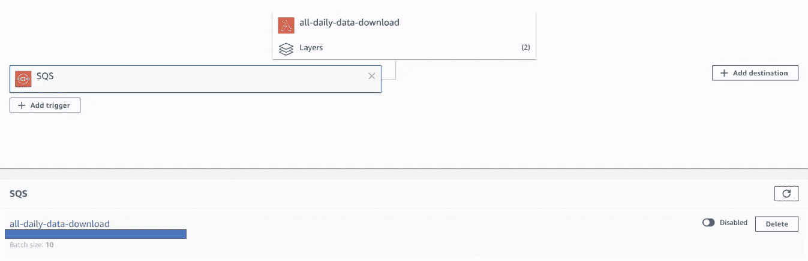

# Python 快速⚡️中的批量下载

> 原文：<https://towardsdatascience.com/bulk-downloads-in-python-fast-%EF%B8%8F-df070451786?source=collection_archive---------37----------------------->

## 利用 AWS Lambda 和亚马逊 SQS 批量下载外部文件

加布里埃尔·托瓦尔在 [Unsplash](https://unsplash.com?utm_source=medium&utm_medium=referral) 上的照片

**这篇文章概述了我如何使用 AWS Lambda 和亚马逊 SQS 以比我本地机器快 350 倍的速度将 194，204 个文件(即 CSV 格式)下载到亚马逊 S3！**

# 问题是

最近，我构建了一个 web 应用程序来下载加拿大的历史天气数据。作为应用程序结构的一部分，我需要从第三方服务器下载 8，324 个独立气象站的数据，并将数据存储在数据库中(亚马逊 S3)。

 [## 构建动态天气下载应用程序

### 使用 Python、Dash 和 AWS 简化加拿大历史天气数据

towardsdatascience.com](/building-a-dynamic-weather-download-app-1ce64a6c3e61) 

看起来很简单，对吧？只需创建一些代码，执行，瞧，你有数据。**错了**。

每个气象站都有多年的天气数据，第三方服务器将下载限制在 1 年的增量。简而言之，下载所有 8324 个站点的数据集意味着下载 194204 个单独的文件(即一个站点每年的数据一个文件)，合并匹配站点的数据，并将数据推送到亚马逊 S3。

下载数据的问题不是文件大小，整个数据集只有 4.4 GB，而是下载速度和网络延迟。在我的本地机器上，下载一年的数据并将其推送到亚马逊 S3 大约需要 1.7 秒。这意味着使用我的本地机器下载所有 194，204 个文件并推送到亚马逊 S3 将花费 **3.9 天**，假设没有网络中断或下载失败。😲

我们可以做得更好！

# 解决方案

很明显，在本地机器上下载数据是不切实际的，也是不可靠的，尤其是在云计算如此容易实现的情况下。最终，我决定使用 AWS Lambda 来执行我的 Python 代码，使用亚马逊 SQS 消息队列来触发 Lambda 事件和传达下载任务。

## 概观

这篇文章并不打算深入概述 AWS Lambda 和 SQS，因为已经有了[很好的资源](https://aws.amazon.com/serverless/use-sqs-as-an-event-source-for-lambda-tutorial/)，但是我将提供 Lambda 和 SQS 的基本概述以及我使用的框架。

AWS Lambda 是一种运行代码以响应事件的方式，无需提供或管理服务器。亚马逊 SQS 是一种在不同软件组件之间发送、存储和接收消息的方式(即两个 AWS Lambda 函数之间的消息)。

在我的例子中，我使用一个 Lambda 函数为 8，324 个气象站中的每一个生成包含气象站名称和 ID 等信息的消息。每条消息都被发送并存储在 SQS 消息队列中。同时，另一个 Lambda 函数被设计为响应 SQS 事件(即消息到达队列)而执行。这个 Lambda 函数从 SQS 队列中检索消息，使用消息信息下载数据，并将数据推送到亚马逊 S3 进行存储。

AWS Lambda 和亚马逊 SQS 框架概述

## 为什么拉姆达和 SQS 很棒

以下是 Lambda 和 SQS 令人惊叹的几个原因，以及它们如何加快执行时间。

*   Lambda 函数一次可以从 SQS 消息队列中检索多达 10 条消息。
*   Lambda 函数可以并发执行。例如，使用*“for loop”、*执行一个任务 10X，其中每个循环需要 1 秒，而完成这个任务需要 10 秒。使用并发性，您可以“克隆”Lambda 函数并同时执行 10 个相同的函数，只需 1 秒钟即可完成！
*   Lambda 函数可以分配特定数量的内存(即 CPU)。这加快了执行时间。

**注意:当增加 AWS Lambda 函数的并发性和内存时，你应该小心，因为这会很快导致成本增加。**

## 为什么要做这一切

你可能会问*“为什么要通过 SQS 将相同的信息从一个 Lambda 函数发送到另一个函数，而不是对所有事情都使用一个 Lambda 函数？”。*

问得好。

AWS Lambda 函数的最大执行时间限制为 15 分钟。如果我尝试执行 30 个任务，每个任务花费 1 分钟，我将超过最大执行时间。相反，我需要将 30 个任务分成块，执行时间少于 15 分钟。通过使用 SQS，我可以触发 Lambda 并定义我希望 Lambda 从队列中卸载多少任务(最多 10 个),以确保总任务时间低于执行时间。

# 代码

## 第一步:

使用 AWS Lamda 将消息发送到 SQS 消息队列。在我的例子中，我为每个气象站发送了一条消息，其中包含气象站 ID 和数据的开始和结束年份等信息。

AWS Lambda 函数将消息发送到 SQS 消息队列

## 第二步:

创建一个 AWS Lambda 函数，当消息在 SQS 消息队列中可用时触发(即执行)。在我的例子中，Lambda 函数卸载 SQS 消息，使用消息信息下载气象站数据，并将数据推送到亚马逊 S3 进行存储。

我将 Lambda 函数配置为一次从 SQS 消息队列中读取 10 条消息。这使得总执行时间低于 15 分钟的限制。我还为 Lambda 函数配置了高达 1000 的并发性(即，如果需要，Lambda 可以同时调用 1000 个执行)和 256 MB 的内存。

AWS Lambda 函数从 SQS 消息队列卸载消息，并下载和存储数据

在控制台中将 SQS 设置为 AWS Lambda 的触发器

# 结果

在我的本地机器上，将 8，324 个气象站的数据下载并推送至亚马逊 S3 需要 3.9 天。

使用 AWS Lambda 和亚马逊 SQS，我能够在大约 16 分钟内完成任务，比我的本地机器快 350 倍！！！💪

为 SQS 消息队列生成消息需要大约 8 分钟(步骤 1)，Lambda 同时下载数据并将其推送到亚马逊 S3 需要另外 8 分钟(步骤 2)。

有 AWS 免费层的总成本为 0.00 美元，没有免费层的总成本约为 4.30 美元。

*   我可以在本地机器上免费完成这项工作，但这意味着要确保 3.9 天的持续网络连接。
*   我可以通过旋转一个 EC-2 实例并运行一个 cronjob 来完成它，但是使用 AWS Lambda 的便利性非常值得这 4.30 美元。

总的来说，我很高兴找到了 AWS Lambda 和亚马逊 SQS 组合，并将再次使用它！