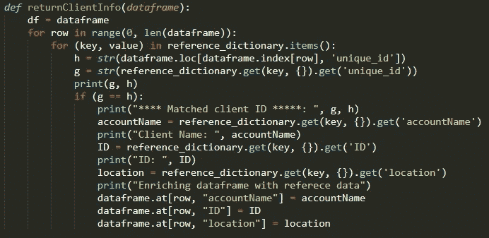
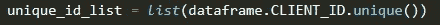
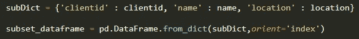
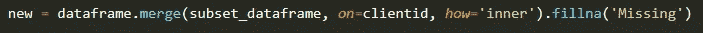

# 使用 Python Pandas 将属性批量映射到数据帧

> 原文：<https://towardsdatascience.com/bulk-mapping-attributes-to-dataframes-using-python-pandas-fe192dca9e83?source=collection_archive---------22----------------------->

## 合并而不是循环遍历大型数据帧如何显著提高程序性能

来源:https://www.pexels.com

当涉及到遍历 Pandas 数据帧中的大量行时，我们中的许多人都不耐烦地等待我们的程序结束循环，有时一行一行地等待很长时间。这是我在将高容量事务性数据作为 Pandas dataframe 加载，然后在单独的字典(从 JSON 文件加载)中根据客户机 ID 匹配丰富记录时遇到的主要困难之一。

**两种数据来源:**

*   **熊猫数据框**包含几千行交易数据(待丰富)
*   **包含客户端数据的字典**(将用于丰富 Pandas 数据帧)

**问题:**

用来自**字典**的客户数据丰富交易 **Pandas Dataframe**

如您所见，最初的方法(如下所示)是在源数据帧中查找 ID，然后遍历参考字典中的另外几千条记录来查找匹配。对每一行重复进行这种操作——想想看。一秒钟是完成这个查找的平均时间，更不用说根据参考数据值更新数据帧需要几个小时的数据处理时间！

源数据是作为来自不同源系统的独立数据帧收集、清理和加载的，因此我的程序遍历这些数据帧的每一行，根据参考字典中的不同属性进行匹配。首先，知道您希望将这两个数据源映射到哪个属性非常重要。在我的例子中，数据帧有 2-3 个不同的属性(基本上是跨数据集的不同映射属性)，这就是为什么一开始不可能将它们全部整合到一个更大的数据帧中——这从一开始就会简单得多。在大多数情况下，您无法控制系统和团队如何收集数据，因此在开始繁重的工作之前，可能会花费大量时间来确保您的格式是一致的。

就这一点而言，如果实现一个战略解决方案，与源团队合作并让他们知道您希望他们如何发送数据是值得的——这将节省您未来的时间，也有助于确保一致性。此外，您不希望遇到这样的情况:最终接收到的源数据包含意外的列、缺失的属性或不同的数据类型。

一旦数据帧被清理并重新标记，允许使用相同的属性和数据类型快速组合它们，我很快意识到**循环应该只保留给较小的数据集。**映射或合并更适合有几千条记录的数据帧。这个过程非常类似于 SQL 连接，将多个表(在我们的例子中是数据帧)组合成一个统一的表。

可以想象，使用循环查找匹配对性能没有好处。最初，我的程序要花几个小时来运行，因为它要逐行(针对数千条记录)运行，然后在参考数据字典中找到匹配。我知道，如果我生成的报告从长远来看有效率的话，这个程序必须得到充分的改进。**这就是战略问题解决发挥作用的地方！**

虽然我在程序中使用了循环，但这只是为了识别惟一的客户机 id，然后从更大的引用数据集中创建一个子集字典。这使我避免了在源数据帧的几千条记录和参考字典的几千个其他值中循环。

# 这种通过迭代开发的新方法将我的程序的执行时间从 12 小时提高到了 15 分钟。

**解决方案:**

**步骤 1:** 在源数据帧中识别惟一的 id，并将它们保存到一个列表中

**步骤 2:** 查找源数据帧和参考字典之间的匹配

**步骤 3:** 为较大的参考字典中的所有匹配创建一个子字典&将其转换为数据帧

**步骤 4:** 将子集参考数据帧与源数据帧合并

希望这种合并而不是循环的发现能够帮助您踏上数据科学之旅！