# Excel 中的业务图表

> 原文：<https://towardsdatascience.com/business-charts-in-excel-d4030b4647aa?source=collection_archive---------29----------------------->

## 我们应得的“大数据”的一个例子

*更新(2020 年 9 月):你现在可以直接获得源代码和现成的插件，达到以下效果，事半功倍；链接:*

[](/how-to-draw-9-professional-chart-types-with-zero-effort-c9eee6d2a9cc) [## 如何零努力画出 9 种专业图表类型

### 只需点击一下鼠标，即可获得业务就绪型视觉效果

towardsdatascience.com](/how-to-draw-9-professional-chart-types-with-zero-effort-c9eee6d2a9cc) 

# 介绍

我通常写我们的商业应用:从自动化决策中创造**价值。**

相反，今天我将把重点放在一个经常不被人喜欢但却至关重要的环节:使用 Excel 从我们处理的海量数据中提取最后一英里**的洞察力**。

虽然每个人都可以做到这一点，但是仍然有太多的人试图掌握这一技能却失败了。

我的观点是**磨练关键的 Excel 图表技能**意味着释放赋予现代经理的最强大和最廉价的工作负荷！

我们的产品，除了许多其他的东西，也为我们的客户产生自动化的 Excel 图表；我们的产品开发团队使用包括 Excel 在内的多种工具手动审核输出。因此，我对让这个话题变得容易理解产生了专业兴趣。

我们都可以**发现“大数据”的视觉秘密，即使只是使用 Excel** ，只要做得正确；这篇文章详细介绍了我自己的方法及其基本原理。

# 为什么在 Excel 中制作图表？

是的，2020 年将会有许多新奇的、先进的图形工具出现……我知道:我们的科学家使用它们，用于特定的目的和产品用例。

但是，在所有核心的分析工作都已经用其他强大的工具完成之后，**“大数据”必须变小**才能让人理解。

图表是分析的最后一英里，有一个简单的规则:**不管选择什么工具，信息清晰是唯一的咒语**。

当谈到“我们其他人的图表”时，对于像你我这样的人来说，没有什么能比得上微软 Excel 的易用性和强大功能:

*   为了*渲染甚至数百万个数据点*:就让 Excel 发挥它的魔力吧，它的渲染引擎的性能是惊人的
*   要*添加图表*:创建新标签即可
*   要*建立开发环境栈*:复制文件即可！

Excel 图表制作快速、灵活且便宜。但是启动需要五分钟，掌握它需要一辈子。特别是实现完全自动化的结果，而不是笨重的手工 Excel 工作。

# 挑战

默认设置是普通用户体验的核心。

但是比尔·盖茨肯定想搞些下流的恶作剧和/或给全球商界带来痛苦的经历: **Excel 图表最初是用错误的默认选项设置的**。他们中的许多人。

举几个例子吧？

1.  默认的调色板更多的是狂欢而不是商业
2.  像插入行或移动数据这样的简单操作可以隐藏任何图表
3.  负值会破坏多种图表类型
4.  3D '，'瀑布'等类型功能失调
5.  数据标签很难使用并且相互重叠

(*注:* *以上每一个默认，还有很多，都可以用一些爱来称呼&固定*

我完全避免那些看似花哨的选项，如“图表”或“数据透视表”，它们实际上不够灵活，因此不值得花力气。我唯一关注的是普通工作表中的**标准图表。**

# 好消息是

现在，让 Excel 图表工作是可能的，而且相对较快！

读完这篇文章后，有了全新的设置，任何人都可以用有限的努力实现**辉煌的自动化结果**:

*   *仅 Excel*:**无外部插件**会降低 Excel 的运行速度、增加额外成本并可能停止工作
*   *零代码* : **没有 VBA** 或其他有崩溃风险的黑客，很难分享，需要技巧来维护
*   *自动化* : **没有手动步骤**，但是图表自动链接到数据，因此无需在每次数据改变时重复额外的特别工作。

接下来的内容最好使用*桌面显示器*或*更大的平板电脑*来观看。

# 指导原则

我的主要指导原则是在多年的“大数据”工作中形成的:

*   *数据优先*:释放**数据本身来完成所有的对话**，巧妙地隐藏不必要的干扰，例如轴、网格线、图例、标签、额外的 0000
*   *逻辑排序*:使用**降序或升序**，因为字母(？)或者甚至随机排序可以将消息隐藏在数据中
*   *眼球控制*:保持观看者的眼睛在数据上，具有支撑元件和参考的逻辑定位**防止前后扫视**。

**视觉数据只有在与其他东西的相对参考进行比较时才有意义**。很多吗？还是不够？长得快吗？一套比另一套相对大吗？

一般来说，(任何)定价也是如此，因为我们只能本能地在与其他东西的比较中评估价格— **我们的大脑在后台拼命这样做**——我们对图表上显示的任何数据也是如此。

这就是为什么我喜欢用清晰的视觉参考来设计我的图表。

# 图表类型

有了这些原则，掌握**一些图表类型**就可以真正拥有 Excel 图表了。即使在“大数据”时代，所有图表中的五大王是:

1.  *线*:时间序列
2.  *派&叠*:组件
3.  *栏&栏:*频率&项数值
4.  *散点图&气泡图*:双向&三维相关图
5.  *箱线图:*分布。

使用这些核心图表类型，并在适当的情况下进行组合，可以传递现代企业经理可能需要的几乎任何信息。

> *无论任何图表的基础数据集有多大，浏览者的大脑保持不变。*

因此，图表必须设计得小而简单:我宁愿用简单的图表来说明复杂的信息，而不是把大量的数据放在大图表上。

# 设置

Excel 默认设置不可信。

但是一个**库的‘模型图表’**可以成为一个‘模板’，从而像躲避瘟疫一样避开 Excel 的默认图表。

如何开始？

*   **虫警报！** *Excel 选项>高级>图表>属性:*究竟为什么会有人想要‘跟随图表数据点’，以及让这些选项默认选中的理由，我都搞不懂；取消选中这两个选项可以防止在基础数据的位置改变时丢失宝贵的格式

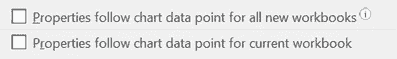

*   *新图表/图表选项/属性*:我不喜欢在插入/删除行时图表的形状发生变化；比起“随单元格移动并调整大小”(默认)，我更喜欢“**移动但不随单元格调整大小”**

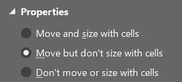

*   *填充*对于数据集，我仍然使用 0.25 磅的薄边框，但透明度为 50%，因此它变得更加微妙，同时仍然引导眼睛

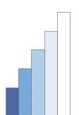

*   *阴影*:只要不过度，右下阴影**【弹出】**图表，使用预设(‘外’，首选左上)‘距离’减少到 2pt 我很少使用阴影，主要用于整个图表区域，甚至根本不使用，以避免造成混乱和不必要的混乱

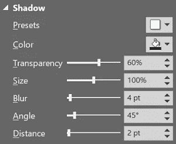

*   *字体类型*:我使用‘Lato’和默认大小 10 作为我的目标外观&感觉；所有文本“浅黑色”(RGB 69/69/69)到**防止“黑色闪烁”**；图表标题 12pt，粗/粗体


*   *线条粗细*:所有非数据线&刻度线的粗细为 0.25 磅，这是目前最细的设置；**网格线**不会增加精确度，但会增加混乱，因此我避免使用网格线，而是使用数据标签，并且只在想要显示精确数据值的时候使用；现在，既然经理们都是讨厌被“大喊大叫”的聪明人，我也保持低调

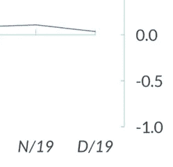

*   *调色板*:偏好和公司政策的问题；我可能会使用“evo green”来强调，但通常会发现**“shades of blue”**是最优雅、最有吸引力、最容易阅读的解决方案——毕竟，在世界上任何地方，天空和大海都是蓝色的，越深越暗——直觉上是有道理的……而且对 7%有视觉障碍的男性也有效(尽管在女性中很少见，幸运的是只有 1%的人是色盲),甚至在打印成黑色&白色时也是如此


*   *间距:*只要有可能，特别是对于文本&总计，我会删除任何和所有额外的默认填充，与轴的距离为 0 而不是 100，边框为 0 而不是默认的 0.11/0.05

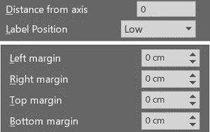

*   *标签:*我格式化标签，并将它们作为自己单独的数据集“来自单元格的值”应用，而不是接受来自 Excel 的自动标签，这样在后台我就能够隐藏重叠部分，并自由定义要显示的正确数字/文本类型

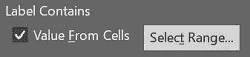

有了这个初始设置，并使用“命名范围”和“offset()”公式，任何图表类型都可以通过完全自动的调整和清晰的格式以灵活的方式**链接到任何数据集**——所以，现在终于到了每种图表类型的更具体的细节。

# 折线图

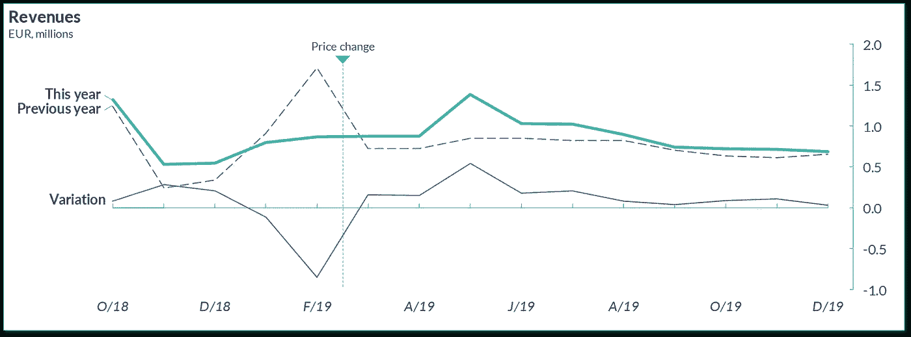

长期趋势。特定设置:

*   **系列标签**在左侧，它们的逻辑位置，使用带有不可见点的辅助散点数据集和自动“引导线”(组合图)在需要时区分标签；如果是单个系列，其名称将出现在图表标题中
*   **副标题中的测量单位**因为只有一个轴，或者它会位于每个轴的正上方
*   数千/数百万/数十亿用于**防止 000 污染** —使用 Excel 的自定义格式自动生成；标题和副标题是通过与单元格值的直接链接自动生成的
*   y 轴在右侧，带有可选的下划线，它是一个**参考标尺**，而不是一条位置有任何其他意义的垂直线
*   负数据下方的轴标签**，交替出现以减少拥挤，刻度线【内侧】指向数据，比标签的文本更重要。**

右上角的**可选图例**对于更容易阅读的左侧系列标签来说是多余的，但线条可能会重叠，从而留下潜在的残留模糊性；因此，是否添加图例是一个偏好问题。

**没有副轴**请。我更喜欢图表上下重叠，而不是增加多个度量单位；额外的好处是 X 轴标签通常可以在“上图”中省略。

Excel 逐步呈现每个系列，一个接一个:第一个系列放在每个其他系列的后面；这通常应该是 X 轴，它本身也是一个折线图，因为散点线总是在任何正常的线条系列的上方呈现**，这是不能改变的。**

“刻度线”是完全可控的**“误差线”**。

最重要的序列，在上面的例子中是“今年”，当两个序列交叉时，被渲染到最后**“高于一切”**:为了实现这一点，我把它移动到最后一个数据集**。**

通常需要额外的**虚拟数据集**，它们可以快速实现。我的列表可能是这样的，例如:

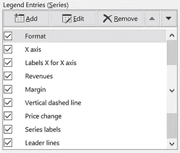

例如，这些虚拟数据集可能以正确的顺序显示 X 轴或**图例键**，首先显示最重要的数据系列，而不是颠倒，这与逻辑上的建议完全一致。

虚拟数据集也可能显示**自动“垂直线”**，在我的示例中，用来突出显示公司进行价格变动的具体日期。

# 饼图和堆积图

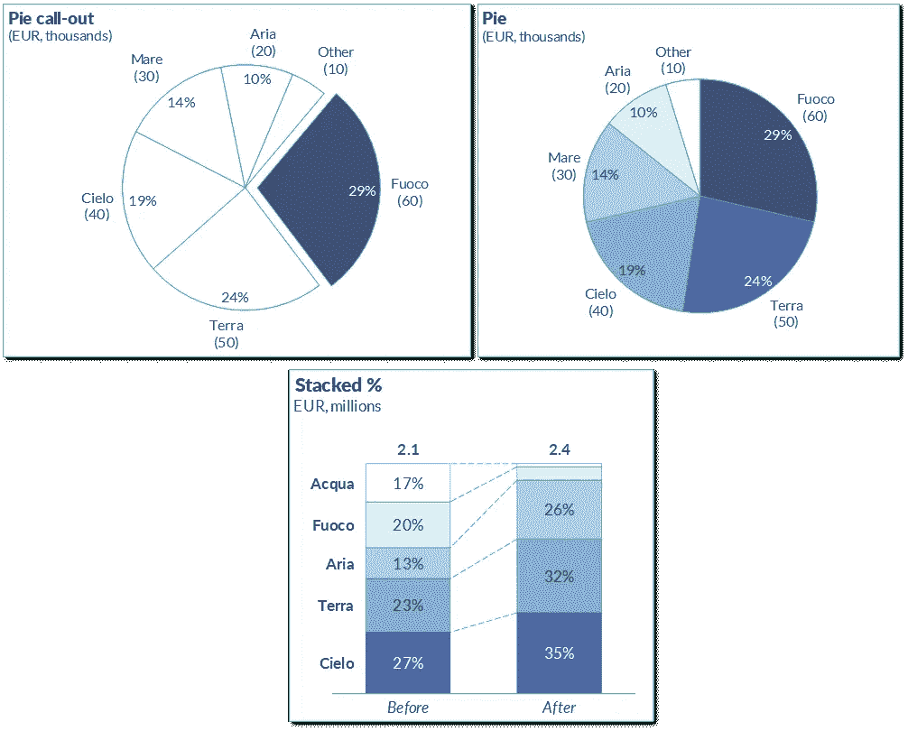

这些都显示了整体的组成部分。特定设置:

*   内部和外部的饼图标签需要**两个重叠的图表**，一个使用副轴——不管这实际上意味着什么。)
*   **旋转和爆炸**在上面的图表中以 90 度为中心，由于它的水平方向，眼睛更容易检测到这个切片的日珥；仅部分自动化，需要用户定义的功能或 VBA 来实现完全自动化
*   **堆积百分比图**，通常比多个饼图更简洁，是一个普通的柱形图或条形图，其数值在绘制前自动缩放至 100%;纤细的**连接线**有助于突出显示变化，最好是将焦点放在底部的**“基础数据集”**。

为了显示跨越多行的**标签的内容，我使用‘char(10)’作为‘新行’字符，与‘text()’函数一起构建标签字符串。**

# 柱形图和条形图

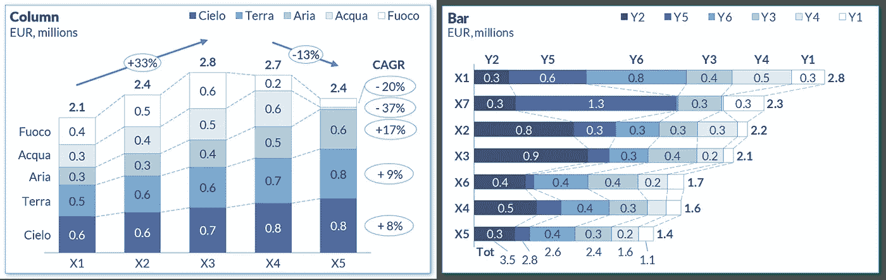

频率和项目值。特定设置:

*   与其他图表相同:预排序、系列标签、自动引导线和无重叠
*   **间隙宽度** 80%而不是默认的 150%
*   支持/ **瀑布图的不可见数据集**
*   **支撑线**为“增长”线标注 losenges
*   **losen ges 的数据标签形状**，例如突出显示 CAGR 的平均增长率。

总计显示在正柱的上方或右侧，显示在负柱的下方或左侧。50%的透明白色填充用于负值总计，以消除轴重叠。

该系列图表中的其他示例:

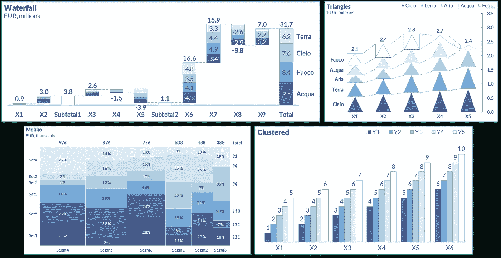

在**瀑布图**中，系列标签位于“总计”的右侧，而不是左侧，并且仅在需要的地方显示，例如一个以上的系列。**“三角形”**用“形状填充”显示——任何东西都可以使用，甚至是树的图像！ **Mekko** 是一个带日期轴的“堆积面积”图。聚类，我不喜欢使用它，因为它往往隐藏其信息，序列重叠设置为 0%。

# 散点图和气泡图

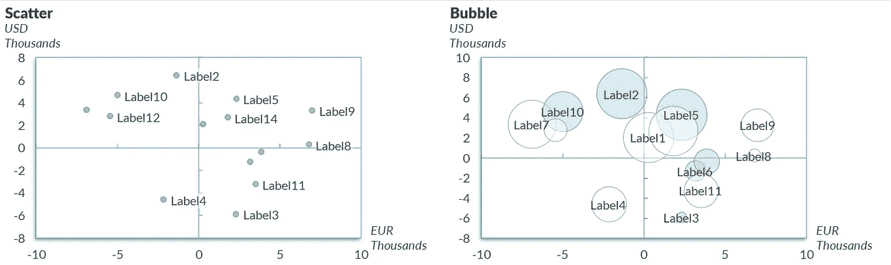

二维和三维相关性。特定设置:

*   轴**标签为“低”，在图表**之外，刻度线为“内”，阴影在左下方
*   **轴标题和每个轴旁边的单位**便于阅读
*   带有**细边框**和 50%透明填充的气泡，以突出显示不同数据点之间的重叠，&带有 50%透明白色背景的数据标签
*   重叠时隐藏的数据标签:这是图表，不是数据表！
*   **尺寸代表气泡的宽度**，此选项强调了相对差异，因此对人眼来说比面积大小更直观。

为了防止数据标签重叠，我计算了每个角的 X/Y 坐标，然后检查一个矩形是在另一个矩形的上边还是左边。

该系列中的其他相关图表类型:

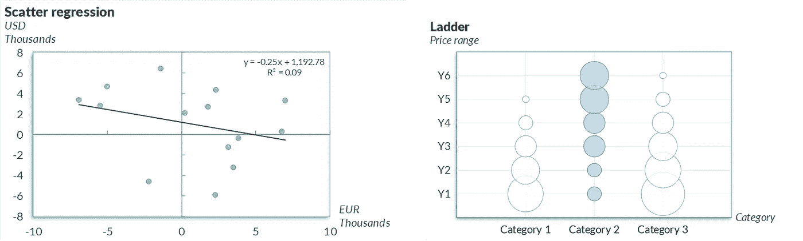

对于**“梯形”**图表:细网格线 0.25 磅，浅灰色 0%透明度。

# 箱线图

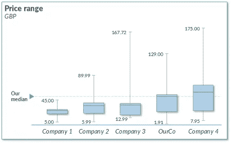

分配，例如价格范围。特定设置:

*   柱形图在底部使用了一个**‘隐形’支撑杆**
*   **上方和下方的误差触须**显示顶部/底部四分位数数据
*   **按中线**排序，中线是中间的水平线
*   数据标签依靠 2 个额外的**不可见线数据集**(“散点图”类型将允许更大的准确性和控制，但代价是需要更长的设置时间)来突出显示最小&最大值，具有 50%的背景透明度；我避免使用自动指引线，尽管标签/方框/轴有重叠的风险，这样可以防止在这个已经相当密集(但非常漂亮)的图表类型中增加更多的复杂性
*   **方框后面的阴影**使用与整个图表阴影相同的设置。

对于显示“我们的中间值”的行，我**通过编程隐藏**应该落在框后面的部分，否则 Excel 会将不需要的部分覆盖在顶部。X 轴也是以编程方式生成的。

# 结论

这些例子展示了我在 Excel 中实现**自动化制图的方法:没有外部工具、VBA 或手工工作。也许有一天，甚至 Excel 的默认设置也会在软件的未来版本中得到修正。**

现在，我发现我构建“自制模板”的方法的结果是**简洁、易读**和**快速渲染。**

如果有任何问题，请不要犹豫让我知道。

制图愉快！

PS 早在 2005 年，在我工作的第一周，**吉恩·泽拉兹尼**的书《用图表说话:视觉沟通主管指南》启发了我。

即使在今天，这仍然是有史以来最好的图表指南之一。简单扼要。不具体关于 Excel，但如何思考为什么，何时以及如何使用每种图表类型。**谢谢基因！**

```
Get free access to your monthly summary of Business Science, new software and University-level learning:[**Free access**](https://evouser.com/register)Any questions? Feel free to connect with me on [Linkedin](https://www.linkedin.com/in/fabrizio-fantini/)
```