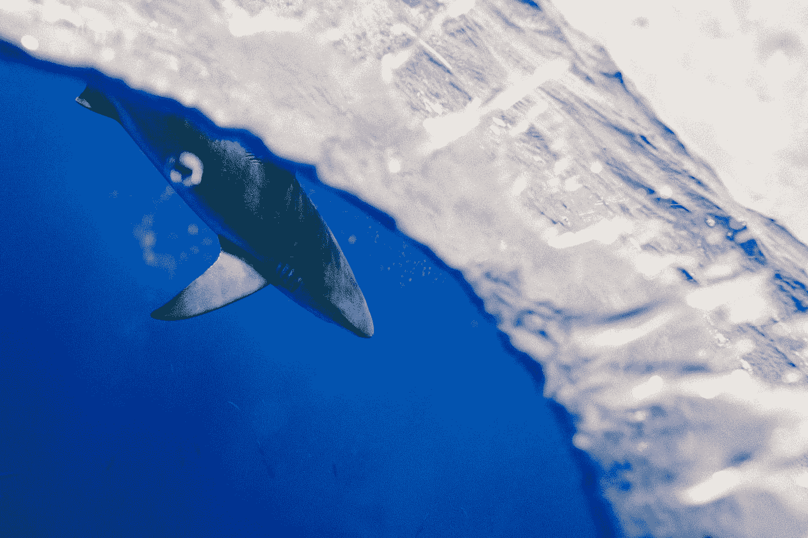

# 数据科学家的商业概念

> 原文：<https://towardsdatascience.com/business-concepts-for-data-scientists-352711657f55?source=collection_archive---------32----------------------->


尼基塔·卡恰诺夫斯基在 [Unsplash](https://unsplash.com?utm_source=medium&utm_medium=referral) 上的照片

## 我半开玩笑地试图弥合 MBA 和数据科学家之间的鸿沟

T4:巴斯是一群严肃的人。他们喜欢开会，讨论行动项目和关键要点；他们总是试图跳出框框思考，或者寻找真正难以捉摸的东西，比如阿尔法或(竞争)优势。

我知道是因为我有 MBA 学位。我职业生涯的大部分时间都是在定量和定性、数据和业务、盒子里和盒子外之间的线上度过的。因此，我的数据科学家同事，这使我可能是第五个最有资格向你解释商业世界如何运作以及所有商业术语的含义的人 ***(仅供参考，如果你还没有注意到，这篇文章主要是讽刺性的，带有一点点洞察力)*** 。今天，我将重点解释最让我恼火的商业概念(这样你就可以和我一起讨厌它们了)。



照片由[雅各布·欧文](https://unsplash.com/@jakobowens1?utm_source=medium&utm_medium=referral)在 [Unsplash](https://unsplash.com?utm_source=medium&utm_medium=referral) 上拍摄

# 蓝海战略

我真的很讨厌这个词。我理解创造者想要表达的意思——不要在现有的竞争市场中竞争，你应该打造一种既新颖、又与众不同(MBA 术语，意思是产品有些独特)又低成本的产品或服务。换句话说，发明一个新的市场，远离那些充斥红海的蹩脚竞争，你将会财源滚滚！如果事情有那么简单，世界充满了蓝色的海洋供我们所有人玩耍(我不是指字面上的意思，是的，我知道地球表面 71%是水)。

事实上，沃伦·巴菲特早就说过——公司应该一直**改善他们的经济护城河**(给予他们相对于竞争对手的**持续优势**和相对于客户的**定价权**)。老实说，仅仅通过阅读巴菲特的股东信，你就可能学到我在 MBA 学到的 99%的东西。

但当我听到这个词时，我不禁回想起我参加的一次会议，会上一个人痛斥另一个人“缺乏商业眼光”。我清楚地记得他说过，“不像你，我是一个蓝色海洋的思考者。”不寒而栗。我其实对那个“蓝海思想者”挺不爽的。我喜欢海洋；但是现在，当我听到蓝色海洋这个词时，我想到的不是鲸鱼、海豚和戳，而是他的脸…

我的想法:拥有更好更便宜的产品是理想的，但并不总是现实的。不是每个公司都可以或者应该去寻找神话中的蓝海。每一个谷歌(由于其巨大的规模，它实际上提供了更好的产品，搜索广告，价格更低)，都有几十个克罗格。Kroger 涉足商品市场(所谓的红海)并不意味着它不能盈利(它只需要优先考虑销量，不要做浪费金钱的蠢事)。如果你将盲目追逐蓝海所消耗的金钱与真正的蓝海所创造的价值进行比较，我敢打赌前者要大得多——因此，追求蓝海从总体上来说可能是一种净负面影响。即使是谷歌，尽管一再尝试，花费了数十亿美元，也从未能够复制搜索的蓝海(和成功)。


由 [Digvijoy Mazumdar](https://unsplash.com/@infernus_666?utm_source=medium&utm_medium=referral) 在 [Unsplash](https://unsplash.com?utm_source=medium&utm_medium=referral) 上拍摄的照片

# 破坏和破坏者

几年前可能有一段时间，仅仅在你的投资者推介材料中提到 **disrupt** 这个词就能保证至少 5000 万美元的资金(来自软银)。如果你能面无表情地解释你的公司基本上是自来水笔的 AirBnB，那你就能再获得 5000 万美元的资金。

由已故的 Clayton Christensen 率先提出的“未启动的颠覆理论”描述了一种情况，即一家较小的公司从其更具(最初)主导地位的竞争对手那里赢得了大量市场份额。它成功地做到了这一点，首先专注于向被忽视和服务不足的买家提供更便宜/更简单的**产品(即**足够好的**),然后通过改进其更便宜的产品的功能最终转向高端市场。现有企业反应迟缓，因为它们不是为成本竞争而生的。最终，这个颠覆性的新贵不仅拥有成本更低的产品，还拥有功能更全的产品，并最终主导市场份额(直到它自己在某个时候被颠覆)。现在我想起来，**颠覆有点像在红海中应用蓝海战略…那么是紫色海洋吗？****

不管是好是坏，冲水时代已经过去了。大多数试图破坏的初创公司最终只会破坏投资在它们身上的资金(通过烧钱)。风险资本的繁荣无疑对消费者有利——它有助于发展像优步、Slack、Flexport、Airbnb 和 Instacart 这样又酷又有用的企业(尽管其中一些企业可能无法在当前的衰退中存活下来)。


照片由 [Alina Karpenko](https://unsplash.com/@alinasagirova?utm_source=medium&utm_medium=referral) 在 [Unsplash](https://unsplash.com?utm_source=medium&utm_medium=referral) 上拍摄

但它也催生了一批只能被描述为投资者资本荒谬浪费的公司。想成为房地产颠覆者的 WeWork 可能是最著名的一家。就在去年[在我对软件工程师薪酬最高的公司的排名中，WeWork 还高居榜首，因为它准备从华尔街榨取数十亿美元(通过可能是历史上估值最高的 IPO)。现在该公司濒临破产(理应如此)。](/how-much-do-software-engineers-make-60565f50f579)

一个非常有趣的例子是 [Juicero](https://www.theguardian.com/technology/2017/sep/01/juicero-silicon-valley-shutting-down) ，这家公司出售了价值 400 美元的剪刀(它实际上是一台机器，唯一的功能是打开一袋同样定价过高的水果泥)。在被嘲笑消失之前，该公司设法筹集了 1.2 亿美元。什么？？当 Juicero 的创始人向他们的投资者推销时，我很想成为墙上的一只苍蝇。我想对话大概是这样的:

```
**VC:** So you're a company that sells expensive juicers?**Juicero:** No, were a cutting edge tech company that's about to disrupt the market for fresh fruit and vegetables.**VC (suffering FOMO from not investing in Uber):** Tell me more.**Juicero:** You know how many people eat fruits and vegetables?**VC:** I would imagine a lot.**Juicero:** EVERYONE eats them EVERYDAY! The TAM (business speak for potential market size) is infinite!**VC:** So you're like Uber but for fruits and vegetables?**Juicero:** Yes exactly.**VC:** I'm liking what I am hearing but just for due diligence's sake, how are you better than say an Odwalla?**Juicero:** Our proprietary deep learning algorithm uses AI and NLP to infuse every juice packet with the optimal combination of flavor, texture, and nutritional value. And we use blockchain technology to ensure that every perfect packet is unique and can only be unlocked by the specific Juicer with the correct private key. It's truly decentralized nutrition for the masses.**VC:** You had me at blockchain!
```

事实上，Juicero 从未上市让我有点难过。这将是一次惊人的做空(做空是押注股票价格将下跌)。

这个故事的寓意是，颠覆是艰难的。不是几百万甚至几十亿美元就能买到的东西。真正的颠覆通常来自于一家公司在激烈的竞争中拼命求生。这需要耐心、无数次的迭代和对客户需求的深刻理解，才能有机会创造出颠覆性的东西。

# 困境买家、协同效应和杠杆收购

私募股权(PE)是相当于房产经纪人的公司。他们借了很多钱来收购一家公司，美化它，然后转手给出价最高的人。如果你能得到它，那将是一份伟大的工作——成功的私募股权基金经理能赚到疯狂的钱。

在我们今天讨论的所有 3 个概念中，这是最相关的。私人股本基金坐拥约 1.5 万亿美元的干粉资金(也就是未投资现金)。如果市场在未来几个月再次下跌，他们将开始认真投入所有资金。这就是为什么他们经常被称为**困境买家**——私募股权基金喜欢收购陷入困境的公司(然后掏空它们)。

你可以打赌，他们已经开始对你附近遭受重创的科技公司穷追不舍了(4 月，Airbnb 从私募股权公司筹集了 20 亿美元的可转换债券；可转换债务是附有转换为股权的选择权的债务)。

私募股权让我很恼火，因为它假装在帮助公司，却在暗中榨取公司的所有现金。在投资行业，我们经常谈论“游戏中的利益”，意思是你的投资是否使你的(财务)利益与公司的业绩完全一致？事实上，私募股权公司在每笔投资中的份额很小。要理解其中的原因，下面是收购一家公司的典型私募股权剧本:

1.  确定一家目标公司，这家公司的银行账户里有大量现金，并能产生大量现金流。
2.  用一点自有资金和大量债务，以目标公司的现金流和资产为抵押，收购目标公司。所有这些债务的使用就是这项交易被称为杠杆收购(LBO)的原因。在商业用语中，杠杆和债务是一回事。
3.  用被收购公司的现金支付股息——基本上是一种无所事事的巨大的财务自我击掌。
4.  实施大规模裁员(所谓的协同效应)，因为被收购的公司现在没有现金，需要支付大量利息(以偿还债务)。哎呀，我想知道现金去哪里了？

因为私募股权公司用了太多的债务(而不是自有资金)来为收购提供资金，并支付股息；到第三步结束时，游戏中剩下的皮肤已经很少了。它最初投资的一小部分股权已经部分收回。

这真是一个冷酷无情的行业。没错，确实有一些私募股权公司离开被收购公司时比当初更好，但它们是例外。更典型的是，私募股权公司(通过新的 IPO)将背负债务、濒临财务困境的公司放归自然。在牛市中，价格上涨和对经济的乐观有助于掩盖不良公司的缺点，他们可以逃脱惩罚。