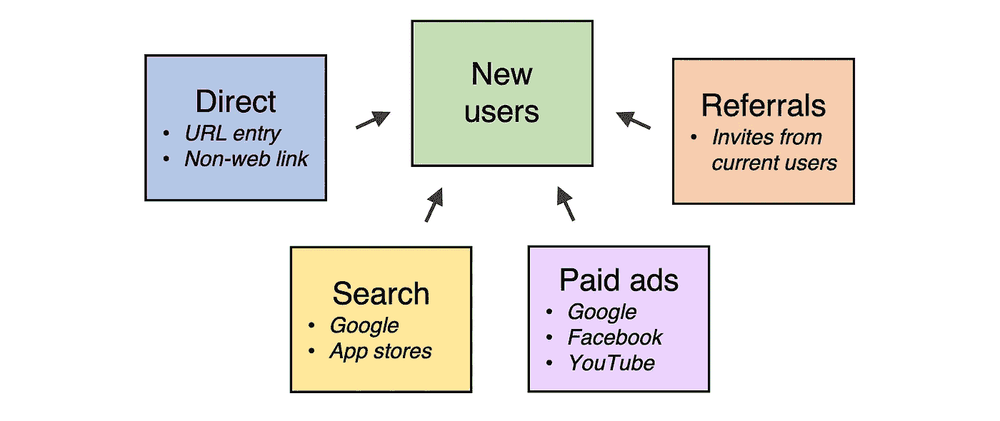
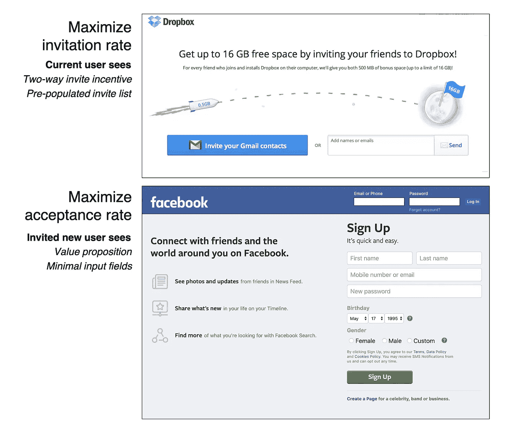
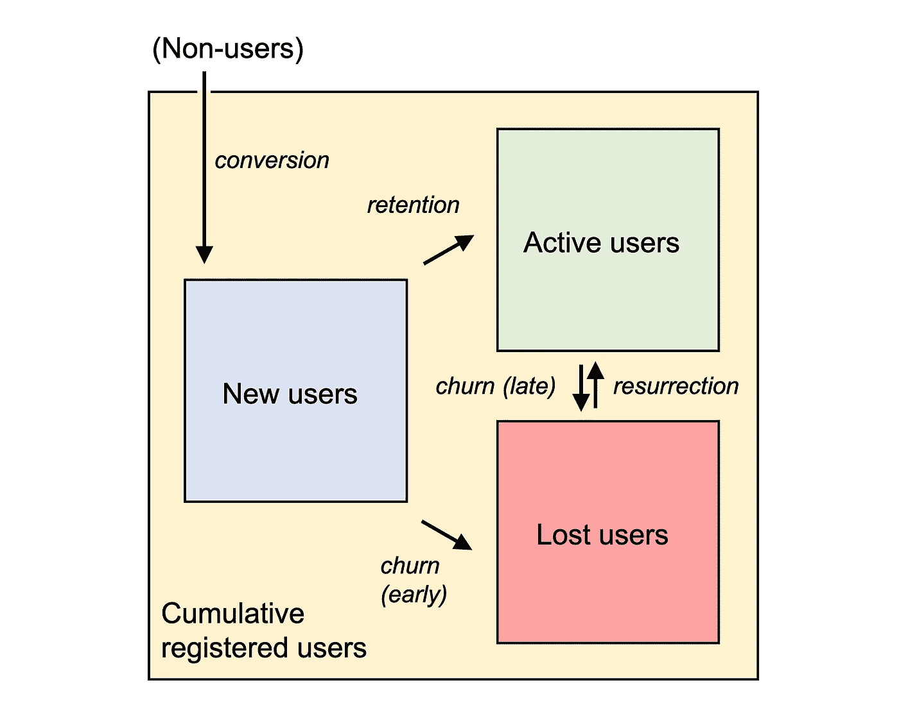
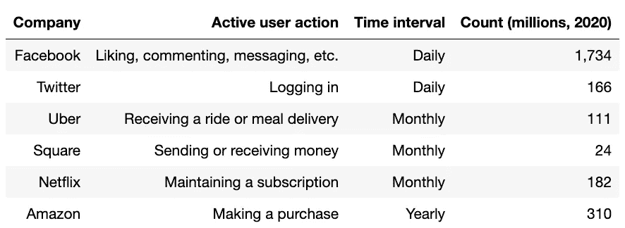
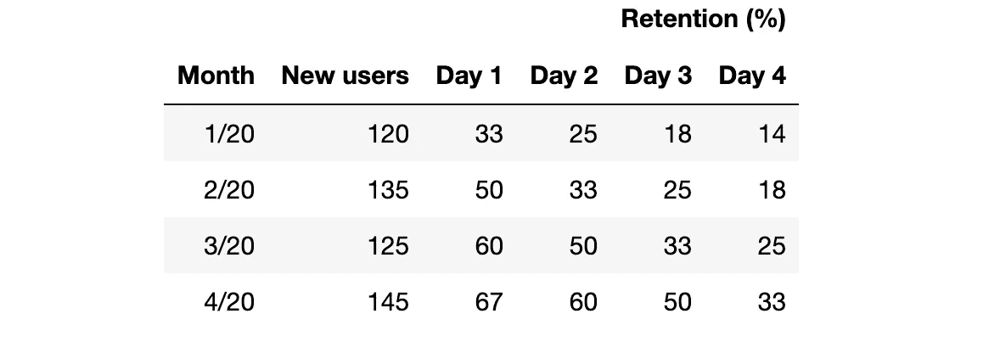
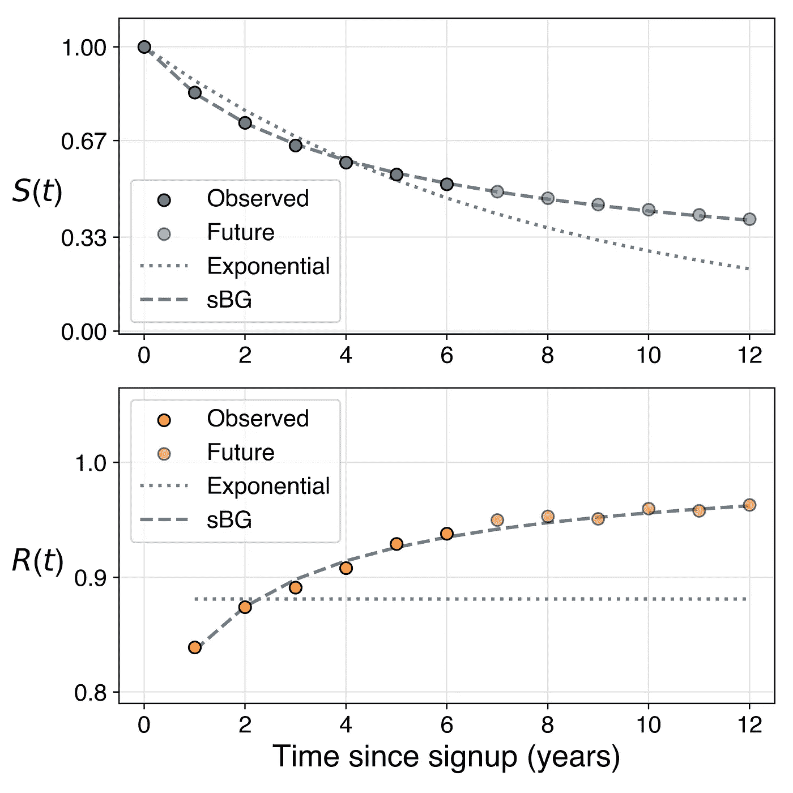
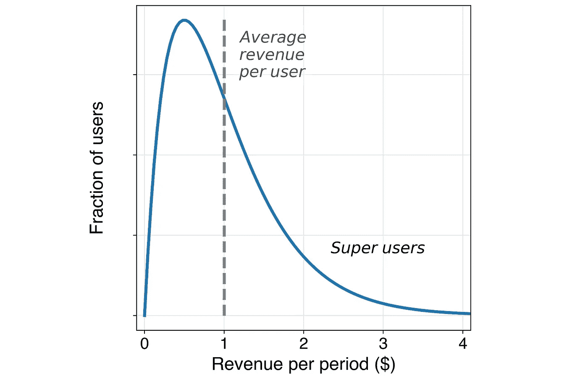
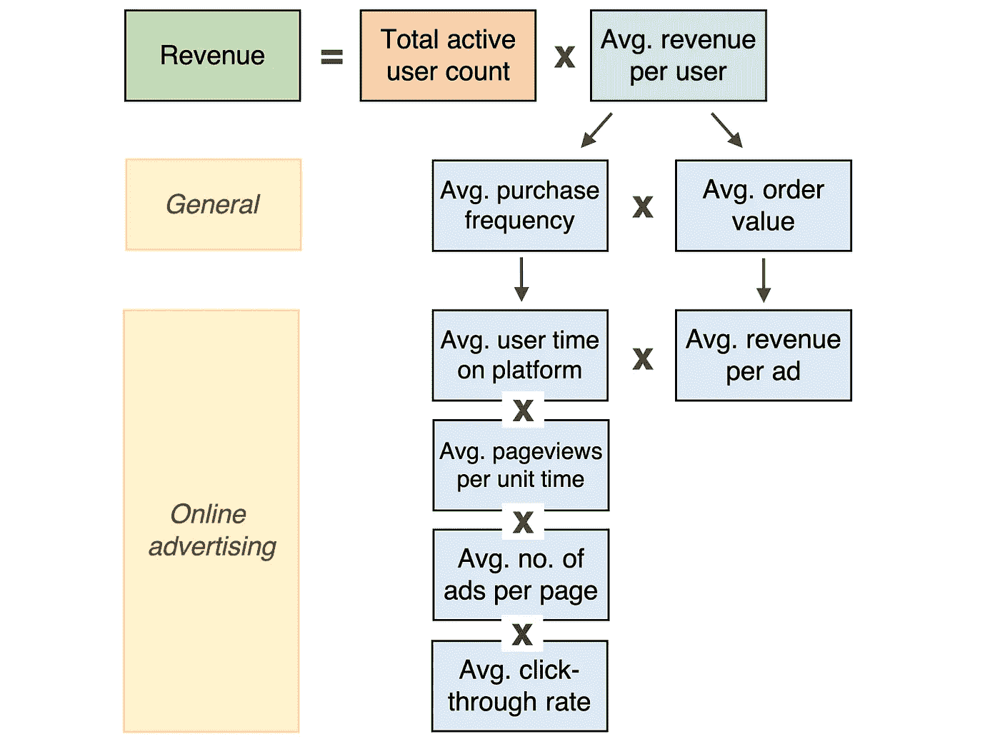
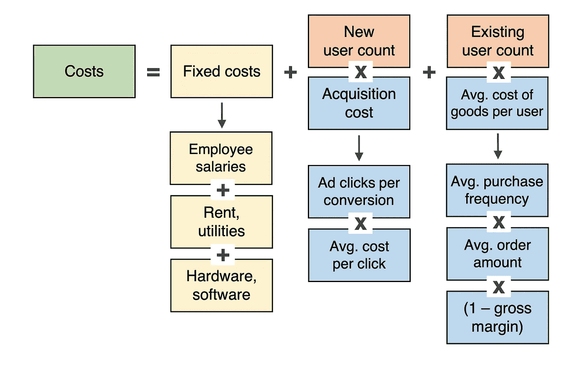

# 走向市场的数据科学

> 原文：<https://towardsdatascience.com/business-data-science-a6fe0b27466c?source=collection_archive---------37----------------------->

## 简单的概念将有助于您的公司跟踪和促进用户增长，保持和盈利能力。

图片来源: [Unsplash](https://unsplash.com/photos/Vrv_nZHaFTc)

# 介绍

T 大多数公司的核心焦点是扩大用户群并将其货币化。肩负这一使命，商业分析数据科学家必须衡量和优化用户增长、用户保持率以及由此带来的盈利能力。

考虑到这一点，本文回顾了您可以采取的具体步骤:

*   通过测量和优化病毒系数、周期时间和客户获取成本，推动可持续的用户**增长**。
*   通过建立活跃的用户定义、跨群组和产品行动细分留存率，以及对留存率数据建模，来衡量、改善和预测用户留存率**。**
*   通过提高每用户收入、降低客户获取成本、延长用户生命周期以及关注高价值用户来推动**盈利**。

# 1.增长

增长的重点是让人们成为你的产品或服务的新用户。有几个渠道(方案 1)可以给你带来新用户:

**方案一**。推动用户增长的流量来源。

*   **直接**。用户在他们的地址栏中手动键入 URL。在实践中，[直接](https://moz.com/blog/guide-to-direct-traffic-google-analytics)流量还包括那些点击嵌入在 Word 或 PDF 文档中或显示在短信中的书签或链接的人。
*   **搜索**。谷歌显示的搜索结果是基于关键字匹配的强度，以及通过其他网站的链接衡量的受欢迎程度。[搜索引擎优化](https://medium.com/startup-grind/seo-is-not-hard-a-step-by-step-seo-tutorial-for-beginners-that-will-get-you-ranked-every-single-1b903b3ab6bb)专注于选择合适的关键词和获得高质量的入站链接。对于应用开发者来说，苹果和谷歌 Play 应用商店也有类似的追求。
*   **付费广告**。通常根据点击付费或印象付费来定价，广告可以从搜索、社交和视频平台(如谷歌、脸书、YouTube)或特定网站(如纽约时报)购买。为用户付费时，比较新用户的预期终身价值和他们的获取成本是很重要的(见第 3 节:盈利能力)。
*   **下线**。当前用户可以邀请新用户使用您的产品。这种人对人的用户获取手段也被称为病毒式增长。因为人们通常信任他们的联系人，推荐可以成为廉价、高价值流量的良好来源。如下所述，跟踪与病毒式用户增长相关的指标可以促进产品开发。

## 1.1 病毒增长

[Hotmail 的电子邮件签名](https://tishiasavestime.com/the-history-of-viral-marketing-how-hotmail-became-hot/)始于 1996 年，是一个邀请收件人获得自己账户的链接，这可能是所谓病毒式营销的第一个例子。如今，许多公司(例如，[优步](https://help.uber.com/driving-and-delivering/article/referring-drivers-and-riders?nodeId=03db9e2b-270b-4fdb-95a7-afce7c6b4b3b)、 [Square](https://cash.app/help/us/en-us/3124-cash-refer-friends) 、[网飞](https://help.netflix.com/en/node/111363))都提供推荐奖励。

病毒系数为 2 的两个生长周期。

借用流行病学的[病毒增长模型](https://readwrite.com/2015/10/09/virality-math-formula/)，对于理解新冠肺炎和其他传播性疾病的[传播至关重要，它允许在假设新用户仅由现有用户带来的情况下，预测用户数量随时间的变化。具体来说，任何特定时间的用户总数 *U* ( *t* )可以表示为](https://rt.live/)

其中 *U* ₀是起始用户数， *t* / *c* 是经过的周期数(对于经过的时间 *t* 和周期时间 *c* ),而 *k* 是病毒系数(流行病学中又称为 [*R* ₀](https://en.wikipedia.org/wiki/Basic_reproduction_number) )，或每个现有用户带来的新用户数。在下文中，我将展示这些术语的重要性，并描述您的企业可以采取哪些具体步骤来利用这些杠杆推动病毒式增长。

## 1.2 病毒系数

病毒式增长模型的关键假设是，新用户通过与现有用户的互动参与到产品中。你可以用
**邀请率** ( *发出邀请数**当前用户数*)乘以**接受率** ( *接受邀请数**发出邀请数*)来计算你公司的病毒系数。

例如，如果现有用户平均发送 5 个邀请，40%的受邀者接受，则病毒系数为 5 × 0.4 = 2。在这个场景中，每个当前用户将带来 2 个新用户。许多年轻公司的基本目标是获得一个病毒系数，因为 *k* = 1 定义了饱和增长和加速增长之间的界限(图 1，左)。

**图一**。根据等式，病毒系数 *k* 和周期时间 *c* 对用户群增长的影响。1.( ***左*** )线性增长结果为 *k* ≈ 1(注: *U* 未定义在 *k* = 1)而 *k* > 1 和 *k* < 1 分别产生指数增长和饱和。(**右**)缩短周期时间保持生长轨迹形状，但沿 x 方向压缩。

## 1.3 周期时间

在分析中引入时间，病毒系数 *k* 被提升到幂 *t* / *c* + 1。这里，**周期时间** ( *c* )是一组用户的转化和其被邀请者的转化之间的时间间隔， *t/c* 则是经过的病毒周期数。按照这个逻辑，对于给定的时间 *t* ，减少周期时间 *c* 相当于增加经过的周期数(图 1，右)。

**方案二**。病毒循环。

病毒循环由三个步骤组成:( *1* )传递积极的用户体验，( *2* )用户邀请其他人，( *3* )其中一些邀请被接受(方案 2)。然后，周期时间 *c* 被计算为一个用户的转换和他们带来的用户的转换之间的平均时间间隔。

## 1.4 加速增长

等式 1 表明，增加病毒系数 *k* 和减少周期时间 *c* 是增加用户增长的病毒成分的两个关键杠杆。我在下面的文章中概述了你可以采取的促进病毒增长的行动。

***增加病毒系数***

由于 *k* 是邀请率和接受率的乘积，增加其中任何一个都会增加病毒系数。为了提高您的**邀请率**(图 2，顶部):

**图二**。通过优化当前用户的邀请率(上图:Dropbox 示例，[图片来源](https://viral-loops.com/blog/dropbox-grew-3900-simple-referral-program/))和被邀请的潜在新用户的接受率(下图:脸书示例，[图片来源](https://www.facebook.com/))来提高病毒系数。

*   **增加一个** **邀请列表**。向用户展示从电子邮件或社交媒体中提取的联系人列表将使当前用户更容易邀请其他人。
*   **奖励** **分享**。这些可以是单向或双向的，有利于邀请者或邀请者和被邀请者，可以是金钱或其他。这使得发送邀请更有吸引力。
*   **延长用户寿命** *。*这允许更多的共享(另见第 2 节，保留)。一旦用户离开，他们将不会发送邀请。

为了提高您的**接受率**(图 2，底部):

*   陈述你的价值主张。将此添加到登录页面有助于转变持观望态度的潜在用户。
*   **减少签约摩擦*。*** 要求尽可能少的输入字段(如姓名、电子邮件、密码)会让那些感兴趣的人更容易转换。

***减少循环时间***

减少周期时间相当于快进你的生长轨迹，并通过加速方案 2 中所示的病毒周期的每个阶段来实现。考虑执行以下操作:

*   **快速交付关键事件*。***[啊哈时刻](https://www.appcues.com/blog/aha-moment-guide)把一个新用户从评价带到忠诚模式。优化呈现给用户的导航选项的顺序(转换漏斗)，让他们尽快获得积极的体验。
*   **增加一个“分享”功能*。无论是在啊哈时刻的旁边还是之后不久，一个满意的用户应该能够在他们记忆犹新的时候邀请朋友。***
*   **推出即将到期的激励措施**。通过在有限的时间内提供一些东西来激励当前用户更快地邀请他们的朋友。
*   **减少签约摩擦**。除了提高接受率(见上文)，最大限度地减少所需的输入字段也将减少用户在这一步花费的时间。

# 2.保留

虽然增加新用户至关重要，但最终是*的活跃用户*通过点击广告或购买来增加收入。因此，关注这些用户，将他们从其他用户群中分离出来是非常必要的。活跃用户通常只占累计注册用户的一小部分:例如，普通的移动应用[仅在 3 天内就失去了 80%的日活跃用户](https://andrewchen.co/new-data-shows-why-losing-80-of-your-mobile-users-is-normal-and-that-the-best-apps-do-much-better/)。

两个期间的活动用户(蓝色)，每个期间的保留率为 0.5。

您的总用户群可以分为新用户、活跃用户和流失用户(方案 3)。如箭头所示，有 5 种可能的转换:

**方案三**。累积注册用户群中的用户包括新用户、活跃用户和流失(流失)用户。新用户要么被保留为活跃用户，要么由于不活跃而流失。活跃用户可以流失，流失的用户可以重新激活。

*   非用户通过**转化**成为新用户
*   新用户通过**保持活跃用户**
*   或者那些新用户都流失到
    **早期流失**
*   丢失的用户通过**复活**回到活动状态
*   活跃用户通过**后期流失成为流失用户，**与早期流失不同，他们在流失之前已经从产品中获得了价值

按照这个逻辑，在给定的时间间隔内你的活跃用户数的变化可以表示为
*保留的新用户* + *恢复的失去的用户-在那个时间段内失去的活跃用户*。

## 2.1 定义活动用户

活跃用户是指在特定的时间间隔内完成了某些行为的人，这些行为最好与收入产生相关联。活跃用户的定义因公司而异，表 1 中显示了选定的示例。

**表 1** 。所选公司的活动用户定义和计数。参考资料:[脸书](https://s21.q4cdn.com/399680738/files/doc_financials/2020/q1/Q1-2020-FB-Earnings-Presentation.pdf)，[推特](https://s22.q4cdn.com/826641620/files/doc_financials/2020/q1/Q1-2020-Shareholder-Letter.pdf)，[优步](https://s23.q4cdn.com/407969754/files/doc_financials/2019/sr/InvestorPresentation_2020_Feb13.pdf)，[广场](https://s21.q4cdn.com/114365585/files/doc_financials/2019/q4/2019-Q4-Shareholder-Letter-Square.pdf)，[网飞](http://d18rn0p25nwr6d.cloudfront.net/CIK-0001065280/4afe837e-b704-49cd-b9f3-9583bfad10ca.pdf)，[亚马逊](https://etaileast.wbresearch.com/blog/amazons-engaged-buyers-drive-social-media-revenue)。

除了定义操作之外，您还必须规定时间间隔，在该时间间隔内，用户必须采取该操作才能被视为活动的。这通常与用户参与产品的频率有关。例如，每当用户有时间浏览时，社交媒体就会提供免费的个性化内容，而且许多用户每天都会访问。另一方面，打车、电子商务和移动支付平台解决了偶尔的需求，通常需要花钱，因此它们的用户参与频率较低。公司选择主动用户定义来反映核心用户的产品使用频率。

## 2.2 计算用户留存率

有了活动用户定义和适当的时间间隔，您可以创建一个用户活动日志(表 2 ),显示用户在某一天的状态。然后，通过从日期列中减去每个用户第一次使用的日期，可以将该表转换为以注册为中心的活动日志(表 3)。

**表 2** 。以日期为中心的用户活动日志，显示用户状态(活动= 1)。连字符代表特定用户注册之前的日期。

**表 3** 。以注册为中心的活动日志。“天”列指的是自用户加入以来的天数。根据定义，所有用户在第 0 天都是活动的。连字符表示用户注册后由于最近注册而尚未到达的天数。

以注册为中心的格式表面洞察用户旅程中的里程碑。例如，用户注册后 3 天发送的电子邮件可能会提高第 3 天的活跃用户比例(保留率)。

相反，以日期为中心的格式显示了发生在特定日期的新闻或产品发布的效果(例如，2017 年 1 月的 [#DeleteUber](https://www.businessinsider.com/uber-deleteuber-protest-hundreds-of-thousands-quit-app-2019-4) 活动)。

## 2.3 可视化用户留存率

以注册为中心的用户活动日志可用于绘制保留曲线，即活跃用户的比例与自注册以来的天数。这条曲线揭示了用户参与度下降的速度，在哪里趋于平稳，以及用户是否会复活。有三种[用户保持模式的原型](https://www.sequoiacap.com/article/retention):下降型、扁平化型和微笑型。

**长期来看，当活跃用户数趋向于零时，用户保持率下降**(图 3，蓝色轨迹)，这表明产品与市场不匹配。获得一群忠诚的核心用户(也就是说，推高*y*-渐近线)是一家年轻公司面临的最紧迫的任务，并从[解决企业或个人面临的一个关键问题](https://www.youtube.com/watch?v=C27RVio2rOs)开始。一个值得注意的警告是视频游戏行业:长期的客户保持几乎是不可能的。像《Farmville》和《愤怒的小鸟》这样曾经轰动一时的游戏现在只拥有其总用户群的极小一部分。在这种情况下，合理的目标是优化用户增长和降低流失率，以最大化保留曲线下的区域(即活跃用户天数)。

**图 3** 。保留曲线的三个经典例子。

**当一部分新用户发现产品的价值并在注册后很长一段时间内保持活跃时，就会看到保持率持平**(图 3，橙色轨迹)。大多数成功的企业都属于这一类。然而，并不是所有的扁平化保持曲线都是一样的:保持曲线结束时的值衡量了产品与市场的匹配程度。例如，网飞在流媒体视频领域处于领先地位，[在注册一年后保留了三分之二的用户。因为获得一个新客户几乎总是比保留一个现有客户更昂贵](https://secondmeasure.com/datapoints/netflix-disney-plus-apple-customer-retention/)，所以通过提高保留率来扩大活跃用户群通常比增加新用户注册更有利可图。

**微笑保持**是理想的场景:一些不活跃的用户返回(图 3，绿色轨迹)。增加产品类别可以鼓励用户复活:在开始在线图书销售四年后，亚马逊开始销售[几乎所有其他的东西](https://www.nytimes.com/1998/08/05/business/amazoncom-is-expanding-beyond-books.html)，促使不活跃的图书购买者通过不同的产品重新参与进来。网络效应也鼓励复活:随着越来越多的司机注册该平台，优步乘车的等待时间减少了，因此该服务对乘客变得更有价值。同样，随着越来越多的智能手机用户下载 WhatsApp，早期用户看到朋友加入该平台，有理由重新使用该服务。

抛开保留率的波动不谈，有一点是肯定的:从长远来看，每家公司最终都会失去所有的用户。考虑一个最近的例子:在声称占有美国智能手机市场 37%的份额仅仅十年后，黑莓将于 2020 年[停止其手机生产](https://www.businessinsider.com/tcl-killing-blackberry-phones-august-2020-2)。

## 2.4 保留和产品开发

**表 4** 。群组分析:用户注册当月的总保持率。

沿着感兴趣的某个维度绑定保留数据通常很有帮助。根据加入日期对用户进行分组(表 4)是这一概念的一种常见实现，被称为[群组分析](https://chartio.com/learn/marketing-analytics/cohort-analysis-primer/)。

群组分析可以揭示跨产品迭代的用户参与度。理想情况下，年轻群体的参与度下降较慢，长期保持率较高。虽然不一定是因果关系的证据，但随着时间的推移，用户参与度的增加与产品市场匹配度的提高是一致的，并且不一定仅从平均留存数据来看是明显的。

与此同时，集思广益可能与保留相关的用户行为可以帮助激发积极的产品变化。在一个众所周知的轶事中，脸书的早期成长团队发现，新用户在平台上的头 10 天里，其留存率与朋友数量之间存在关联。基于这一观察，该公司能够通过将新用户引向关键的“添加好友”行动来提高保留率。

您还可以跨用户人口统计信息
(例如，年龄、性别、地理位置)或获取渠道检查留存率。注意到这些群体之间在保留率上的差异可以提供一个行动号召，也许会激发产品变化来解决不足，或者加倍对符合忠诚档案的潜在用户进行营销。

## 2.5 建立用户留存模型

在观察到的客户行为的时间范围之外预测留存数据，可以让您了解公司的稳态用户参与度，对于估计客户终身价值至关重要(第 3 节，盈利能力)。

考虑一组[真实留存数据](https://doc.lagout.org/Others/Data%20Mining/Data%20Mining%20Techniques_%20For%20Marketing%2C%20Sales%2C%20and%20Customer%20Support%20%282nd%20ed.%29%20%5BBerry%20%26%20Linoff%202004-04-09%5D.pdf#page=416)来衡量
12 年来的客户参与度(图 4，顶部，蓝色散点)。假设您在第 6 年，并且您想要预测未来几年的保留率。你可能会原谅试图拟合指数，尽管你最终会发现它低估了长期记忆(虚线)。

**图 4** 。用户留存数据(蓝色散点)的指数(点状)和移位贝塔几何(sBG，虚线)拟合。为了说明每种方法的预测能力，模型在数据的前半部分(0-6 年)进行了训练。

指数函数未能捕捉到观察到的保留数据的形状 *S* ( *t* )是由于其隐含假设，即从一个周期到下一个周期，逐周期(即瞬时)保留保持不变。

但观察到的瞬时留存，计算为
*R*(*t*)=*S*(*t*)*S*(*t*-1)，明显随着客户保有期的增加而增加(图 4，底部，橙色散点)。这是一个混合转变的例子:老一代人已经淘汰了高流失率的用户，留下了忠诚的用户。

[移位贝塔几何(sBG)](https://faculty.wharton.upenn.edu/wp-content/uploads/2012/04/Fader_hardie_jim_07.pdf) 保留模型通过假设每个客户都有自己的*常数*瞬时更新概率 *r* 以及在时间 *t* 的最终存活概率 *rᵗ* 来适应这种观察到的瞬时保留增加 *R* ( *t* )。在整个客户群中， *r* 的分布遵循 [beta 分布](/beta-distribution-intuition-examples-and-derivation-cf00f4db57af)，所有客户的*合计*瞬时留存率随时间变化如下

其中参数 *α* 和 *β* 和[决定了整个客户群中 *r* 的形状](https://faculty.wharton.upenn.edu/wp-content/uploads/2012/04/Fader_hardie_jim_07.pdf#page=6)。

将此用于 *R* ( *t* )的 sBG 表达式拟合到经验瞬时保留数据上(图 4，底部)，随后将累积保留函数 *S* ( *t* )作为 *R* ( *t* )的累积乘积，提供了与观察数据的良好拟合(图 4，顶部，虚线)。相关计算见[本笔记本](https://github.com/mboles01/Growth/blob/master/LTV_calculation_sBG.ipynb)。在计算客户终身价值时，有一个准确的保留预测会很有用(第 3.3 节)。

# 3.收益性

任何企业的目标都是盈利，或者产生超过成本的收入。本节概述了公司的用户群与其收入、成本和最终盈利能力之间的关系。

## 3.1 收入

一家公司的收入通常在其用户群中分布不均匀。例如，从广告或一次性产品销售中产生收入的企业有一个几乎连续的和潜在的大范围的每客户收入分布，其形状可以近似为一个偏斜的(例如，伽玛或对数正态)分布(图 5)。这一特征反映了这样一个事实，即一小部分客户为公司贡献了不成比例的收入份额，这在其他社会指标中也可以看到[，如家庭收入、城市人口和名字出现频率。](https://arxiv.org/PS_cache/cond-mat/pdf/0412/0412004v3.pdf)

**图 5** 。每个用户贡献的收入的长尾分布。

如果用户分布在全球各地，即使是只有少量定价方案的订阅型企业也能看到每用户可能的收入值。例如，网飞只有三个定价等级，但[收取多种货币的订阅费](https://www.comparitech.com/blog/vpn-privacy/countries-netflix-cost/)。因此，瑞士的网飞用户每月支付 22 美元，而哥伦比亚的用户每月只需支付 5 美元。

将特定时间间隔内的总收入除以活跃用户数，得出每用户平均收入**【ARPU】。表 5 显示了选定公司最近的季度 ARPU 数字。**

****

****表 5** 。选定公司的每用户季度收入(Q1 2020)。参考资料:[脸书](https://s21.q4cdn.com/399680738/files/doc_financials/2020/q1/Q1-2020-FB-Earnings-Presentation.pdf)，[推特](https://s22.q4cdn.com/826641620/files/doc_financials/2020/q1/Q1-2020-Shareholder-Letter.pdf)，[优步](https://s23.q4cdn.com/407969754/files/doc_financials/2019/sr/InvestorPresentation_2020_Feb13.pdf)，[广场](https://s21.q4cdn.com/114365585/files/doc_financials/2019/q4/2019-Q4-Shareholder-Letter-Square.pdf)，[网飞](http://d18rn0p25nwr6d.cloudfront.net/CIK-0001065280/4afe837e-b704-49cd-b9f3-9583bfad10ca.pdf)，[亚马逊](https://etaileast.wbresearch.com/blog/amazons-engaged-buyers-drive-social-media-revenue)。**

**ARPU 在公司的用户数量和收入之间提供了一个有用的链接。如图 6 所示，增加收入就是增加活跃用户群的规模(参见第 1 节和第 2 节“增长和保持”)，增加 ARPU，或者两者兼而有之。在一般情况下，ARPU 可以通过提高**平均采购频率** (单位时间内的采购数量)**平均订单价值**，或者两者同时提高。**

****

****图 6** 。通过每个用户的平均收入(ARPU)说明了收入和活跃用户数之间的联系，其中 ARPU 细分为以在线广告点击形式收集的收入。**

**网飞或 Spotify 等基于订阅的企业看到客户收入定期到达。相反，电子商务、物流和社交媒体公司让用户在特定的参与情况下产生收入，必须找到激励用户在给定时间内下更多订单或点击更多广告的方法。**

**以下是如何提高**购买频率**的方法:**

*   ****降价**。如果需求有足够的弹性，这将会提高 ARPU:购买频率的大幅增加可以弥补每次购买收入的下降。亚马逊在 2017 年收购全食超市时打了这个赌，并对鳄梨和杏仁牛奶进行了降价。**
*   ****添加产品类别**。这将允许你挖掘未被满足的需求，并从现有客户那里获得更多的购买。例子包括亚马逊扩展到图书销售之外，优步开发 Eats。**
*   ****创建付费忠诚度计划**。利用[沉没成本谬误](https://time.com/5347133/sunk-cost-fallacy-decisions/)来增加购买频率。购买了 Prime 会员资格后，亚马逊的顾客在网站上的花费比之前多了 150%,也许是为了“证明”会员费用的合理性。**
*   ****增加广告相关性**。对于依赖[广告收入的公司](https://buffer.com/library/facebook-advertising-cost/)(例如，谷歌、脸书、推特)来说，购买频率相当于单位时间内的广告展示次数或广告点击次数。在点击付费定价的情况下(目前占全球广告支出的 [63%)，购买频率是广告印象和](https://www.iab.com/wp-content/uploads/2020/05/FY19-IAB-Internet-Ad-Revenue-Report_Final.pdf#page=22)[点击率](https://support.google.com/google-ads/answer/2615875?hl=en) (CTR)的乘积。出于这个原因，这些公司使用投标价格*和*相关性分数，并考虑预测的 CTR，来确定谁赢得在线广告拍卖。**

**相反，你可以通过以下方式**增加订单价值**:**

*   ****提价**。如果需求足够缺乏弹性，这将增加 ARPU:购买频率的小幅下降会被价格上涨所抵消。网飞提供了一个这样的例子:2019 年，该公司[将其订阅价格](https://www.pcmag.com/news/netflixs-us-subscriber-count-falls-after-price-hike)提高了 18%，而订阅量仅下降了 0.2%。**
*   ****强调昂贵的物品**。在你的网页或应用程序设计中突出这些产品。例如，亚马逊可能会在“推荐给你”部分显示价格更高的商品，而优步可能会在 UberX 经济选项之前显示价格更高的黑色骑行选项。**
*   ****增加最低购买奖励**。电子商务公司可以提供最低购买量的折扣运费或额外商品。比如:“至少消费 50 美元，获得 *X* ”，其中 *X* =免运费，下一单打九折，等等。**
*   ****捆绑和交叉销售**。成组销售商品可以增加平均订单价值。例如:“需要一支铅笔吗？我们只卖 10 支装的。”或者“买支铅笔？你也应该得到这个橡皮擦。”**
*   ****需求增加时限制供应**。当你不直接设定价格时，这实际上是在提高价格。例如，脸书在 2020 年收取的平均每次点击成本为[0.97 美元，高于 2016 年](https://www.webfx.com/social-media/how-much-does-facebook-advertising-cost.html)的[0.28 美元。这既反映了随着用户群和参与度的增长放缓，广告库存的供应趋于平缓，也反映了随着更多企业看到令人信服的广告支出 ROI 并因此抬高广告价格，需求增加。](https://buffer.com/library/facebook-advertising-cost/)**

## **3.2 成本**

**每个企业都面临着与创造产品或服务相关的成本。这些费用通常分为[固定成本和](https://www.investopedia.com/ask/answers/032515/what-difference-between-variable-cost-and-fixed-cost-economics.asp)可变成本，其中可变成本与产量成比例。虽然可变成本对于一家烘烤饼干或洗衣服的公司来说是真实存在的，但那些专注于软件开发的人通常几乎不需要增加成本就可以将他们的体验传递给多一个客户。**

**在每用户的基础上*表达可变成本，而不是每产出单位的成本，可以对成本进行有意义的描述，该成本随着接触到的客户数量的增加而增加(图 7)。在这种情况下，一个公司在一定时期内的总成本是固定成本(工资、建筑、设备等)的总和。)和可变成本包括 [**顾客获取成本**](https://www.investopedia.com/terms/a/acquisition-cost.asp) 和 [**商品销售成本**](https://www.investopedia.com/terms/c/cogs.asp) 。***

****

****图 7** 。以用户为中心的固定和可变成本框架，用户获取来自付费广告。**

**你可以计算你的客户获取成本(CAC ),用你获取的新用户数除以获取新用户的总花费。如果你是按广告点击付费，你的 CAC 就是每次转换的点击量和相关的每次点击成本的乘积。CAC 提供了营销支出效率的一个重要衡量标准:一个经验法则[规定 CAC 应限制在客户终身价值的三分之一以下(见下一节，盈利能力)。](http://s3.amazonaws.com/arena-attachments/2691064/f08eb7e7366c27a1ea5cafc7df8f8dab.pdf?1536761476#page=312)**

**以下是你如何**降低客户获取成本**:**

*   ****推动免费用户增长**。客户直接进入你的网址，通过有机搜索进入你的网页，或者接受一个现有用户的邀请(见第 1 节:增长)都不会让你付出任何代价。提高你的公司在免费搜索结果中的排名，优化其病毒式增长引擎，将会推动*免费*新用户的获取，从而降低你的平均 CAC。**
*   **寻找更便宜的付费用户来源。衡量一系列营销渠道或广告活动的每次点击成本和转化率。考虑采用[渐进转变](https://repository.upenn.edu/cgi/viewcontent.cgi?article=1602&context=statistics_papers)从探索资源到开发最便宜的新用户资源，而不是在两个不同的阶段运行测试和展示(参见[多兵种土匪问题](https://lilianweng.github.io/lil-log/2018/01/23/the-multi-armed-bandit-problem-and-its-solutions.html))。**

**除了为获得用户而付费之外，你还可以在每次向他们提供产品或服务时付费。这个总数，也就是你卖给每个用户的商品成本(COGS)，是你收入中可变成本所占的份额，或者减去你的毛利润。毛利润抵消了固定成本，并决定了业务达到收支平衡所需的活跃用户数量。**

**这很棘手，但这是我给**的大胆建议，降低你的商品成本**:**

*   ****做软件公司**。脸书和谷歌不需要为销售额外的广告支付任何费用，微软也不需要为多一个客户延长 Office 许可支付任何费用。另一方面，以硬件和物流为重点的科技公司会这样做:苹果的 iPhone 的 [COGS 大约是销售价格的 40%,而优步的](https://www.reuters.com/article/us-apple-iphone/apples-iphone-x-has-higher-margin-than-iphone-8-analysis-idUSKBN1D62RZ) [23%的提取率](https://s23.q4cdn.com/407969754/files/doc_financials/2019/sr/InvestorPresentation_2020_Feb13.pdf#page=15)意味着相对较高的 77%的乘车费用收入。**
*   ****成为巨人，消灭竞争对手**。提供实物商品或劳动密集型服务的公司只能在竞争格局允许的范围内降低成本。例如，手机部件供应商[较弱的议价能力使得苹果公司能够挤压供应商的利润，使得苹果公司的零售价格成为智能手机市场](https://www.investopedia.com/articles/investing/111015/analyzing-porters-five-forces-apple.asp#bargaining-power-of-suppliers)中最低的。相反，优步不能合理地期望以同样的方式压榨它的司机——如果优步提高他们的乘车率，优步的司机就会转向 Lyft。**

## **3.3 盈利能力**

**企业的[价值](https://www.investopedia.com/terms/d/dcf.asp)是公司预期现金流(利润)的现值，[以反映这些现金流风险的](https://www.investopedia.com/terms/c/capm.asp)利率贴现。表 6 显示了选定公司的季度收益(利润)数据。**

****

****表 6** 。选定公司的盈利能力(Q1 2020)和市值。参考资料:[脸书](https://s21.q4cdn.com/399680738/files/doc_financials/2020/q1/Q1-2020-FB-Earnings-Presentation.pdf)，[推特](https://s22.q4cdn.com/826641620/files/doc_financials/2020/q1/Q1-2020-Shareholder-Letter.pdf)，[优步](https://s23.q4cdn.com/407969754/files/doc_financials/2019/sr/InvestorPresentation_2020_Feb13.pdf)，[广场](https://s21.q4cdn.com/114365585/files/doc_financials/2019/q4/2019-Q4-Shareholder-Letter-Square.pdf)，[网飞](http://d18rn0p25nwr6d.cloudfront.net/CIK-0001065280/4afe837e-b704-49cd-b9f3-9583bfad10ca.pdf)，[亚马逊](https://etaileast.wbresearch.com/blog/amazons-engaged-buyers-drive-social-media-revenue)。**

*****客户终身价值*****

**类似于公司估值，客户的终身价值(LTV)是新获得的用户将为你的企业贡献的利润的现值。**

**估算客户 LTV 对于建立您的:**

*   ****营销预算**。花费不超过你估计的 LTV 的三分之一来获得一个新客户。**
*   ****商业健康**。用户数量和 LTV 是决定你公司未来现金流的两个旋钮，从而决定你公司的最终价值。**
*   ****客户理解**。发现哪些用户统计数据和产品行为与高 LTV 客户最密切相关。**

**客户的 LTV 可以通过将客户的定期(例如每月、每年)现金流(*cf*₁+*cf*₂+…+*cfn*)相加，并应用适当的贴现率 *d* 来计算:**

****

**其中现金流是收入减去在 *t* 期间从客户处收取的 COGS，贴现率 *d* 与公司的[资本成本](https://www.investopedia.com/terms/c/capm.asp)相关。完全了解客户的购买意图，就有可能计算出他们对你公司的 LTV。例如，在 10%的贴现率下，如果客户在 5 年内每年交付 100 美元的现金流，那么他们的 LTV 就是[417 美元](https://www.wolframalpha.com/input/?i=100%2F1.1%5E0+%2B+100%2F1.1%5E1+%2B+100%2F1.1%5E2+%2B+100%2F1.1%5E3+%2B+100%2F1.1%5E4)。**

*****简单的 LTV 估计*****

**当然，你不会提前知道每个客户的现金流时间表。作为替代，您可以通过将预期的单位时间现金流乘以预期的客户生命周期来获得一个粗略的客户 LTV 估计值(图 8)。**

****

****图 8。**简化的客户 LTV 估算是每期收入(蓝框)、边际贡献和预期客户寿命的乘积。**

**为了*粗略地*预测一个客户对你的业务的总价值，估计:**

*   ****单位时间平均收入**。乘以客户的预期订单数量和频率(图 8，蓝色方框)。对于订阅业务，这两者都是在注册时通过合同建立的。对于未锁定合同的客户，使用所有客户的平均历史订单金额和频率，或客户特定细分市场(例如，年龄组、位置等)的平均历史订单金额和频率，估计每单位时间的预期收入。).*注意，这种方法忽略了金钱的时间价值。***
*   ****平均贡献率**。也被称为[毛利润](https://www.investopedia.com/ask/answers/122314/what-difference-between-gross-margin-and-contribution-margin.asp)，这是所有产品销售收入中未被可变成本消耗的平均部分。对软件公司来说，这个数字接近 1，而对那些支付实物投入或劳动力的公司来说，这个数字要低得多。**
*   ****平均客户寿命**。这可以粗略地近似为
    1 ÷流失率，或给定时间段内的客户流失÷间隔开始时的客户。例如，如果每月有 20%的用户离开，那么你的平均客户寿命是 5 个月。该方法源自相关的[几何级数](https://medium.com/@prashmaj/how-to-estimate-customer-lifetime-using-churn-rates-325f456a2f05)、*的收敛，低估了平均寿命*，因为流失概率通常会随着客户任期的延长而下降。**

**如上所述，这种 LTV 模型有两个缺点:( *1* )如果不贴现现金流，我们会过分强调未来收到的资金的实际价值，而( *2* )通过假设恒定的流失率，我们会低估真正的平均客户寿命。**

*****更好的 LTV 估计*****

**只需多一点努力，就有可能既考虑到资金的时间价值，又降低长期客户的流失率。在这种情况下，认识到预期客户生命周期是保留函数 *S* ( *t* )下的区域，客户 LTV 可以表示为*贴现*现金流和这个*客户生命周期的更精确估计*的乘积:**

****

**这简化为**

****

**要实施这种方法:**

****

****图 9** 。考虑时间折扣的平均客户寿命计算。本例使用了来自[的保留数据 S(t)，这里是](https://doc.lagout.org/Others/Data%20Mining/Data%20Mining%20Techniques_%20For%20Marketing%2C%20Sales%2C%20and%20Customer%20Support%20%282nd%20ed.%29%20%5BBerry%20%26%20Linoff%202004-04-09%5D.pdf#page=416)，贴现率为 *d* = 10%。**

*   ****拟合**你的实验保留数据， *S* ( *t* )(图 9，顶部)。
    参见第 2.5 节。**
*   ****将**模型化留存 *S* ( *t* )除以贴现因子，(1+ *d* ) *ᵗ* (图 9，底部)。**
*   ****求和**曲线下面积*s*(*t*)/(1+*d*)*ᵗ。多亏了贴现因子，总和收敛得很快。***

**预期 LTV 是曲线下面积(图 9，底部)和每期平均现金流的乘积，*参见*。参见[本笔记本](https://github.com/mboles01/Growth/blob/master/LTV_calculation_sBG.ipynb)的计算示例。**

*****老练的 LTV 估计*****

**上面概述的方法为您的普通客户提供了一个 LTV 估计。但是你可能希望找到特定客户的 LTV，或者更重要的是，确定你的高价值客户。在这种情况下，贝塔几何负二项分布( [BG/NBD](http://brucehardie.com/papers/018/fader_et_al_mksc_05.pdf) )模型会很有用。这种方法将一系列交易数据(例如，客户 id、交易日期、金额)与描述客户购买率和退出率的四个参数相匹配。这种分析为每个用户产生一个预测的货币价值。BG/NBD 模型的全面实现超出了本文的范围，但是您可以查看相关的[生命周期](https://lifetimes.readthedocs.io/en/latest/) Python 库和参考资料，以获得[概念性](http://cdn.oreillystatic.com/en/assets/1/event/85/Case%20Study_%20What_s%20a%20Customer%20Worth_%20Presentation.pdf)和[实践性](https://benalexkeen.com/bg-nbd-model-for-customer-base-analysis-in-python/)指导。**

**以下是你如何**增加客户终身价值**:**

*   ****增加现金流量**。这可以通过增加收入(3.1 节)、降低成本(3.2 节)或两者兼而有之来实现。**
*   ****增加客户寿命**。这是保留和盈利之间的关键环节。通过提高产品与市场的契合度(第 2.3 节)来减缓客户流失和鼓励复活，将会在 *S* ( *t* )中形成*y*-渐近线，扩大保留曲线下的区域，从而延长客户寿命。**

# **结论**

**你有它！从获得和留住用户到最大化他们对你的企业的价值，这篇文章概述了你在建立和维持一个成功的公司的旅程中可能采取的一些步骤。请不要犹豫，联系或者在下面的评论中留下你的反馈。**

**这篇文章的灵感来自一组优秀的相关文本([精益分析](t.ly/JgJYm)、[振幅](https://www.productanalyticsplaybook.com/)、 [Mixpanel](https://mixpanel.com/topics/) 、[社会资本](https://medium.com/swlh/diligence-at-social-capital-part-1-accounting-for-user-growth-4a8a449fddfc#.bvu0we2z3)、[部落资本](https://tribecap.co/a-quantitative-approach-to-product-market-fit/)、[红杉资本](https://medium.com/@sequoia))和视频([亚历克斯·舒尔茨](https://www.youtube.com/watch?v=8qwV-sAHsG8)、[埃利奥特·施穆克勒](https://productsthatcount.com/resources/video/instacart-vp-head-product-driving-growth-scale/)、[迈克尔·赛贝尔](https://www.youtube.com/watch?v=C27RVio2rOs))资源。**

**多亏了本·拉卡尔。**