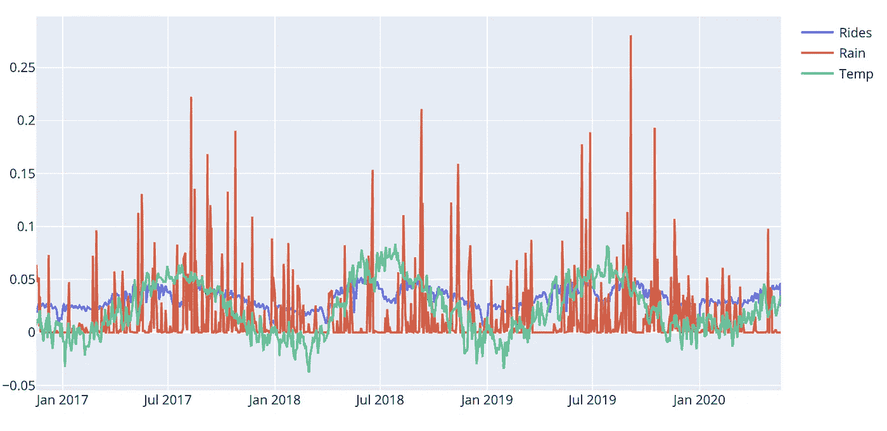
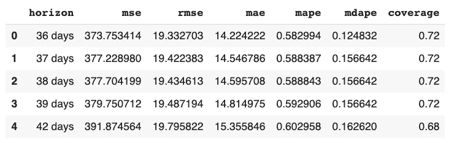
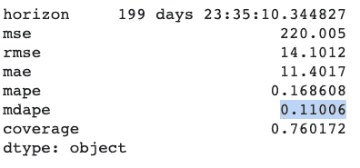

# 脸书预言家的商业预测

> 原文：<https://towardsdatascience.com/business-forecasting-with-facebook-prophet-b9aaf7121398?source=collection_archive---------33----------------------->

## 2020 年 6 月更新

## 在这篇文章中，你将学习如何使用脸书先知库进行可靠的时间序列分析和预测。

来源:( [@rosssneddon](http://twitter.com/rosssneddon) )转自 [Unsplash](https://unsplash.com/photos/zNGPmIVPQf4)

F 时间序列模型预测可被企业用于多种目的，例如优化销售、改善供应链规划和执行异常检测等。还有许多技术可以使用，从对历史数据的简单推断到更复杂的机器学习模型。一些先进的技术对数据、实施者和分析者都提出了相当高的要求，通常很难提出稳定的预测模型。Prophet 库的好处在于它相当宽容，这意味着它可以生成合理的结果。也就是说，Prophet 最适合具有明显季节性的商业类时间序列，并且您事先知道重要的商业日期和事件。与大多数时间序列工具一样，最好有一个包含几年观察结果的数据集。

最后，Prophet 也很容易通过其可理解的超参数进行调整。此外，它是可扩展的，所以如果你需要添加额外的回归，季节性或特殊事件，你可以很容易做到这一点。

# 要解决的问题

想象一下，我们在一家自行车租赁初创公司担任数据分析师，让我们称之为 Acme Bikes，我们收集了一些测量人们骑自行车上下班的数据。此外，数据集增加了历史降雨量和温度数据。我们被要求对数据集提供一些见解，并提供一个预测模型来估计任何给定时间范围内的未来通勤。我们还被要求以统计测试的形式提供一些有效性的指示。我们准备好了吗？但是当然。

# Prophet 简介—主要概念

Prophet 采用了一种新颖的方法，认为预测主要是一种使用概率技术和来自广义加法模型的灵感的曲线拟合练习。我们不会在这篇文章中深入研究数学细节，但对于那些倾向于此的人，我建议阅读预言家的原始论文。

Prophet library 对于具有明显季节性的商业时间序列以及对数据有重大影响的特殊事件(例如，国定假日、黑色星期五、新产品推出、促销活动等)非常有用。要对时间序列 Prophet 建模，请将信号分成以下附加分量:

先知组件

其中:

**g(t)** 是使用非线性饱和增长模型或分段线性回归模型对非周期性变化进行建模的趋势函数。您可以使用参数对此进行配置。

**s(t)** 是季节函数(每年、每周和每天)，用于模拟时间序列值的周期性变化。这个组件是使用傅立叶变换建模的，如果你愿意，你可以添加你自己的季节性。

**h(t)** 代表模拟假日和特殊影响事件的函数。您可以添加自己的自定义假日和特殊事件。

**εt** 是假设正态分布的模型误差/噪声

我认为这是一种直观而新颖的方法，分析师很容易从概念上理解预测是由什么组成的。稍后，我们将验证该模型实际上是按照数学描述的方式工作的。如果你对 Prophet 背后的数学和理论感兴趣，你可以阅读他们的[论文](https://peerj.com/preprints/3190/)，除了深入研究模型的不同组件之外，该论文还很好地描述了构建库背后的基本原理。说够了，我们开始吧！

# 关于数据的简短说明

对于这个假想的例子，我通过结合来自挪威道路管理局和挪威气象研究所的真实世界数据制作了一个数据集。更具体地说，该数据是在挪威奥斯陆 Ullevå的特定路段上计算自行车通勤者。您可以下载该数据她:[https://github . com/pixel bakker/datasets/blob/master/bike rides _ day . CSV](https://github.com/pixelbakker/datasets/blob/master/bikerides_day.csv)

# 这个计划

在我们开始工作之前，我们做一个简单的工作分解如下:

*   目视检查数据并控制缺失数据和异常值
*   如果需要，转换数据
*   在没有任何调整的情况下制作第一个预测模型并验证该模型。
*   通过添加特殊事件和日期来调整和测试模型
*   将降雨量和温度作为额外的回归变量，对模型进行调整和测试。
*   调谐超参数

# 首先看一下数据

为了简单起见，我选择提供一个干净的数据集，这样我们就可以把大部分时间花在实际的分析上，而不是挑选出坏数据。

导入库并读取数据和转换日期列

清单 1:我们的数据原始框架

Prophet 希望列有特定的名称，`ds`表示时间部分，`y`表示值部分。所以我们坚持这一点。

绘制数据以获得我们正在处理的东西的第一印象总是一个好主意。我使用 *plot.ly* 定制图表——这很好。

图一。我们数据的原始图

## 取消周末骑行

我们可以看到，数据有明显的季节性，可能还有轻微的积极趋势，尽管这很难看到。我们还可以注意到相当多的可变性。一些可变性可能是由于周末人们不通勤上班造成的。让我们从数据中去掉所有的周末，看看它是什么样子。

图 2:没有周末通勤的数据

仍有一些可变性，但相当少。希望剩下的大部分可变性可以用季节性、假期和我们额外的天气回归因素来解释:雨和温度。我们很快就会看到。

## 应用 Box Cox 变换

对于时间序列，对数据进行某种形式的幂变换以稳定方差并使数据更像正态分布通常是有用的。但是使用什么样的转换才能获得最好的结果呢？幸运的是，我们可以使用 Box Cox 变换来评估一组λ系数(λ),并选择实现最佳正态近似的值。我们可以这样做:

应用 Box Cox 变换。

图 3:经过 Box Cox 变换后。

我们可以看到，现在差异变小了，尤其是在季节性高峰附近。

## 绘制天气数据

当我们开始绘图时，让我们也来看看降雨和温度数据。在我们绘图之前，我们将数据标准化，这样我们就可以得到可比较的比例。

图 4:游乐设施和天气数据

毫不奇怪，气温与通勤量高度相关。我们看到这种模式在 7 月份被打破，很可能是因为挪威的公共假日。当涉及到下雨时，很难从情节中得出任何结论，但放大来看，有迹象表明下雨可能起了作用。我们走着瞧。

好的，看起来我们准备好出发了。让我们做一些预测。

# 使用 prophet 进行预测—初次尝试

Prophet 代码流非常简单:首先获得一个 Prophet 实例，并用我们的自行车骑行数据框拟合一个模型。然后，我们创建一个包含预测日期(地平线)的数据框，并将其传递给 Prophet predict 方法，如下所示:

当列出预测数据框时，我们得到:

清单 2:第一个预测数据框架

第*列*包含预测，然后你有预测的上下波段。尽管预测数据框包含了绘制自己的图所需的所有数据，但 Prophet 也提供了方便的绘制方法。为简洁起见，我们将尽可能使用内置方法，但在需要时，我们将使用 plotly 制作自己的自定义绘图。用 Prophet 绘制我们的预测可以这样做:

图 5:使用 Prophet 内置方法的预测图

您还可以将变化点(趋势模型正在变化的地方)添加到图中，如下所示:

图 6:有变化点的预测

这个先知剧情没有包含所有的改动点，只包含最重要的。如果您想查看所有这些，您可以使用以下代码:

图 7:所有模型的变化点。

如果我们愿意，我们还可以绘制出组成模型的所有组件:趋势、不同的季节和假期——我们将在后面更详细地介绍。现在，让我们用内置的绘图方法来看看组件。

它给出了以下输出:

图 8:到目前为止的模型组件。

我们可以看到，我们有一个明显的积极趋势，周一和周二是大多数人通勤的日子。我们也看到了强烈的年度季节性。

# 验证我们的结果

## 交互效度分析

为了让我们发现我们的模型表现如何，并知道我们是否正在取得进展，我们需要某种形式的验证。当然，我们可以编写自己的验证代码，但幸运的是我们不必这样做，因为 Prophet 提供了我们需要的大部分内容。

Prophet 库使得将我们的历史数据分为训练数据和测试数据进行交叉验证成为可能。使用 Prophet 进行交叉验证的主要概念是:

*   **训练数据(初始):**为训练预留的数据量。该参数位于名为 initial 的 API 中。
*   **Horizon:** 预留验证的数据。如果不定义周期，模型将符合 Horizon/2。
*   **截止时间(周期):**对截止时间和截止时间+时间范围之间的每个观察点进行预测。

得到的数据帧现在可用于计算 *yhat* 对 *y* 的误差度量。下面我用一些标记绘制了一个图表，帮助你以更直观的方式理解。在本例中，我们有一年的时间跨度，模型将对每个月(~31 天)进行预测。

图 9:显示训练期、截止期和水平期

## 获取性能指标

所以我们现在对先知图书馆做了第一次预测。但是我们怎么知道结果是否好呢？幸运的是，Prophet 提供了一些内置的性能指标来帮助我们。至于使用哪些指标，我就不赘述了，让您自己决定吧。可用的性能指标有:

*   **Mse:** 平均绝对误差
*   **Rmse:** 均方差
*   **平均误差**
*   **Mape:** 平均百分比误差平均值
*   **Mdape:** 中位数平均百分比误差

验证和收集性能指标的代码如下所示。首先，您需要获得交叉验证数据(我们已经在上面的代码清单中完成了，它是名为`cv_df`的数据帧)，然后我们将交叉验证数据帧放入 Prophet 方法`perfomance_metrics`，就像这样:

列出性能数据框架可为我们提供以下信息:

清单 3:每天的性能指标。

要查看我们的模型在一段时间内的表现，我们可以使用名为`plot_cross_validation_metric`的内置图表，如下所示:

这给出了下面的图:

图 10:随着时间的推移直观地查看交叉验证

我们看到我们得到了每天的天气预报。开始时，我们看到*平均百分比误差* (mape)相当大，但几天后它也下降了很多。希望当我们开始调整我们的模型时，我们可以使这个图更有性能。

随着我们继续进行，我们希望比较我们的验证结果，所以我选择在一侧制作一个电子表格来存储中间结果。此外，由于我们使用转换后的数字(还记得 Box Cox)，我们只使用百分比误差指标。为了保持跟踪，我们从交叉验证中收集平均聚合数据，如下所示:

`df_p.mean()`

它给出了这样一个列表:

清单 4:交叉验证数据的平均值

第一次运行后，结果电子表格如下所示:

图 11:第一次运行后的结果电子表格

在继续改进我们的预测模型之前，我们将添加两个效用函数，这样，如果我们想要测试不同的交叉验证设置，就不需要到处更改数据。它们看起来像这样:

# 改进我们的预测

## 添加假日

Prophet 有几种添加假日和特殊事件的方法。最简单方便的就是利用内置的国定假日。Python 中的假日包提供了每个国家的假日。他们的页面上有可用国家的列表，以及要使用的国家名称:【https://github.com/dr-prodigy/python-holidays.】T4 我们需要挪威假期，所以我们这样做:

最后一行代码列出了所有内置的假日，从表面上看，这个列表似乎是正确的，尽管它可能会增加平安夜或新年前夕等日期，但这是一个开始。如果我们想要查看假日回归所做的预测和影响，我们可以这样绘制它:

情节是这样的:

图 12:带有假日效应的绘图

如果我们查看交叉验证数据，我们可以看到该模型非常适合 5 月 1 日和 17 日，但 2018 年 5 月 30 日的提升日就不太适合了。此外，2018 年的升天日是在周四，这往往会让挪威人在周五休假。如果我们放大，我们可以在图中看到这一点。

图 13。放大五月份的日期

我们对圣诞款也没有什么特别的印象。如果我们放大 2019 年的图表，我们可以看到:

图 14:2019 年圣诞节的糟糕预测

幸运的是，先知给了我们添加自己的节日和特殊日期的机会。为了看看我们是否得到一个改进的预测，我们将为模型添加一些额外的日期来考虑。像这样:

对于*升天日*的日期，我已经设定了`upper_window`。这意味着这一天的影响会延续一天，这样我们也可以在星期五捕捉到这种影响。对于圣诞节日期，我设置了下面的窗口，这样我们可以赶上挪威平安夜的前一天，上面的窗口可以赶上许多挪威人的整个圣诞节假期。我们现在可以安装一个新的模型，并添加新的节日效果。

新的地块显示出令人印象深刻的改进。下面你可以看到 2019 年圣诞节的剧情，现在已经完美拟合。

图 15:圣诞节非常合适

我们暂时离开假期，但在继续之前，让我们收集一些性能数据并更新我们的性能表:

`getPerformanceMetrics(m).mean()`

清单 5:更新的性能表

正如我们所看到的，假日调整具有显著的预测效果。现在，让我们添加一些额外的回归变量。

# 添加额外的回归变量

如果我们看看这个图，它看起来还不错，但是我们能改进我们的预测吗？记得我们有一些额外的天气数据吗？让我们看看添加那些作为额外的回归变量是否会有任何影响。添加额外的回归量非常简单，但是请记住，如果您要在预测模型中使用一些回归量，您需要事先准备好数据。有了天气数据，这可以通过天气预报来实现。依我看，你可以使用的最简单和最可靠的额外回归变量是你知道的假期和特殊日期，所以我鼓励你在这些方面做一些额外的工作。但是回到天气数据。我们可以像这样将降雨和温度数据作为额外的回归量添加到模型中(注意，只有两行代码发生了变化，但为了便于执行，我将整个清单都留了下来):

图 16:使用额外回归变量雨水和温度绘制的图

从图上看，很明显，降雨和气温都对天气预报有影响。让我们收集性能数据并更新我们的性能表:

`getPerformanceMetrics(m).mean()`

它开始看起来像什么了！我们的*平均百分比误差*现在低于 10%。

清单 6。更新的结果表

# 调谐超参数

Prophet 有相当多的参数供您调整。我不打算深入研究所有的细节，但下面你可以看到代码，你可以用来测试不同的超参数在一个循环中，然后选择最好的。请记住，如果您选择一次性测试所有参数，排列的数量将会很多，运行时间将会很长。我选择一次调优一个参数，并在注释中留下了我开始时使用的参数数组，供您自己尝试。

为了查看调整是否有任何效果，我们用新的参数集拟合了一个新模式，如下所示:

清单 7:更新的结果表

我们看到我们在 *mape* 指标上有所改进，尽管并没有那么多。从其他时间序列分析中，我看到了更好的结果，所以我想这总是值得一试。

# 绘制和验证整个模型

请记住，在开始时，我们列出了数学公式，表示我们的预测是趋势、季节性、假日等模型组件的总和。我们实际上可以验证这是真的。让我们首先从绘制所有组件开始。

导致了这个情节:

图 17:列出模型中的所有组件

Plotly 做了一个奇妙的图表工作，你可以通过点击右边的图例标签来切换不同组件的视图，以获得更好的可读性。

为了检查模型的预测实际上是其组成部分的总和，我们可以运行以下代码片段:

并得到这样的确认:

清单 8:确认模型是其各个部分的总和

# 进行实际预测

所以，我们暂时结束了。我们最不想做的事情就是做一个实际的预测。请记住，我们还必须对 Box Cox 变换后的数字求逆，方法如下:

确认秤已恢复并可用于现实世界。

图 18:用真实世界的数字绘图。

# 结论

在本文中，您已经学习了如何使用脸书先知库进行时间序列预测。我们已经了解了如何使用 Box Cox 变换，以及如何添加额外的回归变量和调整 Prophet 模型，以使性能越来越好。我们以大约 17%的平均百分比误差开始，以大约 9%结束，这是一个相当大的改进和有用的结果。我希望这篇文章对你有价值，并且你学到了一些可以在你自己的工作中使用的东西。