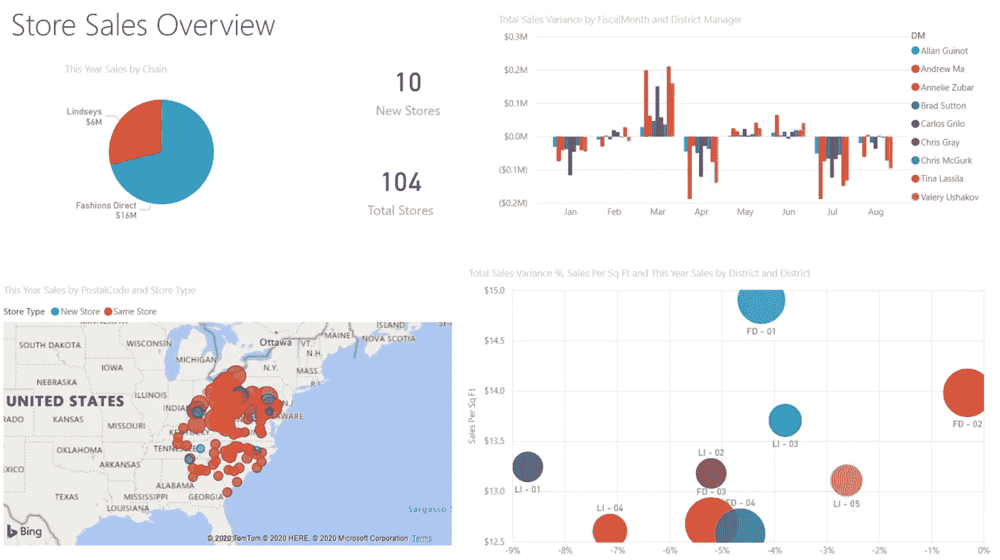
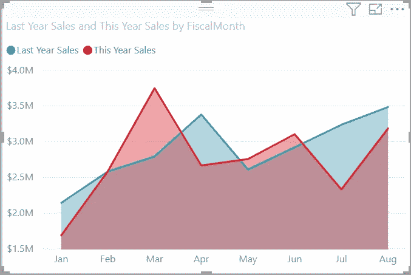
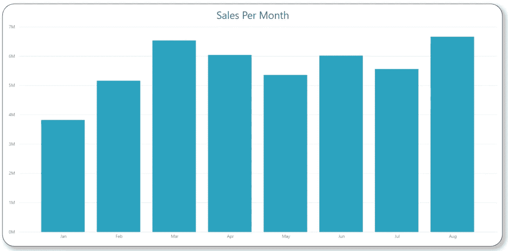
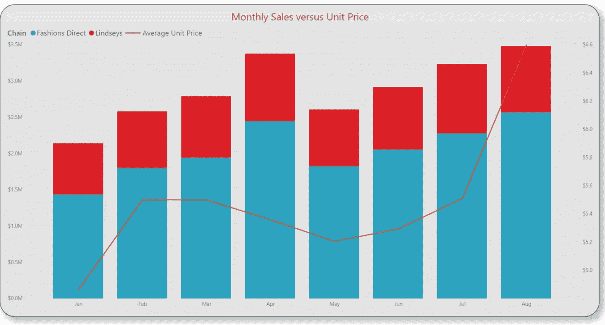
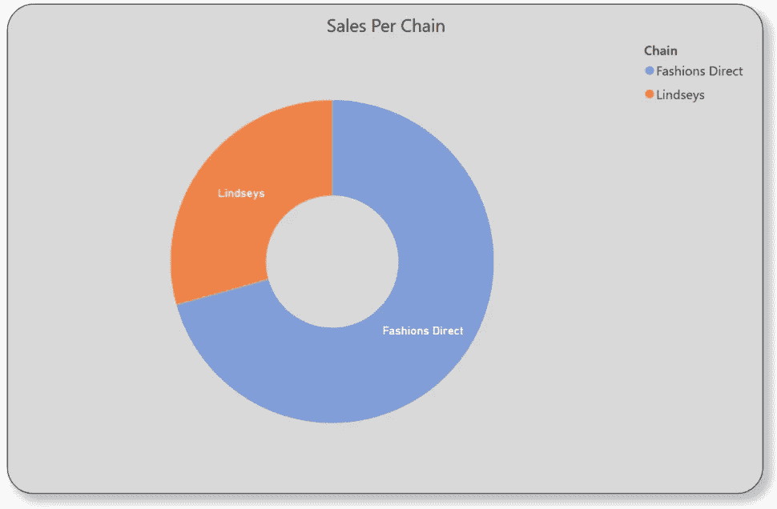
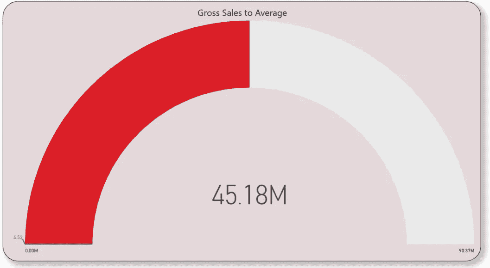

# 借助 Power BI 实现商业智能可视化

> 原文：<https://towardsdatascience.com/business-intelligence-visualizations-with-power-bi-fcc4ccc5a906?source=collection_archive---------36----------------------->

## 我准备了一份在 Power BI 中显示可视化的详细指南，Power BI 是数据爱好者的必备工具。

照片由 [**卢卡斯**](https://www.pexels.com/@goumbik?utm_content=attributionCopyText&utm_medium=referral&utm_source=pexels) 发自 [**Pexels**](https://www.pexels.com/photo/paper-on-gray-laptop-669617/?utm_content=attributionCopyText&utm_medium=referral&utm_source=pexels)

> “当一幅画迫使我们注意到你从未想过会看到的东西时，它就获得了最大的价值。”— [约翰·图基](http://www-history.mcs.st-and.ac.uk/Biographies/Tukey.html)

**数据可视化**是信息和数据的图形化表示。通过使用图表、图形和地图等可视化元素，数据可视化工具为**解释和理解数据中的趋势、异常值和模式**提供了一种便捷的方式。在大数据和海量信息需要处理的背景下，数据可视化软件应运而生，并成为一种重要的工具，使数据分析师能够以更简单、更快速的方式深入了解他们正在处理的数据。

可用于实现相同目标的其他工具包括**编程技能**，它允许我们构建更灵活和定制的功能，但代价是在这种个性化的可视化上花费更多时间。如果您对使用编程技巧进行数据可视化感兴趣，可以看看我写的一篇关于这个主题的文章:

 [## 用 Python 实现商业智能可视化

### 我准备了一份详尽的指南来展示漂亮的可视化效果，以增强度量、KPI、预测和其他…

towardsdatascience.com](/business-intelligence-visualizations-with-python-1d2d30ce8bd9) 

在这篇文章中，我包含了一个关于如何利用微软提供的商业分析服务 **Power BI** 来准备我们的数据可视化分析的广泛指南。请和我一起做这个实用的解释！

# 目录:

> 1.Power BI 简介。(2 分钟读取)
> 
> 2.你为什么要用它？(2 分钟读取)
> 
> 3.绘图类型(5 分钟读取)

# 1.介绍

Power BI 是微软的一项商业分析服务。它旨在提供交互式可视化和商业智能功能，其界面足够简单，最终用户可以创建自己的报告和仪表板。

本质上，它由一系列软件服务、应用程序和连接器组成，它们协同工作**将不相关的数据源转化为连贯的交互式洞察**。数据可以存储在 Excel 电子表格、基于云的环境或数据仓库中，并且仍然可以从 Power BI 中访问，以便于分析。

**Power BI** 由一组协同工作的应用程序组成，让您能够创造和利用业务洞察力。最常用的三种是:

*   一款名为 **Power BI Desktop** 的 Windows 桌面应用。
*   一个叫做 **Power BI service** 的在线软件服务。
*   面向 Windows、iOS 和 Android 设备的 Power BI **移动应用**。

使用 Power BI Desktop 创建的示例仪表板

Power BI 中的一个常见工作流是从连接到中的数据源并构建一个报告开始的。之后，继续将该报告从 Power BI Desktop 发布到 Power BI 服务，以便能够与其他业务用户共享，这样他们就可以查看该报告并与之交互。

为了开始使用它，请在此[链接](https://powerbi.microsoft.com/en-us/downloads/)中下载 Power BI 桌面应用程序，在选择该应用程序后，您将直接被发送到 Microsoft Store。

# 2.你为什么要用它？

一旦下载了应用程序，您就可以立即开始使用它。您首先看到的是主画布，其中的数据可以通过拖放系统进行可视化浏览，该系统可以在各种现代可视化中选择绘图类型，并可以轻松地从导入的文件或数据库中选择数据要素。

在下图中，我展示了如何轻松拖动选定的绘图类型，并将确定的要素作为值和标签包含到该绘图中:

画布和条形图示例

Power BI 最有用的特性之一是，它支持从多个来源提取**数据并进行连接，这与其他 Microsoft Office 软件包工具(如 Excel 或 PowerPoint)不同，例如**

> 它不仅有几个数据源，而且允许来自不同来源的数据在探索过程中进行交互，以获得进一步的见解。

这可以通过“主页”选项卡中的菜单栏索引，选择**获取数据**小部件来完成。一些最有趣的信息来源是 excel 和。CSV 文件、Access、Oracle、Azure SQL 和 MySQL 数据库、Spark 和 Hive、Salesforce、GitHub 甚至 Python 脚本来获得与您的脚本的交互:

数据源

如果您有兴趣了解如何将 Python 应用于数据探索性分析，并对您的结论进行手动可视化配置，请查看我写的以下文章:

 [## Airbnb 租房——使用 Python 分析纽约

### 发现最方便的租赁方式，以便继续实施具有良好可视化效果的数据分析。

towardsdatascience.com](/airbnb-rental-analysis-of-new-york-using-python-a6e1b2ecd7dc) 

Power BI 的另一个有趣的特性是，它允许**自动刷新已经存储的数据**，以方便日常分析任务，如内部业务报告。

另一方面，除了提供各种不同的绘图类型，如折线图、条形图、饼图和堆积条形图，Power BI **还包括一个市场，在这里可以获得特定的和更复杂的绘图类型。**看看一些可用的地块:

地块类型

# 3.地块类型

## A.对比图

面积图，也称为*分层面积图*，是一种绘图类型，以类似于折线图显示数据的方式表示一个或多个量随时间的变化，并增加了变量体积的可视化表示。

当您想要显示一个变量随时间变化的趋势，但不太关心显示精确值时，例如公司全年的销售和费用变化，以及员工的生产率，面积图是一个很好的选择。

为了执行该图表，我们必须从可视化面板中选择**面积图**，并将所需的值和轴拖到画布上:

对比图

## B.条形图

这种情节类型在我以前准备的文章中有广泛的解释。在开始实施 Power BI 之前，请随意从概念上回顾它们:

 [## 用 Python 实现商业智能可视化—第 2 部分

### 作为第一篇文章的后续，我准备了一个广泛的指南，向已经…

towardsdatascience.com](/business-intelligence-visualizations-with-python-part-2-92f8a8463026) 

为了在 Power BI 中执行这种图表，我们必须从可视化面板中选择**条形图**。

条形图示例

一旦我们将所需的值和轴拖到画布上，我们就可以继续处理图像的样式，包括修改标题、标签、背景颜色、条形颜色以及其他功能:

## C.组合图

组合图是由折线图和柱形图组合而成的单一可视化图形。当您有一个具有相同 X 轴的折线图和柱形图**时，以及当您想要比较具有**不同数值范围的多个度量时，它们是一个很好的选择。**此外，它们有助于在一个可视化中说明两个度量之间的相关性。**

在下图中，我准备了一个样本图表，其中显示了总销售额(左侧 Y 轴以百万计)和每件产品平均价格(右侧 Y 轴以美元计)之间的**关系，以及销售链的区别:**

示例组合图

为了在 Power BI 中执行这种类型的图表，我们必须从 visualizations 面板中选择**折线图和堆积柱形图**，并完成带有月份的**轴**字段，带有突出显示的独特功能的**系列**，在本例中是带有销售额和平均单价的**列**，以便通过折线图与总销售额进行比较。

## D.圆环图

**甜甜圈图**类似于饼图，它显示了部分与整体的关系。唯一的区别是，中心是空白的，并允许标签或图标的空间。

在下图中，我准备了一个样本图表，其中显示了该品牌现有连锁店的总销售额分布情况:

圆环图示例

为了在 Power BI 中执行这种类型的图表，我们必须从可视化面板中选择**圆环图**，并在几个月内完成**图例**字段，并将总销售额信息拖动到**值**字段。之后，您可以根据自己的需要或喜好对情节进行定制:

在选择此图表来可视化某个度量值之前，请记住圆环图值的总和必须是 100%,并且太多的类别会使其难以阅读和解释

## E.漏斗图

**漏斗图**是一种图表，通常用于表示流程的**顺序连接阶段**。最常见的应用程序是销售流程，因为它们显示每个阶段的潜在收入，并有助于确定组织中潜在的问题领域。

每个漏斗阶段代表总数的一个百分比。因此，在大多数情况下，漏斗图的形状像一个漏斗——第一个阶段最大，随后的每个阶段都比前一个阶段小。

样本漏斗图

在以下情况下，漏斗图是一个很好的选择:

*   数据是连续的，至少要经过几个阶段。
*   预计第一阶段的观察次数将多于后续阶段的观察次数。
*   我们想分阶段计算潜在收入。

为了在 Power BI 中执行这种类型的图表，我们必须从可视化面板中选择**漏斗图**，并用流程的不同阶段完成**组**字段，并将总销售额信息拖至**值**字段，以便它们在各个阶段之间进行分配。之后，您可以根据自己的需要或喜好对情节进行定制:

## F.径向仪表图

辐射状仪表图有一个圆弧，并显示一个值，该值衡量朝着目标或关键绩效指标 (KPI)的**进度。线条(或*指针*代表目标或目标值，阴影代表朝着目标的进展。弧线内的值代表进度值。**

在这种情况下，我代表的是与年平均总销售额相比的年初至今总销售额，年平均总销售额合计为 9000 万英镑，而年初至今合计为 4500 万英镑。

样本径向规

径向标尺是显示目标进度、代表百分比度量(如 KPI)或甚至显示单个度量的健康状况的绝佳选择。

为了在 Power BI 中执行这种类型的图表，我们必须从可视化面板中选择**仪表图**，并填写**目标值**字段和**值**字段，其中包含要比较的实际数字。

此外，您可以手动设置最小值和最大值。之后，您可以根据自己的需要或喜好对情节进行定制:

# 结论

根据本文中发布的指南和绘图类型，我希望能够帮助您提高使用 Power BI 创建可视化的技能。

这篇文章是与数据可视化相关的系列文章的一部分，我将准备分享更多的见解和知识。如果你喜欢这篇文章中的信息，不要犹豫，联系我分享你的想法。它激励我继续分享！

感谢您花时间阅读我的文章！如果您有任何问题或想法要分享，请随时通过我的[电子邮件](http://herrera.ajulian@gmail.com)联系我，或者您可以在以下社交网络中找到我以了解更多相关内容:

*   [**LinkedIn**](https://www.linkedin.com/in/juli%C3%A1n-alfredo-herrera-08531559/)**。**
*   [**GitHub**](https://github.com/Jotaherrer) **。**