# 用 Python 实现商业智能可视化

> 原文：<https://towardsdatascience.com/business-intelligence-visualizations-with-python-1d2d30ce8bd9?source=collection_archive---------5----------------------->

## 我准备了一个广泛的指南来展示美丽的可视化，以增强度量、KPI、预测和其他见解。


照片由 [**卢卡斯**](https://www.pexels.com/@goumbik?utm_content=attributionCopyText&utm_medium=referral&utm_source=pexels) 发自 [**Pexels**](https://www.pexels.com/photo/macbook-pro-beside-papers-669619/?utm_content=attributionCopyText&utm_medium=referral&utm_source=pexels)

> 为什么可视化值几千字？他们有讲述故事和简化信息解读的能力。他们帮助用户检测模式、**洞察**和**度量，并因此**构建更好的产品和服务。所以它们真的很重要。

**可视化**是数据分析师或数据爱好者可用的最强大的工具之一。为了方便他们的创作，已经开发了各种各样的软件和语言。也许可视化的有用性与我们的大脑自然给予图像的不同解释有关，而不是大的数据帧、数组或分配有数据的传统表格。

# **目录:**

> 可视化的重要性。(2 分钟读取)
> 
> Python 绘图类型介绍(8 分钟阅读)

# 1.可视化的重要性

列表数据使结论提取变得复杂。从上下文中分离出来的数字，尽管被相应地组织成列和行，以提供结构和给用户定位，但是很难从中理解意义。另一方面，**可视化表示一目了然的值**。它们以一种简单的方式显示列表数据，方便快速地比较数值，有助于决策。

更重要的是金融、计量经济学、数据分析和其他数学相关领域的这些技能，在这些领域，决策是基于数字基础的，通常很难向不熟悉金融的团队成员解释清楚。

> 想象你自己是一个投资委员会的资产经理，解释你的数据驱动的资产配置方法，用机器学习算法创建一个优化的投资组合。作为研究的论证，可视化肯定会派上用场。

大数据和海量数据处理提高了从分析中提取的结论的复杂性。在这种背景下，**用户友好的报告**和其他**定制的演示**可以为特定的受众重新创建，具有特殊的价值。

在本文**中，我不会将**的重点放在专门设计的工具来产生可视化效果，如 *Tableau、Qlik* 和 *Power BI* 。这一类别的产品因功能和易用性而异，通常可以快速设置，使用户能够从多个来源访问数据。我**将主要关注**通过应用我们在 Python 中的编码技能，利用 **Matplotlib** 这是一个二维绘图库，它有一些简洁的工具，可以创建漂亮灵活的图形和可视化效果。

让我们看看数据解释是如何随着数据的使用而得到巨大改善的。看看这个数据图，包括不同类型的茶叶销售:

在下图中，您将看到它是如何通过 Matplotlib 条形图进行可视化显示的。显然，可以很快得出结论，例如销售最好和最差的茶类，中等销售的茶类，以及每种茶类的销售额之间的比较，一目了然:

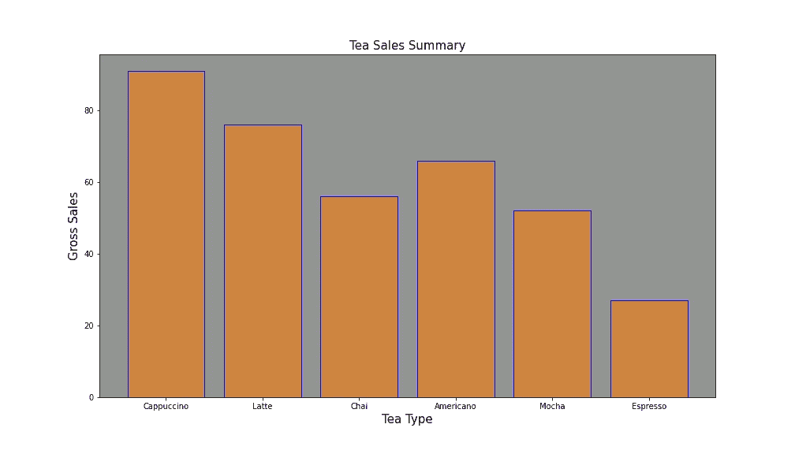

# 2.Python 绘图类型简介

安装过程非常简单。只需打开您的终端并插入以下命令:

```
pip install matplotlib
```

## A.线形图

安装完库之后，我们可以开始创建情节了。我们要创建的第一种类型是简单的折线图:

```
# Begin by importing the necessary libraries:
import matplotlib.pyplot as plt
```

假设您想使用以下输入数据绘制贵公司**一周的支出与前一周**的支出的对比图:

```
# Days of the week:
days = [1, 2, 3, 4, 5, 6,7]
# Money spend one week 1
money_spent = [1000, 1200, 1500, 1080, 1400, 1650, 1350]
# Money spend one week 2
money_spent_2 = [900, 1500, 1200, 1050, 950, 1250, 1000]# Create figure:
fig = plt.figure(figsize=(10,5))
# Plot first week expenses:
plt.plot(days, money_spent)
# Plot second week expenses:
plt.plot(days, money_spent_2)
# Display the result:
plt.title('Company Expenditure Comparison')
plt.legend(['First week', 'Second week'])
plt.show()
```

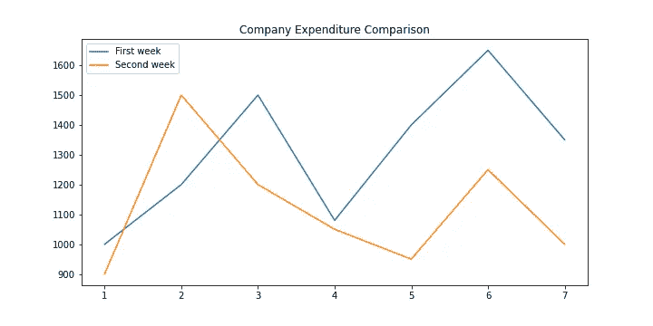

示例图—作者提供的图像

这个图可以用几行代码做一些很好的样式修改:

```
# Display the result:
ax = plt.subplot()
ax.set_xticks(range(1,8))
ax.set_xticklabels(['Monday', 'Tuesday', 'Wednesday', 'Thursday', 'Friday','Saturday',' Sunday'])
plt.title('Company Expenditure Comparison')
plt.legend(['First week', 'Second week'])
plt.show()
```

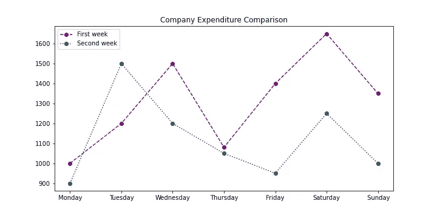

如果你想放大到一个特定的点，你可以使用 *plt.axis* 命令，输入 X 和 Y 轴所需的坐标:

```
plt.axis([1,3,900,1600])
```

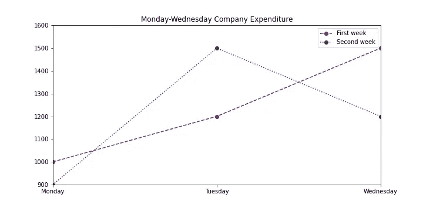

## 支线剧情

Matplotlib 库提供了一种在单个图形上绘制多个图的方法。为了在一个图形中创建多个图，一般情况下，为*matplotlib . py plot . subplots*方法配置以下参数:

```
# Subplot creation
plt.subplots(nrows=1,ncols=1,sharex=False,sharey=False,squeeze=True,subplot_kw=None,gridspec_kw=None)
```

如果您没有插入这些默认设置的参数，请确保使用 *plt.subplot* 方法来指示要配置的子情节的坐标。参数:

*   **n 排**:图中**排**的数量。
*   **ncols** :图中**列**的数量。
*   **plot_number** :图内支线剧情的索引。

例如，假设您希望**使用以下输入数据来表示与同一时期**的航班销售相关的全年温度，以便找出这些变量之间是否存在任何相关性:

```
# Temperature and flight sales 
months = range(12)
temperature = [37, 38, 40, 53, 62, 71, 78, 74, 69, 56, 47, 48]
flights = [1100, 1300, 1200, 1400, 800, 700, 450, 500, 450, 900, 950, 1100]# Create figure:
fig = plt.figure(figsize=(12,6))# Display the result - Plot 1:
plt.subplot(1,2,1)
# Plot temperatures:
plt.plot(months,temperature,color='steelblue',linestyle='--')
# Configure labels and title:
plt.xlabel('Months')
plt.ylabel('Temperature')
plt.title('Temperature Representation')# Display the result - Plot 2:
plt.subplot(1,2,2)
# Plot flights:
plt.plot(months,flights,color='red',marker='o')
plt.xlabel('Month')
# Configure labels and title:
plt.ylabel('Flights Summary')
plt.title('Flights per month')
plt.show()
```

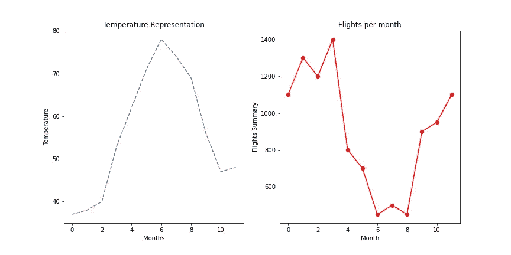

示例图—作者提供的图像

## B.并排条形图

我将跳过简单条形图的可视化，专注于更多与业务相关的并排图表。条形图使用的基本命令是 *plt.bar(x_values，y_values)。*

**并排条形图**用于比较两组具有相同类型轴值的数据。并排条形图可能有用的一些数据示例包括:

*   一段时间内超过一个国家的人口。
*   一段时间内多家餐厅不同食物的价格。
*   男女生分班注册。

我们将使用以下信息来创建图表:

```
# Values for X axis bar separation:
x_values1 = [0.8,2.8,4.8,6.8,8.8,10.8]
x_values2 = [1.6,3.6,5.6,7.6,9.6,11.6]# Sales by month and labels:
drinks = ["cappuccino", "latte", "chai", "americano", "mocha", "espresso"]
months_sales = ['Jan','Mar','May','Jun','Aug','Oct', 'Dec']
sales_cappuccino = [95, 72, 53, 62, 51, 25]
sales_latte = [62, 81, 34, 62, 35, 42]
```

情节配置看起来像这样:

```
# Figure creation:
fig = plt.figure(figsize=(12,8))# Subplot configuration:
ax = plt.subplot()
ax.set_xticks(range(1,12,2))
ax.set_xticklabels(months_sales)# Bar plot creation:
plt.bar(x_values1, sales_cappuccino, color='gray')
plt.bar(x_values2, sales_latte, color='purple')# Display plot:
plt.title("Coffee Sales Comparison")
plt.xlabel("Types of coffees")
plt.ylabel("Pounds sold")
plt.legend(labels=drinks, loc='upper right')
plt.show()
```

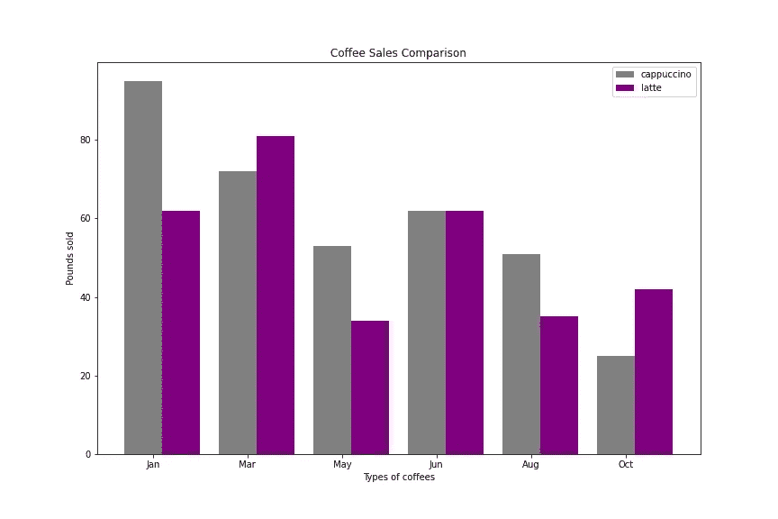

## C.堆积条形图

如果我们想比较两组数据，同时保留它们之间的总数，我们也可以堆叠条形，而不是并排放置。我们通过使用关键字*底部*来做到这一点。

例如，假设我们希望在不失去总销售额视角的情况下，按产品评估我们的销售分布情况:

```
# Product identification & Sales per product:
product = ['Computer', 'Keyboard', 'Headset', 'Mouse', 'Monitor']
sales_c = np.random.randint(1000,3000,5)
sales_k = np.random.randint(1000,3000,5)
sales_h = np.random.randint(1000,3000,5)
sales_m = np.random.randint(1000,3000,5)
sales_o = np.random.randint(1000,3000,5)# Configure bottoms to stack bars:
k_bottom = np.add(sales_c, sales_k)
h_bottom = np.add(k_bottom, sales_h)
m_bottom = np.add(h_bottom, sales_m)# Create figure and axes:
fig = plt.figure(figsize=(10,8))
ax = plt.subplot()# Plot bars individually:
plt.bar(range(len(sales_c)),sales_c, color='#D50071', label=product[0])
plt.bar(range(len(sales_k)),sales_k, bottom=sales_c, color='#0040FF',label=product[1])
plt.bar(range(len(sales_h)),sales_h, bottom=k_bottom, color='#00CA70',label=product[2])
plt.bar(range(len(sales_m)),sales_m, bottom=h_bottom, color='#C14200',label=product[3])
plt.bar(range(len(sales_o)),sales_o, bottom=m_bottom, color='#F0C300',label=product[4])# Display graphs:
ax.set_xticks(range(5))
ax.set_xticklabels(['Monday','Tuesday', 'Wednesday', 'Thursday', 'Friday'])
plt.legend(loc='best')
plt.title('Sales Distribution by Product')
plt.ylabel("Products Sold")
plt.show()
```

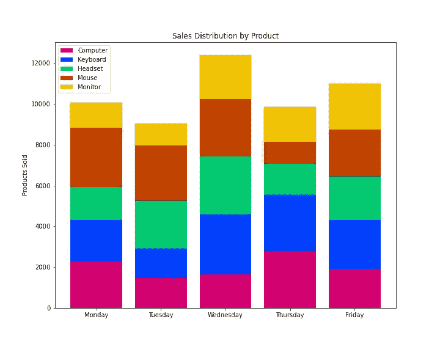

## D.圆形分格统计图表

如果我们想将数据集的元素显示为整体的比例，我们可以使用饼图。在 Matplotlib 中，您可以使用命令 *plt.pie* 制作一个饼图，传递您想要绘制的值。

我们还希望能够理解饼的每一片代表什么。为此，我们可以:

*   使用图例标记每种颜色。
*   在图表上贴标签。

饼图的另一个有用的标签工具是添加每个扇区占总扇区的百分比。Matplotlib 可以用关键字 *autopct* 自动添加这个。此外，我将添加 explode 特性，该特性突出显示“饼图”的选定部分。

我将使用以下数据绘制图表:

```
# Sales and regions:
region = ['LATAM', 'North America','Europe','Asia','Africa']
sales = [3500,5500,4800,4500,2500]# Create figure and plot pie:
fig = plt.figure(figsize=(10,8))
plt.pie(sales, labels=region,autopct='%d%%', colors=colors,explode=explode_values)
plt.axis('equal')
plt.title('Global Sales Distribution', fontsize='20')
plt.savefig('plot_eight.png')
plt.show()
```

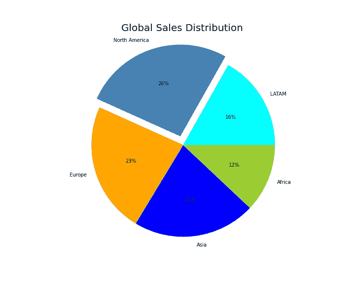

## E.柱状图

直方图告诉我们数据集中有多少值落在不同的数字集合之间，例如*有多少数字落在 0 和 10 之间？* **这个问题代表一个可能在 0 到 10 之间的 bin。**

直方图中的所有条块始终具有相同的大小:

*   每个面元的**宽度**是每个面元的最小值和最大值之间的距离。
*   每个容器由一个不同的矩形表示，矩形的**高度**是数据集中落在该容器内的元素数量。

命令 *plt.hist* 查找数据集中的最小值和最大值，并在默认情况下在这些值之间创建 10 个等距的条柱。如果我们想要 10 个以上的箱柜，我们可以使用关键字*箱柜*来设置指令。

我们面临的一个问题是，我们的直方图可能有不同数量的样本，使一个比另一个大得多。为了解决这个问题，我们可以使用 *normed=True* 来标准化我们的直方图。

在下面的例子中，**我包括了一个信用评分案例，在这个案例中，我们希望看到分数是如何在两组客户**之间分配的。我对直方图进行了裁剪，创建了 12 个区间，而不是默认的 10 个，并将 *alpha* 或透明度级别设置为 0.5，以便同时看到两个直方图，避免重叠分布。

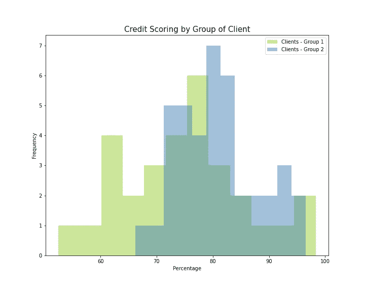

## F.堆积图

这种类型的图表在堆积图中绘制表格或时间表的变量，最多 25 个变量。该函数在单独的 *y* 轴上绘制变量，垂直堆叠。变量共享一个公共的 *x* 轴。

我将模拟三家公司在过去八年中市场份额的**演变情况**，并在堆积图中分别显示:

```
# Insert DataFrames:
year = pd.DataFrame(range(2013,2021),columns=['Year'])
volume1 = pd.DataFrame([1000,1100,1200,1250,1300,1350,1400,1450], columns=['Values 1'])
volume2 = pd.DataFrame([1000,900,800,700,600,500,400,300], columns=['Values 2'])
volume3 = pd.DataFrame([1000,950,900,850,800,750,700,650], columns=['Values 3'])# Create main frame:
frames = [year,volume1, volume2, volume3]
frame = pd.concat(frames,axis=1)# Plot axis, labels, colors:
x_values = frame['Year']
y_values = np.vstack([frame['Values 1'], frame['Values 2'], frame['Values 3']])
labels = ['Company A', 'Company B', 'Company C']
colors = ['skyblue', 'peru', 'gray']# Display plot:
fig = plt.figure(figsize=(10,8))
plt.stackplot(x_values, y_values, labels=labels, colors=colors ,edgecolor='black')
plt.title('Market Share Evolution',fontsize=15)
plt.ylabel('Share', fontsize=15)
plt.legend(loc='best')
plt.show()
```

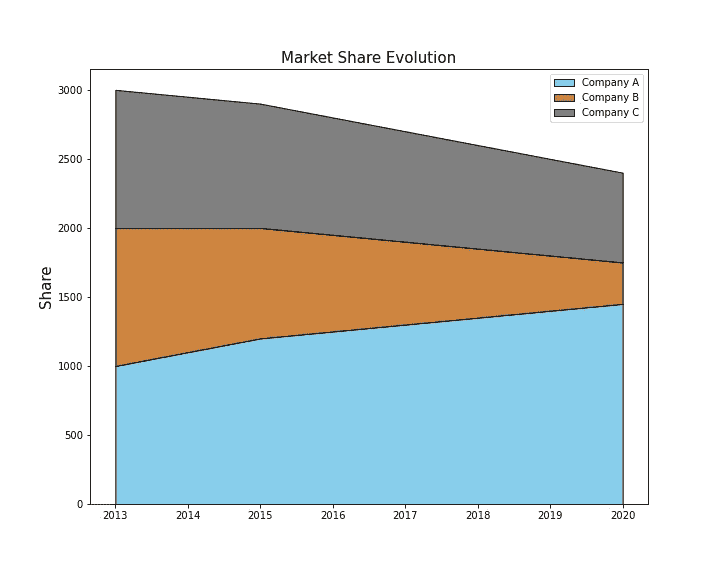

## G.百分比堆积图

该图表也称为百分比堆积面积图，显示每个数值所占百分比随时间或类别变化的趋势。

在这种情况下，我们将绘制与堆积图相同的信息，但会显示每家公司占总市场份额的百分比:

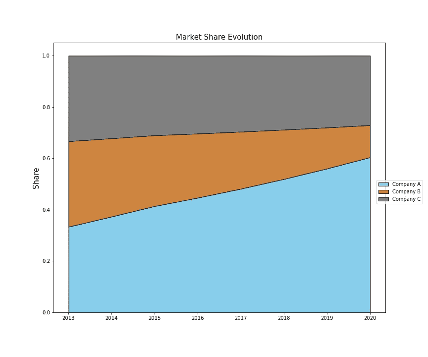

# 结论

根据本文中发布的指南和绘图类型，我希望能够帮助您增强数据分析技能，至少从数据可视化的角度来看是这样的。

这是与数据可视化相关的一系列文章的开始，我将准备分享更多的见解和知识。如果你喜欢这篇文章中的信息，不要犹豫，联系我分享你的想法。它激励我继续分享！

# 参考

*   [1] Matplotlib [文档](https://matplotlib.org/)。
*   [2] Matlab 文档— [Mathworks](https://www.mathworks.com/)

**感谢您花时间阅读我的文章！如有任何问题、建议或意见，欢迎联系我:herrera.ajulian@gmail.com**