# 用 Python 实现商业智能可视化—第 2 部分

> 原文：<https://towardsdatascience.com/business-intelligence-visualizations-with-python-part-2-92f8a8463026?source=collection_archive---------20----------------------->

## 作为第一篇文章的后续，我准备了一个广泛的指南来显示已经介绍的情节的定制特性。


照片由 [**卢卡斯**](https://www.pexels.com/@goumbik?utm_content=attributionCopyText&utm_medium=referral&utm_source=pexels) 发自 [**Pexels**](https://www.pexels.com/photo/pie-graph-illustration-669621/?utm_content=attributionCopyText&utm_medium=referral&utm_source=pexels)

> “没有信息过载这回事。只有糟糕的设计。”
> [爱德华·塔夫特](https://en.wikipedia.org/wiki/Edward_Tufte)

**数据可视化**越来越被视为任何成功的数据驱动分析战略的必要步骤。此外，正如我在之前的[文章](/business-intelligence-visualizations-with-python-1d2d30ce8bd9)中提到的，是数据分析师或数据爱好者可用的最强大的工具之一。因此，我们必须花时间来创建令人惊叹的图表和可视化效果，以**仔细清晰地传达我们隐藏在结构化数据中的故事和发现。**

**上周**，我们讨论了数据可视化的重要性，我介绍了不同的绘图类型，例如:

*   *线剧情和支线剧情。*
*   *并排条形图。*
*   *堆积条形图。*
*   *饼状图*
*   *直方图。*
*   *堆积图和百分比堆积图。*

[](/business-intelligence-visualizations-with-python-1d2d30ce8bd9) [## 用 Python 实现商业智能可视化

### 我准备了一份详尽的指南来展示漂亮的可视化效果，以增强度量、KPI、预测和其他…

towardsdatascience.com](/business-intelligence-visualizations-with-python-1d2d30ce8bd9) 

**借此机会，我将为您提供更多关于如何使用 **Python** 和[Matplotlib](https://matplotlib.org/)**显示定制图表的见解，这是一个绘图库，提供了一些简洁的工具来创建漂亮而灵活的图表。

# 目录:

> 1.使用 Python 的其他绘图类型(8 分钟读取)。
> 
> 2.格式化应用程序(2 分钟阅读)。

# 1.其他绘图类型

尽管这些图表类型包含在本系列的第二部分*Python 商业智能可视化*中，但它们的重要性并没有降低，因为它们补充了已经介绍过的图表。我相信你会发现它们比基本情节更有趣！

从本系列开始，我们必须安装所需的库:

```
# Imports
import matplotlib.pyplot as plt
import numpy as np
from mpl_toolkits.mplot3d import Axes3D
```

## A.带误差线的水平条形图:

**条形图**是一种图表，使用矩形条呈现数据，矩形条的高度和长度与它们所代表的值成比例。条形图使用的基本命令是 *plt.bar(x_values，y_values)。*

此图中涉及的附加功能是误差线，误差线是数据可变性的图形表示。它们通常用于表示预期测量中的估计误差。

这一次，我们将使用以下输入数据绘制一个水平条形图:

```
# Input data for error bars and labels
mean_values = [1, 2, 3]
std_dev = [0.2, 0.3, 0.4]
bar_labels = ['Bar 1', 'Bar 2', 'Bar 3']
y_values = [0,1,2]
```

现在让我们用 *plt.barh* 命令绘制条形:

```
# Create bar plots
plt.yticks(y_values, bar_labels, fontsize=10)
plt.barh(y_values, mean_values, xerr=std_dev,align='center', alpha=0.5, color='red')# Labels and plotting
plt.title('Horizontal Bar plot with error', fontsize=13)
plt.xlim([0, 3.5])
plt.grid()
plt.show()
```

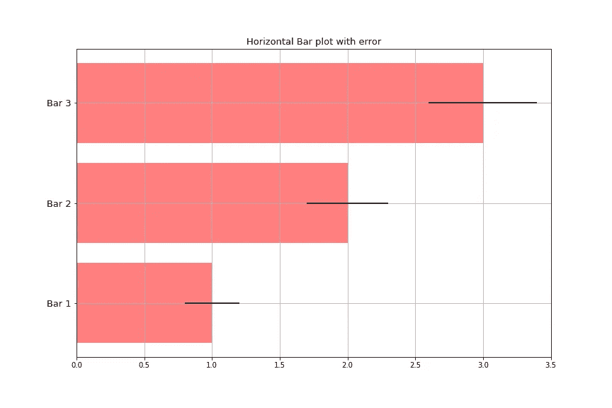

示例图—作者提供的图像

这种图的变化可以通过在条上插入标签或文本来实现。我们将使用以下输入数据来完成这项工作:

```
# Input data for error bars and labels
data = range(200, 225, 5)
bar_labels = ['Bar 1', 'Bar 2', 'Bar 3']
y_values = [0,1,2,3,4]
```

继续准备地块:

```
# Create bar plots
fig = plt.figure(figsize=(12,8))
plt.yticks(y_values, bar_labels, fontsize=15)
bars = plt.barh(y_values, data,align='center', alpha=0.5, color='orange', edgecolor='red')# Labels and plotting
for b,d in zip(bars, data):
    plt.text(b.get_width() + b.get_width()*0.08, b.get_y() + b.get_height()/2,'{0:.2%}'.format(d/min(data)),ha='center', va='bottom', fontsize=12)
plt.title('Horizontal bar plot with labels', fontsize=15)
plt.ylim([-1,len(data)+0.5])
plt.xlim((125,240))
plt.vlines(min(data), -1, len(data)+0.5, linestyles='dashed')
plt.show()
```

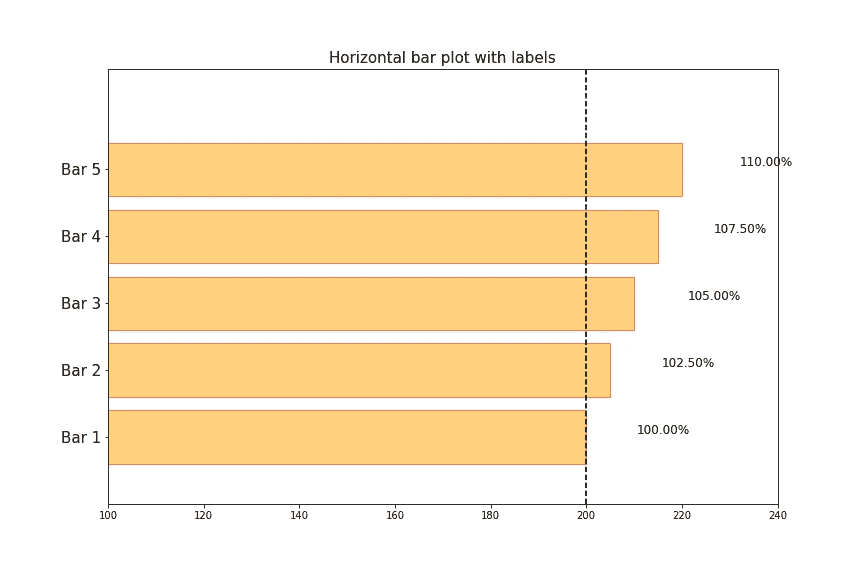

示例图—作者提供的图像

## B.连续条形图:

我们继续研究柱状图系列，在这种情况下，我们使用了一种变体来横向比较两组数据。创建此图的命令与创建水平条形图的命令相同，但其中一组数据的值为负值。

```
# Input data for both sets of data utilizing numpy arrays to negate one set:
X1 = np.array([1, 2, 3])
X2 = np.array([3, 2, 1])
y_values = [0,1,2]
bar_labels = ['Bar 1', 'Bar 2', 'Bar 3']
```

现在让我们用 *plt.barh* 命令和否定特性来绘制条形图:

```
# Plot bars
fig = plt.figure(figsize=(12,8))
plt.yticks(y_values, bar_labels, fontsize=13)
plt.barh(y_values, X1,align='center', alpha=0.5, color='blue')
plt.barh(y_values, -X2,align='center', alpha=0.5, color='purple')plt.title('Back-to-back Bar Plot', fontsize=13)
plt.ylim([-1,len(X1)+0.1])
plt.grid()
plt.show()
```

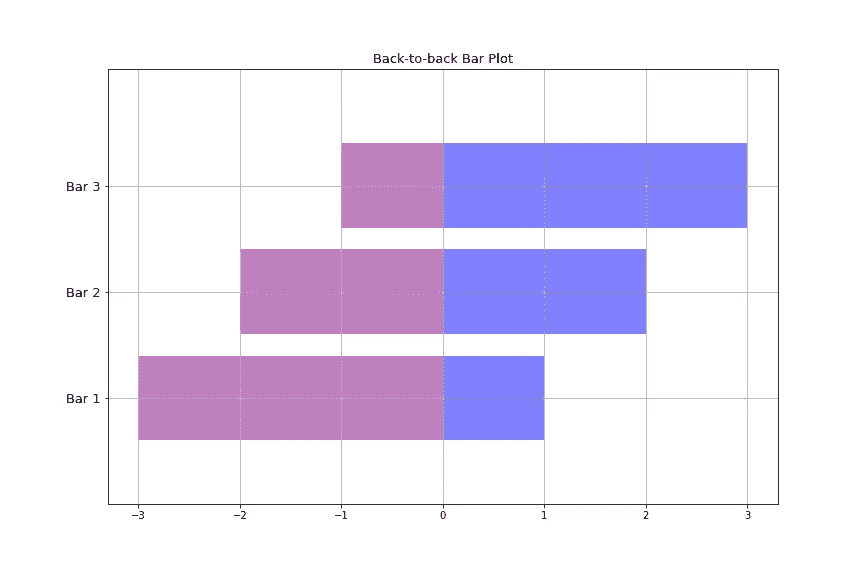

示例图-作者提供的图像

## C.带高度标签的条形图:

此图表与前面显示的图表相同，只是它是垂直方向的，并且我添加了高度标签，以便更清楚地显示这种指标。这可以通过命令 *ax.text.* 来完成

此外，我介绍了 Matplotlib 中包含的方法 *autofmt_xdate* 来自动旋转标签。看一下代码 *:*

```
# Input information:
n_bars = [0,1,2,3]
values = [3000, 5000, 12000, 20000]
labels = ['Group 1', 'Group 2','Group 3', 'Group 4']# Create figure and plots
fig, ax = plt.subplots(figsize=(12,8))
ax.set_facecolor('xkcd:gray')
fig.patch.set_facecolor('xkcd:gray')
fig.autofmt_xdate()
bars = plt.bar(idx, values, align='center', color='peru', edgecolor='steelblue')
plt.xticks(idx, labels, fontsize=13)# Add text labels to the top of the bars
def rotate_label(bars):
   for bar in bars:
      height = bar.get_height()
      ax.text(bar.get_x() + bar.get_width()/2., 1.05 * height,'%d' % int(height),ha='center', va='bottom', fontsize=13)# Labels and plotting
rotate_label(bars)
plt.ylim([0, 25000])
plt.title('Bar plot with Height Labels', fontsize=14)
plt.tight_layout()
plt.show()
```


示例图—作者提供的图像

## D.带颜色渐变的条形图:

让我们给等式加点颜色。在下图中，我介绍了名为 [**colormap**](https://matplotlib.org/3.3.1/api/cm_api.html) 的内置模块，该模块用于为绘制的参数实现直观的配色方案。首先，我将继续导入:

```
import matplotlib.colors as col
import matplotlib.cm as cm
```

现在我将插入样本数据来绘制图表。如你所见，**色彩映射表**是通过*scalar maptable*类实现的，该类在从给定的色彩映射表返回 **RGBA** 颜色之前应用数据标准化。

为了澄清前面的陈述， **RGBA** 颜色与**十六进制**和 **HSL** 一起是一种数字颜色表示形式。十六进制是使用最多和最广为人知的，因为它是 6 位数的简单表示，可以产生*红色、绿色、*和*蓝色*。十六进制颜色表示的一个例子是 **#123456** ，12 是红色，34 是绿色，56 是蓝色。另一方面， **RGBA** 颜色添加了一个新的因素，alpha，它是遵循相同百分比方案的*不透明度或透明度*:0%代表绝对透明度，100%代表绝对不透明度，这是我们传统上看到颜色的方式。更多详情在[这个](https://htmlcolors.com/rgba-color)网站。

在 Matplotlib 文档的[链接](https://matplotlib.org/3.3.1/tutorials/colors/colormaps.html)中，您将找到更多关于可供选择的不同色彩映射表的详细信息。为了有一个更清晰的视图，请看一下生成图的代码:

```
# Sample values
means = range(10,18)
x_values = range(0,8)# Create Colormap
cmap1 = cm.ScalarMappable(col.Normalize(min(means), max(means), cm.spring))
cmap2 = cm.ScalarMappable(col.Normalize(0, 20, cm.spring))# Plot bars
# Subplot 1
fig, ax = plt.subplots(figsize=(12,8))
plt.subplot(121)
plt.bar(x_values, means, align='center', alpha=0.5, color=cmap1.to_rgba(means))
plt.ylim(0, max(means) * 1.1)# Subplot 2
plt.subplot(122)
plt.bar(x_values, means, align='center', alpha=0.5, color=cmap2.to_rgba(means))
plt.ylim(0, max(means) * 1.1)
plt.show()
```

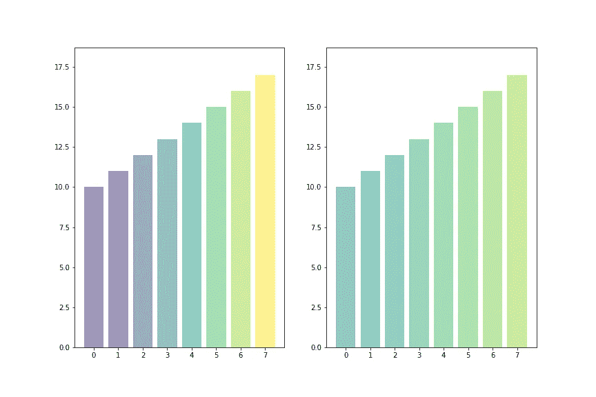

示例图—作者提供的图像

## E.带图案填充的条形图:

现在，我们将使用条形图和模式填充为我们的数据表示添加一些样式。这可以通过使用 *set_hatch* 命令或在 *plt.bar* 配置中包含一个参数 *hatch* 命令来完成。

```
# Input data:
patterns = ('-', '+', 'x', '\\', '*', 'o', 'O', '.')
mean_values = range(1, len(patterns)+1)
y_values = [0,1,2,3,4,5,6,7]# Create figure and bars
fig, ax = plt.subplots(figsize=(12,8))
bars = plt.bar(y_values,mean_values,align='center',color='salmon')
for bar, pattern in zip(bars, patterns):
    bar.set_hatch(pattern)# Labeling and plotting 
plt.xticks(y_values, patterns, fontsize=13)
plt.title('Bar plot with patterns')
plt.show()
```

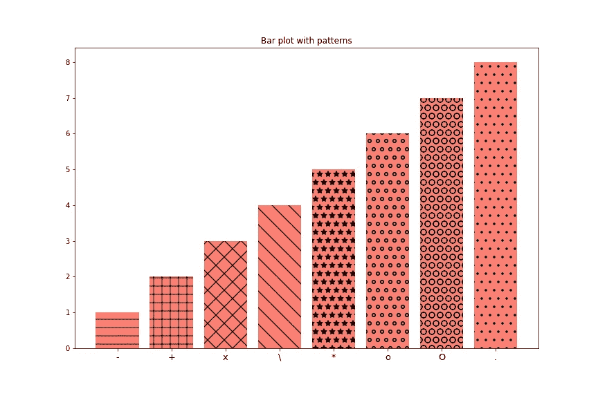

示例图—作者提供的图像

## F.简单热图:

**热图**是数据的图形表示，其中的值用颜色表示。它们使复杂的数据可视化变得容易，并且一目了然。颜色的变化可能是由[色调](https://en.wikipedia.org/wiki/Hue)或[强度](https://en.wikipedia.org/wiki/Brightness)引起的，给读者关于所表示的值如何分布的明显视觉提示。

在这种情况下，颜色的变化表示在特定值范围内聚集的观察值的数量，这是通过 Matplotlib 的*颜色条*功能实现的。此外，该图是用命令 *plt.hist2d.* 创建的二维直方图绘制的

在下面的代码中，我创建了两个正态分布的变量 X 和 Y，平均值分别为 0 和 5。

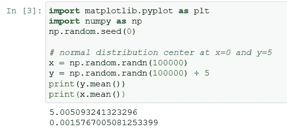

当你绘制 *2D 历史*时，你会看到一个 2D 直方图。把它想象成从“顶部”看一个直方图。除此之外，为了更清楚地了解颜色分布，请考虑位于 2D 直方图中心的颜色是淡黄色的，并且对应于颜色条的最高值，这是合理的，因为 X 值应该在 0 处达到峰值，Y 值应该在 5 处达到峰值。

```
# Input a sample of normally distributed observations centered at x=0 and y=5
x = np.random.randn(100000)
y = np.random.randn(100000) + 5# Create figure, 2D histogram and labels
plt.figure(figsize=(10,8))
plt.hist2d(x, y, bins=40)
plt.xlabel('X values - Centered at 0', fontsize=13)
plt.ylabel('Y values - Centered at 5', fontsize=13)
cbar = plt.colorbar()
cbar.ax.set_ylabel('Number of observations', fontsize=13)
plt.show()
```

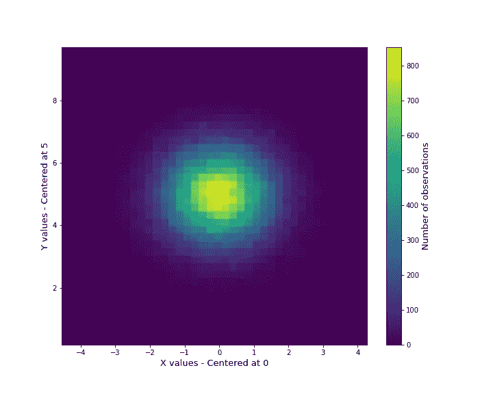

示例图—作者提供的图像

## G.阴影饼图:

饼图用于将数据集的元素显示为整体的比例。除了传统的 *plt.pie* 命令之外，我们将利用 *shadow=True* 布尔特性为饼图的切片带来一些样式。

```
# Create figure and plot the chart:
plt.figure(figsize=(10,8))
plt.pie((10,5),labels=('Blue','Orange'),shadow=True,colors=('steelblue', 'orange'),
explode=(0,0.15), 
startangle=90,    
autopct='%1.1f%%'
)
plt.legend(fancybox=True, fontsize=13)
plt.axis('equal')     
plt.title('Shadowed Pie Chart',fontsize=15)
plt.tight_layout()
plt.show()
```

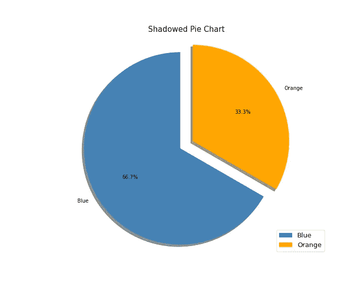

示例图—作者提供的图像

# 2.格式化应用程序

一旦可视化被创建并包含在我们的分析中，是时候学习如何修改我们的图的格式了。我们可以实现各种颜色、线条样式、颜色渐变，甚至标记。

## **A .颜色格式定义**

看一下下面的代码，其中我实现了三种不同的替代方法来显示我们想要的简单线图的颜色，在本例中是红色。

```
# Input sample data
sample_values = [1,2,3]# Create figure, plots and labels
fig,ax = plt.subplots(figsize=(12,9))
ax.set_facecolor((0.,0.,0.))
plt.plot([0,10], [0,1], lw=3, color=(1.0,0.0,0.0))
plt.plot([0,10], [0,2], lw=3, color='red')
plt.plot([0,10], [0,3], lw=3, color='#f54842')
plt.legend(['RGB values: (1.0,0.0,0.0)',"matplotlib names: 'red'","HTML hex values: '#f54842'"],loc='upper left')
plt.title('3 ways to define colors', fontsize=13)
plt.show()
```

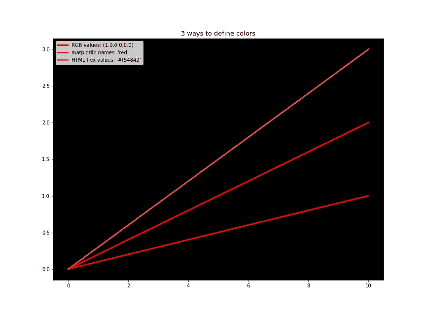

示例图—作者提供的图像

## B.Matplotlib 中的可用颜色

另一方面，我们可以利用已经提到的 **RGBA 格式**显示 Matplotlib 可用颜色的样本，例如以下命令:

```
# Sample colors
colors = ['blue', 'green', 'red', 'cyan',  'magenta', 'yellow', 'black', 'white']
numbers = [1,2,3,4,5,6,7,8]# Create figure, plots and labels
plt.figure(figsize=(10,8))
for n, col in zip(numbers, colors):
    plt.plot([0, 10], [0, n], label=col, lw=3, color=col)plt.legend(loc='upper left')
plt.title('Matplotlib Sample Colors', fontsize=13)
plt.show()
```

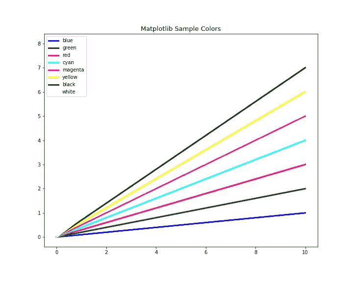

示例图—作者提供的图像

## C.渐变颜色

此外，我们可以使用应用 RGBA 格式的渐变颜色样本来执行我们自己的线图:

```
# Input data
gradients = [0.0, 0.1, 0.2, 0.3, 0.4, 0.5, 0.6, 0.7, 0.8, 0.9, 1.0]# Create figure, plots and labels
plt.figure(figsize=(10,8))
for i in samples:
    plt.plot([0, 10], [0, i], label='gray-level %s'%i, lw=3,    color=str(i)) # ! gray level has to be parsed as string
plt.legend(loc='upper left')
plt.title('Gray Gradients with RGBA Formatting')
plt.show()
```

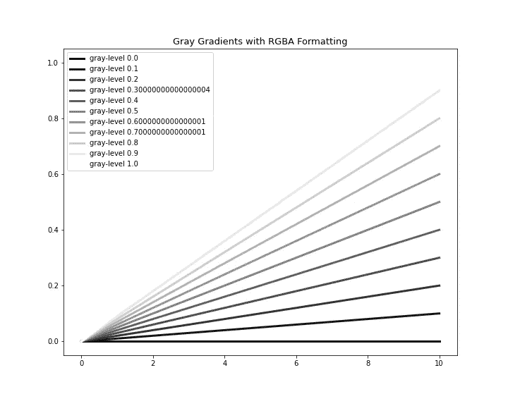

示例图—作者提供的图像

## D.标记样式

**标记样式**是 Matplotlib 工具包的另一个有趣的特性，它可以很好地格式化我们的可视化效果:

```
# Markers
marker_name = ['point', 'pixel', 'circle', 'triangle down', 'triangle up', 'triangle_left', 'triangle_right','tri_down', 'tri_up', 'tri_left', 'tri_right', 'octagon', 'square', 'pentagon', 'star', 'hexagon1','hexagon2', 'plus', 'x', 'diamond', 'thin_diamond', 'vline']markers = ['.', ',', 'o', 'v', '^', '<', '>','1', '2', '3','4', '8', 's','p', '*','h', 'H','+','x','D','d', '|']samples = range(len(markers))# Create figure, plots and labels
plt.figure(figsize=(13, 10))
for i in samples:
    plt.plot([i-1, i, i+1], [i, i, i], label=marker_name[i], marker=markers[i], markersize=11)
plt.title('Matplotlib Marker styles', fontsize=20)
plt.ylim([-1, len(markers)+1])
plt.legend(loc='lower right')
plt.show()
```

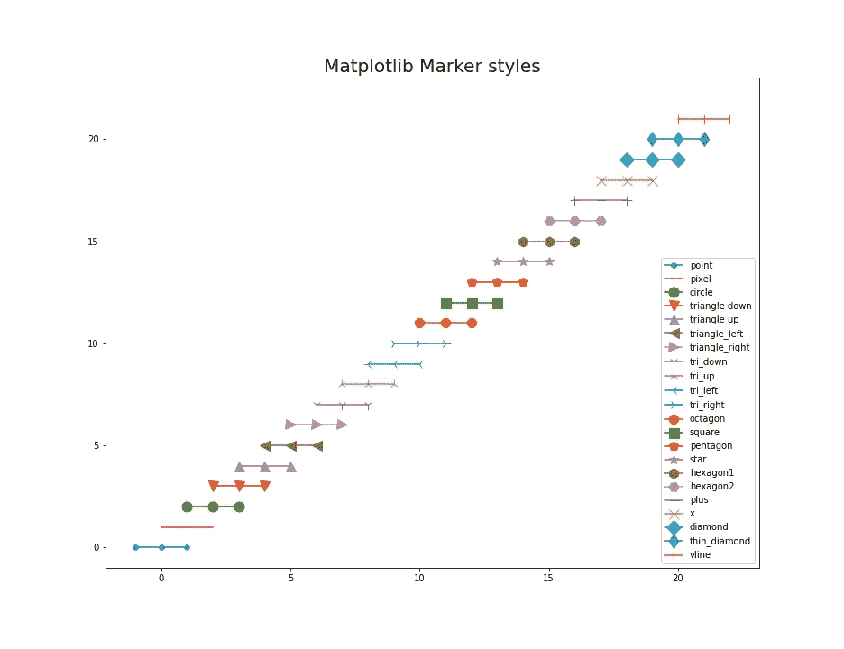

示例图—作者提供的图像

## E.样式表选择

Matplotlib 的样式包增加了对预定义的易于切换的绘图样式表的支持，例如“ *ggplot* ”，这是 r 中流行的绘图包的模拟。以下是所有可用样式的列表:

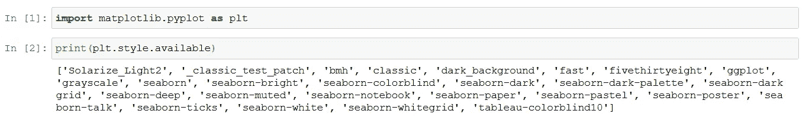

设置样式表有两种方法，第一种是通过**使用 *plt.style.use 函数将其全局***设置到我们的编码环境中。

```
# Setting style globally
plt.style.use('ggplot')# Data input
x = np.arange(10)# Create figure, plots and labels
plt.figure(figsize=(10,8))
for i in range(1, 4):
    plt.plot(x, i * x**2, label='Group %d' % i)
plt.legend(loc='best')
plt.title('Style sheet formatting', fontsize=13)
plt.show()
```

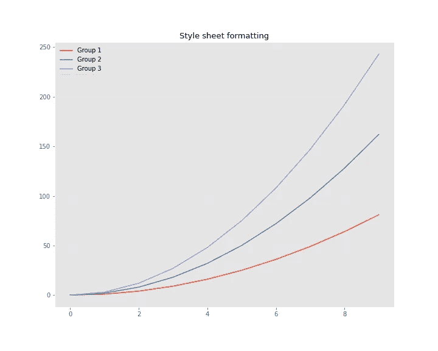

示例图—作者提供的图像

第二种方式是通过**上下文管理器**，它只将样式应用于特定的代码块:

```
# Data input
x = np.arange(10)# Create figure, plots and labels with the context manager
with plt.style.context('fivethirtyeight'):
    plt.figure(figsize=(10,8))
    for i in range(1, 4):
         plt.plot(x, i * x**2, label='Group %d' % i)
    plt.legend(loc='best')
    plt.title('Style sheet formatting', fontsize=13)
    plt.show()
```

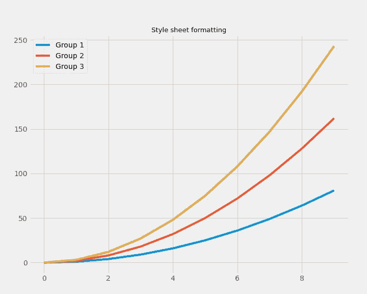

示例图—作者提供的图像

# 结论

根据本文中发布的指南和绘图类型，我希望能够帮助您提高使用 Python 和 Matplotlib 创建可视化的技能。

这是与数据可视化相关的一系列文章的第二部分，我将准备分享更多的见解和知识。如果你喜欢这篇文章中的信息，不要犹豫，联系我分享你的想法。它激励我继续分享！

感谢您花时间阅读我的文章！如果您有任何问题或想法要分享，请随时联系我的[电子邮件](http://herrera.ajulian@gmail.com)，或者您可以在以下社交网络中找到我以了解更多相关内容:

*   [**领英**](https://www.linkedin.com/in/juli%C3%A1n-alfredo-herrera-08531559/) **。**
*   [**GitHub**](https://github.com/Jotaherrer) **。**

# 参考

*   [1] Matplotlib [文档](https://matplotlib.org/)。
*   [2] [色彩映射表应用](https://matplotlib.org/3.3.1/api/cm_api.html)。
*   [3]六角彩色工具[文档](https://www.hexcolortool.com/#01d596)。