# 失败的假设

> 原文：<https://towardsdatascience.com/busted-assumptions-3e224b7706eb?source=collection_archive---------34----------------------->

## 如何使用 Python 检查回归假设

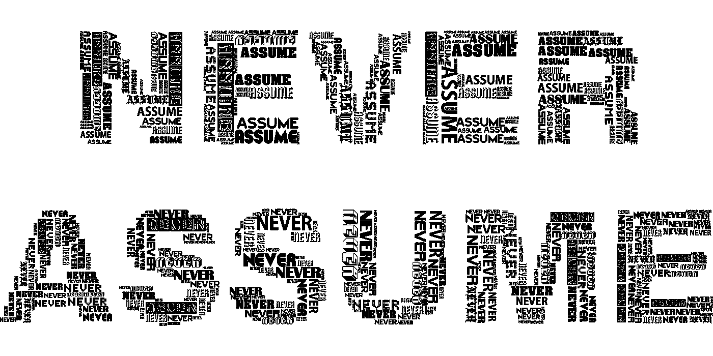

图片由来自 Pixabay 的 Gordon Johnson 提供

# 资料组

我们将在本教程中使用的数据集来自 Kaggle 的“房价:高级回归技术”竞赛([链接](https://www.kaggle.com/c/house-prices-advanced-regression-techniques))，因为我目前正在提交我的结果。由于这是一个回归问题，我们的任务是预测房价，我们需要检查我们是否满足回归背后的所有主要假设

一般来说，如果你违反了这些假设中的任何一个，那么从你的模型中得到的结果可能会非常误导人。违反某些假设比其他假设更严重，但我们应该非常小心地正确处理我们的数据。

# **OLS 回归**

在检查回归背后的许多假设之前，我们首先要拟合一个回归模型(在我们的例子中是 OLS)。这是因为许多假设检验依赖于计算的残差或我们模型中的误差。残差只不过是实际值和预测值之间的绝对距离。记住这一点也很重要，我拟合到回归模型的数据已经过彻底处理，包括输入缺失值、移除异常值、处理高基数和低基数、转换偏斜(要素和目标)、目标编码分类要素，以及使用 StandardScaler()进行标准化。

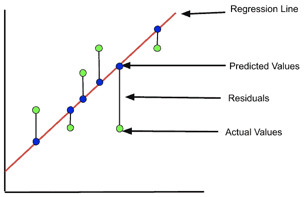

```
X = sm.add_constant(X_train_df)
y_train = y_train.reshape(-1,1)
model = sm.OLS(y_train, X)
results = model.fit()
print(results.summary())
```

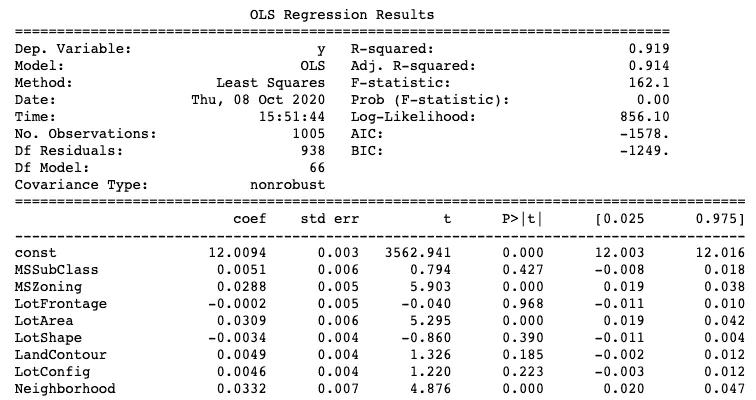

首先，我们添加一个常数来指定初始截距值。在拟合模型时，我们的 y_train 值需要是 2D 数组而不是 1D。最后，我们拟合数据并打印结果。我不想解释结果表。

# 回归假设

**线性:**线性回归假设目标与每个独立变量或特征之间存在线性关系。这是最重要的假设之一，因为违反这一假设意味着您的模型试图在非线性数据中找到线性关系。这将导致你的模型严重不符合你的数据。检查异常值也很重要，因为它们会对这一假设产生重大影响。

我们可以对目标和/或独立变量应用变换来纠正问题。在我将注意力转向目标之前，我通常首先转换特征。不幸的是，应用转换的过程本质上是反复试验。应用对数、平方根、指数和 boxcox 变换是我的第一道防线。此外，我发现在添加多项式特征以更好地捕捉非线性关系方面取得了一些成功。

实际值和预测值的散点图通常用于检查线性。我们希望看到实际值和预测值紧密地分散在回归线周围。我们还可以生成一组显示每个特征和目标之间关系的配对图。但是，这种方法非常耗时，而且容易混淆，尤其是当您有许多功能时。我更喜欢先绘制实际值与预测值，如果我发现有大量违反这一假设的情况，我将使用 pairplot 方法来确定哪些特征破坏了我的假设。

```
def linearity_assum(model, y):

    y_pred = model.predict()plt.figure(figsize=(15,10))
    sns.regplot(x=y_pred, y=y, lowess=True, line_kws={'color': 'red'})
    plt.title('Observed vs. Predicted Values', fontsize=16)# Results is the object which contains the trained OLS model
linearity_assum(results, y_train)
```

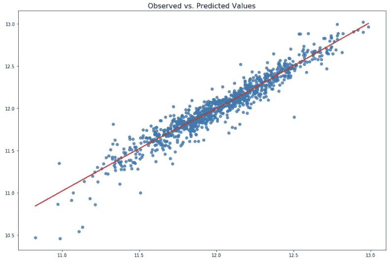

:)

**自相关:**在处理时间序列数据时，这一假设经常被违反，因为它指的是变量与自身之间在不同时间点的相关性。例如，在不同时间点测量的股票价格(同一变量)。横截面数据也可能出现自相关。例如，不同社区之间的房价可能是相关的。

不幸的是，我没有太多处理时间序列数据的经验，因此，我不想假定一个修正。然而，在横截面数据的情况下，我发现在拟合模型之前标准化数据有减少自相关的趋势。

我们通常使用德宾-沃森测试来检验这一假设。接近 2 的结果表示没有自相关。然而，当我们接近零(0)时，正自相关的证据就越多，越接近 4，负自相关的证据就越多。

```
from statsmodels.stats.stattools import durbin_watsondurbin_watson(results.resid)
```

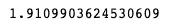

**同方差:**假设回归模型的残差具有相同的可变性或沿回归线分布。如果他们不这样做，这被称为“异方差”。一个被打破的同方差假设会使你的系数不太准确，但不会增加系数的偏差。

在被破坏的同方差假设中，散点图将显示数据点的模式。如果你碰巧在散点图上看到一个**漏斗形状**，这将表明一个错误的假设。

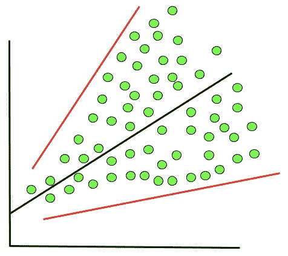

再一次，变换是你最好的朋友来纠正一个失败的同质性假设。首先，尝试改变你的目标(即。y)使用平方根、对数、平方根倒数或倒数变换。我们也可以使用加权普通最小二乘法代替普通最小二乘法来拟合你的数据，当你已经打破了同方差假设。

我们通常使用散点图来检查残差的方差在整个目标上是否恒定。

```
def homoscedasticity_assum(model):
    y_pred = model.predict() 
    residuals = model.resid

    plt.figure(figsize=(15,10))
    sns.regplot(x=y_pred, y=residuals, lowess=True, line_kws={'color': 'red'})
    plt.title('Residuals vs Fitted', fontsize=16)
    plt.xlabel('Fitted Values')
    plt.ylabel('Residuals')homoscedasticity_assum(results)
```

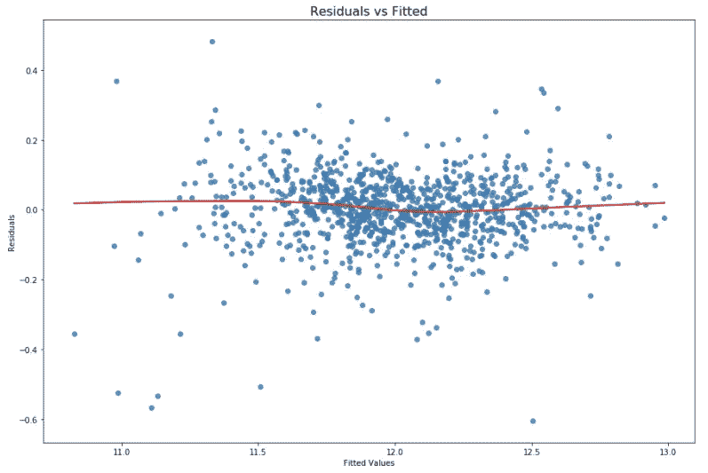

**残差的正态性:**残差服从正态或高斯分布。幸运的是，人们普遍认为违反这一假设对结果的影响最小。就我个人而言，我尽量确保分布“接近正态”。我这样说是因为中心极限定理表明，随着样本量的增加，样本的均值和标准差将开始接近正态分布。反之亦然，因为样本量较小的数据集很少具有高斯分布，因此，您的残差将不会具有正态分布。

在这种情况下，对目标进行对数或平方根变换有助于使残差更加正常。

也就是说，简单地使用直方图绘制残差将有助于您可视化它们的分布。你也可以使用夏皮罗-维尔克统计。在夏皮罗-维尔克检验中，零假设假设正态分布，因此我们不想拒绝零假设。换句话说，夏皮罗-维尔克检验将产生一个 p 值，我们希望看到 p 值高于 0.05(即。我们不能拒绝零假设)。

```
def normality_assum(model):
    residuals = model.resid

    plt.figure(figsize=(15,10))
    sns.distplot(residuals)
    plt.title('Residuals Distribution', fontsize=16)normality_assum(results)
```

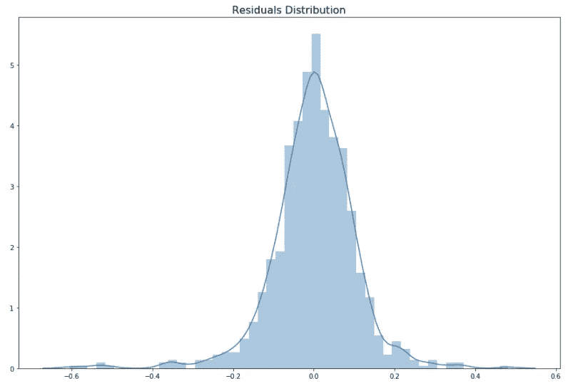

**多重共线性:**当模型中的要素彼此高度相关时，会出现多重共线性。当相关性达到或超过 0.80 时，我们通常说多重共线性发生。违反这一假设会导致回归系数不可靠。

检查数据多重共线性的主要方法是通过相关矩阵。我们也可以使用“方差通货膨胀系数(VIF)”。高于 10 的 VIF 分数表示可以观察到多重共线性，但是 100 或更高的分数表示明确的多重共线性。

处理这个问题最简单的方法是删除这些功能。我们可以移除具有高 VIF 的特征，或者当比较两个高度相关的特征之间的相关性时，我们移除与目标具有较小相关性的那个。我们还可以进行主成分分析，因为每个成分都是正交的(即与其他组件不相关)。

```
sns.set_style('whitegrid')
correlation = abs(X_train_df.corr())
mask = np.zeros_like(correlation, dtype=np.bool)
mask[np.triu_indices_from(mask)] = True
plt.figure(figsize=(70,40))
plt.xticks(fontsize=20)plt.yticks(fontsize=20)
sns.heatmap(correlation, 
            cmap='coolwarm', 
            annot=True, 
            fmt=".2f", 
            annot_kws={"size": 15}, 
            linewidths=2, 
            vmin=-1.5, 
            mask=mask,
           center=0)
```

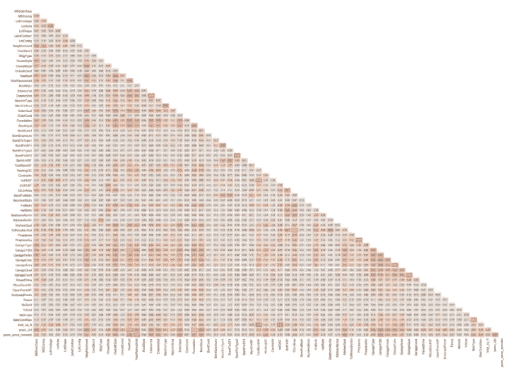

如您所见，当要素数量较少时，相关矩阵会很有用。

```
upper = correlation.where(abs(np.triu(np.ones(correlation.shape), k=1).astype(np.bool)))
to_drop = [var for var in upper.columns if any(upper[var] > .80)]
to_drop
```

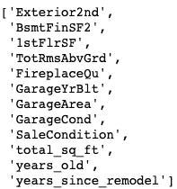

我们可以过滤相关性矩阵以获得高度相关的特征，但一定要检查相关对，并查看每对中的哪个特征与目标的相关性最高。与目标高度相关的特征被保留，而另一个被丢弃。

```
from statsmodels.stats.outliers_influence import variance_inflation_factor as VIFvif = pd.DataFrame()
vif['VIF'] = [VIF(X_train_df.values, i) for i in range(X_train_df.shape[1])]
vif['Features'] = X_train_df.columnsvif_drop = [(feat, num) for num, feat in zip(vif['VIF'], vif['Features']) if num > 5.00]
vif_drop
```

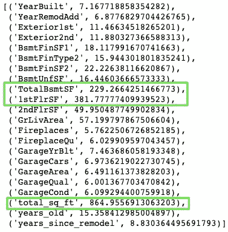

检查 VIF 时，首先删除 VIF 值极高的要素，然后重新计算 VIF。由于删除了这些极端要素，您将会看到剩余要素的 VIF 值有所下降。

# 摘要

通过验证您的线性回归假设，您可以放心，您的结果是由于要素和目标之间的真实关系而不是处理错误。一旦你修正了任何错误的假设，你还会看到你的模型性能的显著提高。

感谢您的阅读！