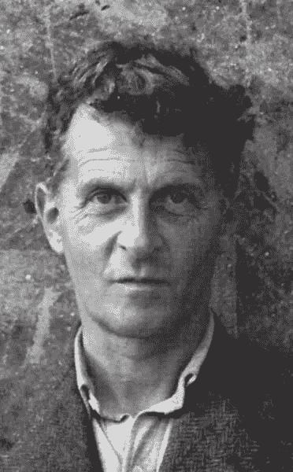

# 但是什么是模型呢？

> 原文：<https://towardsdatascience.com/but-what-is-a-model-58c486cbd40a?source=collection_archive---------30----------------------->

## 数据科学的维特根斯坦方法

1766 年的天文馆，塞奇·罗斯的照片，[知识共享](https://en.wikipedia.org/wiki/Orrery#/media/File:Planetarium_in_Putnam_Gallery_2,_2009-11-24.jpg)

术语*模型*经常被使用。这个词无处不在，已经失去了意义。仅维基百科页面就显示了 *model* 这个词的各种用法，包括统计学、天文学、生物学、产品设计、艺术以及概念模型。

*模式*的词源也很有趣，从法语和意大利语追溯到拉丁语*方式*，意为“度量、节奏或方式”。

然而,“概念模型”的定义抓住了这个词在任何意义上的最广泛的解释，总是来自维基百科:

> **概念模型**是一个系统的表示，由概念组成，用于帮助人们认识、理解或模拟模型所表示的主题。

# 这与数据科学有什么关系？

在 Python 中，数据科学家经常使用诸如`scikit-learn`或`statsmodels`之类的包对各种数据运行线性回归、聚类算法、随机森林或神经网络，以便进行分类或预测。

与此同时，古希腊人和罗马人使用太阳系的地心说模型来理解他们的宇宙，这一宇宙学模型主导了他们对宇宙的理解，直到 1610 年 12 月，伽利略推断威尼斯相位排除了地心说或托勒密模型，最终验证了太阳中心模型。

单词 *model* 的这些用法看似无关，但回到我们上面的定义，它们实际上是该单词的相同应用。为什么？我们与 Python 模型的实际交互存在于 Jupyter 笔记本中，在构建模型时(同时祈祷不要出现错误),这个小*就在一个单元格旁边，并在 AWS 或 Heroku 上使用这些珍贵的 prime-F1-score 模型。但是在像`scikit-learn`这样的地方，到底发生了什么？为什么称之为典范，除了传统？一个腌制的随机森林模型和一个带有金属球的太阳系小玩具模型，或者一个聚苯乙烯泡沫波尔原子模型有什么关系？

因为这些模型**实际上是为了表现现实**。这是他们团结的原因。这是一个崇高而困难的观点，但这个事实比乍看起来更有意义。

# 模型、数据科学和维特根斯坦

本·理查德摄，[公共领域](https://commons.wikimedia.org/wiki/File:50._Wittgenstein_in_Swansea_(taken_by_Ben_Richards).jpg)

哲学家路德维希·维特斯坦根的[逻辑哲学论文](https://en.wikipedia.org/wiki/Tractatus_Logico-Philosophicus)通常被认为是二十世纪最重要的作品之一，这是一篇结合了逻辑、科学和哲学的论文，并以对其自身的神秘反驳达到高潮，在一定程度上也驳斥了哲学。这是一部很棒的作品，由七个首要命题组成，主要陈述如下:

世界存在于关于世界的“事态”或事实中。我们以逻辑命题的形式发展对这些事实的表述，尽管我们永远不能明确地**说出**一个事实和一个事实的表述有什么共同之处，我们只能**展示**它们有什么共同之处，这是人类生活的一个本质上神秘的方面，这也使得哲学化，包括这整部作品(《逻辑哲学》)是浪费时间，除了它把你从继续哲学化的冲动中解放出来。

例如，当我们在面对一个孩子时正确地认出一张母亲的脸时，我们到底看到了什么‘共同点’？我们不太能确定:我们看到了家族相似之处，仅此而已。我们看到一些我们不能说的东西，但我们知道这是真的，试图阐明这种共性的努力失败了。

即使我们试图将这种活动简化为一种神经状态，一种基于神经元的面部识别和特征触发类型(这是目前被怀疑的颞叶梭形面部区域的功能)，我们实际上并没有在识别本身的行为中使用还原论方法:我们只是简单地这样做，这种形而上学的区别遍及所有人类活动，并且根据维特根斯坦的说法，这是我们的伦理和宗教真理的来源，这些真理必须远离科学事实的领域。

最后，回到模型(和重点):模型就是这样的表示！当使用`scikit-learn`制作像线性回归模型这样简单的东西时，我们正在使用计算机的计算能力来模拟和编码这个人脑驱动的[同构](https://en.wikipedia.org/wiki/Isomorphism)识别的过程。回归模型的系数是对某些特征对某个目标变量相关意图的影响的信念的表达，该意图通常是预测。

但是，关于这些模型的一个令人惊奇的认识是，尽管感觉 Python 模型只是巧妙地捕捉梯度下降驱动的损失函数最小化的 1 和 0 的序列，但是模型建立的过程与人类预测和解释的活动是并行的！人类的大脑，无论是做一个数字心理估计，还是试图用语言描述一个物理事件的记忆，或者在几秒钟内认出一个老朋友的面孔，都是在它的心理表征中挑选出现实的同构特征。主要区别在于 Python 模型缺乏感知:它们仍然是需要人类理解才能有效操作的工具，并且**我认为这是数据科学家的工作不太涉及 Python 中的模型构建或 AWS 中的大规模分布式计算，而是涉及产生洞察力、可视化和扩展对某个领域的顶层理解的根本原因。**

有趣的是，这也是为什么数据科学是一个如此广阔的领域:模型构建的范围与要模拟的人工任务一样广。用于自然语言处理的单词嵌入、用于图像识别的卷积模型或用于数值预测的回归模型是世界子域的模型，在人类历史的大部分时间里，这些子域都是由人类生成的。

最终的数据科学模型，类似于豪尔赫·路易斯·博尔赫斯短篇小说《科学的精确性》中的完美地图，将会是世界本身！但这种模式过去和现在都过于笨重，难以有效运用。我们制作模型，以可操作的方式简化世界，我相信任何数据科学家都会从这个角度受益。

也就是说，我怀疑资深数据科学家已经有了。感谢阅读！