# 但是熵是什么呢？

> 原文：<https://towardsdatascience.com/but-what-is-entropy-ae9b2e7c2137?source=collection_archive---------33----------------------->

来源:https://pixabay.com/users/tumisu-148124/

这篇文章从不同的角度重新介绍了熵的概念，重点是它在机器学习、概率编程和信息论中的重要性。

这是字典根据谷歌快速搜索对它的定义-

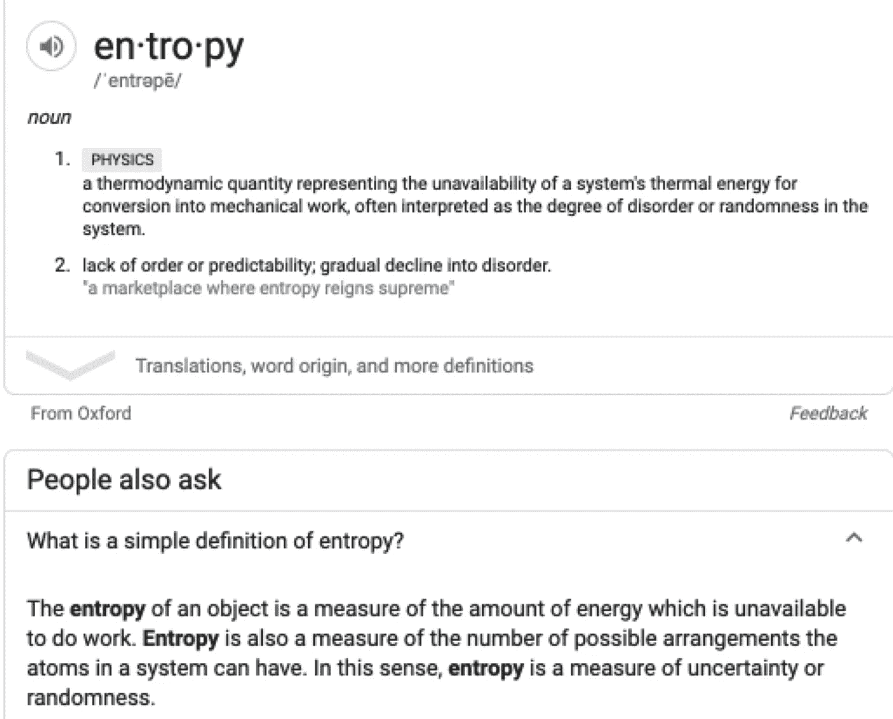

来源:谷歌搜索截图

基于这个结果，你可以注意到这里有**两个核心想法**，起初，它们之间的相关性似乎不是很明显-

*   熵是热力学中做功所缺少的(或需要的)能量
*   熵是无序或随机(不确定性)的量度

那么到底是什么——能量缺失，还是一种度量，或者两者都有？让我提供一些观点，希望能帮助你理解这些定义。

# 倒楣的事情发生了！

把这个令人讨厌的标题换成更容易接受的说法

> **任何可能出错的事情都会出错——墨菲定律**

我们都已经接受了这条定律，因为我们一直在观察和体验这条定律，而这背后的罪魁祸首正是这篇文章的主题——是的，你说对了，这就是**熵！**

所以现在我让你们更加困惑了——熵不仅仅是缺失的能量和无序的量度，它也是无序的原因。太好了！

就定义而言，我们在这里下不了决心。然而，事实是，在适当的背景下，上述三种观点都是正确的。为了理解这些背景，让我们先看看无序及其与熵的关系。

# 无序是主导力量

我借助 James Clear(《原子习惯》的作者)的一篇文章中的例子来解释这一点。

来源:左图([https://pix abay . com/illustrations/puzzle-puzzle-piece-puzzles-3303412/](https://pixabay.com/illustrations/puzzle-puzzle-piece-puzzles-3303412/))右图(图片由[李中清](https://unsplash.com/@picsbyjameslee?utm_source=unsplash&utm_medium=referral&utm_content=creditCopyText)在 [Unsplash](https://unsplash.com/s/photos/sand-castle?utm_source=unsplash&utm_medium=referral&utm_content=creditCopyText) 上拍摄)+作者注明

理论上，这两种情况都有可能发生，但发生的几率微乎其微。好吧，好吧，称之为不可能🤐！。这里的主要信息如下:

> **无序的变化永远比有序的多得多！**

借用伟大的史蒂芬·平克的智慧:

**史蒂芬·平克—** 哈佛大学心理学系约翰斯通家族教授(图片由作者创建)

**我们如何击退熵的浪潮？**

付出必要的努力。努力意味着我们应该花精力去对抗熵产生的无序。

在热力学中，熵的观点占主导地位，也就是说，你将必要的(缺失的)能量注入你的系统，使其达到平衡。

由于这是一本机器学习杂志，我不会在这方面(即统计热力学)停留太久，而是提供了一篇精彩文章的链接，这篇文章以一种我永远无法解释的方式进行了解释。

 [## 撒旦科学

### 在伦敦北部这个悲惨的二月天，当我打开暖气时，我非常感激一个基本的自然事实…

plus.maths.org](https://plus.maths.org/content/satanic-science) 

你要注意的是，作为无序度量度的熵的公式是什么样子的，就像它在玻尔兹曼的墓碑上显示的那样。

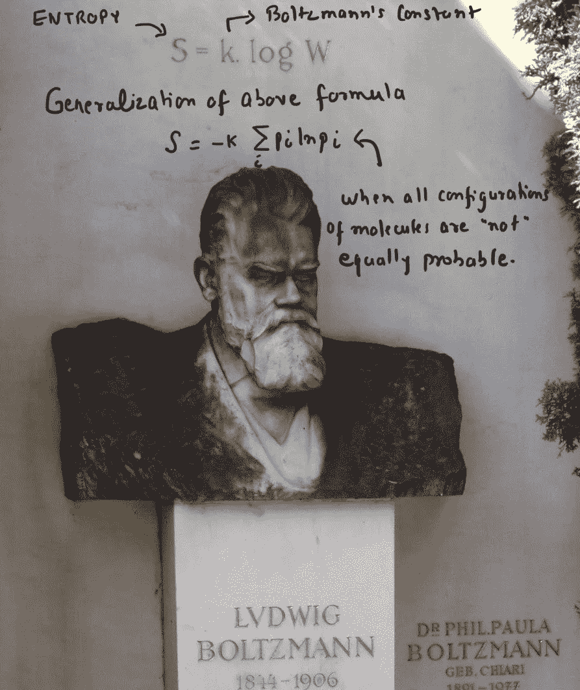

来源:【https://www.atlasobscura.com/places/boltzmanns-grave[+作者标注](https://www.atlasobscura.com/places/boltzmanns-grave)

接下来，让我们从信息的角度探索熵，这是机器学习打算从数据中提取的内容。

# 熵是信息的一种度量

如果你在思考——早先他说熵是无序或随机(不确定性)的量度，现在它已经演变成信息的量度——那么这意味着你在注意。干得好！:)

信息和不确定性确实是相互关联的。耐心点，你很快就会看到的。

“信息”这个词意味着一个人没有的知识。如果你已经知道了，那就不是信息了！

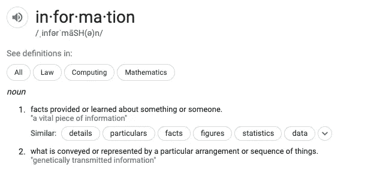

来源:谷歌搜索截图

现在信息也可以被看作是一个“惊喜”,尽管你感到惊讶的程度会有所不同。例如，如果我告诉你明天太阳会升起，你会说——哼！毫不奇怪，也就是说，这份声明中没有任何信息，但如果我告诉你明天世界将会毁灭，你会非常惊讶(…至少非常悲伤，我希望！😩)

从惊讶的角度思考的好处是，大多数时候我们对“信息”的思考是二元的——要么我有信息，要么没有，而“惊讶”有助于带来可变性程度的概念。你的惊讶与某个事件发生的概率(几率)成反比。事件越罕见，你越惊讶！概率是什么？….这是对不确定性的衡量！

借助亚里士多德的逻辑，你可以理解我们已经确立了信息(惊奇)和不确定性(概率)之间的关系。接下来，让我们试着用数学公式表示它。

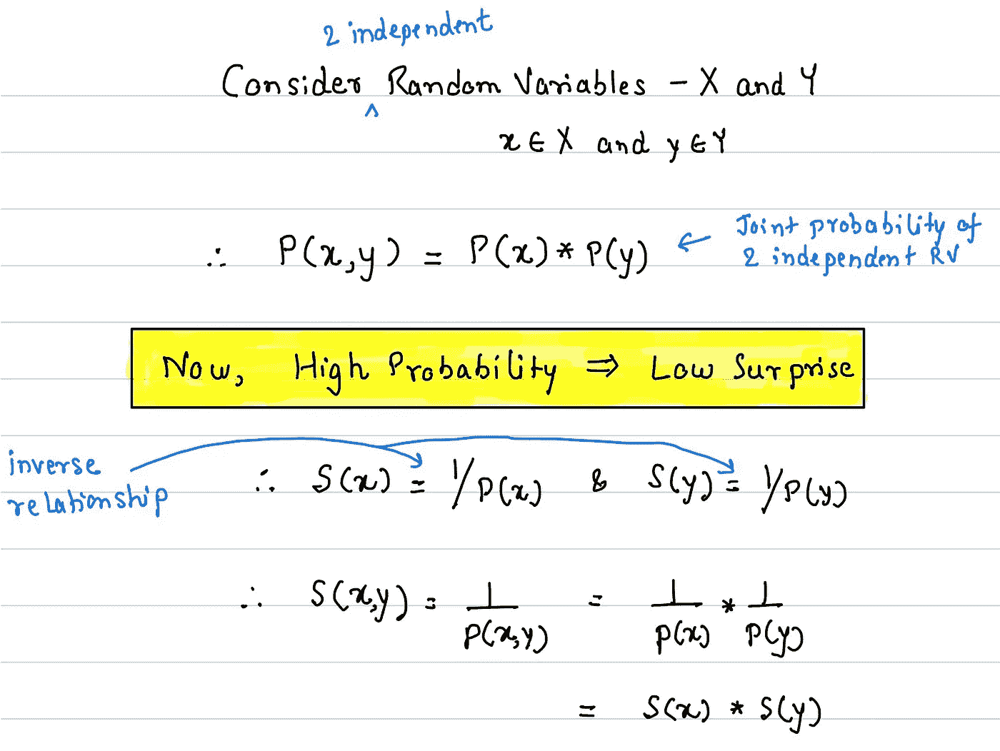

来源:作者

上述数学公式有些奇怪。我不知道你怎么想，但我肯定不开心！

当我得到信息(让我吃惊..咄！)大概两个(😲&🤔)**独立的**事件，总的惊喜将会是**附加的**(😲+🤔)在性质上与**相乘**(😲x🤔).

让我们解决这个问题。

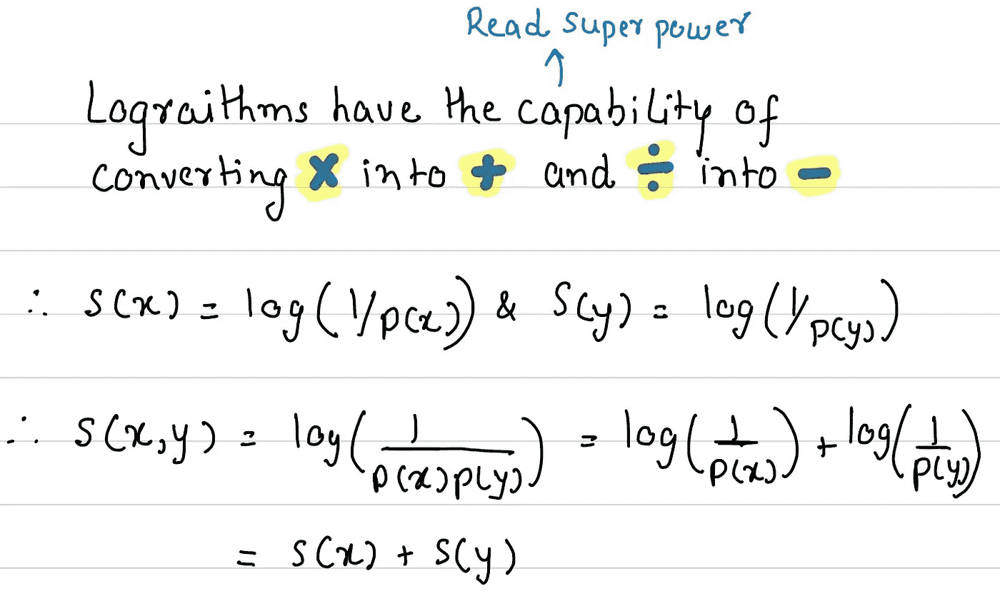

来源:作者

所以，惊喜与事件概率(随机变量)的对数成反比。**对数函数帮助我们把惊喜的附加方面带回家**。换句话说，我们可以通过认识到乘法可以通过对相关概率的对数进行处理而被视为加法，来提高我们对计算惊喜函数的直觉——我们的常识会说，惊喜函数必须是事件概率的加法而不是乘积(乘法)。

对我们来说，下一个问题是制定“从长远来看，我会有多惊讶？”

我们为什么对上面的问题感兴趣(这里的关键字是**“长期”**)是因为我们在这里的组合中引入了随机变量(因此也带来了不确定性)，因此我们需要测量我们的惊喜的**中心趋势**。

> 前一段时间我写了一篇文章叫做“[但是什么是随机变量呢？](/but-what-is-a-random-variable-4265d84cb7e5)”。如果你对随机变量&分布感到不舒服，不妨去看看。

 [## 但是什么是随机变量呢？

### 对什么是随机变量及其与概率论的联系的清晰而简单的解释。

towardsdatascience.com](/but-what-is-a-random-variable-4265d84cb7e5) 

## 随机变量的期望值(或中心趋势)

当我们处理常规数字时，我们经常使用平均数、众数和中位数来统计这些数字。让我们在这里花一分钟的时间只关注均值。平均值是你的数字集中趋势的一个指标，当你计算它的时候，你给你所有的数字以相同的权重。数学很简单——取所有的数字，然后除以数字的个数。

在随机变量的情况下，在给定的时刻，我们没有属于这个随机变量的所有数字(样本),更重要的是，随机变量都是关于公平的；贡献对他们很重要，因此与传统的数字平均不同，他们不会对所有的可能性给予同等的权重！

我们可以通过考虑**“长期平均值”**(也称为随机变量的**期望值)来解决上述挑战。**这是你计算平均值的方法(抱歉..期望值)。

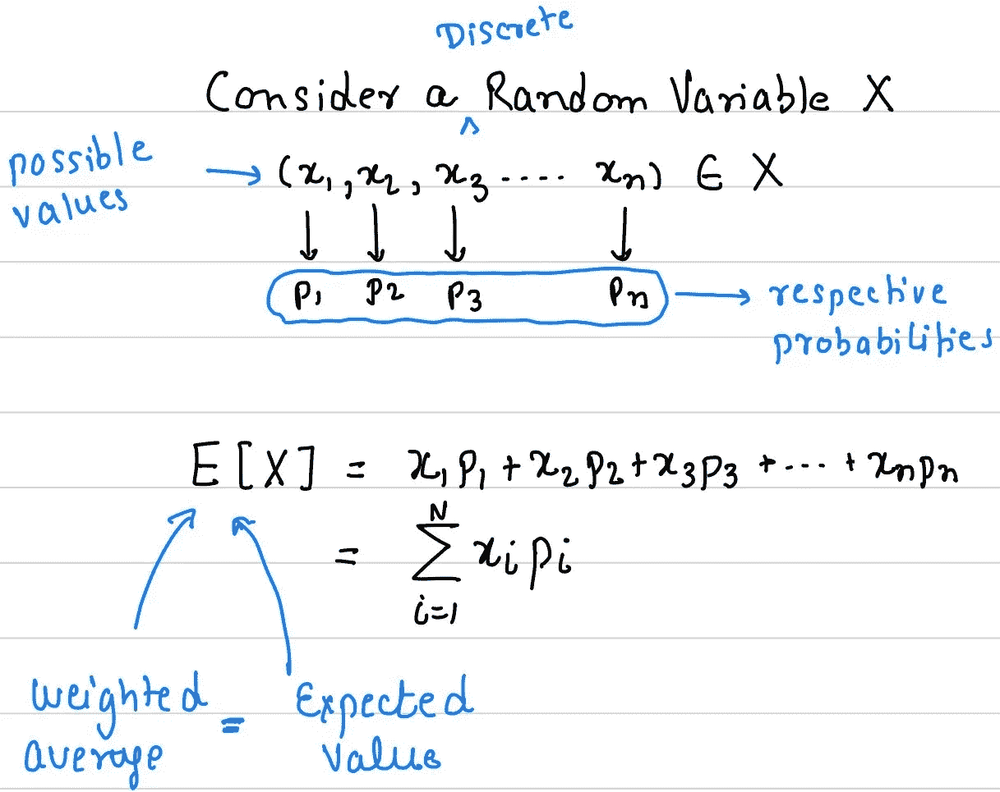

来源:作者

每一种可能性对中心趋势(期望值)的贡献(x_i)由等于其发生的可能性(概率)的权重给出。

## 惊喜的期望值(或集中趋势)

如果你理解随机变量的期望值，你就不会对此感到惊讶(双关语😎！)

平均或预期惊喜也应该是所有惊喜的加权平均之和！

运用我们之前学到的知识:

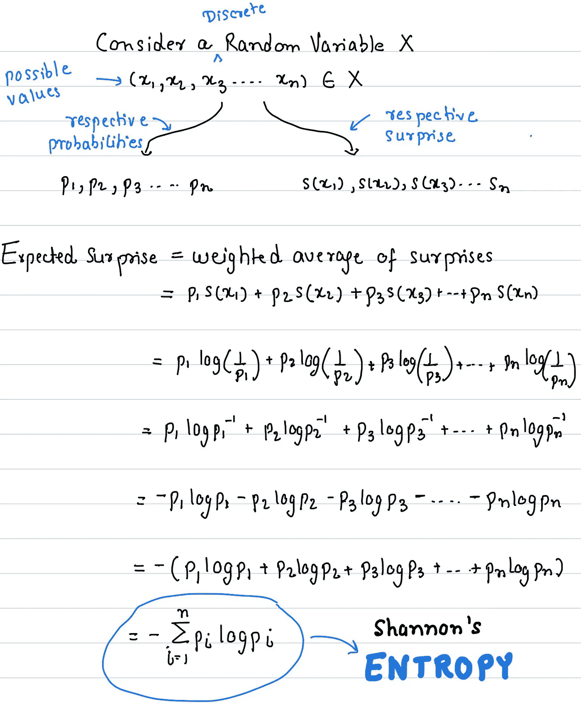

来源:作者

正如你所看到的，在简化了上图中的各个步骤后，我们最终得到了预期的惊喜，看起来像熵的公式(来自热力学)。看我标注的玻尔兹曼墓碑的图像。我真的希望他的鬼魂不会因此困扰我！

克劳德·香农在 1948 年的开创性论文《沟通的数学理论》中提出了信息(惊喜)期望值的公式

克劳德·香农:信息论之父(图片来源:[维基百科](https://en.wikipedia.org/wiki/Claude_Shannon))

克劳德·香农的探索是用尽可能少的比特数传输和接收信息。我之前借助惊奇概念推导出的公式，也可以用来告诉你一条消息的最小比特数。为此，您可以使用基数为 2 的对数。让我们也做几个例子。这些例子摘自《信息论的[元素](https://www.amazon.com/Elements-Information-Theory-Telecommunications-Processing/dp/0471241954)一书，并使用张量流概率求解。

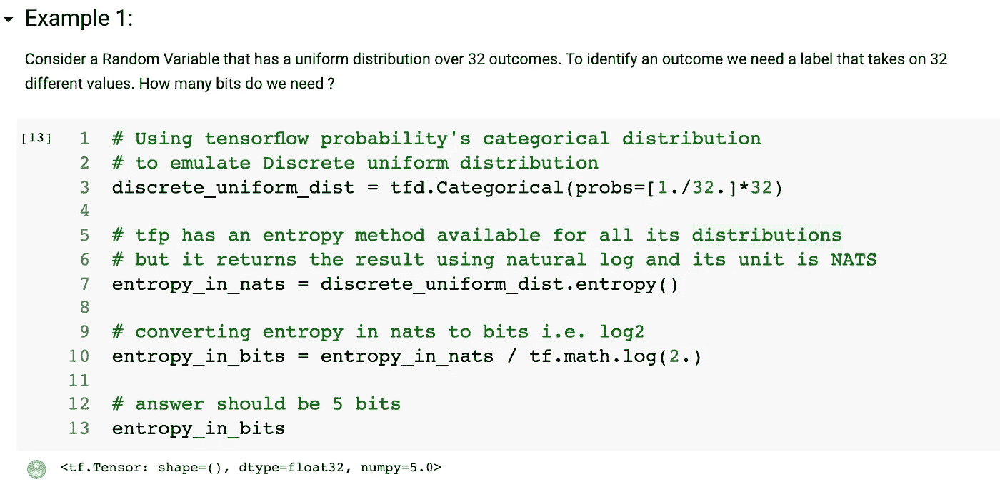

来源:作者

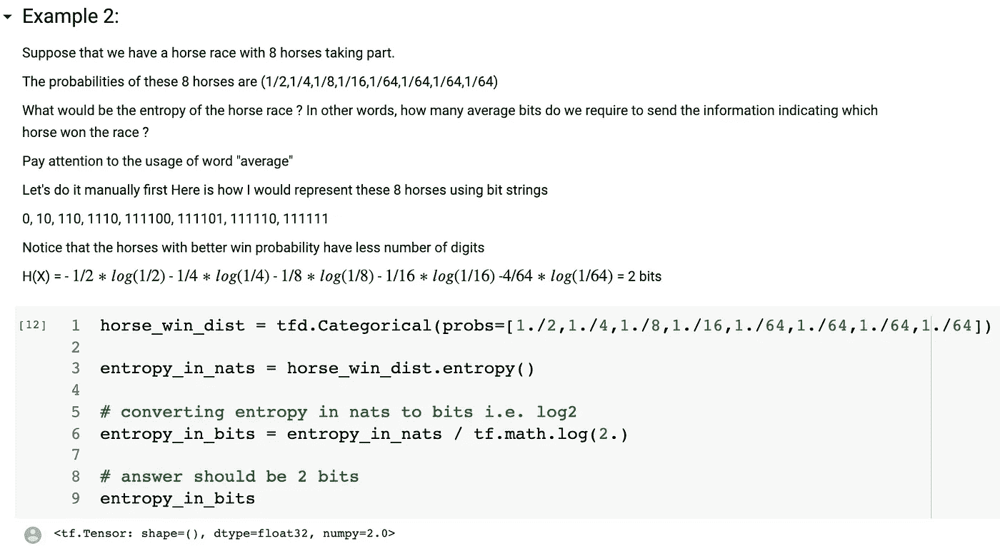

来源:作者

为什么在信息论的上下文中它被称为熵是因为度量(公式)看起来像热力学的公式。它被称为**香农熵或信息熵和熵。真的只是熵！**

香农的工作也为文件压缩奠定了基础，其核心思想是在不扭曲原始信息的情况下，用更少的比特来表示信息。

# 使用熵来选择概率分布

首先，习惯性地提及贝叶斯定理。

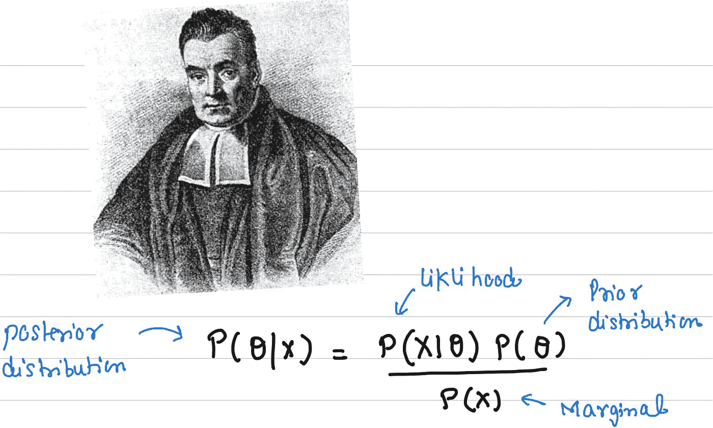

来源:[图片](https://en.wikipedia.org/wiki/Thomas_Bayes)来自维基百科+作者标注

你有没有想过应该如何选择先验分布和概率分布？许多统计通常是通过使用正态(高斯)分布来完成的，但通常常规选择并不是最佳选择。

> 无知比错误更好，不相信任何东西的人比相信错误的人更接近真理——托马斯·杰斐逊

托马斯·杰斐逊的智慧可以成为我们做出这一选择的指导力量。把它转化成我们的问题域，看起来会像这样-

具有最大概率分布的分布是具有最大熵的分布。这也意味着这也是你能做出的信息量最少、最保守的选择。这是最大熵分布原理背后的核心思想。遵循它有助于在我们的计算中不引入任何额外的偏差或假设。

对于无处不在的正态分布选择，一个经常被引用的理由是它遵循**中心极限定理**。最大熵原理也可以用来证明它的使用。可以解析地证明，如果分布的方差已知，那么正态分布就是具有最大熵的分布。如果你对证明的严谨性感兴趣，我会推荐你阅读这些笔记——[https://MTL sites . MIT . edu/Courses/6.050/2003/notes/chapter 10 . pdf](https://mtlsites.mit.edu/Courses/6.050/2003/notes/chapter10.pdf)

# 相对熵(KL 散度)

到目前为止，我们一直使用熵作为概率分布信息含量的指标。我们应该问自己的下一个问题是— **我们可以用它来比较两个分布吗？**

分布之间的比较可以被视为距离(在某个空间中),然而对于分布来说，该距离本质上是不对称的，即给定 p & q 分布，从 p 到 q 的距离不会与从 q 到 p 的距离相同，当然，除非它们相同。在这种情况下，它是零。这就是为什么我们用另一个术语来描述这种不同，称之为差异。

有几种不同类型的散度，最广泛使用和已知的是由 Solomon Kullback 和 Richard Leibler 创建的一种，用于测量分布之间的相对熵

[所罗门·库尔巴克](https://en.wikipedia.org/wiki/Solomon_Kullback) & [理查德·莱布勒](https://en.wikipedia.org/wiki/Richard_Leibler)KL 发散的发明者(图片来自维基百科)

很明显，熵在计算这种差异时扮演了一个角色，但你必须等一会儿才能看到它。

我们不想把 KL 散度的公式扔给你，我们想要发展一种关于它的起源的直觉，为此，我们从可能性的概念中得到帮助。

假设通过进行一项实验(例如投掷骰子数千次)，你观察到了真实的分布，我们称之为 **p** 。现在假设我们有另一个候选分布(模型)叫做 **q** ，它可能也适合于描述我们的随机变量。我们比较这两种分布(模型)的一种方法是通过查看它们的可能性比率。这是一种被称为[似然比测试](https://en.wikipedia.org/wiki/Likelihood-ratio_test)的假设测试形式(参见维基百科；解释得真好)。在实践中，我们取似然比的自然对数。

我们可以使用这个对数似然比，并使用在 **p** 中出现的数据点对其进行加权，这将为我们提供两个分布之间的差异(距离)的期望值。是时候用数学方法来看待它了:

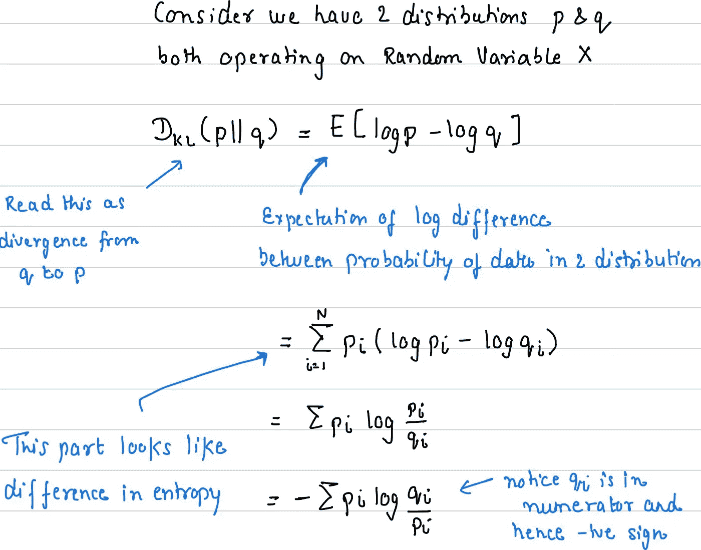

来源:作者

正如你看到的，我们的熵公式再次出现，这就是为什么 KL 散度也叫做相对熵。

我们也可以借助惊奇来理解 KL 发散。你本质上要问的问题是—

> 对于给定的随机变量 X，如果你选择分布 **q** 而不是参考分布 **p** 惊喜的相对变化是多少？

## **使用参考分布近似分布**

在机器学习中，KL 散度应用的一个主要领域是在进行变分推理时将其用作损失函数。

变分推断包括使用另一个(联合)分布来近似一个难以处理的后验分布(来自贝叶斯定理),我们有一个可用的分析形式。随着你的神经网络学习最小化 KL 发散损失，你的参考(p)和目标(q)分布看到相对熵的减少。

# 交叉熵

我也想涵盖熵的这一方面，因为它被广泛用于机器学习，尤其是分类任务。在某些方面，我们已经看到它隐藏在 KL 背离中。

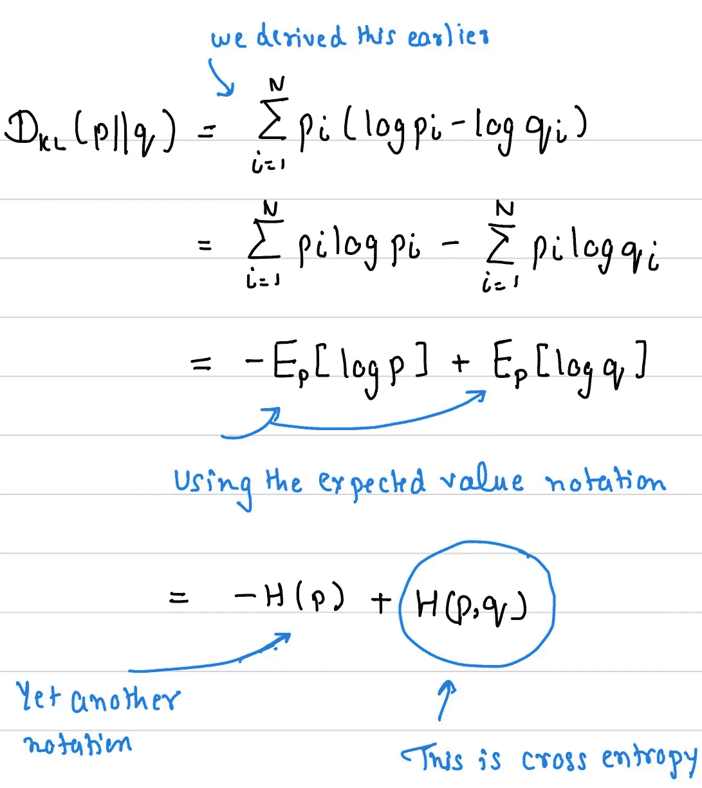

来源:作者

所以 H(p)是分布 p 的熵(自我信息), H(p，q)是分布 p & q 之间的交叉熵。

我们可以用另一种方式来解读它，更重要的是理解相对熵(KL 散度)和交叉熵之间的区别。我们将尝试从香农对熵的使用来看信息所需的比特数。

比方说，对于编码消息，我们希望使用 q 作为候选(目标)分布，因为它的分析形式而不是真正的分布 p(我们在前面的变分推理部分讨论过)。然而，现实情况是我们的近似并不完美，因此 KL 散度可以被视为 q 编码所需的额外比特的平均数量**。然而，交叉熵可以被视为使用 q 表示信息所需的比特**的平均数量

**下面是显示交叉熵和 KL 散度关系的示例代码片段。**

**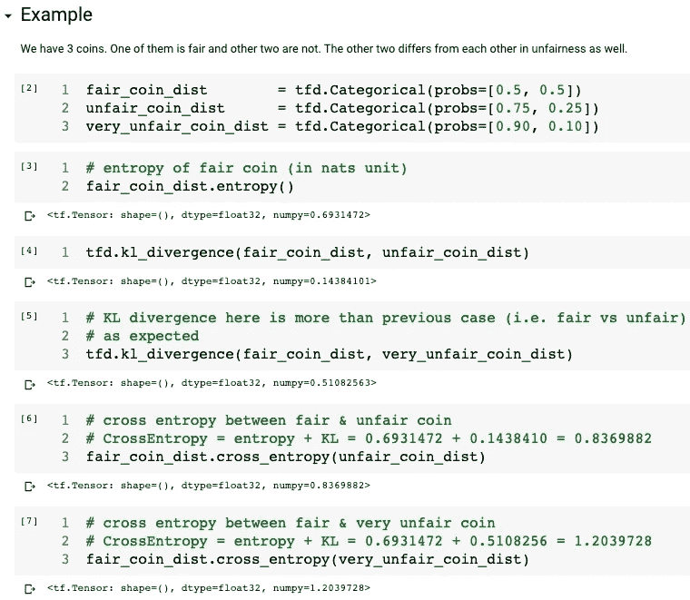**

**来源:作者**

# **结束语**

**熵可能会吓到你，因为许多不同的公式和在不同科学领域的广泛使用，但正如我们在这篇文章中看到的，它们确实是相互联系的。**

**需要记住的要点是:**

*   **熵是信息的一种度量**
*   **信息令人惊讶**
*   **熵帮助你为你的领域问题选择合适的分布(给定约束)**
*   **使用一个分布来近似另一个分布依赖于这些分布之间的相对熵**

**如果你有问题，需要更多的澄清，请写在评论中，我会很乐意尝试回答他们，如果需要的话，更新文章。**

# **参考资料和进一步阅读**

**【1】[熵:为什么生活似乎总是变得更加复杂？](https://jamesclear.com/entropy)**

**[2]威尔·库尔特关于 KL 发散的博文[https://www . countbayesie . com/Blog/2017/5/9/kull back-lei bler-Divergence-explained](https://www.countbayesie.com/blog/2017/5/9/kullback-leibler-divergence-explained)**

**[3]https://plus.maths.org/content/satanic-science[的 M. Freiberger 著《撒旦的科学》](https://plus.maths.org/content/satanic-science)**

**[4]信息论要素—[https://www . Amazon . com/Elements-Information-Theory-telecom munications-Processing/DP/0471241954](https://www.amazon.com/Elements-Information-Theory-Telecommunications-Processing/dp/0471241954)**

**[5]似然比检验—[https://en.wikipedia.org/wiki/Likelihood-ratio_test](https://en.wikipedia.org/wiki/Likelihood-ratio_test)**