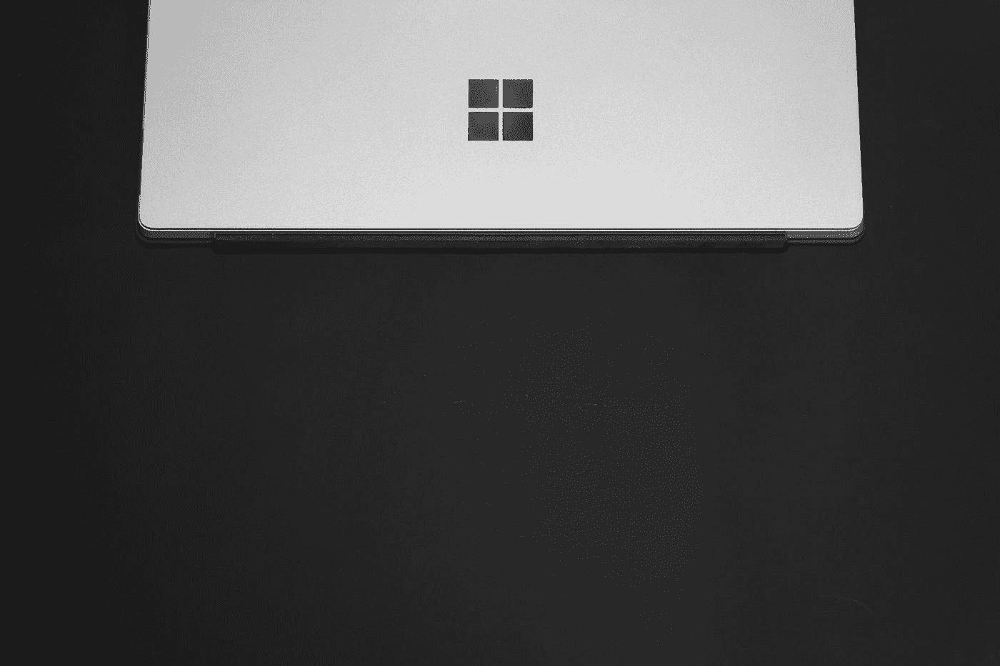
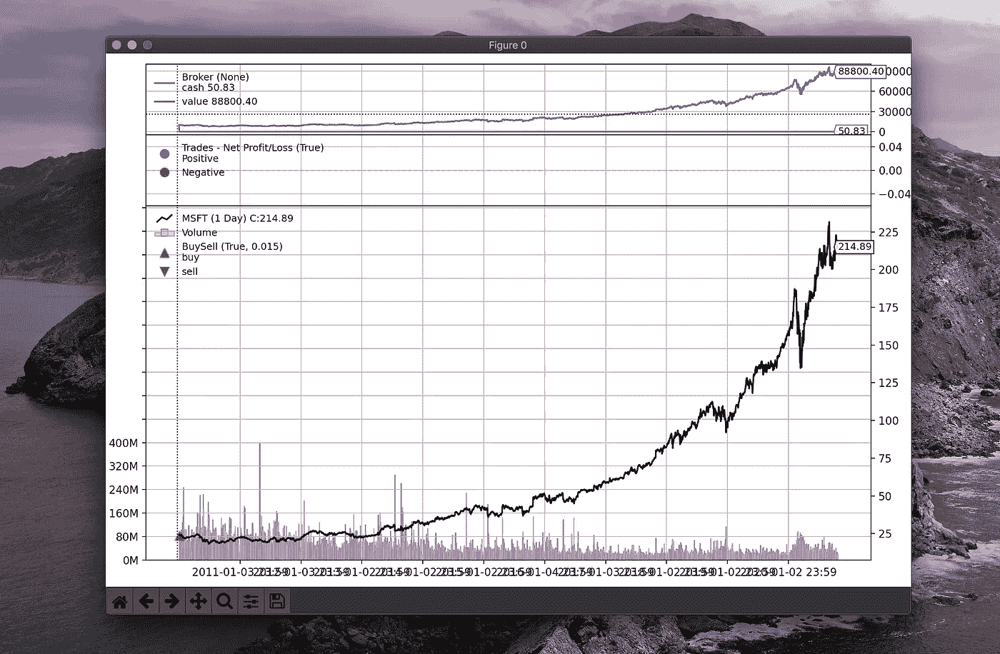

# 买入并持有交易策略

> 原文：<https://towardsdatascience.com/buy-and-hold-trading-strategy-66b4c3ac9b68?source=collection_archive---------35----------------------->

## 用 Backtester 计算策略的性能——一个用于回溯测试的 Python 框架。


米歇尔·汉德森在 [Unsplash](https://unsplash.com?utm_source=medium&utm_medium=referral) 上的照片

# 介绍

买入并持有策略是指在第一个数据点买入一项资产，然后看看最后一个数据点的投资组合价值。

买入并持有策略有时也被用作测试其他策略表现的基准。如果一个精心设计的逻辑不能打败简单的买入并持有策略，这个策略可能一文不值。

虽然手动测量购买并持有策略的性能并不难，但拥有一个回溯测试框架是有用的——您可以进一步改进该策略，它通常带有绘图功能。

**见我关于这个话题的其他文章:**

[](https://romanorac.medium.com/stock-market-analysis-in-python-b71bf50151d9) [## Python 中的股票市场分析

### 我用 Python 写的关于股票市场分析的文章的精选列表。

romanorac.medium.com](https://romanorac.medium.com/stock-market-analysis-in-python-b71bf50151d9) 

**这里有几个你可能会感兴趣的链接:**

```
- [Labeling and Data Engineering for Conversational AI and Analytics](https://www.humanfirst.ai/)- [Data Science for Business Leaders](https://imp.i115008.net/c/2402645/880006/11298) [Course]- [Intro to Machine Learning with PyTorch](https://imp.i115008.net/c/2402645/788201/11298) [Course]- [Become a Growth Product Manager](https://imp.i115008.net/c/2402645/803127/11298) [Course]- [Deep Learning (Adaptive Computation and ML series)](https://amzn.to/3ncTG7D) [Ebook]- [Free skill tests for Data Scientists & Machine Learning Engineers](https://aigents.co/skills)
```

*上面的一些链接是附属链接，如果你通过它们进行购买，我会赚取佣金。请记住，我链接课程是因为它们的质量，而不是因为我从你的购买中获得的佣金。*

# 认识反向交易者


马库斯·斯皮斯克在 [Unsplash](https://unsplash.com?utm_source=medium&utm_medium=referral) 上拍摄的照片

[Backtrader](https://github.com/mementum/backtrader) 是一个用于回溯测试和交易的开源 Python 框架。它让你专注于编写可重复使用的交易策略、指标和分析工具，而不是花时间建立基础设施。

在安装它之前，请安装 TA-LIB 依赖项:

```
# Mac OS X
brew install ta-lib# see [https://github.com/mrjbq7/ta-lib](https://github.com/mrjbq7/ta-lib) for other platforms
```

安装 Backtrader 和安装每个 python 包一样简单:

```
pip install backtrader[plotting]
```

# 买入并持有策略



Ashkan Forouzani 在 [Unsplash](https://unsplash.com?utm_source=medium&utm_medium=referral) 上拍摄的照片

我们要计算一下，如果我们在 2010 年 1 月 1 日投资 10.000 美元到微软，并一直持有到现在，我们会获得多少收益。

## 战略

我们只需要几行代码来实现 Backtrader 的买入并持有策略。

以下代码的解释:

*   start 方法设置现金的初始金额。
*   对于第一个数据点，只调用一次 nextstart 方法。这非常适合实施买入并持有策略。
*   所有可用的现金都用来购买固定数量的股票。它被截断为整数，因为所有的经纪人都不支持零股。
*   回报在 stop 方法中计算，使用投资组合的现值和初始现金量。

```
import backtrader as btclass BuyAndHold_Buy(bt.Strategy): def start(self):
        # set the starting cash
        self.val_start = self.broker.get_cash()    def nextstart(self):
        # Buy stocks with all the available cash
        size = int(self.val_start / self.data)
        self.buy(size=size) def stop(self):
        # calculate the actual returns
        self.roi = (self.broker.get_value() / self.val_start) - 1.0
        print("ROI: %.2f, Cash: %.2f" % (100.0 * self.roi, self.broker.get_value()))
```

## 回溯测试

正如上面已经提到的，我们想计算持有微软股票大约 10 年我们会获得多少收益。

我们定义 ticker、date 参数并初始化数据馈送:

```
from datetime import datetimedata = bt.feeds.YahooFinanceData(
    dataname="MSFT", fromdate=datetime(2010, 1, 1), todate=datetime(2020, 10, 23)
)
```

然后我们初始化脑波强化器引擎:

```
cerebro = bt.Cerebro()
```

将数据馈送添加到引擎:

```
cerebro.adddata(data)
```

将策略添加到引擎中:

```
cerebro.addstrategy(BuyAndHold_Buy, "HODL")
```

设置现金:

```
cerebro.broker.setcash(100000.0)
```

运行回溯测试:

```
cerebro.run()# The output
ROI: 788.00, Cash: 88800.40
```

我们将获得 788%的疯狂回报。如果我们能回到过去😊


Gif 来自 [giphy](https://giphy.com/gifs/back-to-the-future-xsF1FSDbjguis)

## 形象化

我们都听说过“一图胜千言”这句话。这就是 Backtrader 的闪光点。

反向交易者可以想象一个有进场点和出场点的策略。在我们的例子中，我们只有一个入口点，所以交易策略的可视化不会太戏剧化。但是我们需要花相当多的时间来使我们摆脱 Backtrader 的束缚

让我们试试(下面的命令在 JupyterLab 中有效):

```
cerebro.plot(iplot=False)
```



可视化的购买和持有交易策略与微软股票。

要了解更多关于买入并持有的策略，请访问[反向交易文档](https://www.backtrader.com/blog/2019-06-13-buy-and-hold/buy-and-hold/)。

# 在你走之前

像往常一样，你可以下载[这款](https://romanorac.github.io/assets/notebooks/2020-10-24-buy-and-hold.ipynb) Jupyter 笔记本，在你的机器上试例子。

在 [Twitter](https://twitter.com/romanorac) 上关注我，在那里我定期[发布关于数据科学和机器学习的](https://twitter.com/romanorac/status/1328952374447267843)消息。


照片由[Courtney hedge](https://unsplash.com/@cmhedger?utm_source=medium&utm_medium=referral)在 [Unsplash](https://unsplash.com/?utm_source=medium&utm_medium=referral) 拍摄