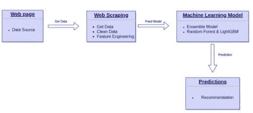
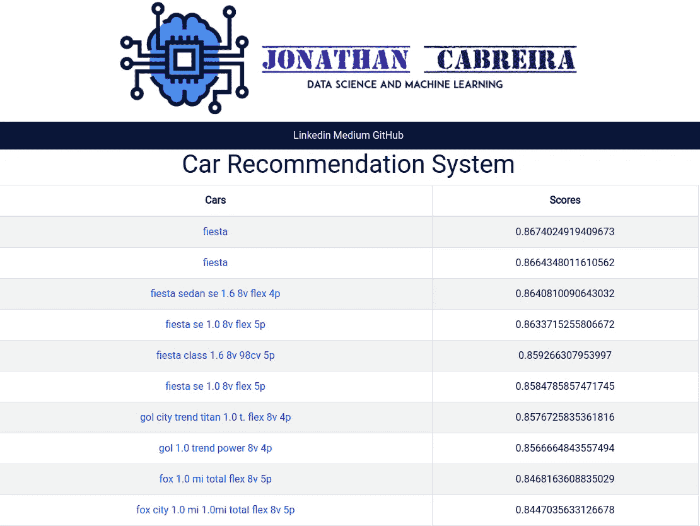
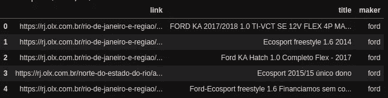
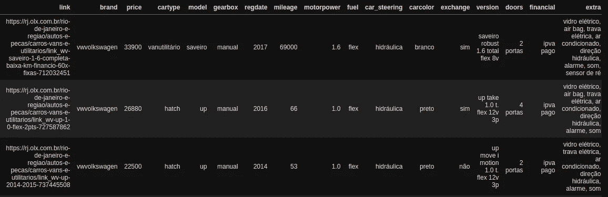
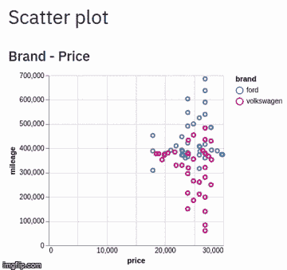
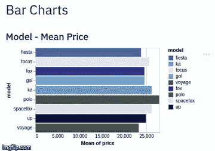
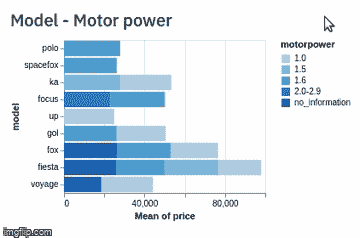
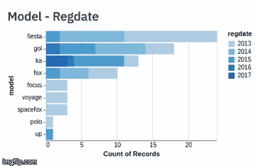

# 作为数据科学家买车

> 原文：<https://towardsdatascience.com/buying-a-car-as-a-data-scientist-5a2f9f340292?source=collection_archive---------50----------------------->

## 从问题陈述到 web 应用程序

应用程序图表

在绿宝石岛(爱尔兰)生活了一年后，是时候搬回巴西了——新冠肺炎疫情让整个世界天翻地覆。

生活在里约热内卢或任何其他巴西大都市的一个有趣(或可悲)的事实是，拥有一辆车几乎是强制性的——只要你买得起。基于此，我决定作为一名优秀的数据科学家来解决这个问题。我建立了一个汽车推荐系统，在网页上搜索汽车，处理数据，并通过机器学习模型传递数据，以便列出和显示与我正在寻找的汽车更相关的汽车——s*poiler:这款应用程序对我帮助很大*

***你可以在***[***web app***](https://car-recommender-jmcabreira.herokuapp.com/)***和我的***[***Github***](https://github.com/jmcabreira/Data-Science-Projects/tree/master/Buying_acar_as_a_DataScientist)***页面上查看应用和我开发的所有代码***

应用评分表

# 获取数据

在这个项目之前，我根本没有实践过网络抓取。不过，只要对某些模块和网页的工作原理有一点了解，你就可以把网络变成一个更强大的数据源。另外，我不能忘记提到我上过 Mario Filho *(巴西该领域的参考文献之一)*数据科学课程，它的内容对我帮助很大。

为了读取页面 HTML 代码并从中获取数据，我使用了 *BeautifulSoup* 。这个过程很简单，你打开你想获取数据的页面，检查你感兴趣的项目并存储你想要的信息。要做到这一点，您必须了解页面的结构，并想出一种智能的方式来存储和组织您正在抓取的数据。

# 数据解析

网络抓取本身并不是目的。换句话说，我们总是受网站设计和模式的支配，正因为如此，每个页面都有自己的废弃方式。此外，我们需要解析字符串，以便以我们想要的格式获取信息。

我在**三个**步骤中得到数据。首先，我抓取了网站的搜索页面，并存储了它的链接、汽车规格和汽车制造商。之后，我解析了每个汽车页面，以获取汽车的特征。最后，我对数据应用了一些特征工程，以便能够应用机器学习算法。

## **获取搜索页面**

## 解析数据帧

## 特征工程

为了避免稀疏性问题，我决定对虚拟变量应用一种热编码，并且只选择频率最高的组件。我将低频类别视为噪音，这样我就能够在不损失太多信息的情况下降低一点数据的维度。我还通过应用 scikit learn 中的 fidfVectorizer 将一组原始文本转换为 TF-IDF 特性矩阵。

# 数据标记

对于这个项目，我决定手动标记训练数据。我在电子表格上打开文件，把我想买或至少看过照片的车设为 1，把我不想买的车设为 0。我本可以使用主动学习技术来标记数据，但是我决定，对于这个项目来说，为了尽可能的准确，我自己来做。

# 模型

我首先构建了一个只有两个特征(价格和型号)的基线模型。然后我应用了随机森林和 lightGBM 等不同的模型。我还为每个模型测试了不同的变量，这样我就可以根据特性的数量来平衡模型的复杂性。

经过漫长的过程，我决定创建一个由随机森林和 lightGBM 组成的集合模型。

# **模型结果数据分析**

除了模型提供的分数*(由于不平衡数据标签，我使用平均精度和 Roc AUC 分数作为度量标准)，*我还构建了一个仪表板，显示关于得分最高的汽车的信息*。*

每次更新应用程序的数据库时，仪表板也会更新。因此，让我们检查几个当前日期的图表和曲线图。

通过查看上面的图表，我可以衡量模型的运行情况。嗯，到目前为止结果是惊人的！我正在寻找两个品牌(大众和福特)的价格在 17-30k 雷亚尔以内的汽车。除此之外，福特嘉年华和福特 ka 是我最有可能购买的汽车。此外，所有这些型号都是我感兴趣的汽车。所以，这个应用程序运行得非常好！

# app 会帮我买车吗？！

这个问题的答案很简单:对我肯定有帮助！事实上，它已经在起作用了。我每天都在更新数据库，以便找到最好的报价。当我快要到达巴西的时候，我将会决定当我到达那里的时候我将会买的每一个。

# 结论

我建立了一个非常好用的汽车推荐系统。所有的建议都与我正在寻找的一致，我很自豪能够使用我的数据科学技能来完成这个美丽的任务。

如果你想了解更多关于项目本身的信息，请查看我的 Github 上的代码。关于它，有很多我在这篇文章中没有提到，比如容器、烧瓶和 Streamlit 应用程序的使用。

如果你需要任何帮助来建立你的推荐系统，让我知道，我会帮助你。

