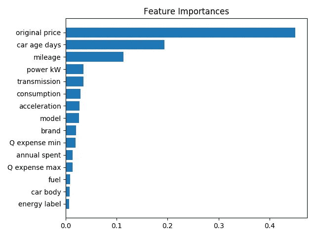
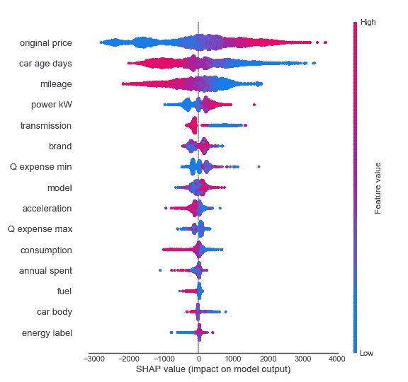
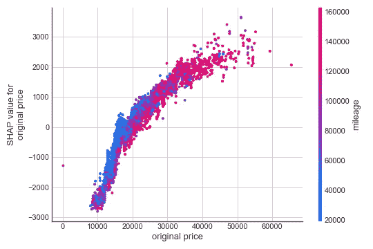
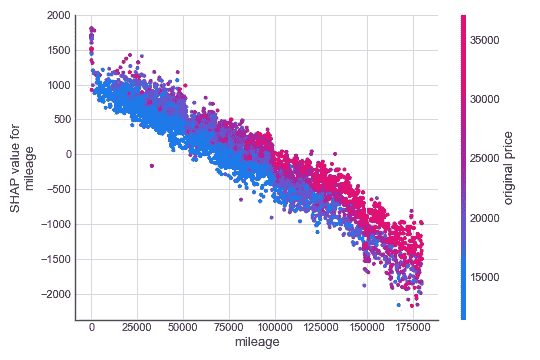
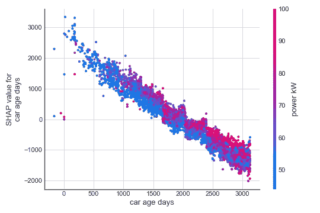
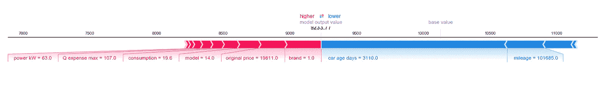
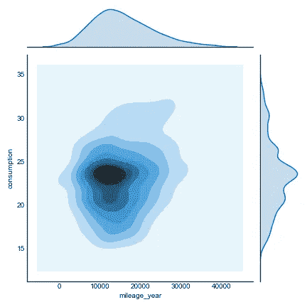

# (以书呆子的方式)买车

> 原文：<https://towardsdatascience.com/buying-a-car-in-a-nerdy-way-8ec4626fd49b?source=collection_archive---------69----------------------->

## 通过使用机器学习进行价格预测，书呆子搜索引擎可以找到二手车价格的好交易。


图片由来自 [Pixabay](https://pixabay.com/?utm_source=link-attribution&utm_medium=referral&utm_campaign=image&utm_content=3250015) 的[戴夫·塔夫斯](https://pixabay.com/users/dtavres-8137151/?utm_source=link-attribution&utm_medium=referral&utm_campaign=image&utm_content=3250015)拍摄

我不是那种可以通过观察汽车的光学系统(或者通过观察整个汽车)来说出汽车型号、品牌、年份的人。因此，当我不得不从成千上万的选择中做出买哪辆车的选择时，我的选择几乎是随机的。我可以上网浏览一堆照片，但对我来说它们看起来都差不多。

所以我决定做我最擅长的事，用最无聊的方式解决问题。:)

我的目标是买一辆二手车，以我心中特定的预算，最大化我能得到的*价值*。同样，我不知道在这个上下文中*值*是什么，因为我对汽车一无所知。但是让我们假设有一个函数 ***y = f(X)*** 可以告诉我们一辆车的价格( ***y*** )，给定该车的特征( ***X*** ，又名特征)。*价值*不是一个客观指标，而是"**市场认为**"通过添加/删除某个特定功能(例如三门与五门汽车)汽车的价格会发生多大变化。“市场认为”是人们集体认同的，*数学上的* *对一辆汽车有无给定特征的价差分布的预期*。

在一个“明知故犯”的世界里，每个人都会知道函数 ***y = f(X)*** ，并用它来设定他们想要出售的汽车的价格。

虽然有在线价格计算器和带有车型-年份-公里价格建议的表格(近似于 ***y = f(X)*** )，但并不是每个人都以这种方式来评估他们的汽车价格。此外，特定买方或卖方对*价值*的感知可能与*市场认为的***(***y = f(X)***)不同( ***y'=f'(X)*** )。例如，卖方可能会分配一些*价值*用于今天出售汽车，而不是等待，为此她愿意降低汽车的价格，但作为买方，我对此没有任何价值，所以我会将这辆汽车视为销售机会。**

**因为我对自己的价格-价值关系( ***y'=f'(X)*** )没有什么特别的个人想法，所以我会尽量去找市场是怎么想的( ***y=f(X)*** )对于那些我关心的特征( ***X**** )。例如，我不介意汽车的颜色，但让我们假设白色汽车往往更便宜，让我们假设我不知道这一点。因为车的颜色不在*，***【y * = f(X *)***在价格上不会对白色或黑色版本的同款车做任何区分，**【y *】**会介于两者之间(具体要看我用白色和黑色车的多少来找函数***【y * = f(X *)***)。在查看白色( ***y_white*** )和黑色( ***y_black*** )车的实际要价时，我应该发现***y _ white<y *<y _ black*。因此，我可以利用实际价格和预测价格之间的差异来找到对我来说比较划算的交易。越负的 ***y_actual-y*，****越好成交。在我们的例子中，***y _ white-y *<0***和***y _ black-y *>0***。所以这样一个过程的最终输出会是“*买白色车*的建议。******

****所有这些冗长的介绍就是为什么建立一个模型(即估计 ***y*=f(X*)* )** 来预测二手车价格可以帮助像我这样的不专业的人做出数据驱动的决定，而不需要真正了解汽车，相信“市场”拥有数据的所有相关信息，我可以提取这些信息来做出更明智的决定。****

# ****模型结构****

****该过程如下:****

*   ****创建 ***y*=f(X*)*******
*   ****____ 获取大量汽车数据: **X*** 和 **y_actual******
*   ****____ 训练一个机器学习模型， ***y*=f(X*)*******
*   ****使用 ***y_actual-y**** 寻找优惠****

****我为构建模型考虑的特征( ***X**** )是:****

```
****numerical features:** consumption [km/l], mileage [km], original price [euro], acceleration [s], motor’s power [kW], car’s age [days], quarterly minimum (Q min) & maximum expenses (Q max) [euro], annual spent (based on the average fuel consumption plus expenses) [euro]**categorical features:** fuel [diesel, benzine, electric, hybrid..], car body [hatchback, sedan, suv...], energy label [A, B, C.. F], brand [audi, honda, toyota...], model [a3, auris, golf, yaris...], transmission [automatic, manual, semi-automatic]**
```

****训练的模型是一个简单的 GradientBoostingRegressor，具有网格搜索超参数调整和 k 倍交叉验证。****

```
**def train_model(X,y,features):
    from sklearn.ensemble import GradientBoostingRegressor
    from sklearn.model_selection import train_test_split
    from sklearn.model_selection import GridSearchCV, KFold

    X_train, X_test, y_train, y_test = train_test_split(X, y, test_size=0.2, random_state=0)
    GB = GradientBoostingRegressor()
    xg_param_grid = {
        'n_estimators': [300, 400, 600, 800],
        'learning_rate': [0.04,0.02],
        'max_depth': [6],
        'subsample': [0.8]
    }
    kfold = KFold(n_splits=10, random_state=0, shuffle=True)
    gsXGB = GridSearchCV(GB, param_grid=xg_param_grid, cv=kfold, scoring="neg_mean_squared_error", n_jobs=-1, verbose=1)
    gsXGB.fit(X_train[features], y_train)
    XGB_best = gsXGB.best_estimator_
    y_hat_test = gsXGB.predict(X_test[features])
    y_hat = gsXGB.predict(X)**
```

****为了知道哪个特征与预测汽车价格更相关，可以检查模型的特征重要性图:****

********

****预测汽车价格时模型指定的功能重要性****

****似乎起步价(新车时的价格)是预测二手车价格最重要的因素，其次是车龄和行驶里程。****

****人们也可以使用 [SHAP 库](https://shap.readthedocs.io/en/latest/)来更好地理解特征和预测之间的关系。这篇文章对 SHAP 价值观有一个很好的解释:[点击这里](/explain-your-model-with-the-shap-values-bc36aac4de3d)。****

********

****SHAP 汇总图****

****例如，在 SHAP 汇总图中，可以看到预测的价格主要受汽车原始价格的影响:原始价格越低(蓝色)，预测的价格越低(SHAP 值低于 0)。要素的 SHAP 值表示知道该要素的值会在多大程度上改变该样本预测的模型输出。数字特征有一个简单的解释，但分类特征有点难以解释，因为它们是标签编码的，即类别字符串被转换为数字。例如，编码特征*变速器*的标签将*自动*转换为 0，将*手动*转换为 1；因此*变速器* redish 点对应更高的值，因此 1: *手动。*变速器 redish 点(手动)和 blueish 点(自动)之间的价格预测差大约为 1000€。这个大约 1k 的€是*值**市场*分配给拥有自动变速箱而不是手动变速箱的汽车。****

********

****汽车原始(新)价格的 SHAP 依赖图****

****SHAP 依赖图显示了单个特征对模型预测的价格的影响。图中的每个点都是数据集上的一个预测。x 轴上的值是要素，y 轴是该要素的 SHAP 值。该颜色对应于第二个特征，该特征可能与我们正在绘制的特征有交互作用。例如，原价似乎与预测价格呈非线性关系:原价越高，预测越高，但从 15k 的€到 20k 的€新车价格增加的二手车预测价格比从 35k 的€到 40k 的€增加的多(大约 1k 的€对 500 的€)。在相同的图中，可以看到，对于相同的原始价格，例如 20k€，里程越高，预测的价格越低，并且该差异可以对预测的价格产生大约 1.5k€的影响。****

****根据 SHAP 依赖图，预测的汽车价格与里程数和车龄(天数)之间存在(相当)线性关系。粗略估计，里程每增加 75000 公里，预测价格下降 1k€。同样，一辆 1000 天前的汽车，其预测价格会有 1000€的下降。这些是经验法则，但并不意味着每辆车都是如此。****

****************

****里程和车龄(天数)的 SHAP 相关图****

****通过绘制 SHAP 力图，也可以理解模型是如何预测每辆车的价格的。例如，下一个图显示汽车价格的基值应该在 10100€左右，这对应于汽车价格的平均值。但是，本例中显示的特定汽车的预测价格较低，即 9233€。这主要是因为高里程(101685 公里)和车龄(3110 天)分别使价格下降了约 400€和 1.3k€。汽车的原价是 19811€，这使得模型预测的价格增加了不到 250€。从基础值(10100€)到模型输出值(9233€)的其余贡献可以在图上观察到。****

********

****SHAP 力图解释了单个汽车的预测价格如何通过每个特征增加(左侧红色特征)或移除(右侧蓝色特征)的值来解释****

****我很好奇的想知道，低油耗(高公里/升)的汽车是否会有更高的平均年行驶里程。考虑到下图中显示的消耗和年里程的联合分布，似乎没有如此明确的关系。****

********

****消耗量[公里/升]和年里程[公里]的联合分布****

# ****寻找交易****

****既然我们已经创建了模型 ***y*=f(X*)*** ，我们可以继续使用价格预测来查找使用 ***y_actual-y**** 的交易。我决定构建自己的书呆子搜索引擎，在那里，我将绘制出*(预测价格)与***y _ 实际*** (要价)，而不是显示汽车选项列表及其照片(任何汽车销售网站通常都会这样做)。如果一辆车落在 1:1 线(***y _ actual***=***y *)，*** 表示要价公平。如简介所述，我其实对那些***y _ actual***<***【y ****的车比较感兴趣。如果您想使用我的搜索引擎，请点击下面的“结果”标签。我建议您检查桌面版本，因为移动版本的扩展性不好。*****

****有两个标签，“自动”只显示自动变速箱的汽车，而“所有汽车”既有手动的也有自动的(实际上甚至有一些半自动的，我不知道存在)。图中每个点是一辆车，x 轴代表模型预测的价格【€】(***【y *)***)，y 轴是要价【€】(***y _ 实际*** )。圆点的大小与汽车的消耗量相关。圆点的颜色与年度总支出相关(一年的税收支出加上取决于汽车消耗的平均燃料支出加上实际价格减去明年同一辆汽车的模型预测价格，这是当我增加 14000 公里的里程和 365 天的车龄时模型的输出)。我还添加了一些过滤器，以防你想查找特定的品牌、里程等。****

****在该图中，划算的汽车是那些远离 1:1 线向右的点，即预测价格> >实际价格。如果你点击这个点，你将被重定向到汽车的链接，将能够看到汽车的照片和更多的信息。如果你被重定向到一个搜索列表，那是因为汽车已经售出。****

****选择“结果”选项卡查看搜索引擎。提示:移动版扩展性不好，检查桌面版****

****用于训练模型并在前面的图中显示的数据来自于 2020 年 7 月在荷兰一个网站上提供的二手车价格。在获得数据之前，我使用了一些预过滤器，例如至少从 2012 年起行驶里程不到 180000 公里、€不到 17k 的汽车。****

****最后，在所有这些分析之后，我能找到的最佳交易是这样的:****

********

****图片由 [Ronda Jenkins](https://pixabay.com/users/rhonda_jenkins-23203/) 从 [Pixabay](https://pixabay.com/?utm_source=link-attribution&utm_medium=referral&utm_campaign=image&utm_content=3250015) 拍摄****

****我想我要征求一下别人的意见…****