# 购买足球队:机器学习方法

> 原文：<https://towardsdatascience.com/buying-a-soccer-team-a-machine-learning-approach-283f51d52511?source=collection_archive---------31----------------------->

一种比随机猜测或从 18000 名职业选手中挑选选手更好的方法。

托马斯·塞勒在 [Unsplash](https://unsplash.com?utm_source=medium&utm_medium=referral) 上的照片

随着我们进入一个体育已经成为我们生活中至关重要的一部分的世界，它也成为投资者获得更好回报、与观众互动并让他们感受到自己存在的热门市场。此外，我们可以看到体育观众的激增导致了更多的锦标赛，对投资者来说，利用这些赛事已经成为一项艰巨的任务。我们接受了一项挑战，帮助主要投资者从 18000 名足球运动员中挑选出最好的球员，以建立一支能够参与并超越大联盟中其他俱乐部的梦想足球队。我们利用机器学习算法对我们俱乐部的潜在团队成员和投资者的潜在预算进行分类，以优化他们的市场收益。因此，我们想出了一个战略来建立最好的团队，同时牢记投资者的预算限制在 10 亿欧元。

## **简介**

我们有一个国际足联数据集，其中有几个名为——评级，释放条款和工资的列。我们假设在即将到来的超时数据集中没有这些变量。这些可以用于各种形式，如将玩家评定为表现较好的玩家或中等或达不到标记的玩家。此外，它还可以转化为应该被邀请参加一些俱乐部聚会、活动等的玩家。我们对评级变量使用监督学习建立了两个模型，并通过将该变量分为两类使其成为一个分类问题:大于或等于 70 和小于 70 作为我们的潜在俱乐部成员或不是。我们选择 70 分作为我们的门槛，因为大多数主要俱乐部只有评分高于 70 分的球员。为了与他们竞争，我们倾向于只让那些评分高于我们门槛的玩家参与。此外，我们还利用模型结果来预测投资者每年提供俱乐部会员资格的成本。我们的第二个模型利用了从我们之前的最佳分类器中获得的预测评级类别，而不是“实际评级”,在这里，将 *release_clause 和年薪*的组合作为投资者成本作为我们的因变量。

## **数据集**

我们使用的是来自 Kaggle FIFA 完整球员数据集的 FIFA 2019 和 2020 数据。国际足联完整的球员数据集包含 18k+独特的球员和 100+从国际足联最新版本中提取的属性。它包含:

*   CSV 格式的文件。
*   国际足联 2020–18，278 个独特的球员和每个球员的 104 个属性。(测试数据集)
*   FIFA 2019–17，770 个独特的球员和每个球员的 104 个属性。(训练数据集)
*   球员位置，在俱乐部和国家队的角色。
*   玩家属性，包括攻击，技能，防守，心态，GK 技能等。
*   球员的个人资料，如国籍，俱乐部，出生日期，工资，薪金等。

## **数据清理**

*   在某些地方，两个数据集具有相同要素的不同数据类型。读取数据字典后，我们将它们同步。
*   有些变量有内置公式，因此我们更正了它们的格式。
*   我们根据字典定义或重复的列删除了*、【索菲法 _id】、【玩家 _url】、【短 _ 姓名】、【长 _ 姓名】、【真实 _ 面孔】、【多比】、【GK _ 潜水】、【GK _ 搬运】、【GK _ 踢腿】、【GK _ 反射】、【GK _ 速度】、【GK _ 定位】和【body_type】，因为它们在我们的分析中没有增加任何有用的影响。*
*   我们将*的总体*评分转换为两个二元等级，评分> 70(因为许多大俱乐部使用这个门槛)来招募他们的团队球员，并将被视为我们的因变量

## **探索性数据分析**

我们首先考虑了用于执行探索性数据分析的各种有趣的统计数据。

*   单变量统计，如缺失值在整个数据中的百分比，以处理缺失值，连续变量(计数、均值、标准差、最小值、最大值、偏度、峰度、唯一值、缺失值、IQR)及其分布的单变量统计。
*   双变量统计:特征之间的相关性，连续变量的 T 检验和分类变量的卡方检验和 Cramer’s V。

## **单变量**

我们对连续变量进行单变量分析，以了解数据集中不同字段的分布情况。根据我们的观察(均值、标准差、偏度、峰度等。)，我们观察到许多关键特征遵循正态分布。此外，四分位间距(IQR)用于使用 Tukey 的方法检测异常值。

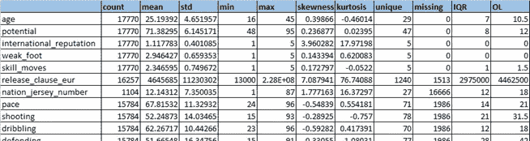

对于分类变量，单变量分析包括它们的计数、唯一值、具有最大计数的类别(即，顶部)、它们的频率以及它们缺失值的数量。从分类表中，我们可以看到 *player_tags，lended _ from，nation_position，player_traits* 有超过 54%的缺失值。用任何有希望的值来估算这些并不容易**。**

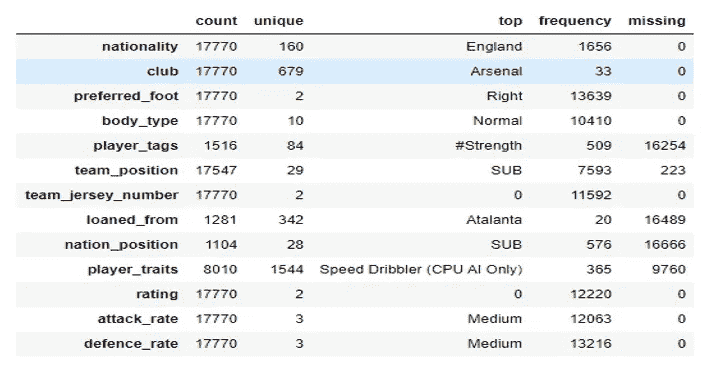

## **双变量**

## **对于连续变量**

我们构建了一个相关矩阵，以了解评级和其他解释变量之间的线性关系程度，以及在后面的阶段可以排除哪些变量。我们使用 Python 中的 seaborn 包创建了上面的热图。

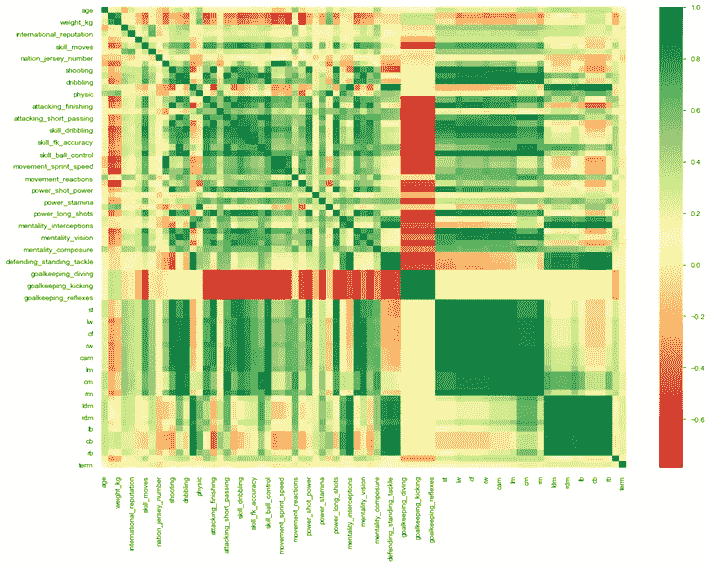

## **T 型测试**

我们还进行了 t 检验，以检查等级= 1 时变量的平均值是否与等级= 0 时变量的平均值有显著差异。在这个阶段之后，我们去掉了一些不重要的变量或者与因变量没有任何关系的变量。

## **用于分类变量**

我们进行了**卡方检验**，以检查因变量评级变量的显著性。下表包含与分类变量相对应的 p 值。在我们的分析中，我们得到了*偏好脚*并不重要。

为了找到分类变量与因变量之间的相关性，我们应用了**克拉默 V** 法则。

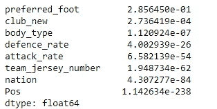

V 等于卡方的平方根除以样本大小 n 乘以 m，m 是(行— 1)或(列— 1)中较小的一个:**V = SQRT(X2/纳米)。**

*   ***释义:*** V 可视为两个变量之间的关联，以其最大可能变化的百分比表示。V2 是变量之间的均方典型相关。对于 2 乘 2 表，V =基于卡方的关联度量。
*   ***对称度:*** V 是对称度。哪个是自变量并不重要。
*   ***数据等级:*** V 可能与名义数据或更高的数据一起使用。
*   ***取值:*** 取值范围从 0 到 1。

在这个场景中，我们保留了显示自变量和因变量之间良好相关性的列。这些是'俱乐部 _ 新'，'位置'，'攻击率'，'国家'

# **特征工程:**

## **1。重新分类/输入变量**

*   由于 *team_jersey_number，nation_jersey_number* 实际上不是一个连续变量，我们决定将它们视为分类变量。
*   我们进一步将 *team_position* 的‘未上场’作为缺失值，并将球员重新分类为*防守队员、进攻队员、守门员、休息队员、中场队员、替补队员、未上场队员、*，从而将 29 个唯一值减少到 7 个级别。
*   我们推测一个守门员将会有最小值的*、【速度】、【射门】、【传球】、【运球】、【防守】、【体能】*从而赋予这些值。
*   此外，2 个变量— *国籍*和*俱乐部*具有很高的基数。根据它们的数量和事件发生率，我们将它们重新归类为低基数变量。

## **2。创建变量:**

*   从数据中，我们观察到' *player_positions'* 给出了关于玩家的多个游戏位置的想法。因此，我们决定将各个球员在不同场地位置的可用总次数分配到“*_ 位置”。*
*   一个玩家的 *work_rate* 是由他的攻防速率给定的；因此，我们把它们分成变量。
*   我们还计算了*期限*单个球员将与俱乐部相关联，以更好地了解他们对俱乐部的忠诚度。
*   我们还使用了一键编码来利用分类变量，这种形式可以提供给 ML 算法，以便在预测中做得更好。

# **3。** **型号 1**

**此处，Y =人群事件发生率为 31.23 %的等级(为 1 级)**

## **3.1。** **逻辑回归:**

对于逻辑回归模型，我们首先在没有正则化的情况下进行分类，然后进行岭和套索回归。L1 正则化逻辑回归需要解决一个凸优化问题。然而，用于解决凸优化问题的标准算法不能很好地处理在许多实际设置中遇到的大型数据集。

应用惩罚以最小化损失函数时逻辑回归的目标:

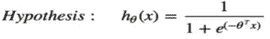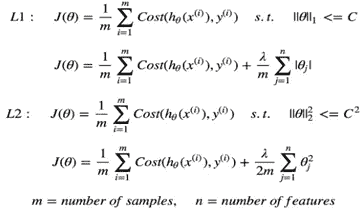

正则化前后运行逻辑回归模型(L1 和 L2)的最佳结果可总结如下:

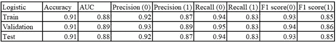

## **3.2。** **KNN:**

kNN 是一种基于案例的学习方法，它保留所有的训练数据用于分类。不同算法的评价标准之一就是它们的性能。由于 kNN 是一种简单而有效的分类方法，并且作为最有效的方法之一令人信服，这促使我们为 kNN 建立一个模型，以提高其效率，同时保持其分类精度。

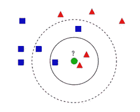

参见图 1，训练数据集包括 11 个数据点，分为两类{正方形，三角形}，分布在二维数据空间中。如果我们使用欧几里德距离作为我们的相似性度量，则根据局部区域中的距离度量，具有相同类别标签的许多数据点彼此接近。

例如，如果我们用实线圆圈表示 *k=3* 的区域，并检查类别之间的多数投票，我们观察到我们的数据点{circle}将被分类为三角形。但是，如果我们增加虚线圆表示的 *k* =5 的值，我们的数据点将被归类为正方形。这促使我们优化我们的*k-最近邻*算法，以找到分类误差最小的最优 *k* 。

## **实验:**

我们最初用 *k=* 1 训练我们的 *k-* NN 模型，将我们的数据分成 70% -30%作为我们的训练和验证数据。从表 2 中，我们观察到训练精度为 1，这意味着模型完全拟合，然而，测试数据的精度和 AUC 高于验证数据，这表明过度拟合，因此，我们主观地进行参数调整。

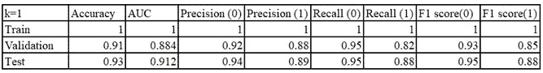

## **优化:**

我们利用肘方法找到训练数据的最小误差。在运行了最佳的 *k、*之后，我们观察到当 *k=7、*时观察到最小的错误率。尽管我们的优化结果在训练和验证中表现得更好，但是我们的测试 AUC 已经降低。

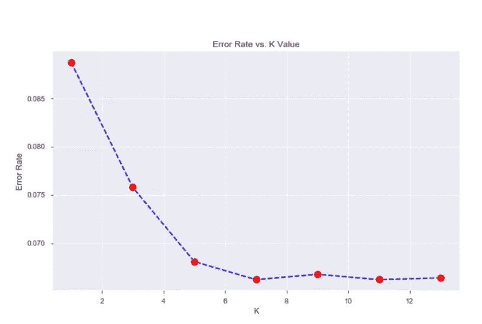

尽管测试的准确性降低了，但是我们观察到相同的精确度-召回率增加了，这表明我们的模型更好地分类了更多的类(1 ),因为它是我们的目标类。(评分大于 70 的玩家)。

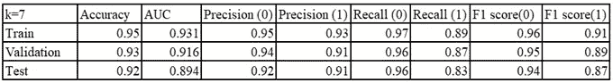

## **3.3*。*** ***决策树:***

决策树方法是一种用于分类、预测、解释和数据处理的强大的统计工具，在许多领域具有潜在的应用。

使用决策树模型有以下优点:

*   通过将原始输入变量分成重要的子组，简化了输入变量和目标变量之间的复杂关系。
*   没有分布假设的非参数方法，因此易于理解和解释。

主要的缺点是它可能会过拟合和欠拟合，特别是在使用小数据集时。

**实验:**

我们从 Sklearn 库中训练了决策树分类器，没有传递任何参数。从表中，我们观察到数据过度拟合，因此我们必须调整参数以获得优化的结果。

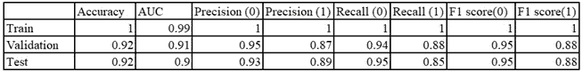

**优化**:

我们使用以下参数:

*   **条件:**字符串，可选(default=" Gini "):

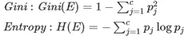

*   **max_depth:** int 或 None，可选(默认值=None):

树的最大深度。如果没有，则扩展节点，直到所有叶子都是纯的，或者直到所有叶子包含少于 min_samples_split 样本。

*   **min_samples_split:** int，float，可选(默认值=2):

树的最大深度。如果没有，则扩展节点，直到所有叶子都是纯的，或者直到所有叶子包含少于 min_samples_split 样本。

*   **最小权重分数叶:**浮点，可选():

要求位于叶节点的权重总和(所有输入样本)的最小加权分数。当未提供 sample_weight 时，样本具有相同的权重

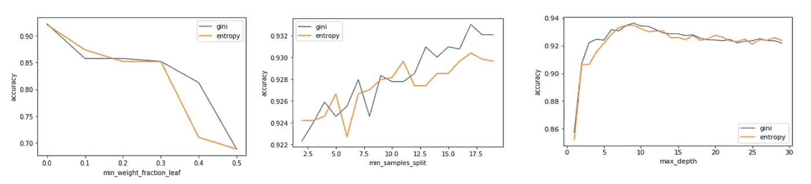

从上面的实验中，我们看到*基尼*在实验参数的所有变量中都优于*熵*。因此，我们的标准是*基尼*。类似地，我们可以观察到其他参数对于 *max_depth = 10，min_samples_split = 17.5，Min_weight_fraction_leaf =0，* Gini 给出了更高的精度。因此，利用这些参数，我们训练我们的模型来观察没有过度拟合，并且我们可以在类别 1 类别中捕获更多的真实类别。

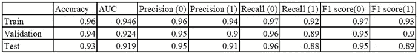

## **3.4。** **支持向量机:**

SVM 的民间观点是，他们找到一个“最优”超平面作为学习问题的解决方案。最简单的 SVM 公式是线性公式，其中超平面位于输入数据 **x** 的空间中。

在这种情况下，假设空间是以下形式的所有超平面的子集:

f( **x** ) = **w⋅x** +b

**硬保证金案例:**

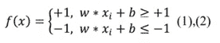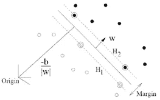

最大边缘分离超平面的目标是找到:

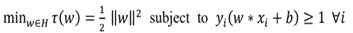

**软保证金案例:**

时差变量也是目标函数的一部分:

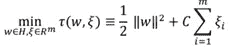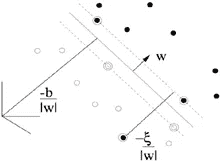

成本系数 C>0 是一个超参数，它指定了错误分类惩罚，并由用户基于分类任务和数据集特征进行调整。

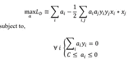

**径向基函数支持向量机**

一般来说，RBF 核是合理的首选。该核非线性地将样本映射到更高维的空间中，因此，与线性核不同，它可以处理类别标签和属性之间的关系是非线性的情况。此外，线性核是 RBF 的特例，因为具有罚参数ĉ的线性核与具有某些参数(c，γ)的 RBF 核具有相同的性能。第二个原因是影响模型选择复杂性的超参数的数量。

**实验:**

我们让我们的训练数据接受线性 SVM 分类器，而不对其进行软边界训练。然而，观察到的结果看起来很有希望，

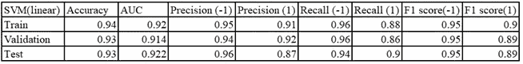

取得好成绩的原因是数据在大部分时间几乎是线性可分的，很少有错误分类。

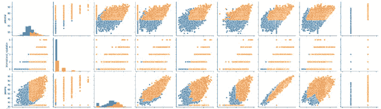

**优化:**

我们决定使用线性径向基函数运行网格搜索，改变 C 和γ来有效地训练我们的模型。通过网格搜索，我们得到了如下的最佳估计量

SVC(C=1，cache_size=200，class_weight=None，coef0=0.0，decision_function_shape='ovr '，degree=3，gamma='auto_deprecated '，kernel='linear '，max_iter=-1，probability=True，random_state=None，shrinking=True，tol=0.001，verbose=False)

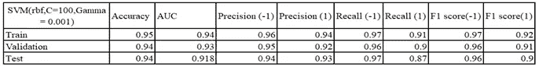

对于径向基函数，我们得到了最好的估计

SVC(C=100，cache_size=200，class_weight=None，coef0=0.0，decision_function_shape='ovr '，degree=3，gamma=0.001，kernel='rbf '，max_iter=-1，probability=True，random_state=None，shrinking=True，tol=0.001，verbose=False)

由于泛化误差(期望损失)被用来逼近总体误差，我们观察到 RBF 核模型的误差值是其他模型中最小的。此外，这是我们最好的模型，因为它比其他模型更符合数据。

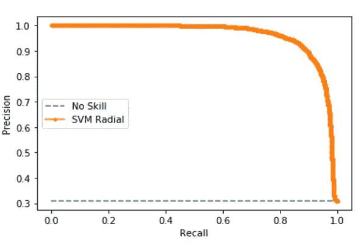

RBF 核将数据带入更高的无限维空间，这有助于我们的模型脱颖而出。精确召回曲线向我们展示了用 AUC-0.961 预测阳性类别的效果。

# **4。** **模式二:**

这里，X 是相同的，包括来自模型 1 的预测评级和 **Y =释放条款+52 *工资**作为投资者的成本。(52 乘以给定的周工资)。

从前面的单变量和双变量分析中选择重要变量后，我们绘制了自变量和因变量的散点图。

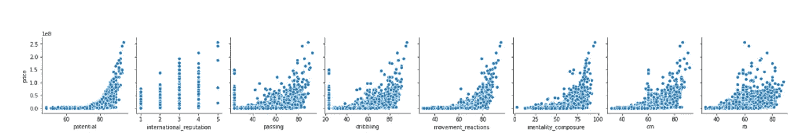

可以清楚地看到，它们遵循一种关系，但它似乎不是线性的。我们通过开发一个线性模型证实了这一点。

## **4.1。** **线性模型:**

**结果:**

r 方形链 **0.54**

r 平方验证 **0.55**

r 平方测试 **0.54**

R 平方是对完美预测接近程度的度量。这里，R 广场不好。

**从残差中检查线性:**数据应该是随机分散的。但是在这里，我们发现它们不是随机的。这意味着线性模型永远不会是适合这个模型的好选择。

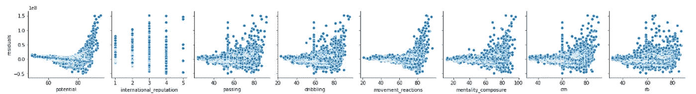

## **4.2。** **决策树:**在这个场景中，这是比线性模型更好的选择。

**结果(基线):**

**训练数据:** R 平方— 0.99，RMSE — 0.05

**验证数据:** R 平方— 0.54，RMSE — 8.05

**测试数据:** R 平方— 0.59，RMSE — 7.35

有明显的过度合身的迹象。该模型的表现不如预期。因此，我们尝试了基于 min_split、tree_depth 和 min_weight_fraction_leaf 以及学习标准的网格搜索。

如上所示，最小分割=3，最大深度=15 时，熵的性能更好。

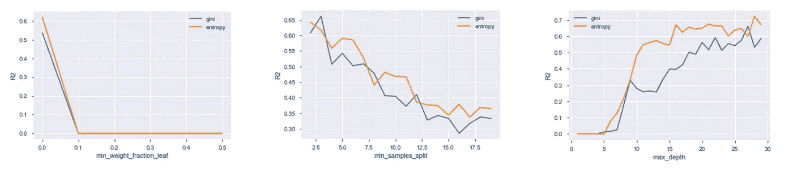

**网格搜索后的结果:(主模型)**

**列车数据:** R 平方— 0.85，RMSE — 4.40

**验证数据:** R 平方— 0.69，RMSE — 6.59

**测试数据:** R 平方— 0.70，RMSE — 6.26

r 平方值现在似乎好得多。RMSE 值也很低，过拟合的问题也得到解决。

因此，为了预测投资者的成本，决策树在这里表现得更好。

**最终策略:**

最后一步是制定一个为我们团队挑选球员的策略，记住:

*   评级应大于 70(表示 1 级)
*   预算——10 亿欧元，玩家人数约 30 人。

首先，我们只选择评分高于 70 分的玩家。剩余玩家数量— **5276**

其次，我们进行了一些分析，如投资者成本的十分位数分析。我们做了一些桶，每个桶有大约 30 名来自剩余池的玩家，并根据投资者的成本按降序排列这些桶。

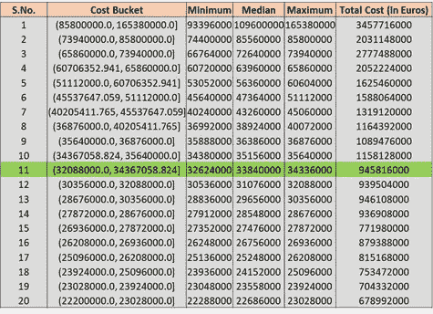

这里我们可以观察到，从第一桶中挑选全队所需的金额是**34.5 亿欧元**(超出预算)。这意味着我们不能直接挑选前 30 名球员，从第 11 组中挑选球队所需的金额为**9.45 亿欧元**(在我们的预算内)。然而，从这个桶中挑选所有的玩家是一个错误的策略，因为我们会留下将近 300 个高价值的玩家。因此，最好的解决方案是从最高级别中挑选 8-10 名核心玩家，其余的从中低级别玩家中挑选。

通过上面的分析可以很容易地做出这个决定，这取决于投资者和球队经理来决定他们的球队需要什么样的球员。

# **5。**结论:

在这项工作中，我们构建了两个模型，利用机器学习算法来使投资者受益，同时捕捉有意义地将玩家分类为表现良好的玩家，然后将他们回归到投资者的预算中。结果、分类和回归拟合是一种新的选择模型，用于监督学习表现优于其他团队的球员。最终，我们缩小了俱乐部内球员的选择过程，这比随机选择要好得多。

**未来范围:**我们还可以实现时间序列技术。作为我们的因变量，评级和成本都取决于前几年的数据。例如，如果某个玩家在 2019 年 12 月的评分为 85，那么他在 2010 年 1 月的评分大约为 85 +/- 3。因此，时间序列技术可能对这些数据有用。

# **参考文献:**

1.  郭，龚德&王，惠&贝尔，大卫&毕，亚新。(2004).基于 KNN 模型的分类方法。
2.  颜人。(2015).决策树方法:分类和预测的应用。
3.  [https://towards data science . com/how-to-tune-a-decision-tree-f 03721801680](/how-to-tune-a-decision-tree-f03721801680)
4.  阿波斯托利斯-阿芬图利斯。(2015).线性核和 RBF 核的 SVM 分类。10.13140/RG