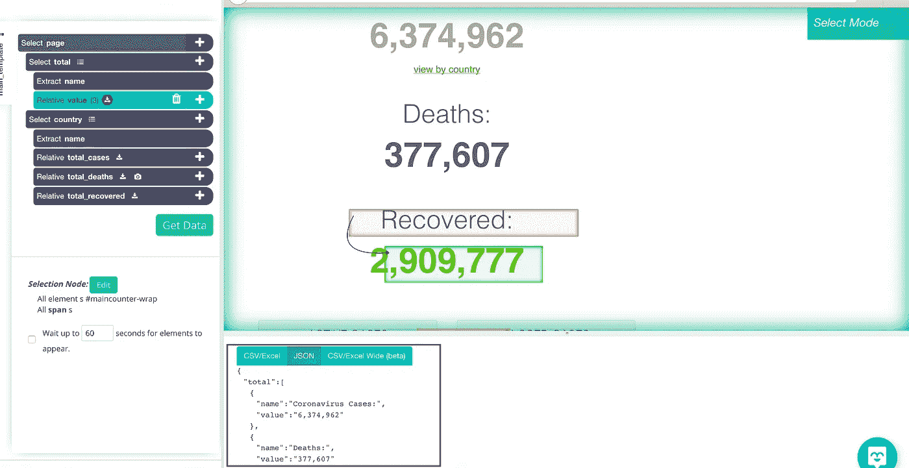
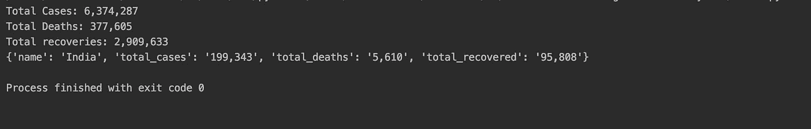

# 再见，美丽的汤！我如何使用 Python 和 ParseHub 抓取新冠肺炎数据？

> 原文：<https://towardsdatascience.com/bye-bye-beautiful-soup-how-i-scraped-covid-19-data-using-python-4dd06f930dc0?source=collection_archive---------57----------------------->

## 意见

## 用美汤刮数据繁琐！


由[卡里姆·甘图斯](https://unsplash.com/@kdghantous)——[Unsplash](http://unsplash.com)拍摄的照片

在使用 Python 抓取网页时，美汤被认为是语言的最佳伴侣。但是，编写数百行代码来抓取一个表格或一个 web 元素会耗费您所有的精力和时间。

这就是为什么我在报废过程中切换到 ParseHub。而且，我在几分钟内就做到了。

**使用 ParseHub**



从 ParseHub 中选择 web 元素需要 5 分钟。在底层，这个工具开始制作 JSON、CSV 文件供我们提取。此外，我们可以使用他们的 API 来访问数据。这种无代码的交互界面使得捕捉 web 元素和提取所需数据变得更加容易。

获取所有数据后，您可以转到“获取数据”并运行工作流和提取数据。然后，您会发现将文件保存为 CSV、JSON 或使用 API 访问数据的选项。

**Python**

我已经使用 API 访问了来自 ParseHub 的数据。然后用“json”库加载它来读取数据。

```
import json
import requests as rq

class Covid:
    def __init__(self, api_key, project_token) :
        self.api_key = api_key
        self.project_token = project_token

        self.data = self.get_data()

    def get_data(self) :
        response = rq.get(f'https://www.parsehub.com/api/v2/projects/{self.project_token}/last_ready_run/data', params={
            "api_key" : self.api_key })
        data = json.loads(response.text)
        return data
```

加载后，您可以轻松访问所有数据。获取关于冠状病毒的所有信息，如全球总病例数、任何国家的总病例数等。我有构建函数来获得世界上发生的总病例数、总死亡数和总恢复数。除此之外，我还创建了一个函数，返回与每个国家的病例和死亡人数相对应的数据。

```
def get_total_case(self):
    return self.data['total'][0]['value']

def get_total_deaths(self) :
    return self.data['total'][1]['value']

def get_total_recovered(self) :
    return self.data['total'][2]['value']

def country_data(self,country_name):
    data=self.data['country']
    for country in data:
        if country['name'].lower()==country_name.lower():
            return country
```

您也可以在类中添加其他函数。我只和这些人呆在一起。然后，我创建了该类的一个对象，并调用驻留在其中的方法。

```
data=Covid('Your API Key','Project Token')
data.get_data()
print("Total Cases:",data.get_total_case())
print("Total Deaths:",data.get_total_deaths())
print("Total recoveries:",data.get_total_recovered())

print(data.country_data("India"))
```

我试着查了印度的 19 个病例和死亡人数。



如果我不得不使用美丽的汤，这个任务可能会杀了我一两个小时。但是，这个工具节省了我大量的时间和精力。你也应该用这个工具来尝试你的网络抓取实验。

注意安全！讨论和反馈，在 [Linkedin](https://www.linkedin.com/in/vishal-sharma-239965140/) 上找我！