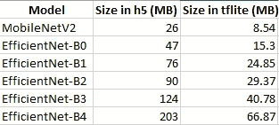
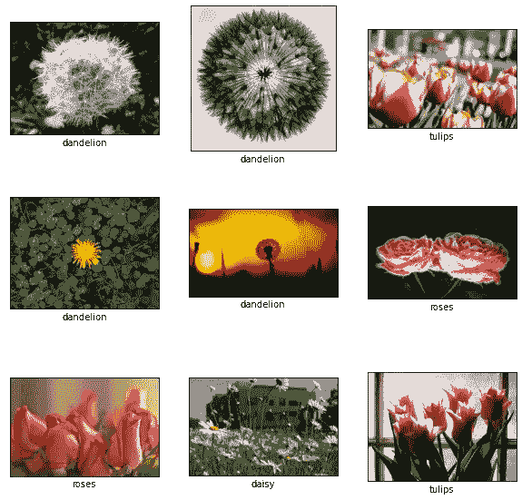
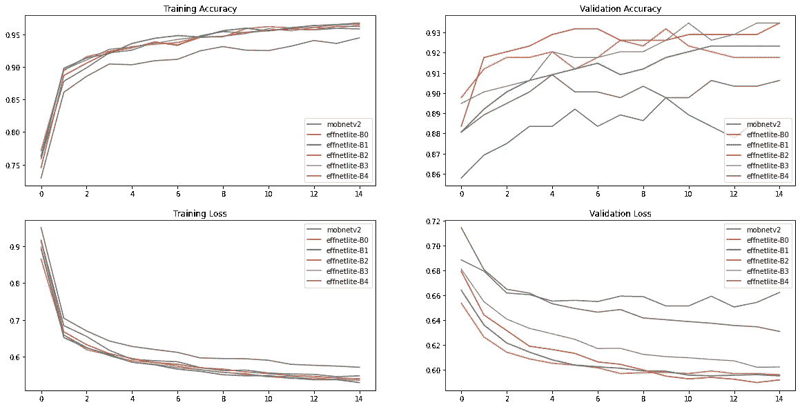
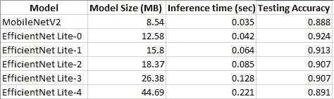

# 再见了移动网络。你好效率网！

> 原文：<https://towardsdatascience.com/bye-bye-mobilenet-hello-efficientnet-9b8ec2cc1a9c?source=collection_archive---------19----------------------->

## 意见

## MobileNet 是应用和边缘部署的首选模型。现在它被 EfficientNet Lite 模型家族所取代。


卢克·坦尼斯在 [Unsplash](https://unsplash.com?utm_source=medium&utm_medium=referral) 拍摄的照片

如何在处理能力和内存有限的移动和边缘设备上以良好的速度运行复杂的深度学习模型？创建一个以 MobileNetV2 为主干的模型，转换成 Tensorflow Lite，就大功告成了。现在它受到了 EfficientNet Lite 的挑战。请继续阅读，了解 EfficientNet 对 EfficientNet-Lite 的需求，以及如何创建 EfficientNet Lite 模型，我们还将比较这些模型，看看谁更胜一筹。如果你想深入了解 EfficientNet 的架构，你可以阅读下面的文章。

[](/complete-architectural-details-of-all-efficientnet-models-5fd5b736142) [## 所有高效网络模型的完整架构细节

### 让我们深入了解所有不同高效网络模型的体系结构细节，并找出它们的不同之处…

towardsdatascience.com](/complete-architectural-details-of-all-efficientnet-models-5fd5b736142) 

在我开始之前，是的，我无耻地窃取了 [Rhea Moutafis](https://medium.com/u/593908e0206?source=post_page-----9b8ec2cc1a9c--------------------------------) 热门文章[拜拜 Python 的标题。你好朱莉娅。](/bye-bye-python-hello-julia-9230bff0df62)

# Tensorflow Lite 中 EfficientNet 模型的缺点→需要 EfficientNet Lite

最近，我写了一篇文章，将 EfficientNet 与其他预训练的模型进行了比较，如 MobileNetV2、Inception 和 Xception，我想将这些保存的模型转换为 Tensorflow Lite 的对应模型，以查看它们的推理时间如何相互比较。

[](/efficientnet-should-be-the-goto-pre-trained-model-or-38f719cbfe60) [## EfficientNet 应该是 goto 预训练模型或…

### 比较不同预训练模型的时间和准确性，并最终创建一个集成来提高结果。

towardsdatascience.com](/efficientnet-should-be-the-goto-pre-trained-model-or-38f719cbfe60) 

在比较模型尺寸之前一切都很好，但在那之后，我震惊了。



比较模型尺寸

为了计算推断时间，我加载并处理了一张图片，对其进行了一百次预测，并取其平均值。


比较模型推理时间

Tensorflow Lite 模型的 MobileNet 推理时间如预期的那样下降了，但 EfficientNet 模型的推理时间增加了！！！Tensorflow Lite 应该使模型更小并减少推理时间！那么为什么会出现这种情况，如何解决呢？这在 EfficientNet Lite 中已得到澄清，根据此[文章](https://blog.tensorflow.org/2020/03/higher-accuracy-on-vision-models-with-efficientnet-lite.html)，它有以下更改:

*   删除挤压和激励网络，因为它们没有得到很好的支持
*   用 RELU6 替换了所有的 swish 激活，这显著提高了训练后量化的质量
*   在放大模型时修复了茎和头，以减少缩放模型的大小和计算

# Tensorflow Lite 中的 MobileNet 与 EfficientNet Lite

这些模型将由*模型制作者*创建，正如其[教程](https://www.tensorflow.org/lite/tutorials/model_maker_image_classification)中所述

> 在为设备上的 ML 应用部署 TensorFlow 神经网络模型时，模型生成器库简化了将该模型适配和转换为特定输入数据的过程。

它确实可以做到这一点，并且支持 MobileNetV2、ResNet50 和 EfficientNet Lite 系列的前五种型号。您还可以使用`ImageModelSpec`从 Tensorflow Hub 使用不同的模型，或者创建或拥有自定义模型并将 *ModelSpec* 导出到 Tensorflow Hub，然后使用`ImageModelSpec`。

在本文中，我将只结合 MobileNetV2 和 EfficientNet Lite 0 到 4。使用的数据将是带有雏菊、蒲公英、玫瑰、向日葵和郁金香标签的花卉数据集，这些数据将被分成 80%、10%和 10%，分别用于训练、验证和测试。

为此，我们需要 Tensorflow 示例，可以使用以下方式进行 pip 安装:

```
!pip install -q git+https://github.com/tensorflow/examples.git#egg=tensorflow-examples[model_maker]
```

然后，我们进行所需的导入，即模型规格、图像分类器、图像分类器的数据加载器、TensorFlow、NumPy 和 Matplotlib。

```
from tensorflow_examples.lite.model_maker.core.data_util.image_dataloader import ImageClassifierDataLoader
from tensorflow_examples.lite.model_maker.core.task import image_classifier
from tensorflow_examples.lite.model_maker.core.task.model_spec import (mobilenet_v2_spec,
        efficientnet_lite0_spec,
        efficientnet_lite1_spec,
        efficientnet_lite2_spec,
        efficientnet_lite3_spec,
        efficientnet_lite4_spec)
import tensorflow as tf
import numpy as np
import matplotlib.pyplot as plt
```

然后我们加载数据，将它分成所需的类别，并使用`ImageClassifierDataLoader`类为图像分类器做好准备。可以使用`from_folder`方法，它假设不同类别的图像存在于主文件夹的不同子文件夹中，子文件夹的名称是类别名称。确保图像具有 PNG 或 JPG 扩展名，因为只有它们受支持。

```
image_path = tf.keras.utils.get_file('flower_photos',
'https://storage.googleapis.com/download.tensorflow.org/example_images/flower_photos.tgz', untar=True)data = ImageClassifierDataLoader.from_folder(image_path)
train_data, rest_data = data.split(0.8)
validation_data, test_data = rest_data.split(0.5)
```

让我们看看我们的数据



资料组

现在用 model-maker 创建模型是一行程序。

```
model = image_classifier.create(train_data, model_spec=model_spec, epochs=epochs, validation_data=validation_data)
```

指定您想要的型号规格，对于 MobileNetV2 是`mobilenet_v2_spec`，对于 EfficientNet Lite-2 是`efficientnet_lite2_spec`，如导入中所述。如果没有指定，EfficientNet Lite-0 是默认的。我每个人都训练了 15 个时期，下面是结果。



所有模型的训练和验证准确性和损失

令人惊讶的是，EfficientNet Lite-4 在测试和训练集上的表现都很差，但这可能只是意味着它需要更多的训练时期。验证集上表现最差的是 MobileNet，其他 EfficientNet 模型彼此接近，EfficientNet Lite-2 和 EfficientNet Lite-3 以最高的准确度分享战利品。

要转换这些模型并将其保存为 Tensorflow Lite 文件，请编写

```
model.export(export_dir='.')
```

这将保存一个 label.txt 和一个 model.tflite 文件。通过创建一个解释器，可以像普通的 tflite 模型一样使用这些模型。

```
# Read TensorFlow Lite model from TensorFlow Lite file.
with tf.io.gfile.GFile('model.tflite', 'rb') as f:
  model_content = f.read()

# Read label names from label file.
with tf.io.gfile.GFile('labels.txt', 'r') as f:
  label_names = f.read().split('\n')

# Initialze TensorFlow Lite inpterpreter.
interpreter = tf.lite.Interpreter(model_content=model_content)
interpreter.allocate_tensors()
input_index = interpreter.get_input_details()[0]['index']
output = interpreter.tensor(interpreter.get_output_details()[0]["index"])

# Run predictions on each test image data and calculate accuracy.
accurate_count = 0
for i, (image, label) in enumerate(test_data.dataset):
    # Pre-processing should remain the same. Currently, just normalize each pixel value and resize image according to the model's specification.
    image, _ = model.preprocess(image, label)
    # Add batch dimension and convert to float32 to match with the model's input
    # data format.
    image = tf.expand_dims(image, 0).numpy()

    # Run inference.
    interpreter.set_tensor(input_index, image)
    interpreter.invoke()

    # Post-processing: remove batch dimension and find the label with highest
    # probability.
    predict_label = np.argmax(output()[0])
    # Get label name with label index.
    predict_label_name = label_names[predict_label]

    accurate_count += (predict_label == label.numpy())

accuracy = accurate_count * 1.0 / test_data.size
print('TensorFlow Lite model accuracy = %.3f' % accuracy)
```

模型的大小，测试的准确性，以及推断时间(也是 100 次的平均值)都被记录了下来。



结果

所以结果很明显。如果模型大小和推理时间比准确性更重要，那么只使用 MobileNetV2，否则 EfficientNet Lite 系列应该是您的首选模型，尤其是 EfficientNet Lite-0 可以作为 MobileNetV2 的直接替代品。