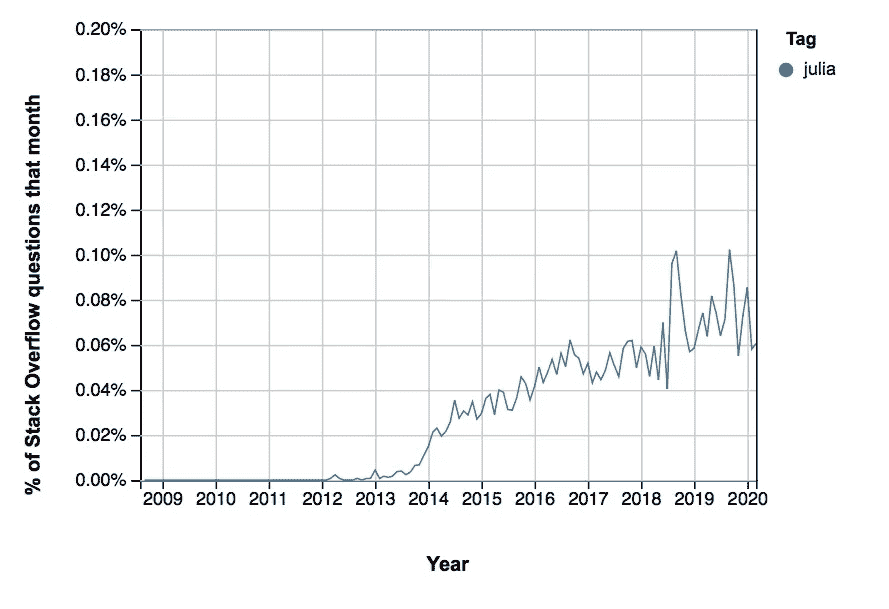
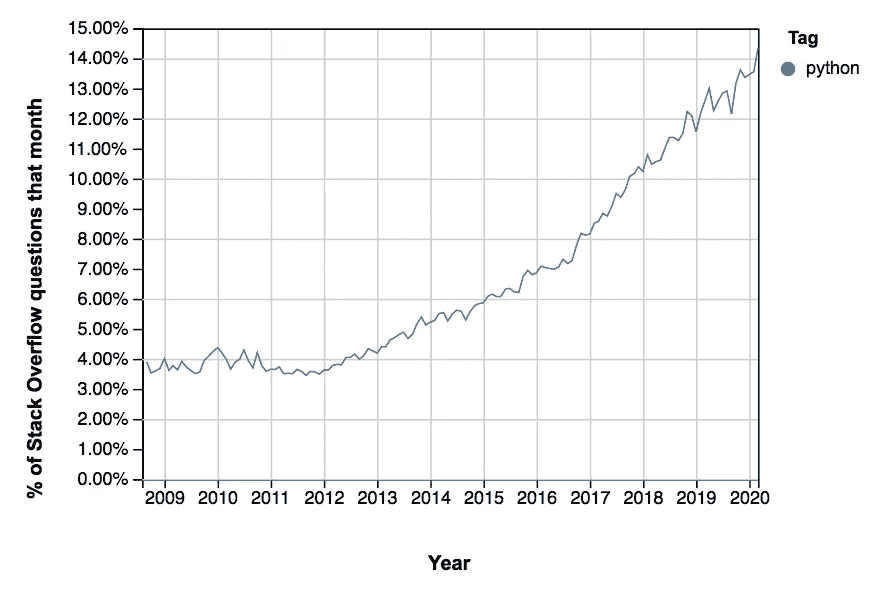

# 再见了蟒蛇。你好朱莉娅。

> 原文：<https://towardsdatascience.com/bye-bye-python-hello-julia-9230bff0df62?source=collection_archive---------0----------------------->

## 意见

## 随着 Python 的寿命逐渐停止，一个热门的新竞争者正在出现


如果朱莉娅对你来说还是个谜，别担心。茱莉亚·凯撒在 [Unsplash](https://unsplash.com/s/photos/julia?utm_source=unsplash&utm_medium=referral&utm_content=creditCopyText) 上的照片

  D  别误会。Python 的流行仍然受到计算机科学家、数据科学家和人工智能专家组成的坚如磐石的社区的支持。

但是如果你曾经和这些人共进晚餐，你也会知道他们对 Python 的弱点有多不满。从速度慢到需要过多的测试，到不顾之前的测试而产生运行时错误——有足够多的事情让我们恼火。

这就是为什么越来越多的程序员采用其他语言的原因——顶尖高手是 Julia、Go 和 Rust。Julia 非常适合数学和技术任务，而 Go 非常适合模块化程序，Rust 是系统编程的首选。

由于数据科学家和人工智能专家处理大量的数学问题，朱莉娅是他们的赢家。即使经过严格的审查，Julia 也有 Python 无法超越的优点。

[](/why-python-is-not-the-programming-language-of-the-future-30ddc5339b66) [## 为什么 Python 不是未来的编程语言

### 尽管未来几年对它的需求量会很大

towardsdatascience.com](/why-python-is-not-the-programming-language-of-the-future-30ddc5339b66) 

# 蟒蛇的禅与朱莉娅的贪婪

当人们创造一种新的编程语言时，他们这样做是因为他们想保留旧语言的优点，并修正不好的地方。

从这个意义上说，吉多·范·罗苏姆在 20 世纪 80 年代末创造了 Python 来改进 ABC。后者对于一门编程语言来说太完美了——虽然它的刚性使它易于教授，但在现实生活中却很难使用。

相比之下，Python 还是比较务实的。你可以在 Python 的[禅中看到这一点，它反映了创作者的意图:](https://www.python.org/dev/peps/pep-0020/)

```
Beautiful is better than ugly.
Explicit is better than implicit.
Simple is better than complex.
Complex is better than complicated.
Flat is better than nested.
Sparse is better than dense.
Readability counts.
Special cases aren't special enough to break the rules.
Although practicality beats purity.
[...]
```

Python 仍然保留了 ABC 的良好特性:例如可读性、简单性和初学者友好性。但是 Python 比 ABC 更健壮，更适应现实生活。


ABC 为 Python 做了铺垫，Python 也在为 Julia 做铺垫。戴维·巴洛在 [Unsplash](https://unsplash.com/s/photos/language?utm_source=unsplash&utm_medium=referral&utm_content=creditCopyText) 上拍摄的照片

从同样的意义上讲，Julia 的创造者希望保留其他语言中好的部分，抛弃不好的部分。但是 Julia 更有野心:它不是要取代一种语言，而是要打败所有的语言。

这是《T4》中朱莉娅的创作者 T5 所说的:

```
We are greedy: we want more.We want a language that's open source, with a liberal license. We want the speed of C with the dynamism of Ruby. We want a language that's homoiconic, with true macros like Lisp, but with obvious, familiar mathematical notation like Matlab. We want something as usable for general programming as Python, as easy for statistics as R, as natural for string processing as Perl, as powerful for linear algebra as Matlab, as good at gluing programs together as the shell. Something that is dirt simple to learn, yet keeps the most serious hackers happy. We want it interactive and we want it compiled.
```

Julia 希望融合当前存在的所有优点，而不是用其他语言的缺点来交换它们。尽管 Julia 是一种年轻的语言，但它已经实现了创造者设定的许多目标。

# Julia 开发者喜欢什么

## 多才多艺

Julia 可以用于从简单的机器学习应用到巨大的超级计算机模拟的任何事情。在某种程度上，Python 也可以做到这一点——但是 Python 不知何故成了这项工作的一部分。

相比之下，[朱莉娅就是为了这种东西而生的](https://www.infoworld.com/article/3241107/julia-vs-python-which-is-best-for-data-science.html)。自下而上。

## 速度

Julia 的创造者想创造一种和 C 一样快的语言，但是他们创造的比 C 更快。即使 Python 在近几年变得更容易加速，但它的性能和 Julia 能做到的还是相差甚远。

2017 年，朱莉娅甚至加入了 [Petaflop 俱乐部](https://www.hpcwire.com/off-the-wire/julia-joins-petaflop-club/)——这个小型语言俱乐部的速度在峰值性能时可以超过每秒 1 Petaflop。除了 Julia，现在只有 C、C++和 Fortran 在俱乐部里。

[](/ten-tricks-to-speed-up-your-python-codes-c38abdb89f18) [## 提高 Python 代码速度的十个技巧

### 每一步的微小进步，整体的巨大飞跃

towardsdatascience.com](/ten-tricks-to-speed-up-your-python-codes-c38abdb89f18) 

## 社区

拥有 30 多年历史的 Python 拥有一个庞大的支持性社区。几乎没有一个与 Python 相关的问题是你在一次谷歌搜索中得不到答案的。

相比之下，朱莉娅社区非常小。虽然这意味着你可能需要进一步挖掘才能找到答案，但你可能会一次又一次地与相同的人联系。这可能会转化为程序员关系，而这种关系是没有价值的。

## 代码转换

你甚至不需要知道一个 Julia 命令来用 Julia 编码。不仅可以在 Julia 中使用 Python 和 C 代码。你甚至可以在 Python 中使用 [Julia！](/run-native-julia-code-with-python-92d3e1079385)

不用说，这使得修补 Python 代码的弱点变得极其容易。或者在了解 Julia 的同时保持高效率。


库仍然是 Python 的强项。[苏珊尹](https://unsplash.com/@syinq?utm_source=unsplash&utm_medium=referral&utm_content=creditCopyText)在 [Unsplash](https://unsplash.com/s/photos/library?utm_source=unsplash&utm_medium=referral&utm_content=creditCopyText) 上的照片

## 图书馆

这是 Python 的最大优势之一——它有无数维护良好的库。Julia 没有很多图书馆，用户抱怨说它们没有得到很好的维护。

但是当你考虑到 Julia 是一种资源有限的非常年轻的语言时，他们已经拥有的库的数量是相当可观的。除了 Julia 的函数库数量在增长这一事实之外，它还可以与 C 和 Fortran 的函数库进行接口，以处理绘图等问题。

## 动态和静态类型

Python 是 100%动态类型化的。这意味着程序在运行时决定一个变量是浮点数还是整数。

虽然这对初学者来说非常友好，但它也引入了大量可能的错误。这意味着您需要在所有可能的场景中测试 Python 代码——这是一项相当耗时的愚蠢任务。

因为 Julia 的创建者也希望它易于学习，所以 Julia 完全支持动态类型。但是与 Python 不同的是，如果你愿意，你可以引入静态类型——例如，以它们在 C 或 Fortran 中存在的方式。

这可以节省您大量的时间:您可以在任何有意义的地方指定类型，而不是为不测试代码找借口。

[](/5-ways-julia-is-better-than-python-334cc66d64ae) [## Julia 优于 Python 的 5 个方面

### 为什么 Julia 比 Python 更适合 DS/ML

towardsdatascience.com](/5-ways-julia-is-better-than-python-334cc66d64ae) 

# 数据:在东西小的时候投资



在 [StackOverflow](https://insights.stackoverflow.com/trends?tags=python%2Cjulia) 上标记为 Julia(左)和 Python(右)的问题数量。

虽然所有这些事情听起来都很棒，但重要的是要记住，与 Python 相比，Julia 仍然微不足道。

一个很好的指标是 StackOverflow 上的问题数量:此时，Python 被标记的次数比 Julia 多 20 次！

这并不意味着 Julia 不受欢迎——相反，被程序员接受自然需要一些时间。

想一想——你真的想用另一种语言编写你的全部代码吗？不，你宁愿在未来的项目中尝试一门新语言。这造成了每种编程语言在发布和采用之间都会面临的时间延迟。

但是如果你现在采用它——这很容易，因为 Julia 允许大量的语言转换——你就是在投资未来。随着越来越多的人收养朱莉娅，你已经获得了足够的经验来回答他们的问题。此外，随着越来越多的 Python 代码被 Julia 取代，您的代码将更加持久。


是时候给朱莉娅一些爱了。亚历山大·辛恩在 [Unsplash](https://unsplash.com/s/photos/code?utm_source=unsplash&utm_medium=referral&utm_content=creditCopyText) 上的照片

# 底线:做朱莉娅，让它成为你的优势

四十年前，人工智能只不过是一种小众现象。行业和投资者不相信它，许多技术都很笨重，难以使用。但是那些在那时学到这一点的人是今天的巨人——那些需求如此之高以至于[他们的工资](https://insights.dice.com/2017/07/17/a-i-specialists-earn-much-nfl-players/)与一名 NFL 球员的工资相当的人。

同样，朱莉娅现在也还是很小众的。但当它成长时，最大的赢家将是那些早期采用它的人。

我不是说如果你现在收养朱莉娅，十年后你一定会赚很多钱。但是你增加了你的机会。

想想看:大多数程序员的简历上都有 Python。在接下来的几年里，我们会在就业市场上看到更多的 Python 程序员。但是如果企业对 Python 的需求放缓，Python 程序员的前景将会黯淡。一开始很慢，但不可避免。

另一方面，如果你能把朱莉娅写进简历，你就有了真正的优势。因为说实话，是什么让你和其他的毕达哥尼亚大师有所不同呢？不多。但是，即使在三年后，也不会有那么多 Julia 程序员了。

有了朱莉娅-斯奇尔斯，你不仅展示了你对工作要求之外的兴趣。你也证明了你渴望学习，你对成为一名程序员有更广泛的理解。换句话说，你适合这份工作。

你和其他 Julia 程序员是未来的摇滚明星，你知道的。或者，正如朱莉娅的创作者们在 2012 年所说的:

```
Even though we recognize that we are inexcusably greedy, we still want to have it all. About two and a half years ago, we set out to create the language of our greed. It's not complete, but it's time for a 1.0 release — the language we've created is called [Julia](https://julialang.org/). It already delivers on 90% of our ungracious demands, and now it needs the ungracious demands of others to shape it further. So, if you are also a greedy, unreasonable, demanding programmer, we want you to give it a try.
```

Python 仍然非常受欢迎。但是如果你现在学习茱莉亚，那可能是你以后的金奖券。从这个意义上说:再见 Python。你好朱莉娅。

*编辑:我做了一个关于 Julia 和 Python 的演讲！由* [*Hatchpad*](https://www.myhatchpad.com) *主持，视频为* [*此处*](https://www.youtube.com/watch?v=Yk2GrBJrShc) *。*