# BYOL:带来你自己的损失

> 原文：<https://towardsdatascience.com/byol-bring-your-own-loss-c5292cb8e9e3?source=collection_archive---------56----------------------->

## 我们如何用客户损失函数改进交货时间估计

亲爱的鉴赏家们，我邀请你们去看一看 [Careem 的](http://careem.com/)送餐平台。具体来说，我们将看看我们如何使用机器学习来改善交付时间跟踪的客户体验。

## **简介**

计划一顿饭时，时机至关重要。这就是为什么我们非常小心地估计订单的交货时间。然而，交付时间取决于几个复杂的因素——出于这个原因，机器学习是预测预计到达时间的正确选择。

Careem 的食品交付平台界面，用于交付时间估算

乍一看，这只是一个典型的回归问题:获取一些功能，根据历史交付时间训练一个合理的模型以最小化 RMSE，使用合适的交叉验证策略估计平均误差的预期下降，并与领导层分享，部署，广泛宣布，并获得尊重，信任，晋升…

在这篇文章中，我将尝试解释这种方法的错误。我将描述我们对这个问题的解决方案以及我们衡量用户影响的方式。然后，我将向您展示我们如何构建一个自定义损失函数来更好地优化用户订单满意度。

## 有什么问题吗

1.  *训练你的模特对抗 RMSE* 。RMSE、梅、胡伯等损失是大多数回归问题的典型选择。然而，这些损失反映了我们客户的感受吗？最大的问题是它们是对称的——它们不能区分提前 20 分钟或晚 20 分钟送达的订单。我的直觉肯定能看出区别…如果我们的模特表现出更多一点的同理心，那就太酷了。
2.  *通过平均误差评估成功。* 又来了。想象一下，您的团队已经努力工作了一个月，用其昂贵的基础设施设置实时交通数据流，以获得减少错误的功能，现在，它最终从平均 3 分钟下降到 2.5 分钟！20%的涨幅，什么结果！这绝对值得…是吗？实际上很难说，这在很大程度上取决于一个特定的问题。对于我们和许多其他应用程序来说，客户很可能甚至不会注意到这种变化。
3.  获得尊重、信任、晋升。
    这个挺简单的！工作是为了乐趣，而不是为了升职！

## 那么，我们该怎么办？

*免责声明:出于法律原因，此处显示的所有数据都是合成的，但它是以代表真实行为的方式构建的。*

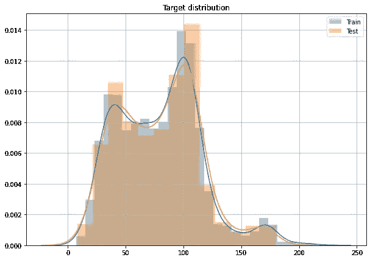

目标分布

让我们从找到衡量成功的方法开始。在某些情况下，测量 MAE 是有意义的。然而，在交货时间估计的情况下，这在很大程度上是没有意义的。它没有告诉我们对客户有什么影响。

我们关心的是客户体验。你关心的是对你的客户体验的影响，这可以通过多种方式来衡量:交付率、流失率、保留率、LTV、呼叫中心联系率、NPS 评分。例如，在 Careem，我们使用反映业务状态的呼叫中心联系率、流失率、交付时间和交付评级的加权组合。

问题是这些很难优化。因此，数据科学家经常求助于 RMSE、梅、胡伯等作为代理人。然后只在部署后测试真实的用户影响。

让我们假设我们项目的目标是提高平均交付率。我们需要了解我们的模型将对交付 ratting 产生什么影响。做到这一点的一个方法是查看历史交付时间估计，并查看当出现各种交付时间错误时，客户评级会发生什么变化。下面我们看到一个图表，显示了平均行程等级，显示的交付时间误差估计中不同程度的误差:

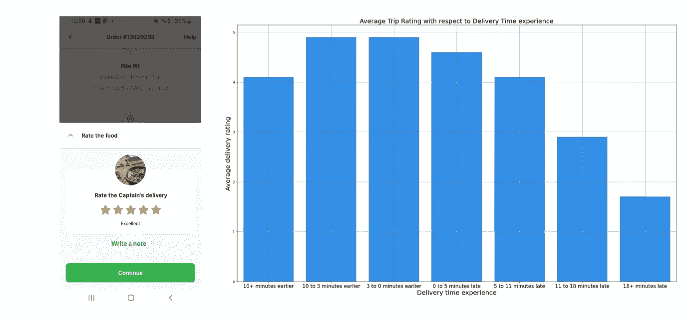

左图是 Careem 的反馈页面，订单完成后发送。在右图中，根据交货时间估计经验，给出了每个仲裁箱的平均等级(见免责声明)

有许多直观的见解:

*   人们喜欢准时或早一点得到食物
*   如果送货时间过长，你会感到失望
*   不要对过早得到食物感到太兴奋，但是仍然，感觉它比延迟交付更积极

如果食物晚送了 22 分钟以上，那么分数应该在 1.9 分左右(见顶部的免责声明)。利用这一点，我们有一个清晰的方法将我们的交货时间误差转化为对订货周转时间的估计。然后在一个验证数据集上，当使用我们的模型时，我们能够估计旅行的预期平均评级。因此，我们找到了一种为我们的模型评估有意义的度量的方法。

*查看图表，同样重要的是要强调，最佳模型不一定是 MAE 等于 0 的模型。如果我有一个完美的模型，我可能会将预测稍微向左移动一点，以确保我们做顾客最喜欢的事情——比我们最初承诺的时间提前几分钟交付食物。*

好了，回到正轨，我们的**目标已经确定**。

## 典型解决方案

一个非常合理的下一步是针对这个目标运行您最喜欢的超参数优化算法。对于下面的图，我们针对这个目标在 120 次迭代中使用 RMSE 损失来调整 Catboost。我们先来比较一下这两位会把我们带向何方。

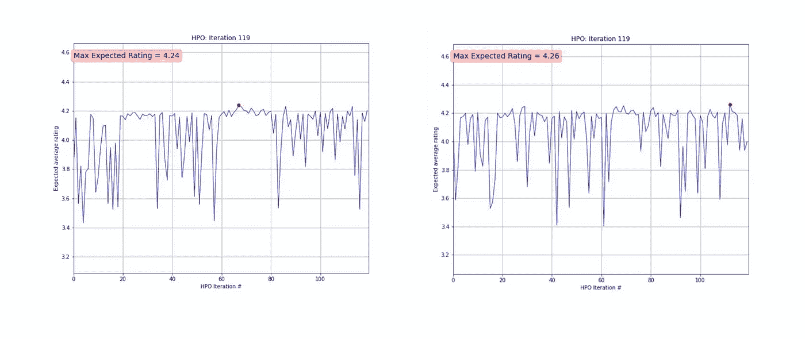

在左图中，有一个对 120 回合 HPO 的评估，当时 RMSE 既用了客观又用了失败。在右图中，针对 RMSE 进行了优化，但评估是使用评级目标进行的。

不伟大，也不可怕。这是一个小小的改进，但它是免费的。此外，现在，你对你的工作的潜在影响有了更好的理解，而不是说“新的实施将交付时间估计提高了 U%”，你会添加一个微小而重要的后缀:“…预计将带来大约 K 星的评级提高”，或“保留率提高了 P%，或“收入增加了 H%，或“人们微笑的次数增加了 28%”。

## 定制损失函数

当然，这不是我们能做的全部。是的，我们提高了一点分数，但是仍然面临着 RMSE 对称性的问题。想出一个自定义损失函数是相当常见的，尤其是在各种深度学习领域。我喜欢这个[帖子](https://heartbeat.fritz.ai/research-guide-advanced-loss-functions-for-machine-learning-models-aee68ed8a38c)，它很好地总结了高级损失函数。

但令人惊讶的是，经典的机器学习应用程序并没有广泛采用损失函数定制，尽管它们有时肯定会从中受益。让我们考虑一个围绕 MSE 的通用形式调整:

函数 *g* 可以像数据科学家幻想的那样复杂，只要你的应用从中受益……而且函数 *g* 有某种形式的导数。但是，即使不深入兔子洞，我们也可以挑选最简单的误差 g 步函数:

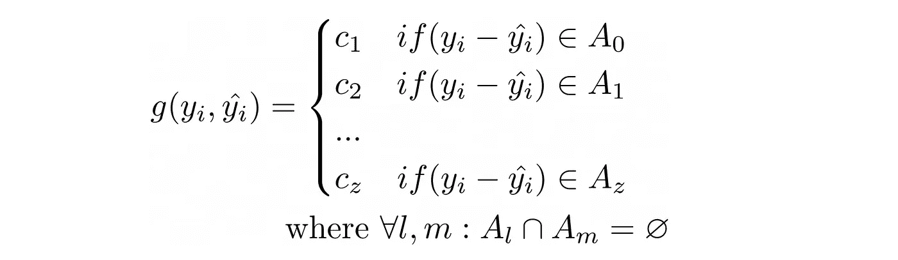

在这种情况下， *g* 只不过是一个动态权重，它是根据误差为每个对象选择的。姑且称之为分段 MSE 吧。最明显的参数选择是使它们与每个错误的等级成比例。这样，模型会比早期交付更努力地避免延迟交付，变得不那么乐观。

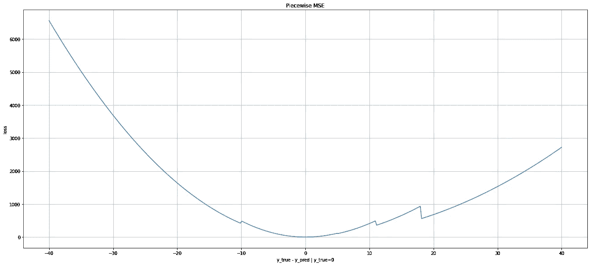

那么，没有什么比计算预测的一阶和二阶导数更容易的了:

这就是我们在您最喜欢的梯度推进实施之上运行所需的全部内容，并具有广泛的超参数优化

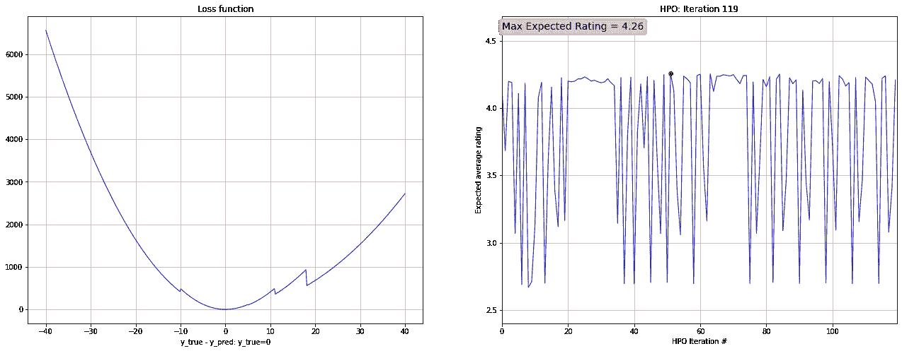

左图显示了与每个篮子的预期评级成比例的损失函数形状。右图显示了超参数优化目标(评级)

我们在与香草 RMSE 的比赛中取得了一点成绩，但前面还有很长的路要走。事实是，我们新的损失函数形状不是最优的，即使它看起来像。

考虑一个简单的例子。数据集有一个异常对象，它完全是凭空出现的:一个快递员(我们称他们为队长)的自行车在距离目的地仅一个街区的地方坏了，送货花了 3 个小时。您的数据集中没有可以帮助区分这种特殊情况的要素，而且很可能该对象会损害整体算法的性能。如果损失函数不太关注异常值，那就更好了。

反对这种固定客户损失的第二个理由是优化。机器学习中的大多数模型都是通过某种形式的梯度下降来优化的。在这个顺序的(而且往往是随机的)过程中，任何变化:不同的初始化、学习速率、批量洗牌都会导致不同的结果。因此，正如我们改变采用不同数据集的模型的学习率一样，调整损失函数的系数可能有助于提高性能。

## 损失函数选择的自动化

遗憾的是，我们无法做出模型的 c_k 参数。但是让它们成为超参数并不太坏。现在，在其他模型的参数中(我使用的是 [Catboost](https://catboost.ai/docs/concepts/parameter-tuning.html) )，我们将使用相同的超参数优化程序来调整 c_k。

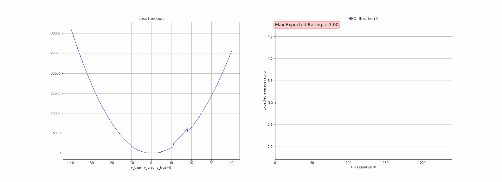

左图显示了一系列考虑的损失函数(五分位数损失)。右图显示了超参数优化目标(评级)

现在，分数明显更高了。毫不奇怪。这是因为损失是为**这个特定问题**和**这个特定数据集**定制的。

此外，通过这种设置，HPO 直接(嗯，几乎)优化了您关心的指标——平均预期评级，而不是抽象的和业务不可知的 MSE。

下一个图显示了我们的赢家损失函数的形状，它是在第 151 次迭代中发现的。

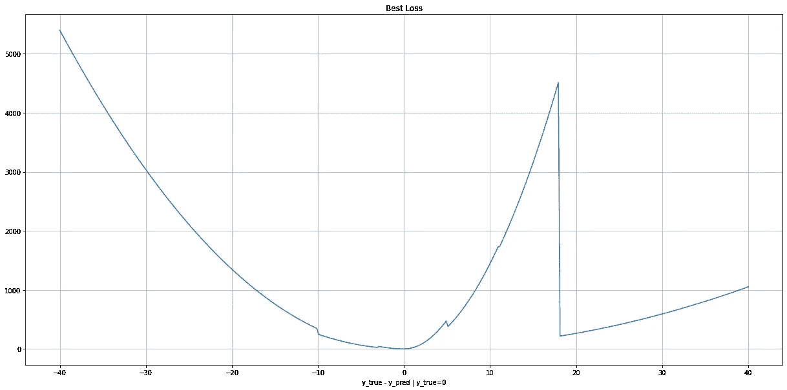

分段均方误差的最佳损失。是由 HPO 程序与 240 轮选择。

误差低于 18 的地方看起来到处都是倾斜的 MSE。然后，它将误差大于 18 的对象去优先级化。看着上面的柱状图，它可能看起来是反直觉的:18 分钟的误差预计是最需要避免的！

但我们不应该忘记，HPO 过程不仅着眼于柱状图，而且整体考虑数据集、模型性能、模型的其他超参数和目标的组合。可能没有一个物体的模型会犯如此大的错误。因此，相反，它专注于将物体从*篮 11–18*移动到*篮 5–11*。或者，这种行为可能有其他原因。因此，损失函数形状不必是直观的，以便提供最好的分数。当综合考虑所有因素时，这个损失函数在这个特定的背景下是不成立的。

## 又一次海关损失

所以，我们已经取得了很大的进步。让我们再做一点小小的改变。先前的损失函数通过缩放 RSE 来修改它。很好，但是不够灵活。向前迈进了一步，通过增加一个偏差来概括它:

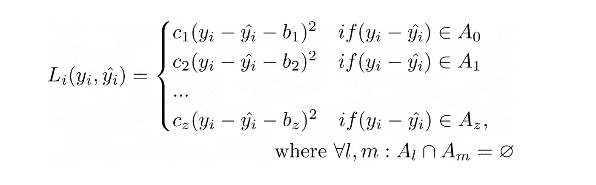

然后，我们称之为有偏分段 MSE。

同样，我们执行 HPO 的相同操作，但是现在与我们的 *c* 和 *b* 一起运行，与算法的其余超参数一起运行。

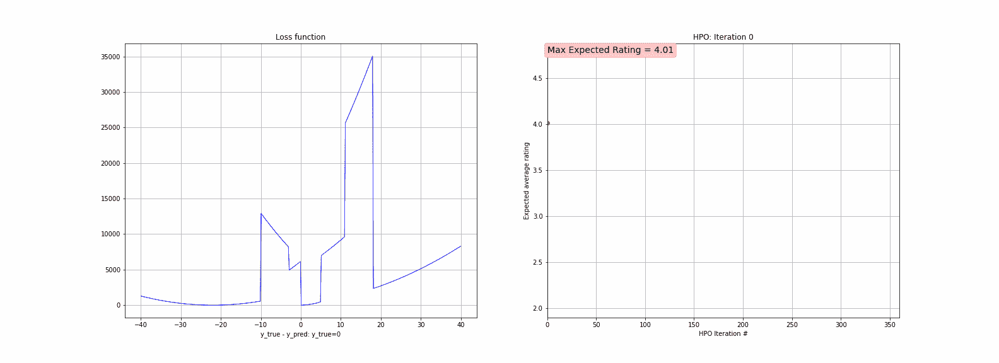

左图显示了一系列考虑的损失函数(有偏差的分段 MSE 损失)。右图显示了超参数优化目标(评级)

最好的分数是我们以前最好成绩的又一次增加。新获得的定制损失的形状看起来更像弗兰肯斯坦，但仍然很漂亮。

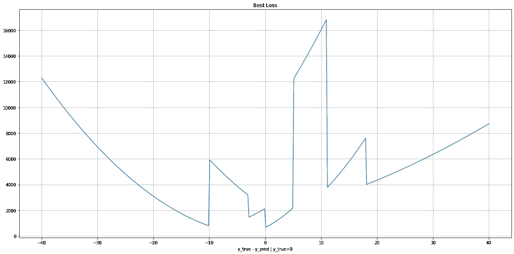

有偏分段均方误差的最佳损失。是通过 HPO 程序用 360 轮选出来的。

## 其他损失

上面将定制的可调物镜与 RMSE 进行了比较，尽管后者是最广泛采用的一种物镜，但对于当前应用来说，它有一个主要缺点—它是对称的。但是还有其他类型的非对称损失函数。一个流行的例子是*五分位数*损失。我们要把这个和我们的分段函数进行比较。同样，它的主要参数*α*将被视为超参数，与之前实验中的方式相同。

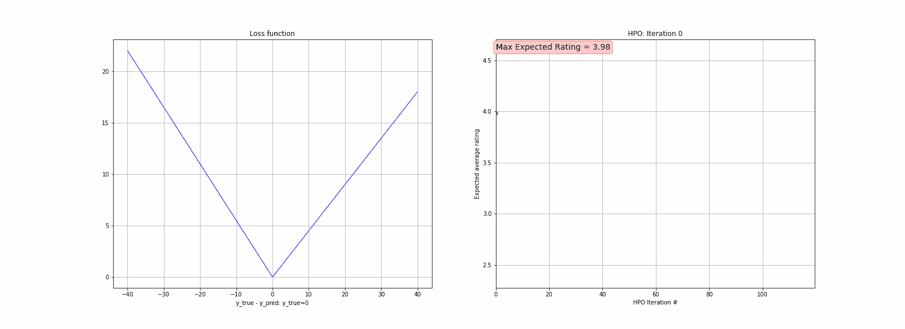

左图显示了一系列考虑的损失函数(五分位数损失)。右图显示了超参数优化目标(评级)

分位数回归的结果比任何以前调整过的 RMSE 要好，但是仍然会因调整过的分段损失而损失很大。

*值得注意的是，除了损耗特定参数外，上述所有实验都使用了相同的超参数集。此外，对于模型的超参数的数量增加的 HPO 运行，迭代的数量也增加以说明这一点(例如，对于分段需要 7 个额外的超参数，而对于有偏差的分段 MSE 有 14 个额外的超参数)。*

## 基于模型的目标

事实是，这里我们已经使用了一个非常简单的方法来评估预期评级，但是没有什么(几乎没有什么)阻止你使用一个复杂的 ML 模型来评估你的目标。比方说，你想把客户流失降到最低，而客户流失取决于配送时间误差。答对了。这是完美的婚姻，尤其是当客户流失模型已经开发出来的时候。唯一的问题可能是，整个训练变得非常慢，但是在很多应用中，这根本不是一个限制。

## 非凸物镜

在这个特殊的例子中，我们的主要度量评级几乎是凸的，这就是为什么即使 RMSE，五分之一正在失去，差距不是那么大。例如，如果我们的交付时间经验分布看起来更像下图中的分布，分段损失的边际收益将显著增加。在 [**链接**](https://github.com/pashna/gbm_custom_loss) 部分，你将可以找到一个笔记本，在它周围玩耍。

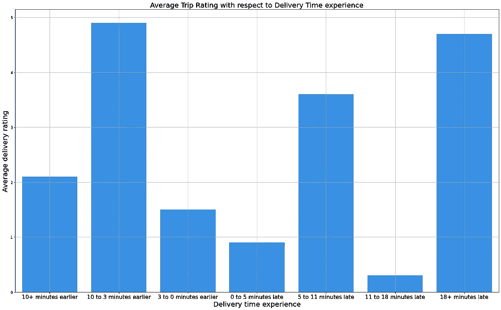

取决于交付时间估计经验的平均评级示例。

## 结论

损失函数只受你的幻想和你的计算能力的限制，而且通常来说，实现和调整一个定制的损失函数实际上是有益的。

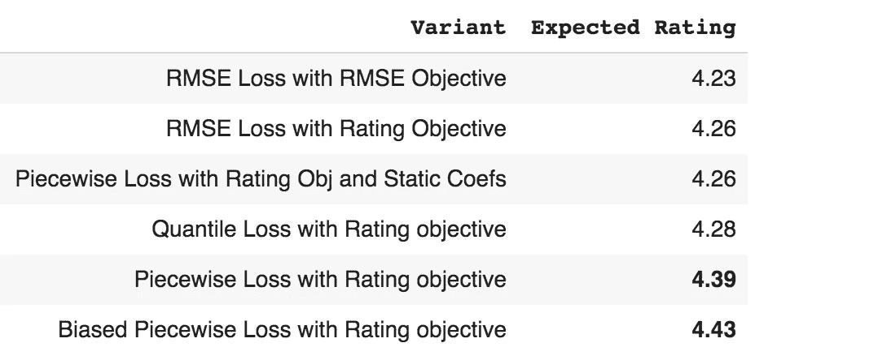

一览表

尽管这些特定的价值是合成的，但我们的生产设置以非常相似的方式工作，该模型在我们平台上的实际影响是极好的:我们已经将超过 25%的订单转移到交付时间体验更好的篮子中。它不仅帮助我们更好地理解什么是重要的以及为什么重要，而且它也为我们的客户带来了很好的体验(我们知道它变得有多好！).

## **链接**

与文章相关的代码位于数据集的[中(见免责声明)。](https://github.com/pashna/custom_lose_medium)

此外，如果有人想使用任何损失函数，你可以安装这个小的[库](https://github.com/pashna/gbm_custom_loss)(顺便说一句，它对任何贡献都非常开放)。