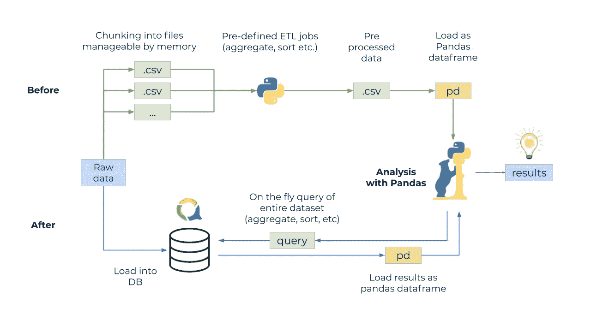
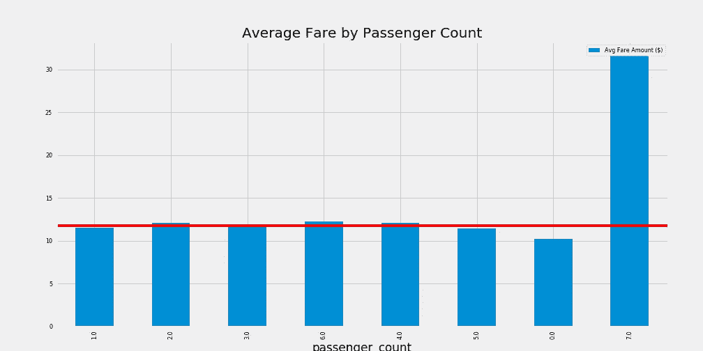
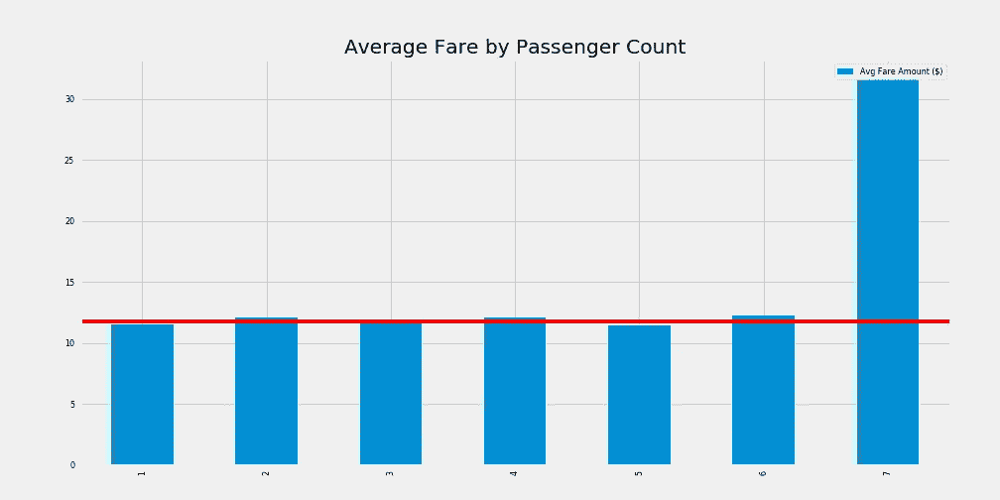
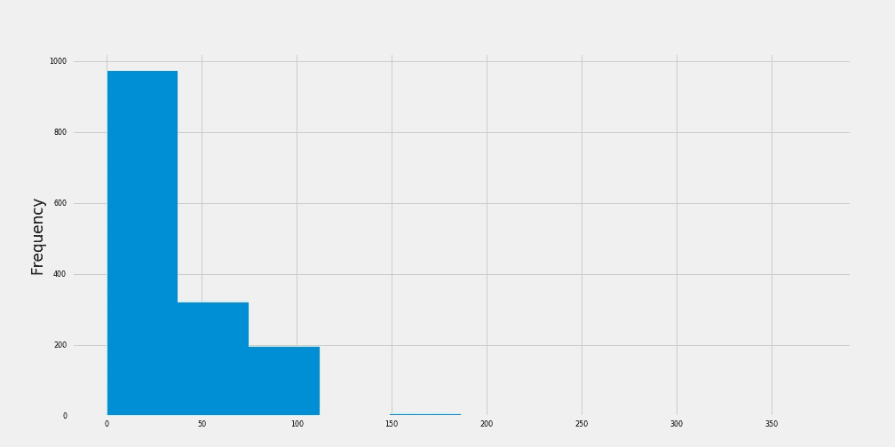
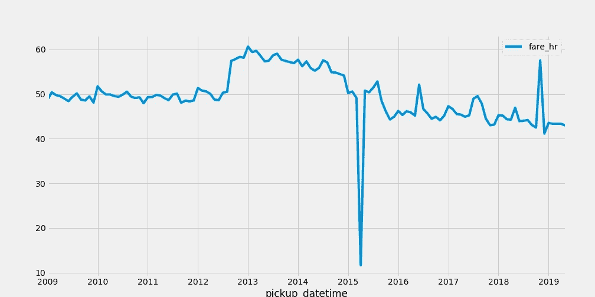

# 绕过熊猫的记忆限制

> 原文：<https://towardsdatascience.com/bypassing-pandas-memory-limitations-9abb574fdf76?source=collection_archive---------28----------------------->

## 我如何简化我的 ETL 管道


[V-Yan](https://www.shutterstock.com/g/V-yan) 在 [Shutterstock](https://www.shutterstock.com/) 上的照片

当你遇到一组新的数据时，你需要花一些时间去了解它。这个过程就像第一次见到一个陌生人一样。而不是问“你叫什么名字？”，“你是哪里人？”，以及“凯蒂·佩里还是泰勒·斯威夫特？”你问“你的分布是什么样的？”，“您是否包含任何缺失或意外的数据？”，以及“您如何与其他数据相关联？”。

一个典型的数据科学家一天要花 80%的时间来准备要处理的数据。像[熊猫](https://pandas.pydata.org/)这样的工具通过增加一套强大的功能来探索和管理数据，使得这个过程更加高效。熊猫可以将一个普通的 CSV 文件转换成有洞察力的聚合和图表。再加上熊猫的头号特点就是让我出不了 Excel。

然而，熊猫并不全是玫瑰和阳光。由于数据帧(熊猫的基础)保存在内存中，一次可以处理多少数据是有限制的。当试图将纽约出租车数据(10 亿多行和 10 年的信息)的大小打包到 Pandas 中时，分析数据集可能会导致内存不足异常。大多数熊猫相关教程只使用 6 个月的数据来避免这种情况。

# 克服记忆极限

在 Pandas 中处理大量数据(太大而不适合内存)需要以下方法之一:

1.  将数据分成易于管理的部分(分块)。
2.  使用 Pandas 之外的服务来处理数据的过滤和聚合。
3.  以上两种方法的结合。

Apache 项目 Spark 和 Arrow 旨在提供处理大数据的解决方案，但我发现安装和使用数据库是 Arrow 和 Spark 带来的复杂性的无痛替代方案。最近，我偶然发现了开源项目 [QuestDB](https://github.com/questdb/questdb) ，它声称在时序数据库领域具有高性能，所以我决定尝试一下。

QuestDB 的 REST API 使用一种我已经熟悉的查询语言接受请求:SQL。如果需要的话，可以对结果进行分页，但是也可以将它们过滤成对熊猫的内存更友好的大小。虽然性能分析不是这篇文章的主要目标，但是通过 QuestDB 的 [SIMD](https://www.questdb.io/blog/2020/04/02/using-simd-to-aggregate-billions-of-rows-per-second) 指令和高性能设计，处理速度也有所提高。

与常见的 ETL 方法相比，在数据管道中加入像 QuestDB 这样的数据库有一些优势(如下图所示):

*   查询数据集的动态方式。
*   降低了过滤和聚合的复杂性。
*   缩短从原始数据到熊猫的路径。



在之前(使用 ETL 工作流)和之后(使用 QuestDB)处理大型数据集的过程。作者图片

# 使用 QuestDB

对于下面所有的例子，我使用一个简单的函数来查询 QuestDB 并将结果转换成 Pandas 数据帧。

```
import pandas as pd
import requests defread_questdb(query, host, per_page = 10000, max_records = None):"""
    Sends a SQL query to a specified host.

    Parameters
    ----------------
    query : string
      A SQL query
    host : string
      A host location in the form of a URL.  [http://host:port](http://host:port)
    per_page : int
      The limit of results to return per page.
    max_records : int
      The maximum amount of records to return (soft limit).
    """data = []
    offset = 1
    page = 1
    get_more = True
    columns = None
    params = {"query": query, "limit": f"{offset},{per_page * page}","count": "true"}
    while get_more:
        r = requests.get(f"{host}exec", params=params)
        jsond = r.json()
        if r.status_code != 200:
            raise ValueError(jsond['error'])
        if not columns:
            columns = [x['name'] for x in jsond['columns']]
        if jsond['dataset'] != []:
            data = data + jsond['dataset']
        if jsond["count"] < (per_page * page) or (max_records != None and (per_page*page) >= max_records):
            get_more = False
        else:
            offset = (per_page * page) + 1
            page += 1
            params['limit'] = f"{offset},{per_page * page}"
            params['nm'] = 'true'
    return pd.DataFrame(data=data, columns=columns)
```

对于数据，我已经预加载了纽约出租车数据集，该数据集从 2009 年到 2019 年有 1，636，055，518 行数据。列定义可在 nyc.gov 的[网站上获得。](https://www1.nyc.gov/assets/tlc/downloads/pdf/data_dictionary_trip_records_yellow.pdf)

文档中有更多关于[安装](https://www.questdb.io/docs/installationOverview) QuestDB 以及[如何加载](https://www.questdb.io/docs/restAPI#imp---loading-data)数据的信息。

# 了解出租车数据集

先从分析 fare_amount 开始。在我的 Macbook Pro 上不可能将 16 亿行数据存储到 Pandas 中，所以我需要使用 QuestDB 来帮助我将数据压缩到更易于管理的大小。

平均票价是多少？

```
query = "SELECT avg(fare_amount) FROM trips"
avg_df = read_questdb(query, hostname)
avg_df['avg'][0]
>>>11.771664413356518
```

我也很好奇 fare_amount 和 passenger_count 有什么关系。较大的团体倾向于长途旅行吗？以下是按乘客数量划分的平均票价图。

```
query = "SELECT passenger_count, avg(fare_amount) FROM trips"
df = read_questdb(query, hostname)
ax = df.plot.bar(x='passenger_count', y='avg', title='Average Fare by Passenger Count', label='Passenger Count')
ax.legend(["Avg Fare Amount ($)"])
#add a horizontal line for the average
ax.axhline(y=avg_df['avg'][0], color='red')
```



passenger_count 为 0 对我来说不合适，虽然这可能有一个很好的原因，但我现在将从数据帧中删除该数据，并对数据进行排序和重新索引。

```
#drop zero passenger count data and set index and sort values
df = df.drop([6]).set_index('passenger_count').sort_values('passenger_count')#change to integers
df.index = df.index.astype('int64')#don't need to specify x axis
ax = df.plot.bar(y='avg', title='Average Fare by Passenger Count', label='Passenger Count')
ax.legend(["Avg Fare Amount ($)"])
ax.axhline(y=avg_df['avg'][0], color='red')>>>avg1 11.548458
2 12.119514
3 11.892298
4 12.091368
5 11.466198
6 12.276963
7 31.622068
```



现在，乘客计数按升序排列，0 乘客计数列已删除，我可以看到不同乘客计数的平均值与数据集平均值一致，只有乘客计数为 7 除外。

由于我已经将目标数据集缩小到 passenger_count 为 7 的行，所以我可以将目标行放入 Pandas 数据框架中，并使用“describe”函数来获得 fare_amount 分布的概况。

```
query = "select * from trips where passenger_count = 7"
df7 = read_questdb(query, hostname)
df7['fare_amount'].describe()
>>>
count    1494.000000
mean     31.622068
std      31.708050
min      0.010000
25%      7.000000
50%      12.000000
75%      70.000000
max      373.000000
Name: fare_amount, dtype: float64
```

该输出的三个初步观察结果:

1.  标准差大于平均值。既然票价不可能是负数，那就意味着数据严重失真。
2.  最小值为 0.01。我不是出租车的常客，但我很确定一旦打开计价器，起价会超过 0.01 美元。
3.  最大值为 373。异常值可能会对平均值施加压力。

我可以画出数据的分布。

```
ax = df7['fare_amount'].plot.hist()
```



正如预期的那样，分布严重偏斜，一些较大的异常值将平均值拉得更高。但是这告诉我们什么呢？所有其他的乘客数量也是如此吗？我应该改用中间值而不是平均值吗？还能对这些数据提出什么问题？

换个话题，我很想知道每小时的平均费用是如何随着时间的推移而变化的。我可以使用 QuestDB 中的抽样来帮助组织每月时段中的 fare_amount 平均值。

```
query = """
SELECT pickup_datetime, avg(fare_amount) / (avg(cast((dropoff_datetime-pickup_datetime) as long)) / 1000000 / 60 / 60) fare_hr FROM trips SAMPLE BY 1M;
""" 
fare_change_df = read_questdb(query,hostname)
fare_change_df['pickup_datetime'] = pd.to_datetime(fare_change_df['pickup_datetime'])
ax = fare_change_df[:125].plot(x='pickup_datetime',y='fare_hr')
```



这张图表产生了新的问题。为什么 2012 年 fare_amount 会暴涨？是什么导致了 2015 年的跳水？平均每小时工资在稳步下降；什么因素会导致这种情况？

# 结论

要让我对出租车数据感到放心，还有很长的路要走。我只触及了单个列的表面，还有关于其他列以及这些列之间的关系的无限量的附加问题。每个回答的问题都会引出更多的问题。

Pandas 是 Python 数据科学堆栈中比较重要的库之一，但是随着数据量的增长，完全在 Pandas 中工作需要额外工具的帮助。我喜欢使用 QuestDB 来执行大容量过滤、聚合和分组操作，以扩展 Pandas 的效用。

[1]吉尔出版社，清理大数据:最耗时，最不愉快的数据科学任务，调查称(2016)，[福布斯](https://www.forbes.com/sites/gilpress/2016/03/23/data-preparation-most-time-consuming-least-enjoyable-data-science-task-survey-says/#39605c716f63)