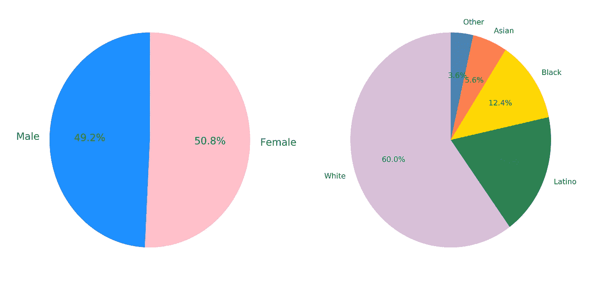
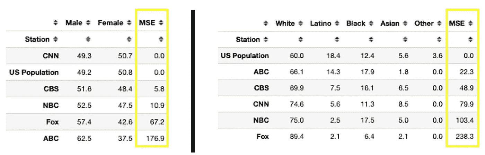
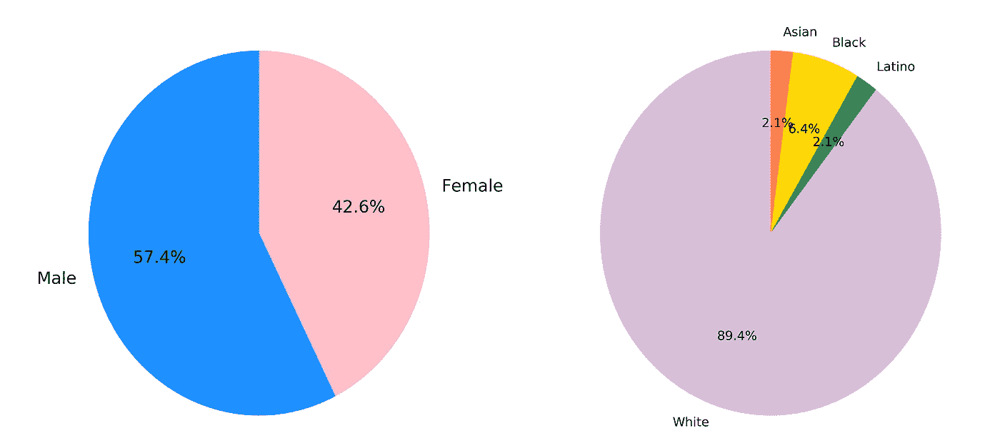
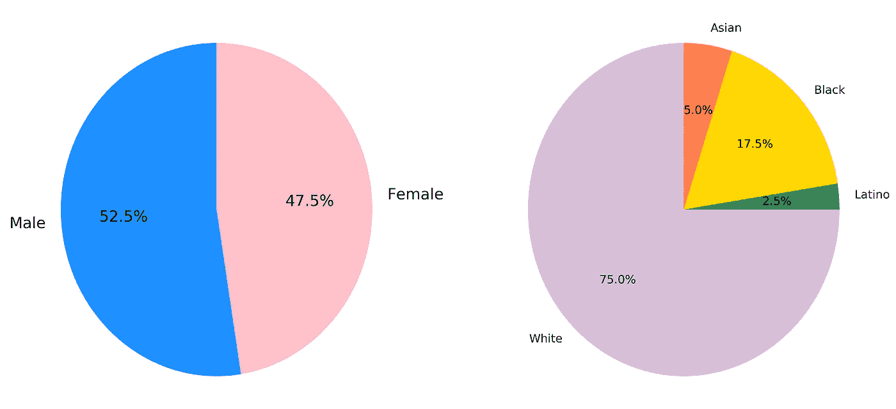
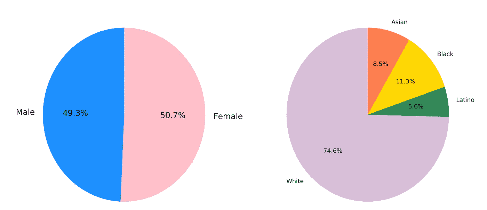
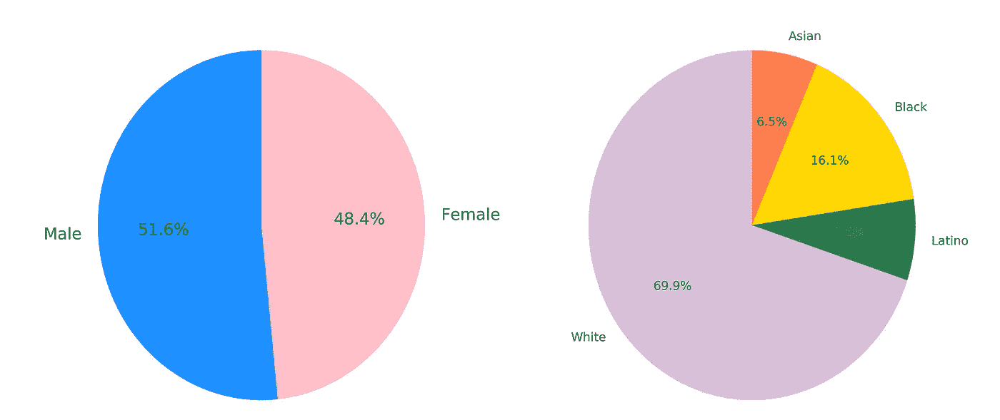
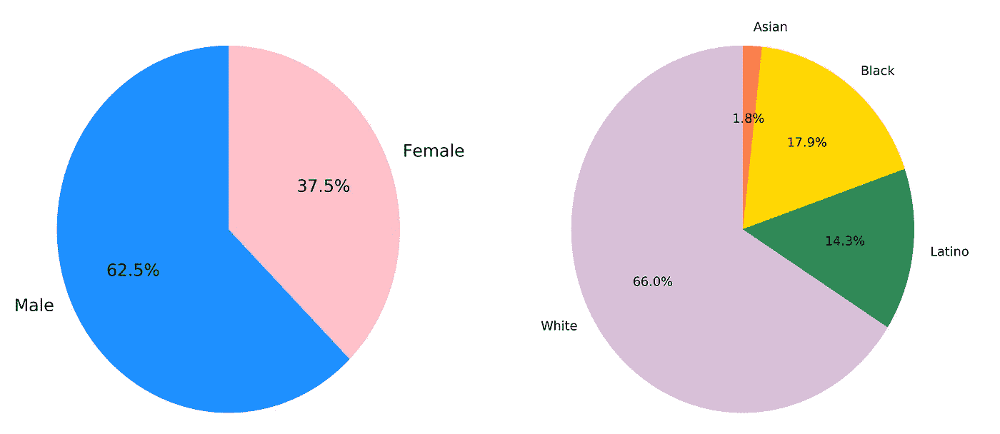

# 有线新闻直播人口统计

> 原文：<https://towardsdatascience.com/cable-news-on-air-demographics-2e50788ab377?source=collection_archive---------29----------------------->

## 使用 matplotlib、plotly 和 python 探索饼图中的相关数据


在 [Unsplash](https://unsplash.com?utm_source=medium&utm_medium=referral) 上拍摄的 [ThisisEngineering RAEng](https://unsplash.com/@thisisengineering?utm_source=medium&utm_medium=referral)

对于那些熟悉这位电影主持人的人来说，这部电影的情节围绕着各种角色的恶作剧，一位女性打破玻璃天花板，主持地方新闻，而不是全国新闻。苹果的电视剧《早间秀》(The Morning Show)也使用了打破电视播出规范的情节设计。根据美国人口普查数据，美国女性人数超过男性 50.8%比 49.2%。一段时间以来，在有线电视新闻网上看到女性变得很正常，然而，考虑到今年对种族公正的重新关注，少数族裔在整个网络的空中记者中的代表性如何？在这篇文章中，我将探讨航空人才网络的人口统计和性别分布。我将以饼状图的形式展示福克斯新闻频道、CNN、ABC、CBS 和 NBC 的性别和种族统计数据，并使用支线图创建一个水平布局。此外，我将使用均方差来评论最准确和最不准确地反映美国一般人口的网络。



根据美国人口普查数据，详细描述美国性别和种族人口统计的饼状图。图片作者。

## 数据和图书馆

性别和种族统计数据是从每个网络网站的图像数据中手动收集的。如果可能的话，使用他们的个人维基百科页面进一步调查暗示不同种族人口统计或没有代表性图像的空中人物的名字。[美国人口普查数据网站](https://data.census.gov/cedsci/table?q=race%20percentage&tid=ACSDP1Y2019.DP05&hidePreview=false)用于收集美国的性别和种族人口统计数据。

饼图是使用 [Matplotlib](https://matplotlib.org/) 创建的静态图表和 [plotly](https://plotly.com/python/) 创建的动态图表。Pandas 用于将 excel 文件加载到数据框架中。所有的脚本都是在 Jupyter 笔记本上完成的，可以在 GitHub 上找到数据集。

在我们的数据中，拥有最多空中通讯员的网络是哥伦比亚广播公司，有 93 名空中人物。这个数字随着出现在节目 [60 分钟](https://www.cbsnews.com/team/)的嘉宾记者的数量而膨胀。下一个最高的网络记者数是美国有线电视新闻网(CNN ),有 71 个空中贡献者。每个网络的直播贡献者平均人数略多于 61 人。数据文件由站点的计数数据组成。为了创建我们的饼图，我将计数数据标准化为百分比。

```
## Load count data
df = pd.read_excel("New_Demos.xlsx")## Split into demographics and gender tables
df_D = df[['Station', "White", "Latino", "Black", "Asian"]]
df_G = df[['Station', "Male", "Female"]]## Get percentages from counts
df_D = df_D.set_index("Station")
df_D=df_D.div(df_D.sum(axis=1),axis=0).multiply(100).round(decimals=1)df_G = df_G.set_index("Station")
df_G=df_G.div(df_G.sum(axis=1),axis=0).multiply(100).round(decimals=1)
```

我使用下面的代码将美国人口计数手动添加到相应的 dataframe 对象中。

```
df_D.loc['US Population'] = [60.0, 18.4,  12.4, 5.6]
df_D['Other'] = 0.0
df_D.at['US Population', "Other"] = 3.6df_G.loc['US Population'] = [49.2, 50.8]
```

## 计算均方差

为了计算一个网络的人口统计和美国一般人口之间的差异，我实现了一个函数来计算均方差(MSE)。该函数执行以下步骤:

1.  设置基线行(我使用美国人口或第六行)
2.  循环遍历每一行，直到基线行
3.  计算每行之间的 MSE，并将其存储到一个列表中
4.  将列表作为新列追加到原始数据帧中

```
def mse(dataframe, size):
    baseline = list(dataframe.iloc[5])
    sums = []
    for item in range(5):
        comparison = list(dataframe.iloc[item])

        ## Calculate MSE 
        amount = [(abs(j-i)**2)/size for i,j in zip(baseline, comparison)]
        sums.append(sum(amount))

    sums = ['%.1f' % elem for elem in sums]
    sums = [float(elem) for elem in sums]
    sums.append(0)
    return(sums)df_D['MSE'] = mse(df_D, 5)
df_G['MSE'] = mse(df_G, 2)
```



网络的 MSE 分数。图片作者。

美国广播公司是由男性主导的，福克斯与美国的真实人口统计相比很差。另一个有趣的福克斯统计数据是，20 位女性中有 13 位是金发女郎，占了令人吃惊的 65%。据研究人员称，白种人中天生金发的人估计只占总人口的 5%。[人们注意到，身居要职的女性比普通人更有可能拥有金发。](https://www.huffpost.com/entry/blonde-leaders-sexism_n_57bdd4f5e4b00c67eca12176)


照片由[mārtiņš·泽姆利克斯](https://unsplash.com/@mzemlickis?utm_source=medium&utm_medium=referral)在 [Unsplash](https://unsplash.com?utm_source=medium&utm_medium=referral) 拍摄

## 构建动态饼图

为了创建动态饼图，我使用了 plotly。不幸的是，动态图表在本文中变成了静态的，但是功能仍然保留在 GitHub 上的笔记本代码中。为了创建动态图表，我将 plotly 链接到笔记本。

```
## Load libraries
import numpy as np
import plotly.offline as py
import plotly.graph_objs as go
from plotly import tools## Connect to notebook
py.init_notebook_mode(connected=True)
```

然后构建互动情节:

```
## Create Color Schema
cmap = plt.get_cmap('Set2')
colors = [cmap(i) for i in np.linspace(0, 1, 8)]### Note: 'marker=' lines are apart of the go.Pie function
## Build Gender Pie
gender_pie = go.Pie(labels=q['US Population'].index, 
                    values=q['US Population'],   marker=dict(colors=colors[1:3],line=dict(color='#FFF', width=2)), domain={'x': [0.0, .4], 'y': [0.0, 1]}, showlegend=False, name='Gender', textinfo='label+percent')## Build Demographics Pie
demo_pie = go.Pie(labels=w['US Population'].index, 
                  values=w['US Population'],     marker=dict(colors=colors, line=dict(color='#FFF', width=2)), domain={'x': [.6, 1], 'y': [0.0, 1]}, showlegend=False, name='Demographics', textinfo='label+percent') ## Set pie chart layout and plot figure
layout = go.Layout(height = 600, width = 1000,autosize = False, title='Gender and Racial Demographics of US Population')fig = go.Figure(data = [gender_pie,demo_pie ], layout = layout)py.iplot(fig, filename='basic_pie_chart')
```

生成的结果图如下，用户可以滚动查看每个切片的更详细视图。在我们的示例中，由于数据帧被标准化为 100%,因此计数数据与切片大小相匹配。


详细描述美国人口性别和人口统计的动态饼图的静态图像。图片作者。

## 静态饼图

为了构建静态的性别和人口统计饼图，我使用 matplotlib 和 subplots 让两个饼图共享一个水平轴。我们的网络数据不包括人口统计中的“其他”类别，因为构成该类别的不同身份的数量很大。首先，让我们定义我们的数字和两个支线剧情。

```
## Horizontal Layout (I use this!)
fig = plt.figure(figsize=(16,8), dpi=200)
ax1 = plt.subplot(1,2,1) 
ax2 = plt.subplot(1,2,2)
```

子情节中定义的三个位置定义了子情节的位置和布局。

```
## Vertical Layout
fig = plt.figure(figsize=(8,16), dpi=200)
ax1 = plt.subplot(2,1,1) 
ax2 = plt.subplot(2,1,2)
```

我决定在这篇文章中使用水平布局来显示更容易。为了准备创建饼图的数据，我调换了我们的数据框架，并手动为图表分配了颜色。

```
## Transpose dataframes
q = df_G.transpose()
w = df_D.transpose()## Gender pie chart
z = q['Fox'].plot(kind='pie', ax=ax1, autopct='%1.1f%%', startangle=90, fontsize=16, colors=['dodgerblue', 'pink'])## Demographics pie chart
t = w['Fox'].plot(kind='pie', ax=ax2, autopct='%1.1f%%', startangle=90, fontsize=12, colors=['thistle', 'seagreen', 'gold', 'coral'])## Remove label text between plots
plt.ylabel('')
ax1.yaxis.label.set_visible(False) ## Save figure
plt.savefig("Images/Fox.png", dpi=400)
```

以下是新闻网络的静态饼状图，从最大 MSE 到最小 MSE，在人口统计数据框架中，美国人口重复出现在底部。

## 福克斯新闻频道



福克斯新闻频道谈空气个性性别和人口分布。图片作者。

## 全国广播公司



全国广播公司对空气个性性别和人口分布。图片作者。

## 美国有线新闻网；卷积神经网络



美国有线电视新闻网关于空气人物性别和人口分布。图片作者。

## 哥伦比亚广播公司



哥伦比亚广播公司对空气个性性别和人口分布。图片作者。

## 美国广播公司



空气中的人物性别和人口分布。图片作者。

## 美国人口


根据美国人口普查数据，详细描述美国性别和种族人口统计的饼状图。图片作者。

## 结论

这是一个新网络关于空气人物性别和人口统计的案例研究。一些电视网在让直播人物与美国人口相匹配方面比其他电视网更好，CBS 在性别和人口统计方面的 MSE 最低。福克斯新闻频道是民族构成中最不具代表性的。我的名字是科迪·格利克曼，可以在 T2 的 LinkedIn 上找到我。这篇文章的代码和数据可以在 [GitHub](https://github.com/Datadolittle/News_Gender_Demographics) 上找到。请务必查看我的其他一些探索 python 可视化技术的文章。

[](/stars-charts-in-python-9c20d02fb6c0) [## Python 中的星图

### 使用 Diamonds 和 Matplotlib 创建星图的教程

towardsdatascience.com](/stars-charts-in-python-9c20d02fb6c0) [](/changing-us-housing-markets-demographics-34d9b0c71cb4) [## 不断变化的美国住房市场人口统计数据

### 一个使用海绵和赛璐珞制作动画的人口金字塔

towardsdatascience.com](/changing-us-housing-markets-demographics-34d9b0c71cb4) [](/college-football-travel-during-covid-1ced0164840e) [## COVID 期间的大学足球旅行

### 当圣母大学在 8 月 17 日暂停面对面学习时，这是对阳性病例激增的回应…

towardsdatascience.com](/college-football-travel-during-covid-1ced0164840e)