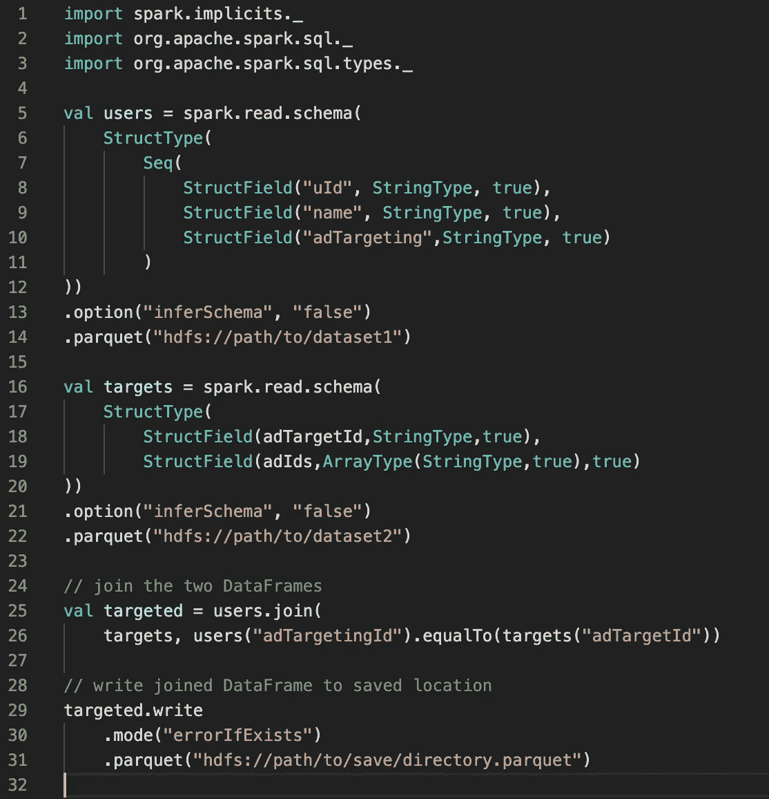
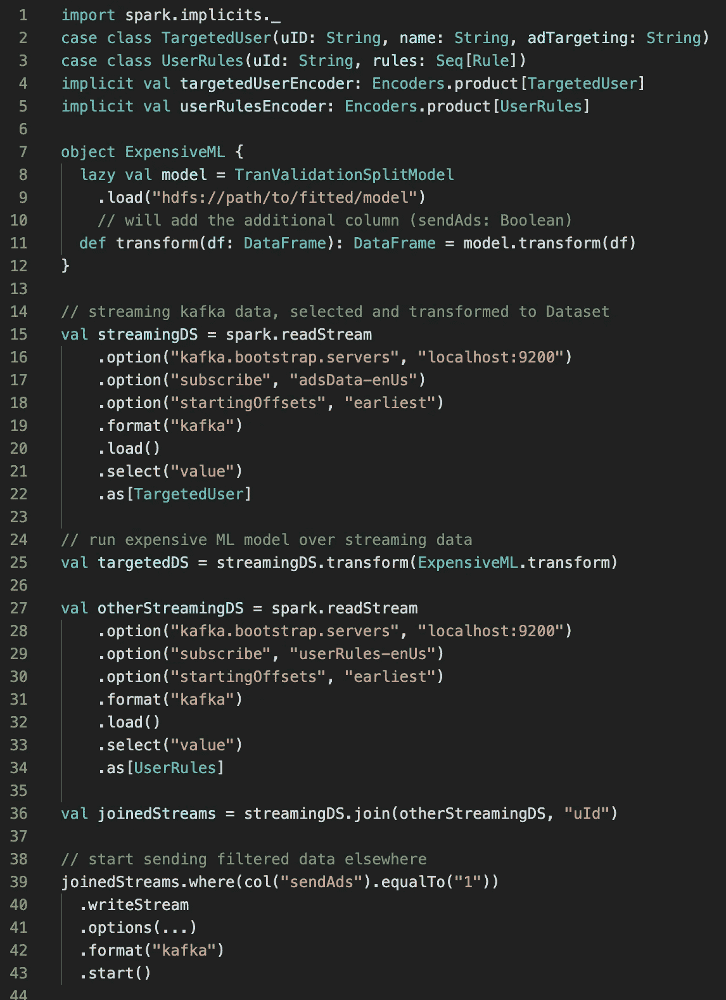
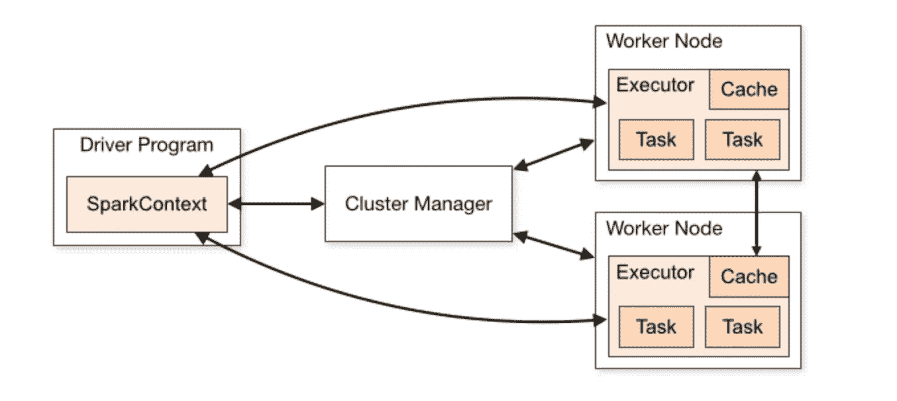

# Apache Spark 的缓存模式

> 原文：<https://towardsdatascience.com/cache-patterns-with-apache-spark-14235f40a29?source=collection_archive---------4----------------------->

## 平衡磁盘、ram 和真实来源之间的选择


许多角度提供了同一场景的许多视图。缓存与分区的工作方式类似。[信用](https://unsplash.com/photos/tMMapPBWK6o)

[Apache Spark](http://spark.apache.org/) 提供了一些*非常简单的*机制来缓存进程内计算，这有助于减轻繁琐且固有的复杂工作负载。这篇文章旨在提供一个可接近的心智模型来分解和重新思考如何构建 Apache Spark 计算。无论您的下一个应用程序是批处理作业还是流作业，这里的目标都是为您提供必要的先决条件，以便满怀兴趣地处理您的下一个 Apache Spark 项目！

## 火花应用程序工作负载

首先，让我说明一个简单的工作负载应该适合内存中数量相对较少的执行器——因为简单的工作负载本质上是简单的:就像加载一组数据，并在一个公共的 [***ETL***](https://en.wikipedia.org/wiki/Extract,_transform,_load) 流中将它与另一组数据连接起来。这里所需的开销往往很低，因为您只需要在总处理时间的一部分内将两个数据集都放入内存中——如果调优正确的话。*这种工作量是数据工程师的饭碗。*

## 简单的 Spark ETL 流程



> 上面是一个基于批处理的提取转换加载(ETL)工作负载的简单示例。批处理工作负载通常更像是传统的 Map-Reduce 风格的作业，正是这种风格让 Hadoop 在当年大受欢迎！

C **复杂的工作负载**通常不会完全适合内存*由于底层数据的成本，或者由于作业的性质，如流管道作业。复杂的工作负载往往会以非常有趣的方式咬你，主要是因为在本地工作的事实，在开发或阶段环境中，*很少* 在生产中第一次就能很好地扩展。*

*生产可能是一个可怕的地方，数据速率(每秒事件数等)以超出传统正态分布的方式激增和增长。不确定的事情，尤其是在海量数据的领域，往往会导致管道尖叫着停止工作，导致工作死亡，让客户愤怒——这一切都是因为我们必须在运营成本和不幸的内存不足异常之间进行平衡。*

*复杂工作负载的示例包括典型的时间序列摄取管道，具有针对实时指标或运营仪表板的流式统计聚合，或者 good ol '实时机器学习管道(请参见下面的示例)。这些工作负载通常是数据工程师和应用机器学习或统计/性能工程师的共同努力。*

## *复杂火花流工作负载*

**

*这可能是一个计算量很大的 Spark 应用程序。*

> *上面的例子是*一个假的用例*，使用 Apache Spark 结构化流进行所谓的流-流连接。这进一步包括通过昂贵的实时机器学习转换、二次流连接、过滤的后连接查询以及广告推荐流的下游发布，将广告定向到该流管道。理论上，像这样的管道可以把你每天在网上看到的广告发送给你。*

*既然我们对简单工作负载和复杂工作负载之间的差异有了大致的了解，我们可以学习如何以更智能的方式解决复杂的问题。*走吧*。*

## *通过分解简化*

*有趣的是，大多数简单工作负载和复杂工作负载之间的差异往往可以归结为智能分解模式，因为复杂工作负载可以被视为一系列具有分布式终点线的简单工作负载，所有进程都独立地奔向一起，并且它们都可以完全独立地运行(例如:非确定性工作负载)或确定性地运行，其中先前的执行阶段将问题简化为更简洁的层。*

*接下来我们将看看 Spark 是如何分配工作的。相信我，这一切都指向某个地方！*

## *Apache 的基本原理引发了分布式计算*

*在 spark 世界中，一切都始于资源。这个资源有一个源，描述了如何从给定的源读取数据。在最简单的基于文件的 spark 应用中，我们从一个 [DataFrameReader](https://jaceklaskowski.gitbooks.io/mastering-spark-sql/spark-sql-DataFrameReader.html) 开始。*

**

*一堆乐高积木。可以把 RDD 看作是一个单独的单元，它被一些独立的小分区封装起来。如果 RDD 中的一个块丢失了，它可以并且将会被重新计算。信用 [Unsplash](https://unsplash.com/photos/lQT_bOWtysE)*

***DataFrameReader** 可用于大多数较简单的数据读取任务，如 json、csv、orc 和其他任务，使我们能够快速将数据加载到 Spark 中，以通过一系列转换进行评估，从而得出最终结果(或行动)。正是这个(load)->(transform)->(write)有向无环计算图(DAG)使得 Spark 工作起来如此有趣。从一个简单的文件开始，如下所示。*

```
*spark.read.json("file://some/path/file.json")*
```

*我们能够很容易地将 json 数据作为数据帧读入 spark 内存。这个数据框架在 Apache Spark 的最新版本中封装了一个强大但几乎隐藏的宝石。那是 RDD。*

*RDD 是 spark 如何在自己的游戏中击败 Map-Reduce 的。它代表**弹性分布式数据集**。这些数据集被划分成多个逻辑分区。例如，假设您有一个有 32 个分区的**阿帕奇卡夫卡**主题。Apache Spark 会自动将 Kafka 资源上的读取流转换成一个有 32 个分区的 **RDD** ,以遵循并保留最初的 Kafka 分区方案。*

***这意味着以下是 rdd 的真实情况。***

1.  *所有分区都成为执行阶段中的任务。因为每个分区都可以并行操作，这意味着您的处理作业可以平均分布在所有可用的 **Spark 执行器**上。(Spark 执行器是运行在 Spark Workers 上的 JVM 进程)*
2.  *在从读到写(或动作)的过程中丢失的任何单个分区都可以独立地重新计算，而无需所有分区都重新开始。与 Map-Reduce 相比，这是一个巨大的速度提升，在 Map-Reduce 中，整个任务都会失败，而单个任务或计算阶段会失败。*
3.  *如果文件系统或 Kafka 主题使用这些块或分区来提供 RDD 的底层分区，而这又可以在简单的数据帧中使用，那么您可以使用常见的散列分区方案( [crc hash](https://en.wikipedia.org/wiki/Cyclic_redundancy_check) )来确保您总是在相同的逻辑分区中处理相同种类的数据。**例如**:假设我们有一个按照一天中的几个小时划分的卡夫卡主题。我们将有 24 个分区，对于给定分区的数据处理将总是有一组那个小时的数据。是的，这将有热点，但我们永远不必在给定分区之外寻找该小时之外发生的信息，而且在许多情况下，这意味着我们不必四处转移数据，也不必承担在整个集群中移动数据的 IO 成本。*

## *但是什么是遗嘱执行人呢？*

**

*展示了 Spark 应用程序的结构:[照片来源](http://spark.apache.org/docs/latest/cluster-overview.html#components) @ Spark Docs*

*执行器是 Spark 对分布式计算进程的命名，它只是一个运行在 Spark Worker 上的 JVM 进程。执行者的唯一工作是在工作的各个阶段内，完全致力于被描述为任务的工作的处理([更多细节参见 Spark 文档](http://spark.apache.org/docs/latest/cluster-overview.html#components))。*

## *持久性、缓存和存储级别:您为什么应该关注*

**

*内存胜过昂贵的 IO。[信用](https://unsplash.com/photos/lYxQ5F9xBDM)*

***明智地使用缓存***

*我一直认为缓存是调优的一个典型组成部分，鉴于这篇文章是关于缓存的，那么让我们假设你会免费带回家一点调优和 [*调试技能*](https://www.oreilly.com/library/view/debugging-apache-spark/9781492039174/) ！*

*在 Apache Spark 中适当地使用缓存可以让您成为可用资源的主人。内存不是免费的，虽然它可能很便宜，但在许多情况下，从长远来看，将数据帧存储在内存中的成本实际上比返回到真实数据集的来源更昂贵。如果您已经查看了 **Spark UI** (当 *spark.ui.enabled* 设置为 true 时在端口 4040 上运行)并且已经确定您不能从系统中挤出性能，那么您是应用缓存的候选人。*

*主要是如果计算过程中花费的大部分时间是从系统 A 或 B 或 C(比如 HDFS 或 MySQL 或 Redis)加载数据，并且无法通过向外扩展来提高速度。spark 的横向扩展意味着在更多机器上的更多 RAM 上添加更多 CPU 内核。然后，您可以开始考虑有选择地缓存最昂贵的计算部分。*

```
*// profile allows you to process up to 64 tasks in parallel.
spark.cores.max = 64
spark.executor.cores = 8
spark.executor.memory = 12g*
```

> *上述配置将允许您使用 8 台运行 8 个内核和 12gb ram 的机器。*我们使用 amazon 的 c5d.2xl 机器，为堆外分配 2gb，为操作系统分配 2gb。因此上例中的 12g。*

## *火花储存*

*当您缓存数据帧的沿袭时，StorageLevel 的概念就出现了。*

```
*val df = spark.**read
  .schema**(Encoders.**product**[SomeCaseClass].**schema**)
  .option("**basePath**", "hdfs://path/to/data/lake/root/table")
  .**parquet**("**hdfs://path/to/data**/lake/root/table/year=2020/month=2")
  .**transform**(expensiveTransformation)
  .**join**(otherDataFrame, df("key").equalTo(other("uuid")))*
```

*上面我们有一个加载、转换和连接带有附加数据框的数据的示例。假设这个操作*是懒惰的*，在你提供一个动作之前不会计算任何东西，那么我们可以通过在我们的数据帧上调用 **head** 来欺骗和缓存这个血统，以将 Spark 推入动作。*

```
*import org.apache.spark.**storage**._
df.persist(**StorageLevel**.MEMORY_ONLY_SER)
df.head // computes the expensive operations and caches
df.**storageLevel** // will show you how things are stored.*
```

*一旦您缓存了您的计算，在这种情况下，调用 **persist** 并选择 **StorageLevel。MEMORY_ONLY_SER** 您可以根据初始计算的结果继续进行尽可能多的操作，而不必在源代码或初始读取命令处重新开始每个操作。*

*[StorageLevel](https://spark.apache.org/docs/2.4.5/api/java/index.html?org/apache/spark/storage/StorageLevel.html) 有从 **DISK** 到 **OFF_HEAP** 到 **NONE** 的选项。我建议看看那里的选项，并测试有助于加速 Spark 应用程序的不同选项。*

*当您处理完缓存的数据后，您可以通过调用 **unpersist** 轻松地将它从 Spark 中移除。用魔杖轻轻一点，告诉哈利波特迷们恶作剧成功了。*

```
*df.unpersist*
```

*这将立即移除缓存，或者您也可以使用*阻塞*选项。*

```
*df.unpersist(blocking=true)*
```

*然后，您将释放您的资源，用于剩余的必要计算。*

> *大数据和大数据的叉积是内存不足异常— [Holden Karau](https://twitter.com/holdenkarau)*

## *结论*

*我对 Spark 进行缓存和持久化的方法是将其更像 JVM 垃圾收集器。如果我需要多次访问同一个数据，我会将它存储在缓存中。这允许我减少往返于数据的真实来源(s3a://或 hdfs://)的次数。考虑到我所处理的数据类型，主要是 parquet 和其他基于文件系统的数据，在 IO 和总加载文件方面都很繁重。一旦我加载了数据，通常最好在做出另一个决定之前缓存数据，这样我就不会不经意地回到 hdfs 或 s3 来再次加载相同的数据。*

## *关于作者*

*我在 Twilio 的 [Voice Insights 团队工作，在这里，我们每几秒钟*就会接收*数百万个事件，这些事件来自一系列 Spark 流媒体应用，它们都在我们的数据谱系管道中运行。我们是一个混合数据平台/数据工程和数据科学团队，在加州工作。](https://www.twilio.com/voice/insights)*

*参见我在[Streaming Trend Discovery](https://medium.com/@newfrontcreative/streaming-trend-discovery-real-time-discovery-in-a-sea-of-events-76bc03367e6f)上的另一篇文章，看看我们如何用 Spark 处理一些更复杂的用例。*