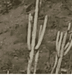
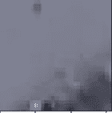
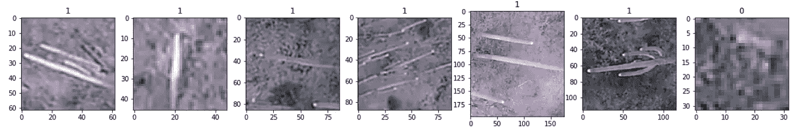
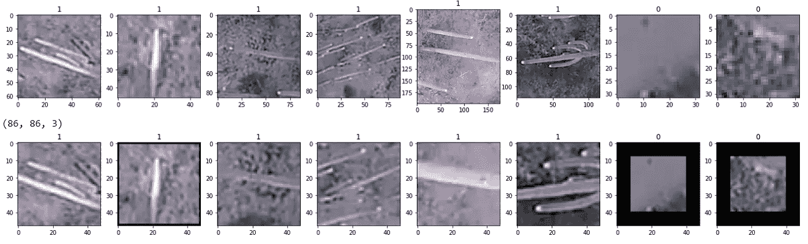
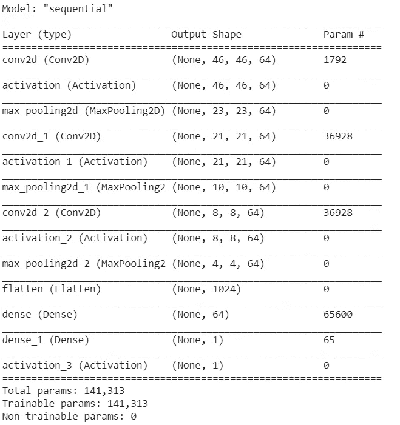
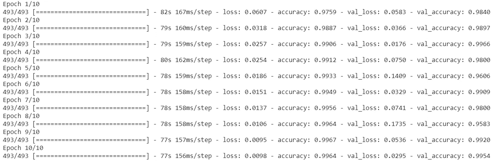
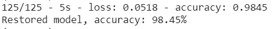

# 使用卷积神经网络(CNN)的仙人掌图像分类达到 98%以上的准确率

> 原文：<https://towardsdatascience.com/cactus-image-classification-using-convolutional-neural-network-cnn-that-reaches-98-accuracy-8432e068f1ea?source=collection_archive---------48----------------------->

## 我们的目标是构建一个分类器，将图像分类为“仙人掌”或“非仙人掌”


照片由[像素](https://www.pexels.com/photo/landscape-mountains-sky-night-34107/?utm_content=attributionCopyText&utm_medium=referral&utm_source=pexels)的[皮克斯拜](https://www.pexels.com/@pixabay?utm_content=attributionCopyText&utm_medium=referral&utm_source=pexels)拍摄

# 了解数据集


这个分类问题来自于[卡格尔挑战赛](https://www.kaggle.com/irvingvasquez/cactus-aerial-photos)中的一个。我们的目标是构建一个分类器，将图像分类为“仙人掌”或“非仙人掌”训练集包括 17500 幅图像，而验证集有 4000 幅图像。有仙人掌标志的图像在名为 cactus 的文件夹中，反之亦然。以下是来自训练数据集的示例。



仙人掌



非仙人掌

# 数据预处理

当我们通过使用 Pyplot 库简单地绘制这些图像来仔细查看其中一些图像时，我们可以观察到它们的大小不同，不适合后面的训练过程。另外，请注意，我们用 1 和 0 标记了所有图像，表示仙人掌和非仙人掌。



因此，我们需要将所有的图像标准化为相同的大小。根据我们的实验，最佳策略是将这些图像裁剪为 48×48 像素的大小。下面是一些裁剪过的图片。第一行显示原始图像，第二行显示修改后的图像。



这种方法的好处是它保存了图像的所有细节；然而，我们有时会丢失图像的边缘，如果图像太小，我们需要用黑色背景扩展图像，使其大小与其他图像相同。失去边缘可能是一个大问题，因为我们有可能用这种技术将仙人掌从图像中切掉。

# CNN 结构和培训

卷积神经网络包含 3 层卷积层和 2 个全连接层。每个卷积层都有一个 3 乘 3 滤波器，步长为 2，输出为 64 个节点。之后，数据通过 max-pooling 层，以防止过度拟合并提取有用的信息。

```
model = Sequential()model.add(Conv2D(64, (3,3), input_shape = X_train.shape[1:]))model.add(Activation(‘relu’))model.add(MaxPooling2D(pool_size=(2,2)))model.add(Conv2D(64, (3,3)))model.add(Activation(‘relu’))model.add(MaxPooling2D(pool_size=(2,2)))model.add(Conv2D(64, (3,3)))model.add(Activation(‘relu’))model.add(MaxPooling2D(pool_size=(2,2)))model.add(Flatten())model.add(Dense(64))model.add(Dense(1))model.add(Activation(‘sigmoid’))model.compile(loss=”binary_crossentropy”,optimizer=”adam”,metrics=[‘accuracy’])history = model.fit(X_train, Y_train, batch_size=32, epochs=10, validation_split=0.1, use_multiprocessing=True)model.save(‘model_48_crop’)
```

下面是模型结构的概述。



模型概述

我们用 10 个纪元来训练模型，结果显示出惊人的效果。第一个精度是下面代码片段中的训练精度，第二个精度是验证精度。请注意，在最终预测之前，我们使用了部分(10%)训练集作为验证集。



# 试验结果

我们使用 Kaggle 提供的 validation_set 作为我们的测试集，对我们训练好的模型进行最终预测。

```
testdata = pd.read_pickle(“pickled_data_validation/crop_images(48, 48).pkl”)test_images = testdata.loc[:, data.columns != ‘class’]test_images = test_images.to_numpy()test_images = test_images.reshape((len(test_images),48, 48, 3))test_images = test_images/255.0print(test_images.shape)test_labels = testdata[‘class’]test_labels = test_labels.to_numpy()type(test_labels)test_labels = test_labels.reshape((len(test_labels),1))loss, acc = new_model.evaluate(test_images, test_labels, verbose=2)print(‘Restored model, accuracy: {:5.2f}%’.format(100*acc))
```

这是结果。它达到了几乎 99%的准确率，这是惊人的。



# 结论

这篇文章的主要目标是与你分享卷积网络结构对这种二进制分类问题，如猫和狗的图像分类。希望你能对这类问题有更好的理解。