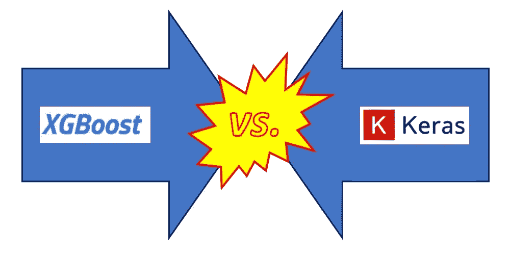
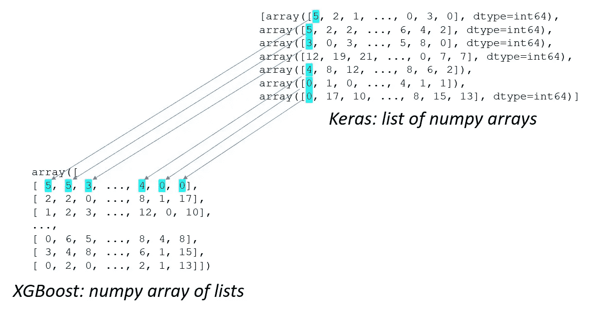
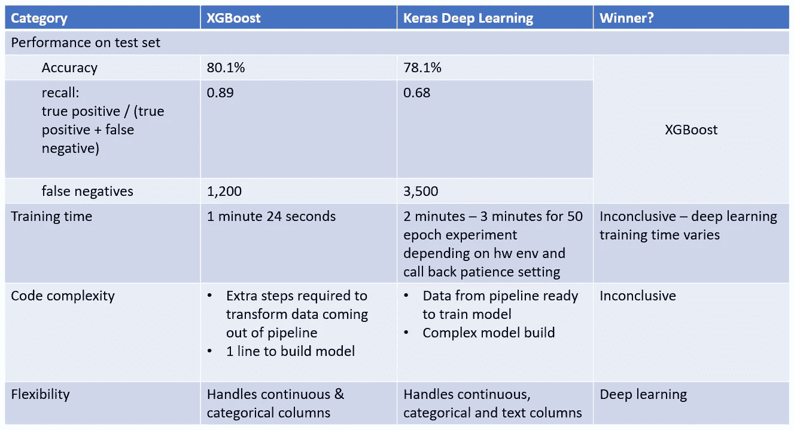

# 笼赛:XGBoost vs. Keras 深度学习

> 原文：<https://towardsdatascience.com/cage-match-xgboost-vs-keras-deep-learning-a8bb2f69a9ab?source=collection_archive---------40----------------------->

笼子比赛(作者插图)

自从我第一次尝试深度学习以来，我一直对将其应用于结构化的表格数据感兴趣。我已经写了几篇关于这个主题的文章，我正在为曼宁出版社写一本关于结构化数据深度学习的书。通过利用深度学习的灵活性和减少特征工程的潜力来解决结构化表格数据的问题将是非常棒的。

在表格数据上使用深度学习的想法[并非没有批评者](https://www.reddit.com/r/MachineLearning/comments/9826bt/d_why_is_deep_learning_so_bad_for_tabular_data/)。我听到的一个一致的反对意见是，非深度学习方法，特别是 XGBoost，编码更简单，更容易解释，性能更好。我决定我需要用我书中的主要例子来测试这个断言:预测多伦多有轨电车网络的延迟。多伦多市发布了一个[数据集，描述了自 2014 年 1 月](https://open.toronto.ca/dataset/ttc-streetcar-delay-data/)以来的每一次电车延误。挑战在于使用这个数据集来训练一个机器学习模型，该模型可以预测给定的有轨电车行程是否会被延迟。

为了说明这本书的关键点，我使用 Keras 功能模型创建了一种深度学习方法来解决有轨电车延迟预测问题。该解决方案包括一组模块，用于清理数据、构建和训练模型，以及[部署训练好的模型](/deploying-a-deep-learning-model-using-flask-3ec166ef59fb)。为了对这两种机器学习方法进行公平的比较，我的目标是用 XGBoost 替换 Keras 深度学习模型，对其余代码进行最小的更改。想象一下，从原始数据的获取到训练模型的部署，整个解决方案就是一辆汽车。我想更换汽车的引擎(机器学习模型)，而不改变车身、电气系统、内部或汽车的任何其他方面。

更换发动机，让汽车的其余部分保持不变(作者插图)

我惊喜地发现，用 XGBoost 替换 Keras 深度学习模型是多么容易。以下部分描述了我将包含训练 Keras 模型的代码的[笔记本转换成训练 XGBoost 模型](https://github.com/ryanmark1867/deep_learning_for_structured_data/blob/master/notebooks/streetcar_model_training.ipynb)的[笔记本的步骤。](https://github.com/ryanmark1867/deep_learning_for_structured_data/blob/master/notebooks/streetcar_model_training_xgb.ipynb)

## 重构用于定型和测试模型的数据

深度学习模型是一个多输入 Keras 函数模型，它需要在一系列 numpy 数组上进行训练，如以下代码片段所示:

相比之下，XGBoost 模型期望在 numpy 列表数组上进行训练。我需要将训练和测试数据从 Keras 期望的格式转换成 XGBoost 期望的格式。首先，我将测试和训练数据集从 numpy 数组列表转换为列表列表:

我有点害怕使用 for 循环来做这件事——我肯定有更 Pythonic 化的方法——但是这个单元运行得足够快，我希望代码易读。

接下来，我将上一步中的每个列表转换成一个 numpy 列表数组，转置以获得正确的数据组织:

这些转换的输出是我们想要的 XGBoost 格式的数据——列表的 numpy 数组:

下图显示了原始数据形式(numpy 数组列表)的值如何以数据的目标形式(列表的 numpy 数组)结束:

将数据从 Keras 要求的格式转换为 XGBoost 要求的格式

## 训练和应用 XGBoost 模型

现在我已经有了 XGBoost 所需格式的数据，我已经准备好训练 XGBoost 模型了。下面的代码片段显示了训练和保存模型的代码:

我在 XGBoost fit 语句中使用了一个非默认参数:将 **scale_pos_weight** 设置为 **one_weight** 。这个参数让我考虑数据集在否定情况(没有电车延迟)和肯定情况(电车延迟)之间的不平衡。数据集中只有大约 2%的记录表示有轨电车延误。XGBoost fit 语句中的 **scale_pos_weight** 参数被设置为与 Keras 模型的 fit 语句中使用的值相同的值，其中 **class_weight** 参数的" 1 "值被设置为 **one_weight** ，如以下代码片段所示:

接下来，我将训练好的模型应用于测试集，并从模型中获得测试集的预测。

最后，我评估了 XGBoost 模型的准确性:

## 比较 XGBoost 和 Keras 的结果

现在我们已经有了经过训练的 XGBoost 模型的结果，我们可以比较使用 Keras 深度学习的解决方案和使用 XGBoost 的解决方案的整体特征。下表总结了结果:

XGBoost 与 Keras 结果汇总

让我们更详细地看一下每个比较类别:

*   **XGBoost 是性能**的赢家，尤其是回忆。召回对于预测有轨电车延误的用例至关重要——当将要有延误时，我们希望最小化预测无延误的模型(假阴性)。如果模型预测延迟并且没有延迟(假阳性)，用户可能最终步行到他们的目的地或者乘坐出租车而不是有轨电车。最终的影响并没有那么糟糕，因为用户仍然有很好的机会按时到达目的地。然而，由于假阴性(当有延迟时，模型预测没有延迟)，影响是坏的，因为用户可能会乘坐有轨电车，并冒着迟到的风险到达他们的目的地。因此，召回对于有轨电车延迟预测问题至关重要，XGBoost 显然具有更好的召回结果。
*   **训练时间是平局**。在没有 GPU 且迭代次数有限的本地系统上，XGBoost 的训练时间更快。然而，Keras 的训练时间因跑步而异，并且取决于回调**耐心**参数。“耐心”参数控制一旦目标性能测量(如认证准确度)不再提高，训练运行将持续多少个时期。因为 Keras 的训练时间变化如此之大，所以我认为这个类别是不确定的。
*   **代码复杂度是平局**。Keras 模型有更复杂的代码来构建功能模型的层。然而，正如上面关于重构用于训练和测试模型的数据的部分所示，XGBoost 需要额外的代码来将数据转换成它所期望的形式。因为 Keras 有更复杂的代码来构建模型，而 XGBoost 需要额外的代码来准备数据，所以我也把这个类别称为平局。
*   **Keras 在灵活性方面胜出**。有轨电车延迟预测问题是《使用结构化数据进行深度学习一书中扩展示例的主题，但其目的是有轨电车延迟预测问题的代码可以应用于各种各样的结构化表格数据集。特别是，如果表格数据集中的一列被标识为自由格式的文本列(例如，零售站点中的商品描述)，那么将自动生成 Keras 模型，其中包含处理此类列的图层。XGBoost 没有这种能力来处理包含连续、分类和自由格式文本列的表格数据集。我认为 Keras 方法具有更好的灵活性，因为它可以处理更多种多样的表格数据集。

## 结论

在本文中，我描述了对街车延迟预测问题的两种解决方案的比较:一种使用 XGBoost 作为模型，另一种使用 Keras 深度学习模型。在这个比较中，我尽可能保持两个解决方案的代码接近；我只修改了与模型的训练和测试相关的部分代码。对比的结果表明，XGBoost 在原始性能，尤其是召回率上更好，Keras 深度学习更灵活。

以下是本文中描述的代码和初始数据集的链接:

*   完整回购:[https://github . com/ryanmark 1867/deep _ learning _ for _ structured _ data](https://github.com/ryanmark1867/deep_learning_for_structured_data)
*   [笔记本包含 XGBoost](https://github.com/ryanmark1867/deep_learning_for_structured_data/blob/master/notebooks/streetcar_model_training_xgb.ipynb) 的模型训练代码
*   [包含 Keras 车型培训代码的笔记本](https://github.com/ryanmark1867/deep_learning_for_structured_data/blob/master/notebooks/streetcar_model_training.ipynb)
*   [数据准备笔记本](https://github.com/ryanmark1867/deep_learning_for_structured_data/blob/master/notebooks/streetcar_data_preparation.ipynb)(XGBoost 和 Keras 方法通用)
*   [原始输入电车延迟数据集](https://open.toronto.ca/dataset/ttc-streetcar-delay-data/)