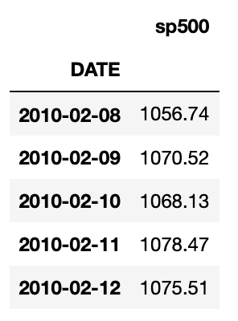
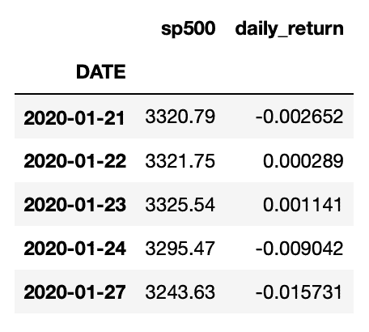
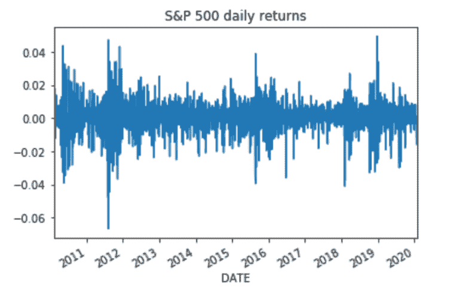
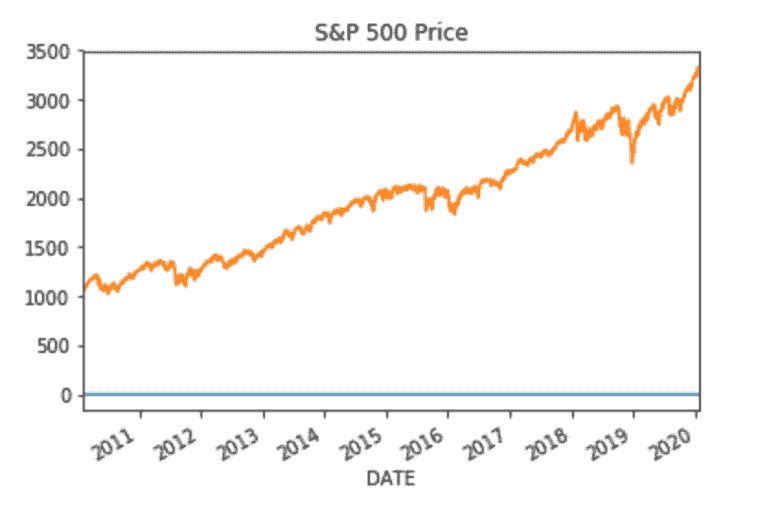

# 计算并绘制标准普尔 500 每日回报

> 原文：<https://towardsdatascience.com/calculate-and-plot-s-p-500-daily-returns-2ce359e014d6?source=collection_archive---------5----------------------->

## 使用 Python，Pandas 和 Matplotlib

大多数投资者总是试图找到一个简单问题的答案，即*金融市场未来将如何表现*。

显然，没有人知道答案，因此，投资者和金融分析师花费大量时间试图找出对未来股票价格的最佳估计。**蟒蛇和熊猫**可以成为一个伟大的盟友，帮助我们找到上述问题的最佳答案。在这个故事中，我们将编写一个 Python 脚本，它将让我们:

*   **用 Python 和熊猫检索市场数据**
*   **计算市场日收益率**
*   **在图表中绘制市场日收益率**

读完这篇文章后，你将能够分析你感兴趣的任何公司的市场回报。我们开始吧。


斯蒂芬·道森在 [Unsplash](https://unsplash.com/s/photos/stock-market?utm_source=unsplash&utm_medium=referral&utm_content=creditCopyText) 上拍摄的照片

# 用 Python 检索市场数据

首先，要进行任何分析，我们都需要数据。幸运是，使用 Python 我们可以在几秒钟内下载数百个数据点。对于我们的分析，我们需要检索股票价格形式的市场数据。

作为市场数据的代理，我将使用[**S & P 500 指数**](https://en.wikipedia.org/wiki/S%26P_500_Index) 来跟踪美国 500 家最大公司的**表现。**

标准普尔 500 日报的数据可以使用 Pandas 和 Pandas DataReader 提取。Pandas DataReader 是一个很棒的软件包，可以用 Pandas 远程访问数据。

在 Pandas DataReader 中，我们有多个来源可以下载数据，用 Python 执行多种财务分析。例如，我们可以从可靠的提供商那里获得股票数据或经济指标。查看 [Pandas DataReader](https://pandas-datareader.readthedocs.io/en/latest/index.html) 文档了解更多信息。

为了我们的分析，我们将从 [FRED 数据源](https://pandas-datareader.readthedocs.io/en/latest/remote_data.html#fred)中检索数据。首先，我们需要导入 *Pandas* 、 *datetime* 和 *Pandas_datareader* 包。

接下来，我们可以简单地定义一个日期范围并使用 *web。DataReader* 方法以 Pandas DataFrame 的形式下载数据，并将其存储在变量名 *SP500* 中。

我们将想要下载的数据集的名称(即 sp500)、数据的提供者或来源(“Fred”)以及开始和结束日期作为参数传递给了 *DataReader* 方法:

```
import pandas as pd
#if you get an error after executing the code, try adding below. pd.core.common.is_list_like = pd.api.types.is_list_likeimport pandas_datareader.data as web
import datetimestart = datetime.datetime(2010, 1, 1)
end = datetime.datetime(2020, 1, 27)SP500 = web.DataReader(['sp500'], 'fred', start, end)
```

运行代码后，我们得到了下面的 Pandas DataFrame，显示了历史 S & P 500 每日价格:



# 计算标准普尔 500 的每日回报率

太好了，我们在熊猫数据框架中有过去 10 年的标准普尔 500 指数价格。现在，我们准备计算过去 10 年的 **S & P 500 日收益率**，并将它们作为一个新列添加到我们的数据框架中，我们将称之为 *daily_return* 。

为了计算回报率，我们可以使用下面的公式，其中 *P1* 指的是*当前价格*，而 *P0* 指的是*初始价格*或我们用来计算回报的参考价格。


收益率

```
SP500['daily_return'] = (SP500['sp500']/ SP500['sp500'].shift(1)) -1

#Drop all Not a number values using drop method.
SP500.dropna(inplace = True)
```

***shift*** 方法所做的是将我们的索引移动作为参数提供的数字。在我们的例子中，我们将把 *sp500* 列中的每个值移动一位。这意味着我们将当天的价格降低到前一天的价格。

让我们打印 SP500 数据帧的最后五个值，看看我们得到了什么:



标准普尔 500 每日回报

# 策划标准普尔 500 每日回报

我们有我们的标准普尔 500 价格和回报准备用 Python 绘图。让我们先画出每日回报。

用 Python 和 Matplotlib 绘图超级简单，我们只需要从我们的 SP500 数据框架中选择 *daily_return* 列，并使用方法 *plot* 。

```
SP500['daily_return'].plot(title='S&P 500 daily returns')
```



策划 S&P500 每日回报

不错！我们可以很容易地从图表中找出一些非常有用的信息。例如，我们可以看到标准普尔 500 指数最差的日回报率是在 2011 年，日回报率为-7%。

同样，我们可以看到，标准普尔 500 指数最好的一天是在 2019 年年中，日回报率约为 5%。

除了每日回报，我们还可以绘制过去 10 年的标准普尔 500 价格演变图。这里我们可以观察到一个明显的上升趋势。

```
SP500['sp500'].plot(title='S&P 500 Price')
```



绘制标准普尔 500 价格

# 包扎

在这个关于 **Python for Finance** 的故事中，我们检索了 **S & P 500 的历史价格**，以便计算和绘制指数的每日回报。

绘制每日市场回报是一个很好的方法来可视化任何特定时期的股票回报。你可以用任何其他股票或指数来尝试。

我真的希望你喜欢这个故事！如果您有任何问题或不清楚的地方，请随时回复。我还有一个 Youtube 视频，一步一步地解释了本教程中使用的代码:

策划 SP500 每日回报

*原载于 2020 年 2 月 8 日*[*【https://codingandfun.com】*](https://codingandfun.com/python-for-finance-calculate-and-plot-sp-500-daily-returns/)*。*