# 计算你的点击预测的经济影响

> 原文：<https://towardsdatascience.com/calculate-the-economic-impact-of-your-click-through-prediction-1fa6eee64494?source=collection_archive---------37----------------------->

## 超越准确性、AUC 或 Lift:一个衡量经济影响的模型


时代广场由安东尼·罗塞特在 Unsplash 拍摄

我们在[*IE data science boot camp*](https://www.ie.edu/exponential-learning/programs/data-science-bootcamp/)*学习期间，我和 m* y 团队为一家拥有 2800 万 MAU 的公司做了一个点击率预测，以**改善公司**的广告分配。在 IE，他们明确强调了三个领域的重要性，即数学、编程和商业，数据科学家需要努力成功应对数据挑战。

我们的挑战是点击率预测。在互联网上，尤其是在这个博客里，有很多关于如何解决这个问题的内容。但是，它为什么重要呢？**为什么需要预测横幅广告的用户点击量？**你的模型什么时候值得？你的业务收入能提高多少？我们花了一半的时间来了解业务问题，并想办法评估我们不同模式的收入改善情况。

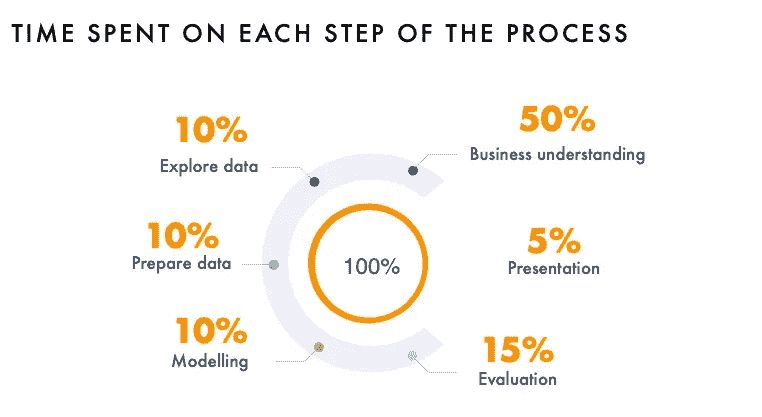

我们在 IE DS 训练营的顶点项目

这不是另一篇关于如何通过预测进行点击的文章([这里](https://github.com/myrthings/click-prediction)如果你感兴趣，你可以得到我们的完整过程代码)，**这是一篇关于为什么这个问题是值得的，以及我们如何计算收入提高的文章。**

开始吧！

# 问题是

程序化广告是在线买卖广告的自动化交易。广告在网站上用横幅广告展示，其**表现用 CTR(点击率)**来衡量:

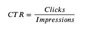

广告的点击率通常很低。如果是 1%,这意味着每 100 个接触过广告的访问者中只有 1 个点击了那个广告。

我们公司 60%的收入来自网站横幅广告。挑战在于尽可能地增加收入。横幅持有者根据点击量和印象数获得报酬——当用户看到横幅但没有点击时。横幅广告的盈利方式是在广告拍卖中出售，广告商为这些横幅广告出价。有很多拍卖提供商。在我们的例子中，该公司了解其更普通的用户，他们有一个为他们提供广告的付费提供商。这些广告给他们带来了更多的收入，但他们受到限制，因为他们需要事先与供应商谈判。

想象一下，广告每月限量 1000 万个。或者限制在一个月正常网站流量的 30%。我们将分配 30%的广告给一个优质供应商，其余 70%给一个标准供应商。但是，怎么做呢？我们如何优化分配以增加收入？这是我们的挑战。

目标是训练一个设定用户点击广告概率的模型。然后，我们将对这些概率进行排序，我们将只向概率最高的 30%的用户显示优质广告，而对于其余 70%的用户，我们将显示标准广告。我们模型的性能将用[升力](https://en.wikipedia.org/wiki/Lift_(data_mining))来衡量。

一个群体的提升是这个群体比平均水平好或差多少倍:

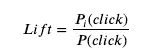

其中 *i* 是十分位数或组数。然后，我们将计算**使用我们的模型可以提高多少收入**，并与没有任何模型进行比较。

# 选择最佳 ML 模型

对于挑战，我们有**两个各 100 万印象的数据集**，这是 2019 年 10 月和 11 月流量的样本。数据来自一种谷歌分析引擎，我们只有 10 个非个人信息的特征。他们是:

*   行的唯一标识符。*字符串。*
*   横幅的名称。*字符串。*
*   服务器的日期。*对象。*
*   服务器的时间。*对象。*
*   印象之国。*弦。*
*   印象网站(来自英国的用户可以看到。es 网站的扩展)。*弦。*
*   印象的运作系统。*弦。*
*   浏览器:用于印象的浏览器。*弦。*
*   RefererURL:点击横幅时，此人在网站的哪个部分。字符串。
*   点击:是否点击了横幅。*二进制整型。*

我们做了大量的可视化工作，然后通过特征工程来提高模型的性能。如果你想看看我们到底做了什么，这里有所有的代码。

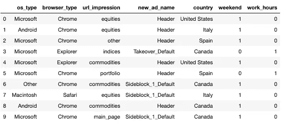

我们的数据框架的负责人在数据之后，即数据争论、数据清理和特征工程

**然后，我们拟合 9 种不同的算法，并使用** [**AUC**](/understanding-auc-roc-curve-68b2303cc9c5) 对它们进行基准测试。我们选择 AUC 来评估我们的模型，因为我们需要很好地预测 1 和 0——点击或未点击。这是因为与我们的优质提供商相比，我们通过点击赚取更多，但如果没有点击，我们会比标准提供商损失更多的钱。

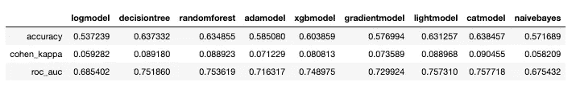

我们使用的每个模型都有其评估指标

使用 *Lightgbm* 和 *Catboost* 型号**，我们实现了 0.757** 的 AUC。我们在最后选择了 *Lightgbm* ，因为预测速度更快，而且我们需要模型实时运行。

# 应用训练模型的结果

现在我们有了一个模型，我们如何利用它的结果呢？

**我们的问题是，我们应该向哪些用户展示广告，不应该向哪些用户展示。给定测试集(不平衡，与我们的样本具有相同的点击率，4%)，模型真正预测的是**一个向量，其中给出了点击或不点击**的概率。我们对点击概率最高的人感兴趣。确切地说，在我们的例子中，我们对 30%感兴趣。**

出于这个原因，我们**对点击的概率进行了排序，并将它们分成十分之一组**。对于每个十分位数，我们计算了*大小*、实际点击数量*、实际十分位数(*十分位数 _ 阈值*)。然后，我们计算了十分位数内用户点击的*概率和相关的*提升*。**

```
*# fit the model
model=LGBMClassifier(random_state=101)
model.fit(X_train_trf,y_train)# we are interested in the probabilities
probs=model.predict_proba(X_test_trf)# create a DataFrame with the probs and set the deciles
probs_df=pd.DataFrame(probs)
probs_df[‘real_values’]=y_test
probs_df[‘decile’]=pd.qcut(probs_df[1], 10, labels=False)
probs_df[‘decile’]=(9-probs_df[‘decile’])%10# group by deciles to find the lift
lift=probs_df.groupby(‘decile’)[[‘real_values’]].sum()
lift[‘size’]=probs_df.groupby(‘decile’)[‘real_values’].count()
lift[‘decile_threshold’]=probs_df.groupby(‘decile’)[1].min()
lift[‘prob_click’]=lift[‘real_values’]/lift[‘size’]
lift[‘lift’]=lift[‘prob_click’]/0.0421
lift*
```

*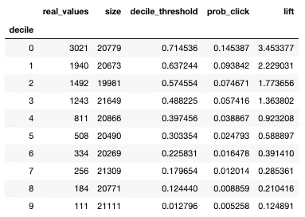*

*我们模型的结果按十分位数分组*

*这个表格真的很重要，因为它意味着**在我们前 10%的印象中，点击的概率是 14.5%(*prob _ click*)，比平均值高 3.45 倍( *lift* )。**如果来自我们的模型的点击概率高于 71.5%(*十分位数 _ 阈值*)，则印象将在该十分位数中。为什么这两个概率不一样？第一个( *prob_click* )是在十分位数内的测试集中印象的实际概率。第二个( *decile_threshold* )是我们模型的概率输出。 *Decile_threshold* 用于将印象从最好到最差排序。 *Prob_click* 就是评价，这个排序有多好。*

*在我们的问题中，记住我们只有 30%的可能分配给额外费用广告。这意味着**我们对十分位数 0，1，2** 的人感兴趣。这些人点击的概率超过 5.7%(*prob _ click*表示十分位数 3)，我们将在我们的模型预测点击概率超过 57.4%的印象中找到他们(十分位数 2 表示*十分位数阈值*)。在下面的图表中，您可以看到结果(数字不匹配，因为这个图表是针对另一个模型的，但想法是相同的)。*

*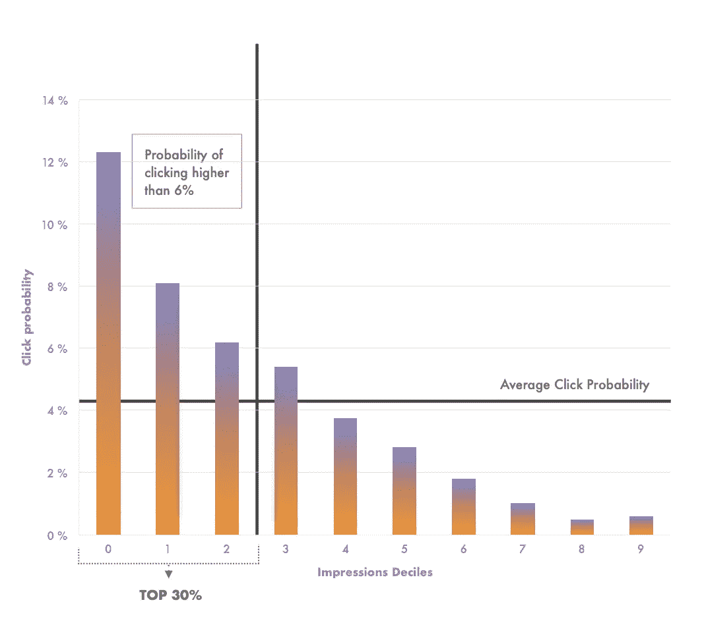*

*每十分位数的点击概率*

*现在我们有了一个做决定的框架。**如果我们的模型预测用户的点击概率高于或等于 57%,它将位于印象的前 30%,因此我们将把横幅销售给我们的优质提供商。**如果对于给定的印象，我们的模型预测点击概率低于 57%，那么我们将把它卖给标准提供商。*

# *经济模式*

*就收入而言，我们的模式有多好？*

***我们并没有通过我们的模式来提高点击率，而是通过更有效地分配点击量来赚取尽可能多的钱。**如果我们没有任何溢价广告，我们将在标准竞价中分配每一个广告，赚取尽可能少的钱。如果我们只有溢价广告，分配将是最好的。相反，我们正处于这两种情况的中间。*

*想象一下，在我们的场景中，我们有**两家供应商**，价格如下:*

*   **高级提供商价格/点击:* 5€*
*   **优质提供商价格/印象但不点击:* 0.015€*
*   **标准提供商价格/点击:* 0.5€*
*   **标准提供商价格/印象但不点击:* 0.0024€*

***如果没有模型，广告将随机分配。**假设整个数据集的点击率为 4%,我们可以拥有的优质广告比例为 30%,则收入将为:*

*   ***点击收入:**4% * 30% *广告总数*高级广告价格+4% * 70% *广告总数*标准广告价格*
*   ***展示但未点击的收入:** 96%(未点击广告)* 30% *广告总数*高级展示价格+96% * 70% *广告总数*标准展示价格*

***有了一个完美的模型——这是不可能的——我们可以完美地预测用户点击的概率**,这样我们就可以尽可能地提高效率，收入将会是:*

*   ***点击收入:**点击次数*优质广告价格*
*   ***印象而非点击的收入:**(30% *广告数量-点击数量)*高级印象价格+70% *标准印象价格*

*使用**我们的模型**我们需要考虑十分位数 0、1、2 中的实际点击次数:*

*   ***点击收入:**前 3 个十分位数的点击量*高级广告价格+后 7 个十分位数的点击量*标准广告价格*
*   ***印象而非点击的收入:**(前 3 个十分位数-前 3 个十分位数的点击次数)*高级印象价格+(后 7 个十分位数-后 7 个十分位数的点击次数)*标准印象价格*

*这看起来有点乱，但它只是应用一些概率分布。为了方便地将它们应用于整个数据集，我们创建了函数 *revenue_model* 。这些输入是:*

*   **probs_df* :上面用来计算升力的数据帧*
*   **fill_rate:* 高级提供商可用的百分比。*
*   **model1:* 标准提供商的价格(_0 用于展示，_1 用于点击)*
*   **模型 2:* 高级提供商的价格(0 为展示次数，1 为点击次数)*

*输出是三个数字，上面的模型给出了收入:随机，最优(你的)和完美。*

```
*def revenue_model(probs_df, fill_rate, model1_0, model1_1, model2_0, model2_1): 

limit=round(len(probs_df)*fill_rate)

 #random model
 random_df=shuffle(probs_df)
 random2=random_df[:limit]
 random1=random_df[limit:]
 money_random2=random2[‘real_values’].sum()*model2_1+(len(random2)-random2[‘real_values’].sum())*model2_0
 money_random1=random1[‘real_values’].sum()*model1_1+(len(random1)-random1[‘real_values’].sum())*model1_0
 revenue_random=money_random1+money_random2

 #optimized problem
 probs_df=probs_df.sort_values(1,ascending=False)
 probs_model2_opt=probs_df[:limit]
 probs_model1_opt=probs_df[limit:]
 money_model2_opt=probs_model2_opt[‘real_values’].sum()*model2_1+(len(probs_model2_opt)-probs_model2_opt[‘real_values’].sum())*model2_0
 money_model1_opt=probs_model1_opt[‘real_values’].sum()*model1_1+(len(probs_model1_opt)-probs_model1_opt[‘real_values’].sum())*model1_0
 revenue_opt=money_model1_opt+money_model2_opt

 #perfect model
 probs_df=probs_df.sort_values(‘real_values’,ascending=False)
 probs_model2_perf=probs_df[:limit]
 probs_model1_perf=probs_df[limit:]
 money_model2_perf=probs_model2_perf[‘real_values’].sum()*model2_1+(len(probs_model2_perf)-probs_model2_perf[‘real_values’].sum())*model2_0
 money_model1_perf=probs_model1_perf[‘real_values’].sum()*model1_1+(len(probs_model1_perf)-probs_model1_perf[‘real_values’].sum())*model1_0
 revenue_perf=money_model1_perf+money_model2_perf

 return revenue_random, revenue_opt, revenue_perf*
```

*然后，我们将其应用于我们的结果，价格如下:*

```
*# set the prices
provider1_1=0.5
provider1_0=0.0024
provider2_1=5
provider2_0=0.015# apply revenue_model function
revenue_random, revenue_opt, revenue_perf = revenue_model(probs_df, 0.3, provider1_0, provider1_1, provider2_0, provider2_1)*
```

*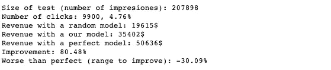*

*这是我们的示例图片，其中 *fill_rate=30%* 。**评估我们模型的全貌**总是一个好主意。为此，我们只需应用相同的函数改变 *fill_rate* 并绘制结果。*

```
*fill_rates=[]
rev_random=[]
rev_optimal=[]
rev_perfect=[]# apply the function for every fill rate
for fill_rate in range(0,110,10):
 fill_rate=fill_rate/100
 revenue_random, revenue_opt, revenue_perf = revenue_model(probs_df, fill_rate, provider1_0, provider1_1, provider2_0, provider2_1)
 rev_random.append(revenue_random)
 rev_optimal.append(revenue_opt)
 rev_perfect.append(revenue_perf)
 fill_rates.append(fill_rate)# plot the result
plt.figure(figsize=(15,10))
plt.plot(fill_rates,rev_random,label=’random model’,linewidth=3)
plt.plot(fill_rates,rev_optimal,label=’optimal model’,linewidth=3)
plt.plot(fill_rates,rev_perfect,label=’perfect model’,linewidth=3)
plt.legend(fontsize=14)
plt.xlabel(‘Fill rate’,fontsize=14)
plt.ylabel(‘Revenue ($)’,fontsize=14)
plt.xlim(xmin=0)
plt.ylim(ymin=0)
plt.show()*
```

*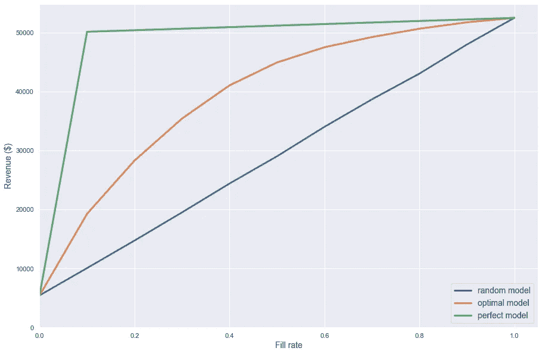*

*在图表中，我们可以看到**改变填充率**时每个型号的收入。蓝线是*随机型号*，绿线是*完美型号*，橙色是我们的型号。在这里，我们可以看到，如果你能把 10%到 50%的广告分配给付费提供商，那么拥有一个模型就更加重要。这是因为这两个数字之间的收入增长百分比比其他范围要高得多。*

*对于 30%的额外费用广告(目前的情况)，我们的收入几乎翻了一番。但是我们还有 45%的收入可以提高。*

*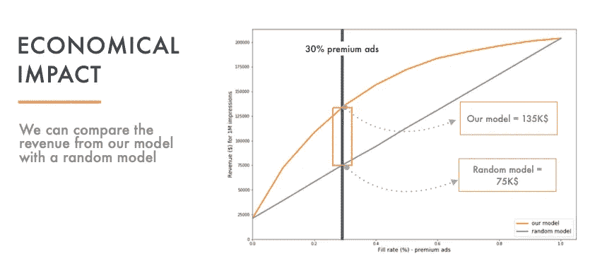**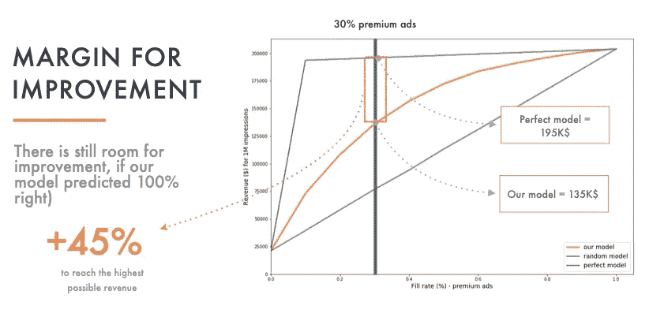*

# *结论*

*数据科学家是懂数学和编程，但也有商业头脑的人。这种商业意识让我们不仅能交付优秀的模型，还能让它们适应公司的需求。用收入的术语来谈论总是能让你向非技术客户展示更清晰的结论。*

*因此，在本文中，我们探讨了点击问题的业务/收入评估。**它可用于了解我们的 ML 模型**的经济影响，并使用无任何模型(随机模型)和尽可能最大收益(完美模型)对其进行基准测试。*

*你也可以在这里找到整个项目👇*

*[](https://github.com/myrthings/click-prediction) [## my things/点击预测

### 数据即，数据清洗，特征工程，建模和点击预测的经济影响…

github.com](https://github.com/myrthings/click-prediction)* 

*你觉得它有用吗？你在用吗？是不是我搞砸了，你什么都不懂？你还有哪些衡量收入的方法？*

**在评论区告诉我吧！*🤗*