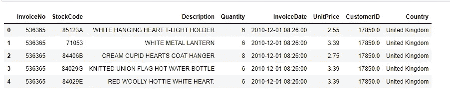
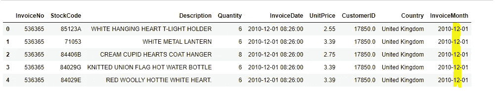
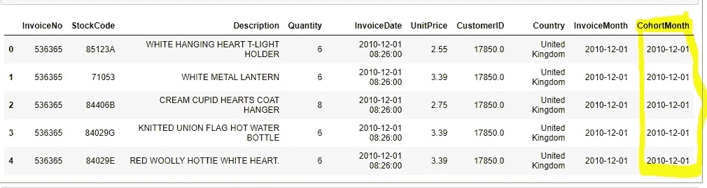
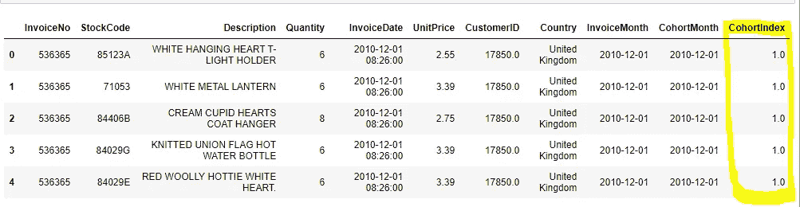
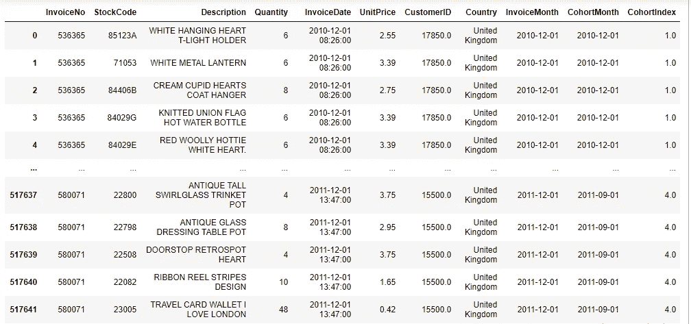
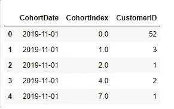
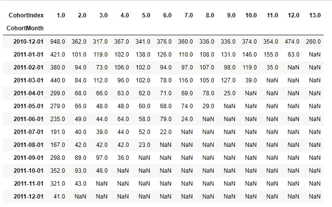
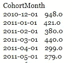
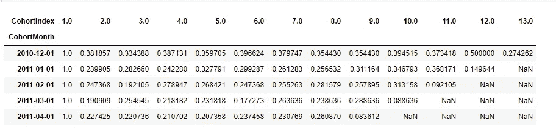
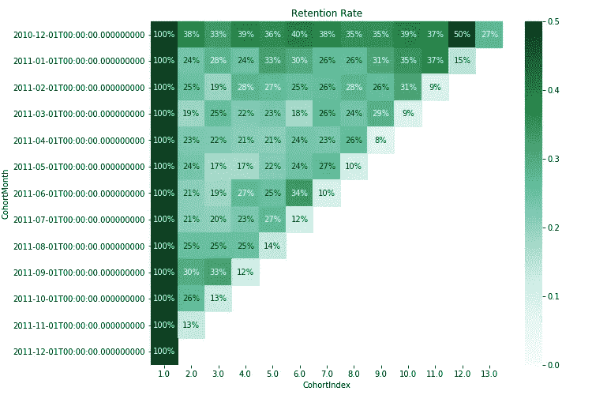

# 通过群组分析计算你每月的回头客

> 原文：<https://towardsdatascience.com/calculate-your-monthly-recurring-customer-by-cohort-analysis-3d39473482b7?source=collection_archive---------15----------------------->

## 解释如何使用 python 数据分析计算您企业的重复客户。

想象你已经开了一家企业，你的生意进展顺利。但这可能会更好。你的一些顾客可能会问你，“嘿，伙计，我经常从你这里买东西，难道我不应该得到一些优惠吗？”。现在你认为“好吧，我应该看看谁是我的老顾客！我应该给他们提供更多，这样他们就会经常来。”。你可以通过群组分析来实现。今天我将讨论使用 python 进行群组分析。让我们深入数据分析的海洋。


卢克·切瑟在 [Unsplash](https://unsplash.com?utm_source=medium&utm_medium=referral) 上的照片

为了这个分析，我使用了来自 Kaggle 的[在线零售](https://www.kaggle.com/mrmining/online-retail?)数据集。转到链接并下载它。好的，让我们看看我们的数据集中有什么！

首先，导入必要的库。

```
import pandas as pd
import seaborn as sns
import datetime as dt
import matplotlib.pyplot as plt
import plotly.express as px
```

现在加载数据集并观察其中的内容。

```
df = pd.read_excel('Online Retail.xlsx')
df.head()
```



这是我们数据集的前五行，

> InvoiceNo:采购的发票号码。
> 
> *库存代码:可能的产品代码*
> 
> *描述:产品是什么*
> 
> *数量:多少个产品*
> 
> *发票日期:购买日期*
> 
> *单价:单个产品的价格*
> 
> *CustomerID:标识每个客户的唯一字符串*
> 
> *国家:来自哪个地区*

好吧，我们再深入一点。现在我们将创建一个函数来获取每个发票号的月份号，这样我们就可以知道产品是在哪个月购买的。

```
def get_month(x):
    return dt.datetime(x.year, x.month, 1)df['InvoiceMonth'] = df['InvoiceDate'].apply(get_month)
df.head()
```



看最后一栏我标记中间部分的地方，是‘月’。我们以后会用到它。现在让我们看看哪些客户在哪些月份访问过。为此，我们将使用熊猫“分组”。别担心。很简单。

```
grouping = df.groupby('CustomerID')['InvoiceMonth']
grouping.head()
```

现在，让我们来看看每位顾客是在哪一个月第一次购买的。

```
df['CohortMonth'] = grouping.transform('min')
df.head()
```



这个“共生月”是顾客第一次购买的时间。现在，我们将再次创建一个函数来提取客户在哪个月来访，这样我们就可以获得我们的回头客。

```
def get_date_int(df, column):
    year = df[column].dt.year
    month = df[column].dt.month
    date = df[column].dt.date
    return year, month, dateInvoice_Year, Invoice_Month, _ = get_date_int(df, 'InvoiceMonth')
Cohort_Year, Cohort_Month , _ = get_date_int(df, 'CohortMonth')Year_Diff = Invoice_Year - Cohort_Year
Month_Diff = Invoice_Month - Cohort_Monthdf['CohortIndex'] = Year_Diff*12 + Month_Diff +1
df.head()
```



因此，标记为“CohortIndex”的列是我们获得第一次购买和客户后来所有购买之间的差异的列。因此，这里第一个是“1.0”，这意味着他在第一次购买的同一个月进行了购买。

现在，让我们按“同月”和“同指数”对客户进行“分组”,这样我们就可以识别出在同一个月以相同的时间间隔购买的客户。

```
grouping = df.groupby(['CohortMonth', 'CohortIndex'])
grouping.head()
```



现在，我们将只取每个客户的第一个月来计算数据透视表，以便我们可以在以后计算经常性客户。

```
cohort_data = grouping['CustomerID'].apply(pd.Series.nunique)
cohort_data = cohort_data.reset_index()
cohort_data.head()
```



```
print(df.shape) #output: 91, 3
print(cohort_data.shape)#output: 541909, 11
```

因此，我们可以看到，在此期间，只有 91 个不同的客户进行了 541909 次购买。让我们制作数据透视表。

```
cohort_counts = cohort_data.pivot(index="CohortMonth",
                                  columns="CohortIndex",
                                  values="CustomerID")
retention = cohort_counts
retention
```



现在我们可以看到一些 NaN 值，这意味着从 2010 年 12 月 1 日到 2011 年 12 月 1 日总共是 13 个月。因此，第一个指数值包含每 13 个月的经常性客户，但下一个指数 2011–01–01 与 2011–12–01 只有 12 个月的差异。这就是为什么最后一行值是 NaN。因此，在第一个月，948 名顾客前来购买，其中 362 名顾客在第二个月再次购买，如此循环。

现在我们要统计每个月的顾客数量。因为我们想把他们作为基础，以后来的顾客会成为追随者。

```
cohort_sizes = cohort_counts.iloc[:,0]
cohort_sizes.head()
```



现在，我们将在 1–0 的区间内对数据进行整形，以便显示回头客的百分比。

```
retention = cohort_counts.divide(cohort_sizes, axis=0)
retention.head()
```



```
retention.round(3)*100
```

因此，我们将保留率转换为百分比。现在，让我们用热图来观察我们每月的重复客户百分比。

```
plt.figure(figsize=(10,8))
plt.title("Retention Rate")
sns.heatmap(data=retention,
           annot=True,
           fmt='.0%',
           vmin=0.0,
           vmax=0.5,
           cmap="BuGn")
plt.show()
```



## 仅此而已。我们已经完成了我们的队列。这对你的业务增长非常重要。你必须留意你的老顾客。谢谢你一直陪着我。成为数据科学海洋的冲浪者！